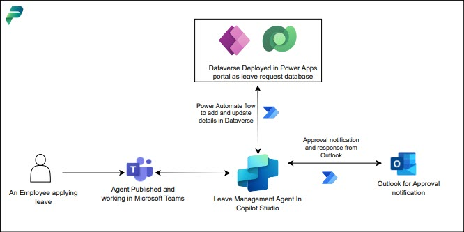
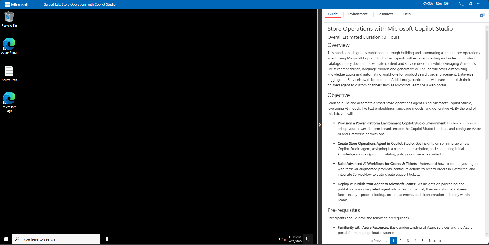
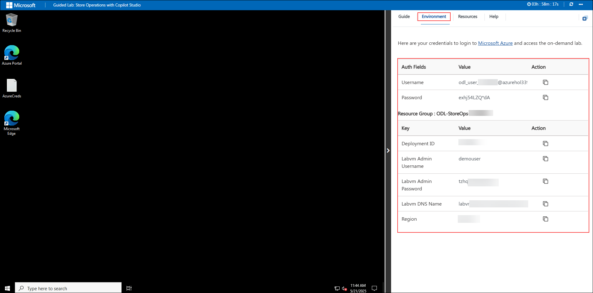
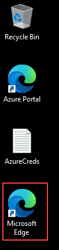
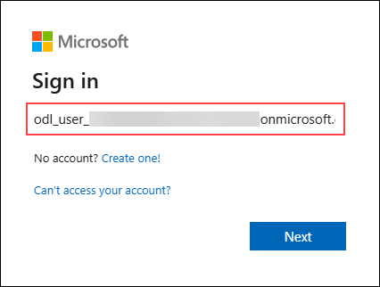
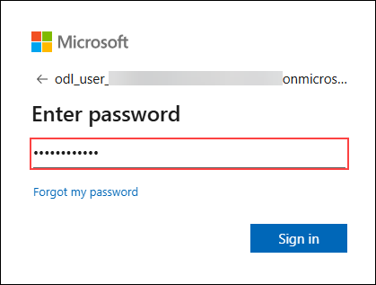

# Leave Management System with Microsoft Copilot Studio

### Overall Estimated Duration: 3 Hours

## Overview

In this hands-on lab, you will configure and explore a Leave Management Agent that automates employee leave applications, approvals, and balance tracking. The agent enforces strict security and business rules to ensure that requests are handled fairly, securely, and consistently. Employees can apply for leave, check their balance, and track past requests all through a controlled Dataverse integration that respects row-level security and manager approval flows.

## Objectives

By the end of this lab, you will be able to:

- **Setting up Pre-Requisites for Leave Management Agent:** Provision a Power Platform environment, sign into Copilot Studio, and configure a new agent’s basic settings.

- **Designing Advanced Topics:** Define the agent’s purpose, connect knowledge sources, and enable AI-powered responses for leave management.

- **Power Automate Approval Workflow:** Implement leave approval logic based on company policy and record finalized requests.

- **End-to-End Testing:** Execute prompts and scenarios to verify the agent updates leave request data correctly in Dataverse.

- **Publishing & Sharing:** Publish the agent to Microsoft Teams and ensure it is accessible and responsive to basic prompts.

## Prerequisites

Participants should have:

- Basic Understanding of Agentic AI Concepts
- Working knowledge on Microsoft Copilot Studio

## Architecture

The Leave Management Agent is built on Microsoft Copilot Studio, integrated with Dataverse for storing leave requests and user data. Power Automate connects business logic by enabling automated approval workflows based on company policies. The agent is then published to Microsoft Teams, allowing employees to interact seamlessly within their work environment. This architecture ensures an end-to-end AI-driven solution that streamlines leave management.

## Architecture Diagram

## Explanation of Components

- **Microsoft Copilot Studio:** Platform to build, configure, and manage the leave management agent.

- **Dataverse:** Central data store for leave requests, user details, and policy records.

- **Power Platform Environment:** Secure workspace hosting the agent, data, and workflows.

- **Outlook:** Communication channel for sending leave notifications and approvals.

- **Microsoft Teams:** Collaboration hub where users interact directly with the agent.

## Getting Started with the Lab

Welcome to your Leave Management System with Microsoft Copilot Studio lab! We've prepared a seamless environment for you to explore and learn how to build, configure, and test an intelligent leave management agent. This lab will guide you through applying business rules, handling approvals, and integrating with Dataverse to deliver a secure and efficient experience. Let's begin by making the most of this workshop!

### Accessing Your Lab Environment

Once you're ready to dive in, your virtual machine and Lab guide will be right at your fingertips within your web browser.

### Exploring Your Lab Resources

To get a better understanding of your Lab resources and credentials, navigate to the Environment tab.

### Utilizing the Split Window Feature

For convenience, you can open the Lab guide in a separate window by selecting the Split Window button from the Top right corner

### Managing Your Virtual Machine

Feel free to start, stop, or restart your virtual machine as needed from the Resources tab. Your experience is in your hands!

## Let's Get Started with Power Apps Portal

1. In the JumpVM, click on **Microsoft Edge** shortcut of Microsoft Edge browser which is created on desktop.

   

1. Open a new browser tab and navigate to [Power Apps](https://make.powerapps.com/) portal.

1. On the **Sign into Microsoft** tab, you will see the login screen. Enter the provided email or username, and click **Next** to proceed.

   - Email/Username: <inject key="AzureAdUserEmail"></inject>

     

1. Now, enter the following password and click on **Sign in**.

   - Password: <inject key="AzureAdUserPassword"></inject>

     

     >**Note:** If you see the Action Required dialog box, then select Ask Later option.
     
1. If you see the pop-up **Stay Signed in?**, click No.

   

1. You have now successfully logged in to the Power Apps portal. Keep the portal open, as you will be using it later in the lab.

   

## Support Contact

The CloudLabs support team is available 24/7, 365 days a year, via email and live chat to ensure seamless assistance at any time. We offer dedicated support channels tailored specifically for both learners and instructors, ensuring that all your needs are promptly and efficiently addressed.Learner Support Contacts:

- Email Support: cloudlabs-support@spektrasystems.com
- Live Chat Support: https://cloudlabs.ai/labs-support

Now, click on the **Next** from lower right corner to move on next page.

## Happy Learning!!
