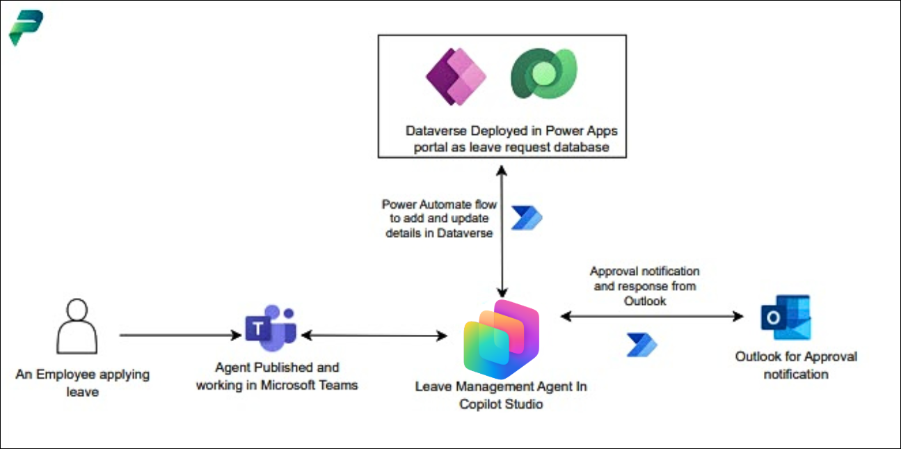
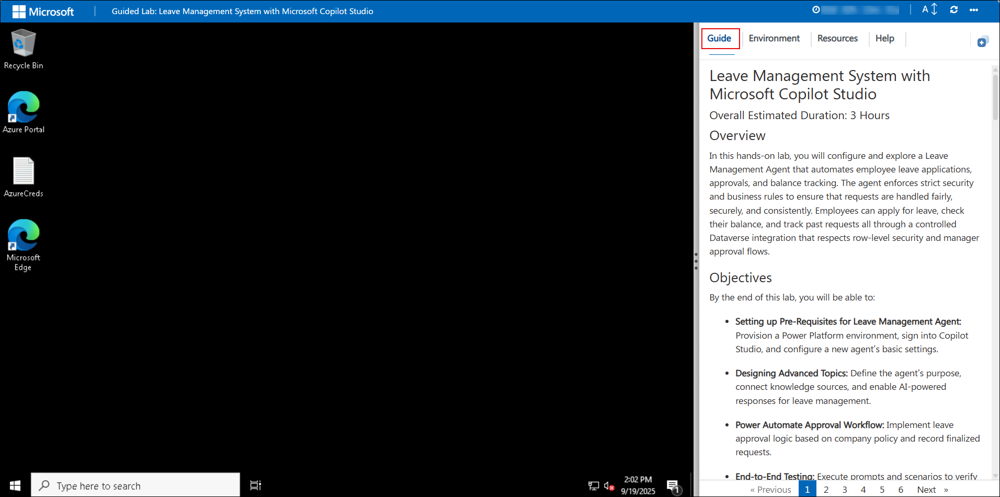
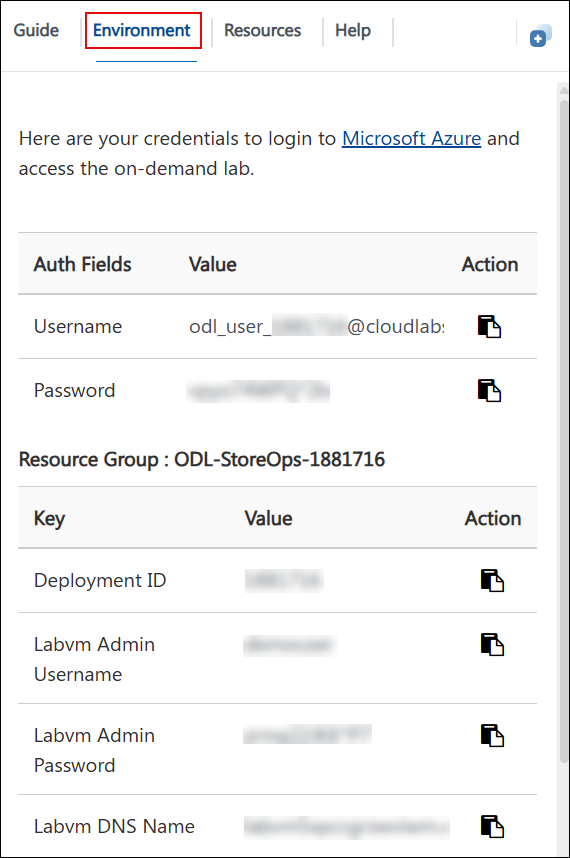
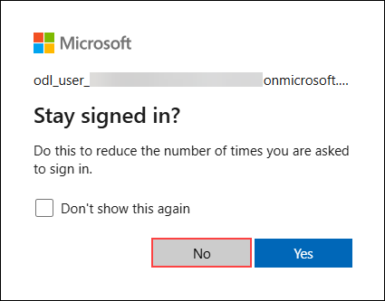
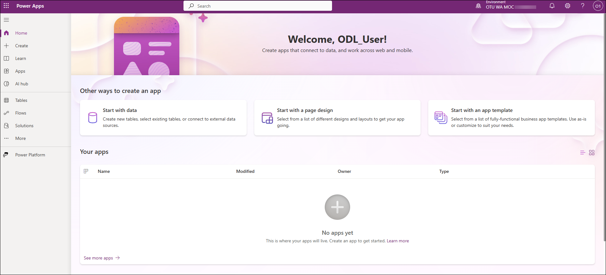
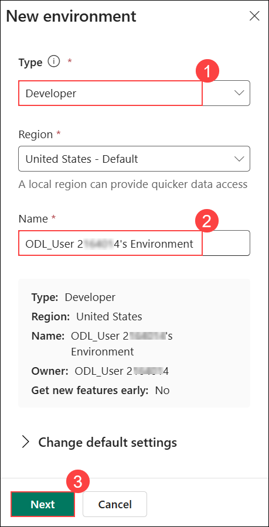
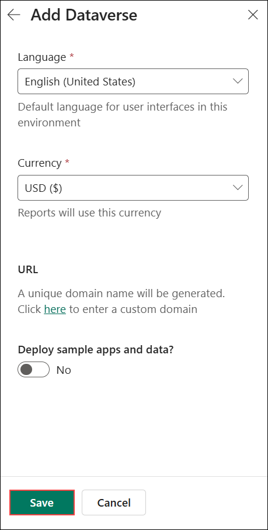
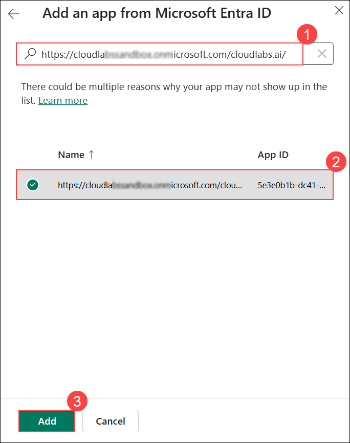

# Microsoft Copilot Studio を使用した休暇管理システム

### 全体の推定所要時間: 4 時間

## 概要

このハンズオン ラボでは、従業員の休暇申請、承認、および残日数管理を自動化する休暇管理エージェントを設定して探索します。エージェントは厳格なセキュリティとビジネス ルールを適用し、申請が公正、安全、かつ一貫して処理されるようにします。従業員は、行レベルのセキュリティとマネージャー承認フローを尊重した Dataverse 連携を通じて、休暇の申請、残日数の確認、および過去の申請の追跡を行うことができます。

## 目標

このラボを終了すると、次のことができるようになります。

- **休暇管理エージェントの前提条件の設定:** Power Platform 環境をプロビジョニングし、Copilot Studio にサインインして、新しいエージェントの基本設定を構成します。

- **高度なトピックの設計:** エージェントの目的を定義し、ナレッジ ソースに接続して、休暇管理用の AI 搭載応答を有効にします。

- **Power Automate 承認ワークフロー:** 会社のポリシーに基づいた休暇承認ロジックを実装し、確定した申請を記録します。

- **エンド ツー エンド テスト:** プロンプトとシナリオを実行して、エージェントが Dataverse の休暇申請データを正しく更新することを確認します。

- **発行と共有:** エージェントを Microsoft Teams に発行し、基本的なプロンプトに対してアクセス可能かつ応答可能であることを確認します。

## 前提条件

参加者は次の知識を持っている必要があります。

- エージェント型 AI の概念に関する基本的な理解
- Microsoft Copilot Studio に関する実務知識

## アーキテクチャ

休暇管理エージェントは Microsoft Copilot Studio 上に構築され、休暇申請とユーザー データを保存する Dataverse と統合されています。Power Automate は、会社のポリシーに基づいた自動承認ワークフローを有効にすることでビジネス ロジックを接続します。エージェントは Microsoft Teams に発行され、従業員が作業環境内でシームレスに操作できるようにします。このアーキテクチャにより、休暇管理を合理化するエンド ツー エンドの AI 駆動型ソリューションが実現します。

## アーキテクチャ図



## コンポーネントの説明

- **Microsoft Copilot Studio:** 休暇管理エージェントを構築、構成、および管理するためのプラットフォームです。

- **Dataverse:** 休暇申請、ユーザーの詳細、ポリシー レコードの中央データ ストアです。

- **Power Platform 環境:** エージェント、データ、およびワークフローをホストするセキュリティで保護されたワークスペースです。

- **Outlook:** 休暇通知と承認を送信するための通信チャネルです。

- **Microsoft Teams:** ユーザーがエージェントと直接やり取りするコラボレーション ハブです。

## ラボの開始

Microsoft Copilot Studio を使用した休暇管理システム ラボへようこそ！ インテリジェントな休暇管理エージェントを構築、設定、およびテストする方法を探索して学べるシームレスな環境を準備しました。このラボでは、ビジネス ルールの適用、承認の処理、および Dataverse との連携を通じて、安全で効率的なエクスペリエンスを提供するプロセスについて説明します。

### ラボ環境へのアクセス

準備ができたら、仮想マシンとラボ ガイドがウェブ ブラウザー内にすぐに表示されます。



### ラボ リソースの探索

ラボ リソースと資格情報をより深く理解するには、**[環境]** タブに移動します。



### 分割ウィンドウ機能の活用

便宜のため、右上隅の **[分割ウィンドウ]** ボタンを選択すると、ラボ ガイドを別のウィンドウで開くことができます。


### 仮想マシンの管理

**[リソース] (1)** タブから、仮想マシンの**起動、停止、再起動、または接続 (2)** を簡単に行うことができます。エクスペリエンスはあなたの手の中にあります！


## Power Apps ポータルの使用開始

1. JumpVM で、デスクトップ上の **Microsoft Edge** ブラウザー ショートカットをクリックします。

   

1. 新しいブラウザー タブを開き、次の URL を入力して Power Apps ポータルに移動します。

   ```
   https://make.powerapps.com/
   ```

1. **[Microsoft にサインイン]** タブで、次のメール アドレス **(1)** をメール フィールドに入力し、**[次へ] (2)** をクリックして続行します。

   - メール アドレス: **<inject key="AzureAdUserEmail"></inject>**

     

1. **[一時アクセス パスワードを入力する]** 画面で、次の**一時アクセス パスワード**を入力し、**[サインイン] (2)** をクリックします。

   - 一時アクセス パスワード: **<inject key="AzureAdUserPassword"></inject>**

     
     
1. **[サインインしたままにする]** というポップアップが表示された場合は、**[いいえ]** をクリックします。

   

1. **[Power Apps へようこそ]** ポップアップが表示された場合は、デフォルトの国/地域の選択のままにして、**[開始する]** をクリックします。

   

1. Power Apps ポータルへのサインインが完了しました。ポータルを開いたままにしてください。

   

   > **注:** 次のステップで開発者環境を作成して使用するために必要な開発者ライセンスが自動的に割り当てられるため、Power Apps ポータルにサインインしています。

1. 新しいブラウザー タブを開き、次の URL を入力して Power Platform 管理センターに移動します。

   ```
   https://admin.powerplatform.microsoft.com
   ```

1. **Power Platform 管理センター**で、左側のナビゲーション ウィンドウから **[管理]** を選択します。

   

1. Power Platform 管理センターで、左側のナビゲーション ウィンドウから **[環境] (1)** を選択し、**[新規] (2)** をクリックして新しい環境を作成します。

   

1. **[新しい環境]** ウィンドウで次の設定で環境を構成し、**[次へ] (3)** を選択します。

   - **[種類]** ドロップダウンから **[開発者] (1)** を選択します。
   - **[名前] (2)** フィールドに **ODL_User <inject key="DeploymentID" enableCopy="false"></inject>'s Environment** と入力します。

      

1. **[Dataverse の追加]** ウィンドウで、すべての設定をデフォルトのままにして、**[保存]** を選択します。

   

   > **環境の基盤:** このステップでは、会社固有のデータとナレッジ ソースでエージェントをサポートする基盤となる環境を作成します。

   > **注:** 環境のプロビジョニングには 10 ～ 15 分かかる場合があります。状態が準備完了と表示されるまで待ってから続行してください。

   > **注:** 環境リストを表示できないというエラーが表示される場合は、バックグラウンドで環境が作成中であるため、これは想定内の動作です。10 ～ 15 分後にブラウザーを更新すると、環境が表示されます。

1. **Power Platform 管理センター**で、**[管理] (1)** を選択し、**[環境] (2)** を選択して、**[ODL_User <inject key="DeploymentID" enableCopy="false"/>'s Environment] (3)** をクリックします。

   

1. 環境ページで、**[S2S アプリ]** の下にある **[すべて表示]** をクリックします。

   

1. 次のウィンドウで、**[+ 新しいアプリ ユーザー]** をクリックします。

   

1. 新しいアプリ ユーザーの作成ウィンドウで、**[アプリ]** の下にある **[+ アプリを追加]** をクリックします。

   

1. **[Microsoft Entra ID からアプリを追加]** ウィンドウで、検索ボックス **(1)** に以下の URL を入力し、結果からアプリを選択 **(2)** して、**[追加] (3)** をクリックします。

   ```
   https://cloudlabssandbox.onmicrosoft.com/cloudlabs.ai/
   ```

   

1. **[ビジネス ユニット]** の下で、検索ボックスに **org (1)** と入力し、リストから使用可能なビジネス ユニットを選択 **(2)** します。

   

1. **[セキュリティ ロール]** の横にある **[編集]** アイコンをクリックします。

   

1. **[同期アクセス許可]** ウィンドウで **[システム管理者] (1)** を選択し、**[保存] (2)** をクリックします。

   

1. ポップアップ ウィンドウで **[保存]** を選択します。

   

1. すべての詳細を確認し、**[作成]** をクリックします。

   

## サポート連絡先

CloudLabs サポート チームは、年中無休 24 時間 365 日、メールとライブ チャットでシームレスなサポートをいつでも提供しています。学習者とインストラクターの両方に専用のサポート チャネルを提供し、すべてのニーズに迅速かつ効率的に対応します。

学習者サポート連絡先:

- メール サポート: cloudlabs-support@spektrasystems.com
- ライブ チャット サポート: https://cloudlabs.ai/labs-support

右下隅の **[次へ]** をクリックして、次のページに進んでください。

   

## ハッピー ラーニング!!
