# Microsoft Copilot Studio を使用した休暇管理システム

### 全体の推定所要時間: 4 時間

## 概要

このハンズオン ラボでは、従業員の休暇申請、承認、残高追跡を自動化する休暇管理エージェントを設定して探索します。エージェントは厳格なセキュリティとビジネス ルールを適用し、申請が公正、安全、一貫した方法で処理されることを保証します。従業員は、行レベルのセキュリティと管理者承認フローを遵守した Dataverse 統合を通じて、休暇申請、残高確認、過去の申請追跡をすべて行うことができます。

## 目標

このラボの終わりには、次のことができるようになります。

- **休暇管理エージェントの前提条件の設定:** Power Platform 環境をプロビジョニングし、Copilot Studio にサインインして、新しいエージェントの基本設定を構成します。

- **高度なトピックの設計:** 休暇申請トピックを作成し、休暇申請を検証してバランスを確認する Power Automate フローを構築し、休暇期間の承認ワークフローを設定します。

- **Power Automate 承認ワークフロー:** 承認後に Dataverse テーブルを更新し、フローを発行して名前を変更し、フローを接続して変数をマッピングすることで休暇申請トピックを完成させます。

- **エンド ツー エンド テスト:** プロンプトとシナリオを実行して、エージェントが Dataverse の休暇申請データを正しく更新することを確認します。

- **発行と共有:** エージェントを Microsoft Teams に発行し、基本的なプロンプトにアクセスして応答できることを確認します。

## 前提条件

参加者は次の知識を持っていることが求められます。

- エージェント型 AI の概念の基本的な理解
- Microsoft Copilot Studio の実用的な知識

## アーキテクチャ

休暇管理エージェントは Microsoft Copilot Studio 上に構築されており、休暇申請とユーザー データを保存するために Dataverse と統合されています。Power Automate は、会社のポリシーに基づいた自動承認ワークフローを有効にすることでビジネス ロジックを接続します。エージェントはその後 Microsoft Teams に発行され、従業員が職場環境でシームレスに操作できるようになります。このアーキテクチャにより、休暇管理を合理化するエンド ツー エンドの AI 主導ソリューションが実現します。

## アーキテクチャ図

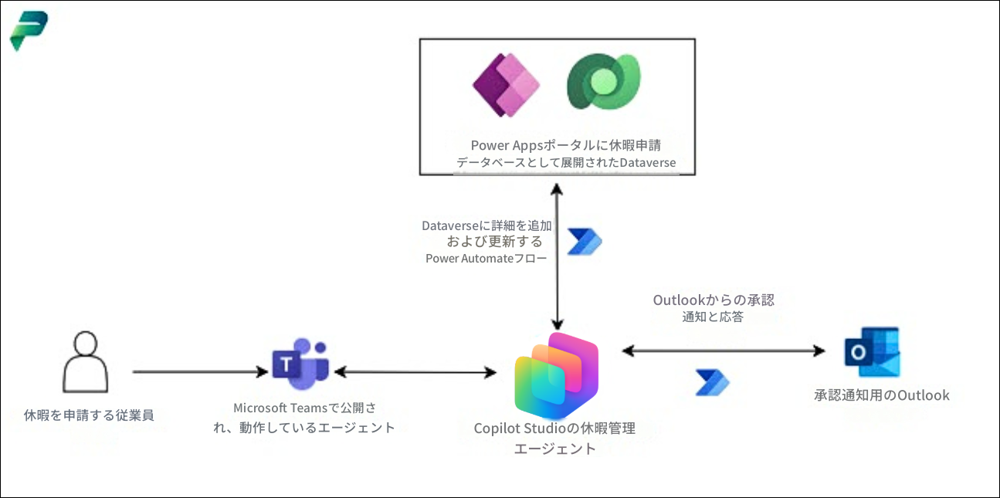

## コンポーネントの説明

- **Microsoft Copilot Studio:** 休暇管理エージェントを構築、設定、管理するプラットフォーム。

- **Dataverse:** 休暇申請、ユーザー詳細、ポリシー レコードの中央データ ストア。

- **Power Platform 環境:** エージェント、データ、ワークフローをホストするセキュアなワークスペース。

- **Outlook:** 休暇通知と承認を送信するためのコミュニケーション チャネル。

- **Microsoft Teams:** ユーザーがエージェントと直接やり取りするコラボレーション ハブ。

## ラボ環境の概要

**Microsoft Copilot Studio を使用した休暇管理システム** ラボへようこそ！このラボでは、インテリジェントな休暇管理エージェントを構築、設定、テストする方法を学習するためのシームレスな環境を準備しました。このラボでは、ビジネス ルールの適用、承認の処理、Dataverse との統合について説明し、安全で効率的なエクスペリエンスを提供します。

### ラボ環境へのアクセス

開始する準備ができたら、Web ブラウザー内で仮想マシンとラボ ガイドがすぐに手の届くところにあります。

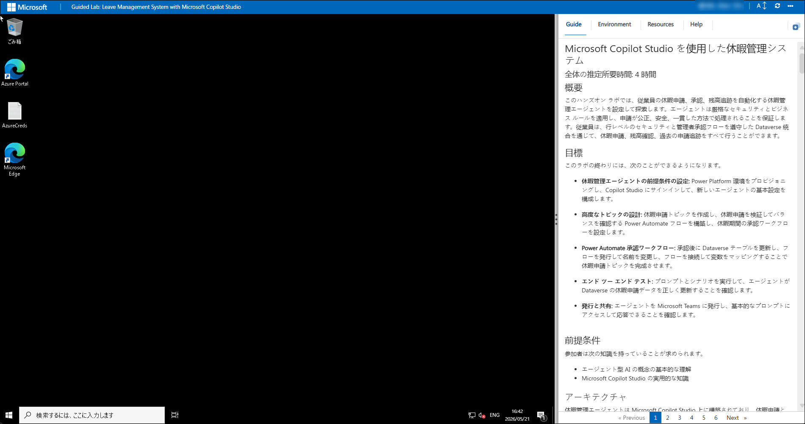

### ラボ リソースの確認

ラボ リソースと資格情報をより深く理解するには、[環境] タブに移動します。


### 分割ウィンドウ機能の使用

便宜上、右上隅の [分割ウィンドウ] ボタンを選択することで、ラボ ガイドを別のウィンドウで開くことができます。


### 仮想マシンの管理

**[リソース] (1)** タブから、仮想マシンを**起動、停止、再起動、または接続 (2)** できます。操作はご自身で行ってください。


## Power Apps ポータルを使ってみましょう

1. JumpVM で、デスクトップの **Microsoft Edge** ブラウザー ショートカットをクリックします。

   

1. 新しいブラウザー タブを開き、次の URL を入力して Power Apps ポータルに移動します。

   ```
   https://make.powerapps.com/
   ```

1. **[Microsoft にサインイン]** タブで、メール フィールドに以下のメール **(1)** を入力し、**[次へ] (2)** をクリックして続行します。

   - Email: **<inject key="AzureAdUserEmail"></inject>**

     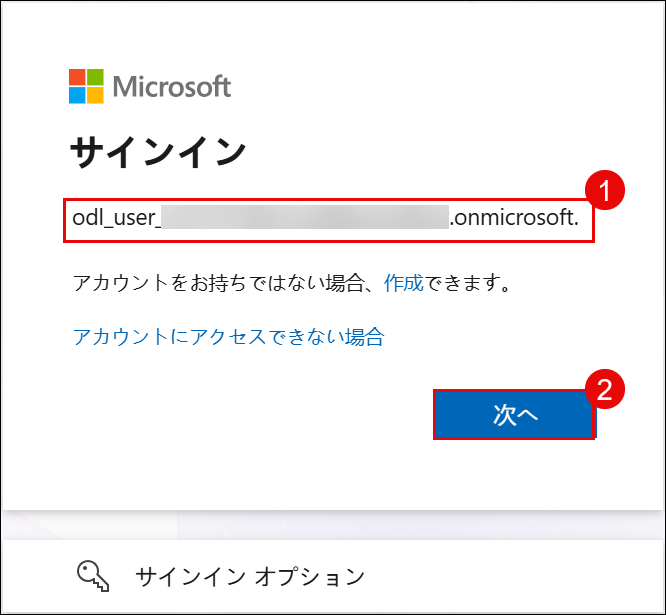

1. **[一時アクセス パスの入力]** 画面で、以下の**一時アクセス パス**を入力し、**[サインイン] (2)** をクリックします。

   - Temporary Access Pass: **<inject key="AzureAdUserPassword"></inject>**

     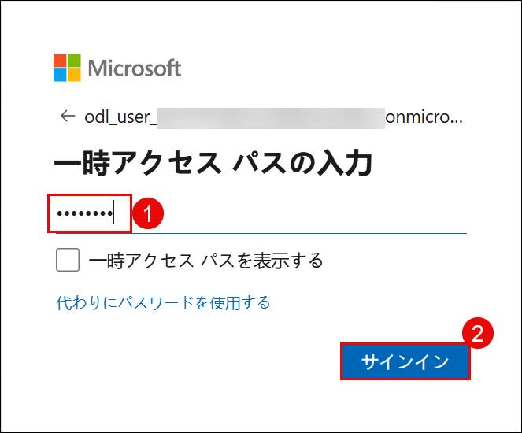
     
1. **[サインインの状態を維持しますか?]** ポップアップが表示された場合は、**[いいえ]** をクリックします。

   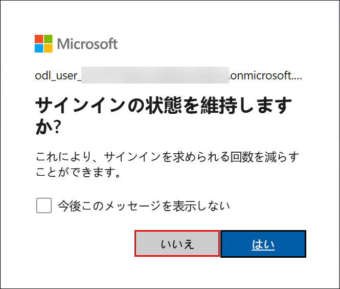

1. **[Power Apps へようこそ]** ポップアップが表示された場合は、デフォルトの国/地域の選択のままにして **[開始する]** をクリックします。

   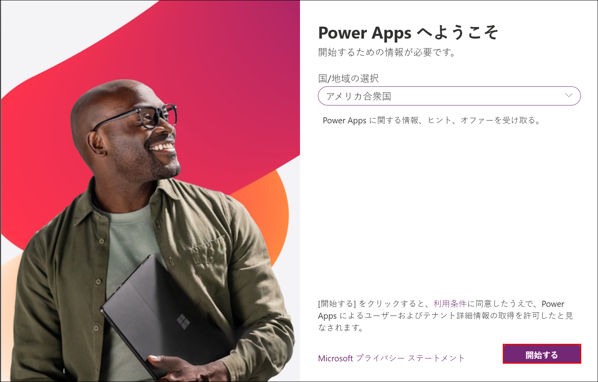

1. これで Power Apps ポータルに正常にログインしました。ポータルを開いたままにしてください。

   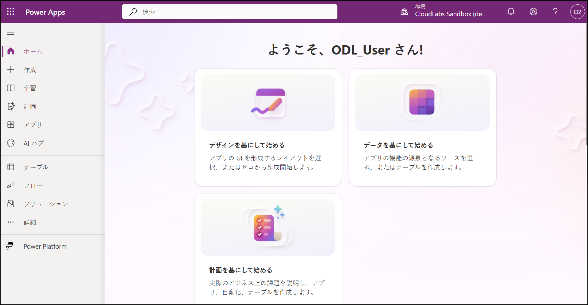

   > **注:** Power Apps ポータルにサインインするのは、次のステップで Developer 環境を作成して使用するために必要な Developer ライセンスが自動的に割り当てられるためです。

1. 完了したら、**[Excel または .CSV ファイルで作成する]** を選択します。

   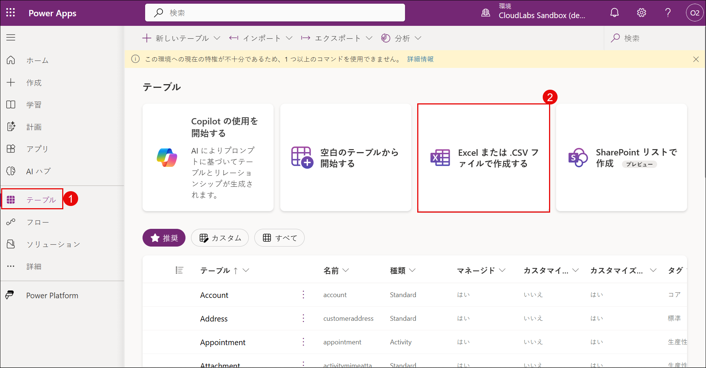

1. 環境を作成するためのポップアップ ウィンドウで、**[作成]** を選択します。これにより、新しい Power Platform Developer 環境が作成されます。

   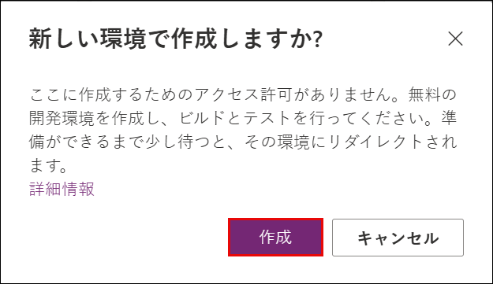

   > **注:** ここで作成する権限がないというメッセージが表示された場合は、数分待ってからページを更新してください。環境の準備が完了するまで時間がかかる場合があります。
   
1. **[Excel または .CSV ファイルのアップロード]** ウィンドウに直接移動した場合は、プロセスをキャンセルしてください。

   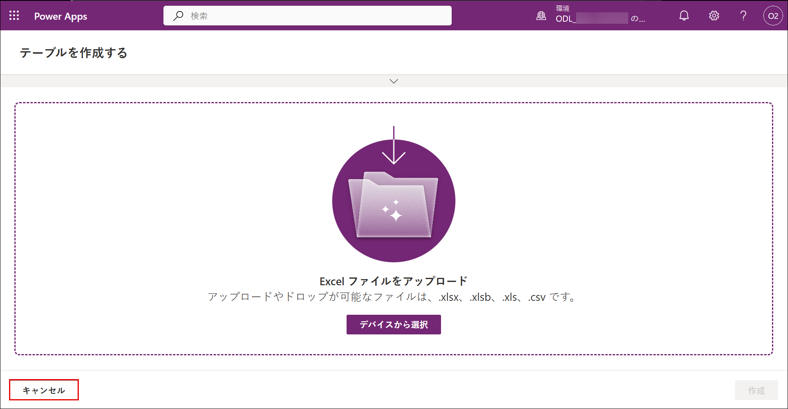

1. 新しいブラウザー タブを開き、次の URL を入力して Power Platform 管理センターに移動します。

   ```
   https://admin.powerplatform.microsoft.com
   ```

1. **Power Platform 管理センター**で、**[管理] (1)** を選択し、**[環境] (2)** を選択して、**[ODL_User <inject key="DeploymentID" enableCopy="false"/>の環境 (3)]** をクリックします。

   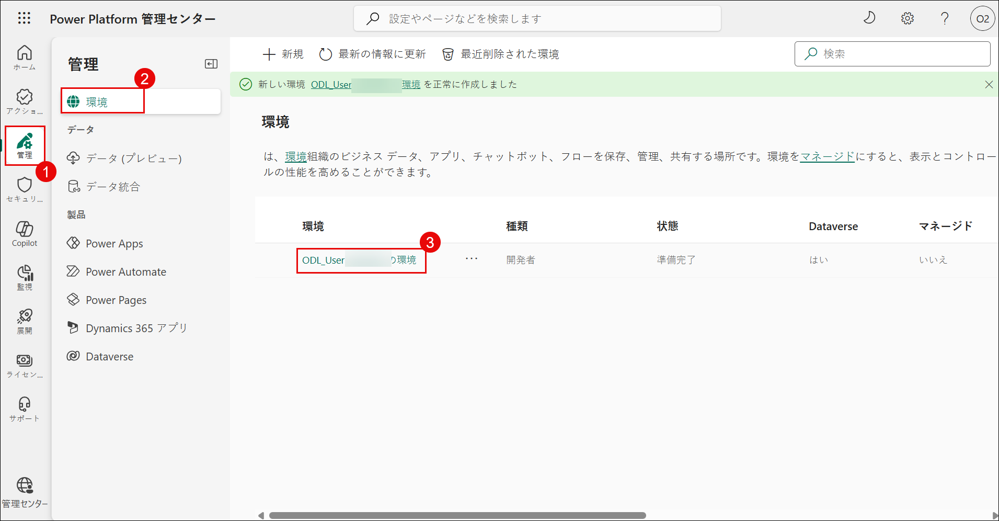

   >注: 環境が表示されない場合は、バックグラウンドでまだ作成中の可能性があります。これは Power Platform での予想される動作です。15 ～ 20 分待ってからページを更新して環境を確認してください。

1. 環境ページで、**[S2S アプリ]** の下の **[すべて表示]** をクリックします。

   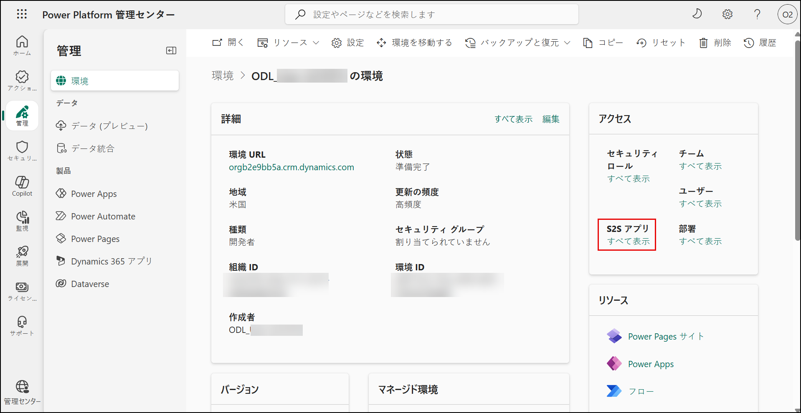

1. 次のウィンドウで、**[+ 新規アプリ ユーザー]** をクリックします。

   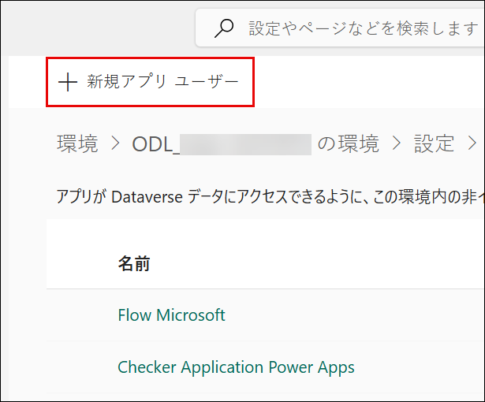

1. 新しいアプリ ユーザーの作成ウィンドウで、**[アプリ]** の下にある **[+ アプリの追加]** をクリックします。

   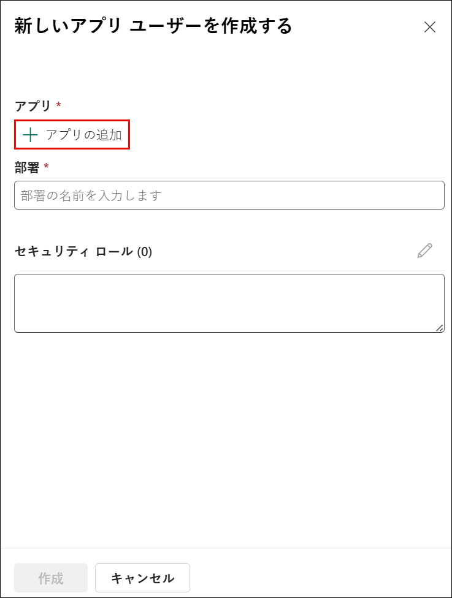

1. **[Microsoft Entra ID からアプリを追加する]** ウィンドウで、検索ボックス **(1)** に以下の URL を入力し、結果からアプリを選択 **(2)** して、**[追加] (3)** をクリックします。

   ```
   https://cloudlabssandbox.onmicrosoft.com/cloudlabs.ai/
   ```

   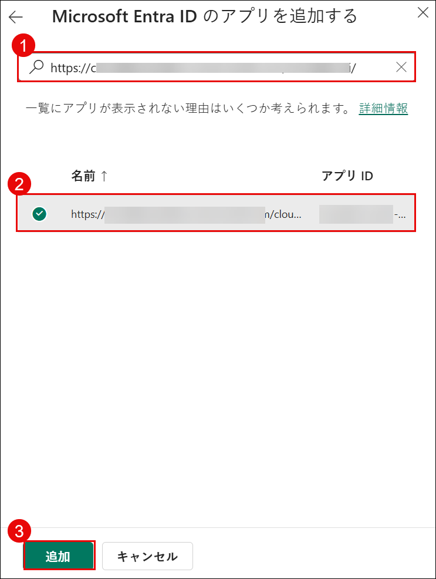

1. **[部署]** の下で、検索ボックスに **org (1)** と入力し、リストから利用可能な部署を選択 **(2)** します。

   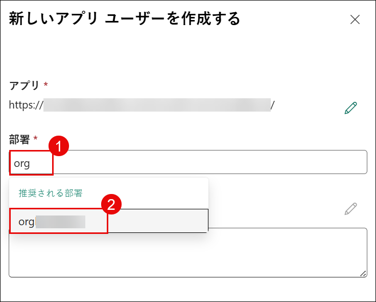

1. **[セキュリティ ロール]** の横にある **[編集]** アイコンをクリックします。

   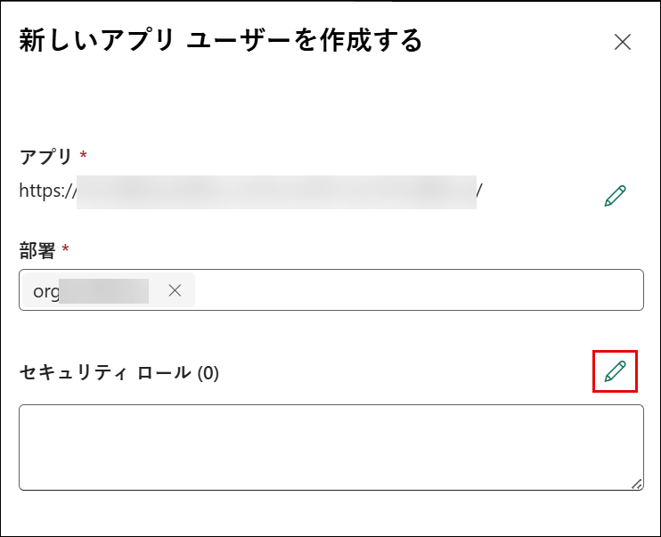

1. **[アクセス許可の同期]** ウィンドウで、**[システム管理者] (1)** を選択し、**[保存] (2)** をクリックします。

   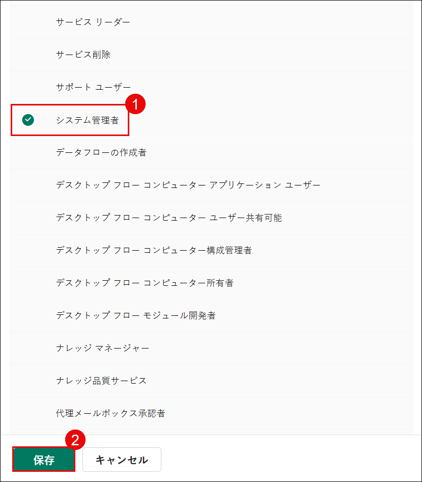

1. ポップアップ ウィンドウで **[保存]** を選択します。

   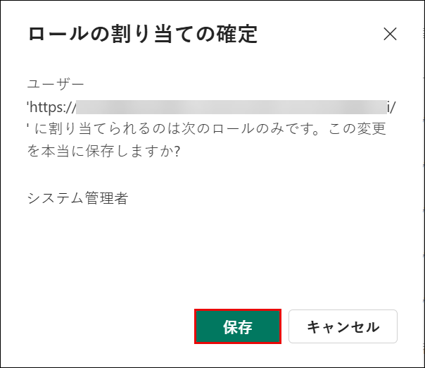

1. すべての詳細を確認し、**[作成]** をクリックします。

   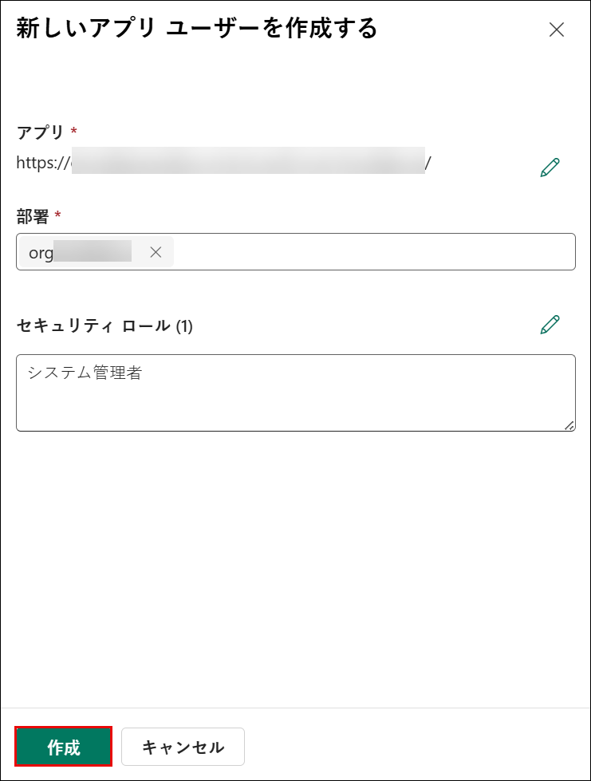

## サポート連絡先

CloudLabs サポート チームは、メールとライブ チャットを通じて 24 時間 365 日対応しており、いつでもシームレスなサポートを提供します。学習者とインストラクターの両方に特化した専用サポート チャネルを提供しており、すべてのニーズに迅速かつ効率的に対応します。

学習者サポート連絡先:

- メール サポート: cloudlabs-support@spektrasystems.com
- ライブ チャット サポート: https://cloudlabs.ai/labs-support

右下隅の **[次へ]** をクリックして次のページに進んでください。

   

## ハッピー ラーニング!!
