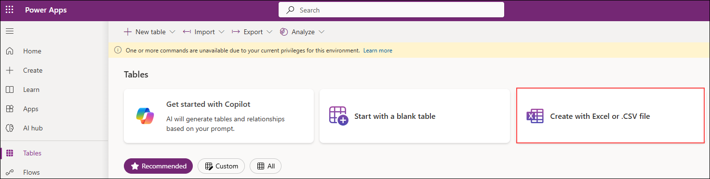
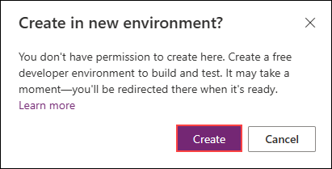

# Exercise 1: Setting up Pre-Requisites for Store operations Agent

### Estimated Duration: 45 Minutes

## Overview

In this exercise, you will provision a Power Platform environment—enabling Dataverse, Azure AI services, and the Copilot Studio trial. You will also set up and configure Freshworks to handle incident management. Together, these foundational steps establish the infrastructure needed to build and deploy your RAG‑driven store operations agent.

## Objectives

You will be able to complete the following tasks:

- Task 1 : Provisioning power platform environment

- Task 2 : Setting up Freshworks for incident management

## Task 1 : Provisioning power platform environment

1. Inside power apps portal, select **Tables (1)** from the left menu and click on **Create a database (2)**.

   

   >**Note:** If you are not able to see **Create Database** option and you are able to see some tables already, please continue from **Step 3**.

1. In the new pane for creating New Database, click on **Create my Database**.

   

1. Once done, click on **Create with Excel or .CSV file**.

   

1. In the pop up window to create a environment, Click on **Create**. This will create a new power platform developer environment.

   
   >Note: If you are directly navigated to **Import an Excel or .CSV file pane**, please cancel the process.

1. Once done, select **Tables (1)** from the left menu and click on **Create with Excel or .CSV file (2)**.

   

1. In the next pane, click on **Select from device** and in the pop-up window to select files, navigate to `C:\datasets\leave-management-with-Copilot-Studio-lab-datasets`, select **LeaveRequest.csv**.

   

1. Once selected, click on **Save and exit** and in the pop up window, click on **Save and exit**.

   

   

   >**Note:** If you are not able to find **Save and exit** button, minimize the screen using **CTRL + -**.

   >**Note:** If you are seeing **Create** option instead of **Save and Exit**, please go with the Create option.

1. As you have now created a new environment and set up Dataverse, navigate to **Copilot Studio**  in a new tab using this link: [copilot studio](https://go.microsoft.com/fwlink/p/?linkid=2252408&clcid=0x409&culture=en-us&country=us)
   
1. In the pop-up window that appears click on **Get Started**

   

   >**Note:** If the Copilot Studio portal is taking longer than usual to load, please wait a few minutes. Alternatively, try closing your browser and reopening the portal in a private/incognito window. If still the issue persists,followthe below instructions to resolve this:

   > Navigate back to Power Apps Portal, and copy the environment ID as shown.

   

   > Once copied, navigate back to Copilot Studio, from the URL, replace the **Default** environment ID to the ID that you copied.

   

1. If the **Welcome to Copilot Studio** prompt appears, click **Skip**.

1. Once you are inside **Copilot Studio** you will be in the home page. 

   

1. In the home page, select the environment option as shown.

   

1. Change the environment to the new environment that you have created earlier. Keep the tab open as you will be using this in further exercises.

   

<validation step="9ec40b7e-aa69-4359-a1f4-833d8ca8d8b4" />
 
> **Congratulations** on completing the task! Now, it's time to validate it. Here are the steps:
> - Hit the Validate button for the corresponding task. If you receive a success message, you can proceed to the next task. 
> - If not, carefully read the error message and retry the step, following the instructions in the lab guide.
> - If you need any assistance, please contact us at cloudlabs-support@spektrasystems.com. We are available 24/7 to help.

## Summary

In this exercise, you provisioned a Power Platform environment—enabled Dataverse and the Copilot Studio trial. You also set up and configured Freshworks to handle incident management. Together, these foundational steps established the infrastructure needed to build and deploy your RAG-driven store operations agent.

### You have successfully completed this exercise, please continue to next one >>
