# Exercise 1: Setting up Pre-Requisites for Leave Management Agent

### Estimated Duration: 30 Minutes

## Overview

In this exercise, you will provision a Microsoft Power Platform environment and sign into Microsoft Copilot Studio. You will then create a new agent and configure its basic settings. These steps form the foundation for building an Agentic AI–driven leave management solution that streamlines processes and enhances user experience.

## Objectives

You will be able to complete the following tasks:

- Task 1 : Provisioning power platform environment

- Task 2 : Sign into Microsoft Copilot Studio

- Task 3: Create a New Agent

- Task 4: Configure Agent Basics

## Task 1 : Provisioning power platform environment

1. Inside power apps portal, select **Tables (1)** from the left menu and click on **Create a database (2)**.

   

   >**Note:** If you are not able to see **Create Database** option and you are able to see some tables already, please continue from **Step 3**.

1. In the new pane for creating New Database, click on **Create my Database**.

   

1. Once done, click on **Tables (1)** from the left menu and click on **Create with Excel or .CSV file (2)**.

   

1. In the pop up window to create a environment, Click on **Create**. This will create a new power platform developer environment.

   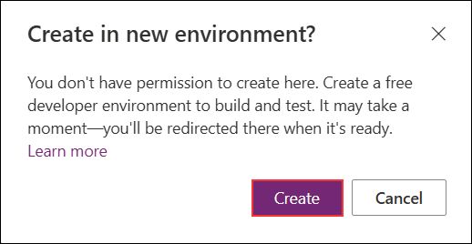

   >Note: If you are directly navigated to **Import an Excel or .CSV file pane**, please cancel the process.

      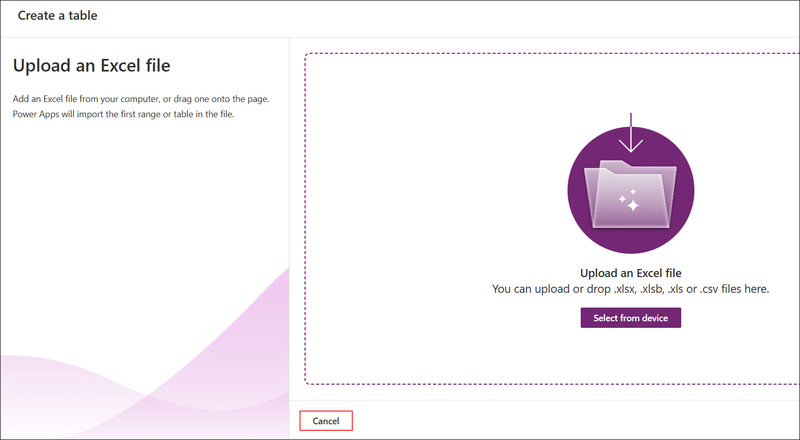

1. Once done, select **Tables (1)** from the left menu and click on **Create with Excel or .CSV file (2)**.

   

1. In the next pane, click on **Select from device** and in the pop-up window to select files, navigate to `C:\datasets\leave-management-with-Copilot-Studio-lab-datasets`, select **LeaveRequest.csv**.

   

On the **Import an Excel or .CSV file** pane, verify that the file **Leave Request.xlsx** is listed. Ensure that the table **LeaveRequests** is included by keeping the toggle enabled. Click **Import** to proceed.

   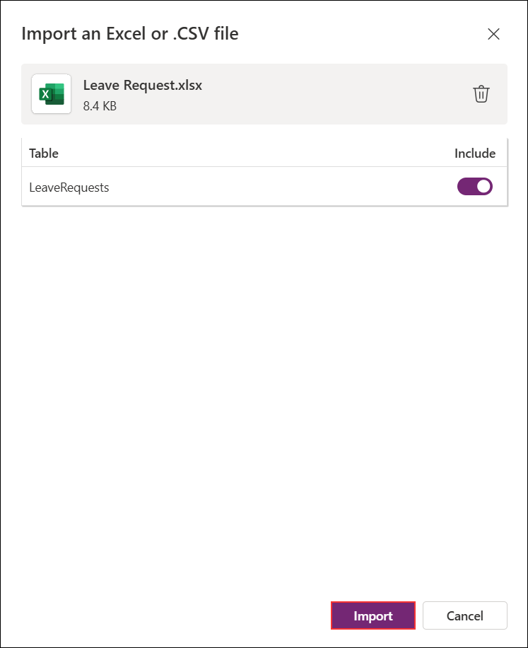

1. Once selected, click on **Save and exit** and in the pop up window, click on **Save and exit**.

   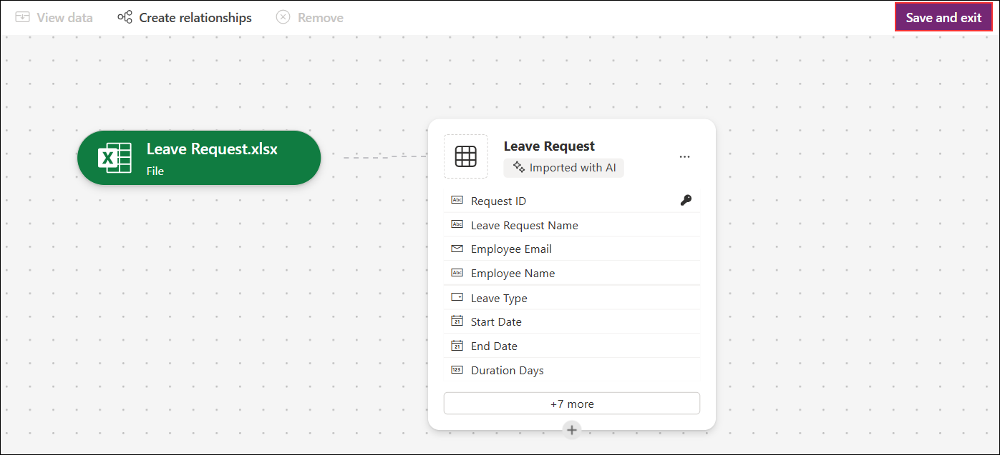

   

   >**Note:** If you are not able to find **Save and exit** button, minimize the screen using **CTRL + -**.

   >**Note:** If you are seeing **Create** option instead of **Save and Exit**, please go with the Create option.

1. Once created locate the Leave Request table from the list and note down the logical id of the table as shown in a notepad safely, as you will be using this value further in the lab.

   

   >**Note:** You may see a different ID than the one shown in the screenshot, this is expected.

## Task 2 : Sign into Microsoft Copilot Studio

1. As you have now created a new environment and set up Dataverse, navigate to **Copilot Studio**  in a new tab using this link: [copilot studio](https://go.microsoft.com/fwlink/p/?linkid=2252408&clcid=0x409&culture=en-us&country=us)
   
1. In the pop-up window that appears click on **Get Started**

   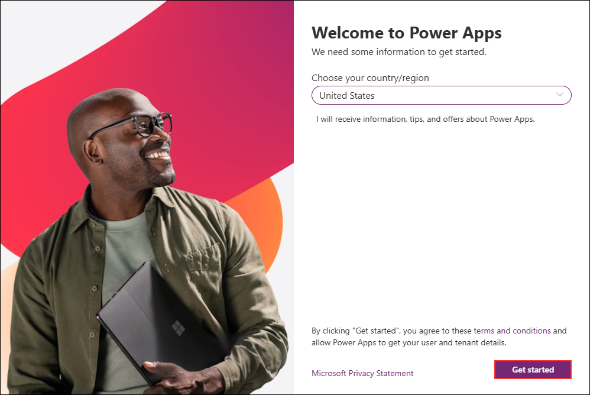

   >**Note:** If the Copilot Studio portal is taking longer than usual to load, please wait a few minutes. Alternatively, try closing your browser and reopening the portal in a private/incognito window. If still the issue persists,followthe below instructions to resolve this:

   > Navigate back to Power Apps Portal, and copy the environment ID as shown.

   

   > Once copied, navigate back to Copilot Studio, from the URL, replace the **Default** environment ID to the ID that you copied.

   

1. If the **Welcome to Copilot Studio** prompt appears, click **Skip**.

1. Once you are inside **Copilot Studio** you will be in the home page. 

   

1. In the home page, select the environment option as shown.

   

1. Change the environment to the new environment that you have created earlier on **Select environment** pane, expand **Supported environments (1)** and select **ODL_User <your-ID> Environment (2)**.

   

## Task 3: Create a New Agent

In this task, you will create a new agent in Microsoft Copilot Studio by defining its name, description, and basic configuration settings. This agent will serve as the base for enabling intelligent leave management operations.

1. Navigate back to Copilot Studio page from the browser.

1. From the home page, select **Create (1)** from left menu and click on **+ New agent (2)** to create an agent.

   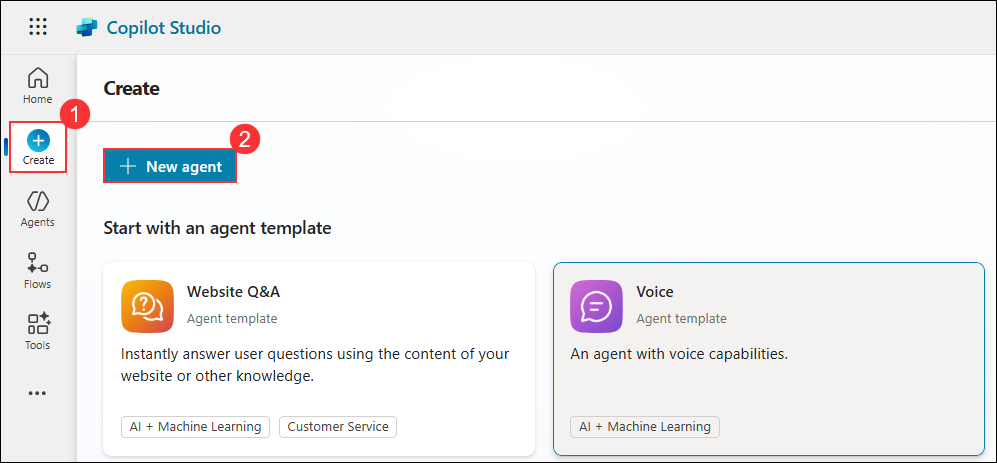

1. In the next pane, select **configure (1)** and provide the following details.

    | Key                     | Value                               |
    |-------------------------------|--------------------------------------------|
    | Name | `Leave Management Agent` |
    | Description | Handles leave requests, approvals, and balance updates using Dataverse and Power Automate. Helps employees apply for leave, check status, and get real-time updates via Teams. |
    | Instruction | Assist with leave applications, validate balances, and route approvals. Respond clearly and guide users through each step. Always ensure requests meet policy and ask for missing details. |

    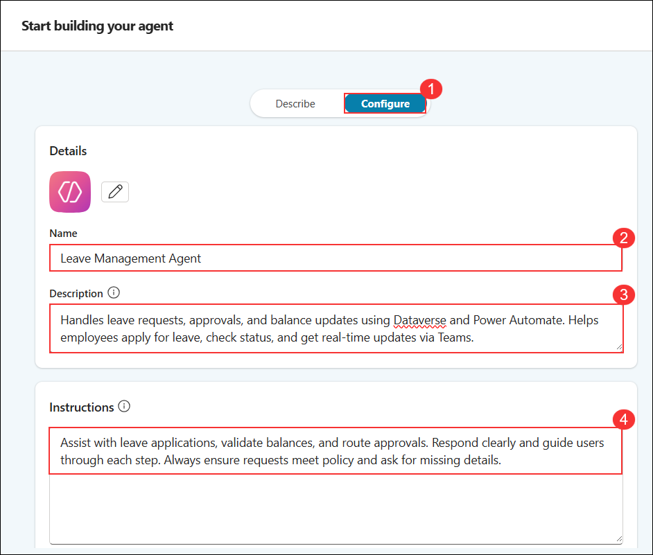

    >**Note:** Sometimes you may see a diffrent UI, if you are seeing a UI diffrent than this, then follow this below steps:

    - Click on **Skip to configure**, to get the configuration pane.

      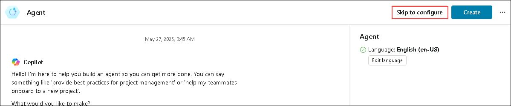
   
1. In the next pane, provide the same details given above and click on **Create**.

   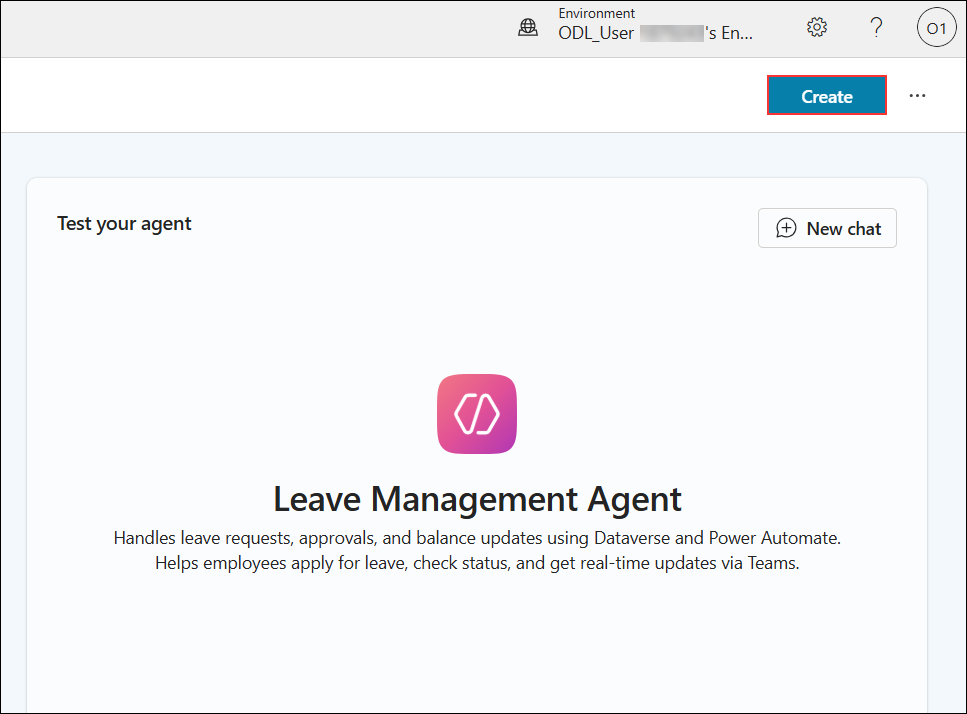

1. You have successfully created the Leave Management Agent. In the next steps of this lab, you will enhance it further by adding knowledge sources and advanced features.

   

## Task 4: Configure Agent Basics

In this task, you will connect knowledge sources such as the product catalog, policy documents, and store website content to your agent, allowing it to provide AI-powered answers using Retrieval-Augmented Generation (RAG).

1. If you are not already on the **Agents** page, select **Agents (1)** from the left navigation menu. Then, click **Leave Management Agent (2)**.

   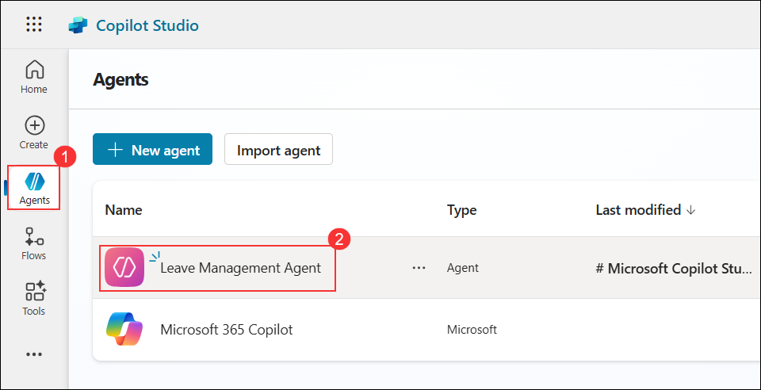

1. On the **Leave Management Agent** page, select the **Knowledge (1)** tab from the top menu and click **+ Add knowledge (2)**.  

   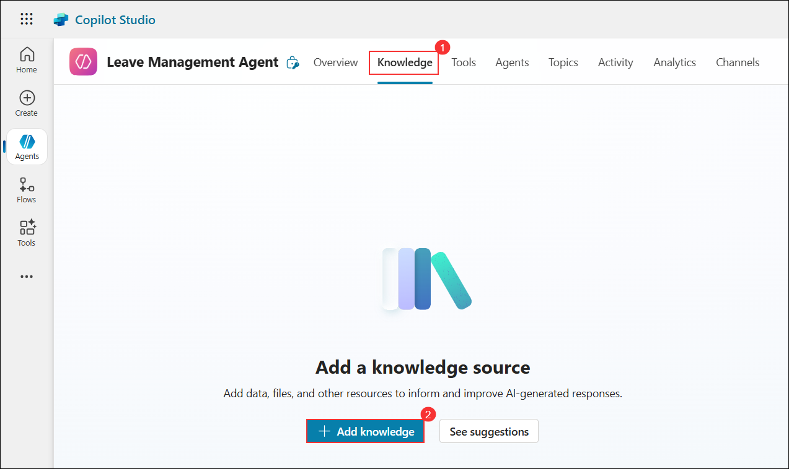

1. In the next pane, select **Dataverse** as knowledge source.

   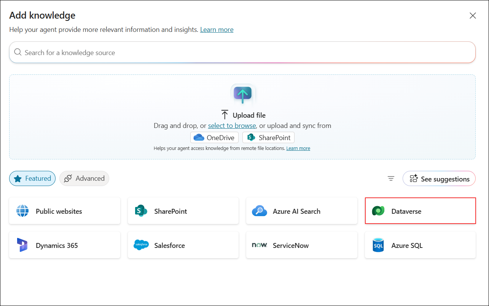

1. From the list, search and select **Leave Request** table. Click on **Add to agent**.

   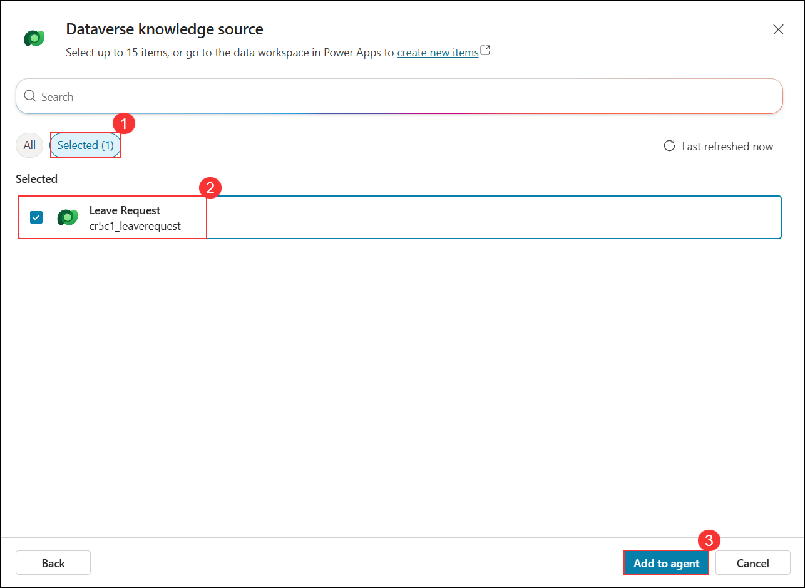

1. With the basic setup and configurations complete, the next exercises will focus on building the core logic for leave management.

## Summary

In this exercise, you provisioned a Power Platform environment, signed into Microsoft Copilot Studio, created a new agent, and configured its basic settings. These steps laid the groundwork for building an Agentic AI–driven leave management solution.

### You have successfully completed this exercise, please continue to next one >>