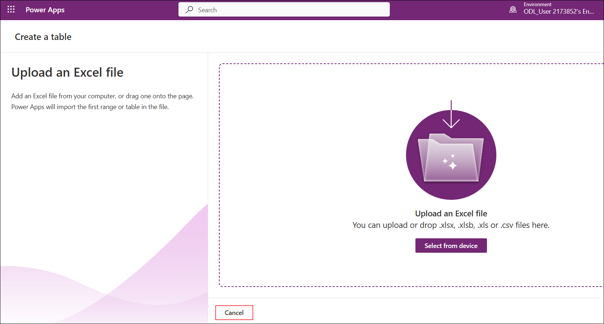

# 演習 1: 休暇管理エージェントの前提条件の設定

### 推定所要時間: 60 分

## 概要

この演習では、Microsoft Power Platform 環境をプロビジョニングし、Microsoft Copilot Studio にサインインします。次に、新しいエージェントを作成し、基本設定を構成します。これらのステップは、プロセスを合理化してエクスペリエンスを向上させるエージェント型 AI 駆動の休暇管理ソリューションを構築するための基盤となります。

## 目標

次のタスクを完了できるようになります。

- タスク 1: Power Platform 環境のプロビジョニング

- タスク 2: Microsoft Copilot Studio へのサインイン

- タスク 3: 新しいエージェントの作成

- タスク 4: エージェントの基本設定

## タスク 1: Power Platform 環境のプロビジョニング

このタスクでは、新しい Power Platform 環境に作成された Dataverse にデータセットを取り込みます。

1. Power Apps ポータルに戻り、以前に作成した環境に切り替えてください。

    

    > **注:** 環境が表示されない場合は、ページを更新して再試行してください。

1. 完了したら、左側のメニューから **[テーブル] (1)** を選択し、**[Excel または .CSV ファイルで作成] (2)** をクリックします。

     

     > **注:** ここで作成する権限がないというメッセージが表示された場合は、環境の準備に時間がかかっている可能性があるため、数分待ってからページを更新してください。
   
     > **注:** **[Excel または .CSV ファイルのインポート]** ウィンドウに直接移動された場合は、プロセスをキャンセルしてください。

     

1. 次のウィンドウで **[デバイスから選択]** をクリックし、ポップアップ ウィンドウでファイルを選択します。

     

1. **[開く]** ダイアログ ボックスで、フォルダー パス `C:\datasets\Leave-Management-System-with-Microsoft-Copilot-Studio-datasets-main` **(1)** に移動し、ファイル **LeaveRequests_Schema.csv (2)** を選択して、**[開く] (3)** をクリックします。

     

1. **[Excel または .CSV ファイルのインポート]** ウィンドウで、ファイル **LeaveRequests_Schema.csv** が一覧に表示されていることを確認します。トグルを有効にして **LeaveRequests** テーブルが含まれていることを確認し、**[インポート]** をクリックして続行します。

     

1. 選択が完了したら、**[保存して終了]** をクリックし、ポップアップ ウィンドウで **[保存して終了]** をクリックします。

     

     

     > **注:** ファイルの解析と列の作成には数分かかる場合があります。続行する前に、プロセスが完了して列が表示されるまで待ってください。この間は、ページを閉じたり別の場所に移動したりしないでください。

     > **注:** **[保存して終了]** ボタンが見つからない場合は、**CTRL + -** を使用して画面を縮小してください。

1. 作成が完了したら、リストから休暇申請テーブルを見つけ、後のラボで使用するため、テーブルの論理 ID をメモ帳に安全に記録します。

     

     > **注:** スクリーンショットと異なる ID が表示される場合がありますが、これは想定内の動作です。

## タスク 2: Microsoft Copilot Studio へのサインイン

このタスクでは、Microsoft Copilot Studio にサインインし、以前に作成した新しい開発者環境に切り替えます。

1. 新しい環境を作成し、Dataverse を設定したら、次のリンクを使用して新しいタブで **Copilot Studio** に移動します: [copilot studio](https://go.microsoft.com/fwlink/p/?linkid=2252408&clcid=0x409&culture=en-us&country=us)

     > **注:** VM 内で作業しているため、上記のリンクをコピーして VM 内のブラウザーで開いてください。
   
1. 表示されるポップアップ ウィンドウで **[開始する]** をクリックします。

     
   
     > **[省略可能]**

     > **注:** Copilot Studio ポータルの読み込みに通常より時間がかかる場合は、数分待ってください。あるいは、ブラウザーを閉じてプライベート/シークレット ウィンドウでポータルを再度開いてみてください。問題が続く場合は、以下の手順に従って解決してください。

     > Power Apps ポータルに戻り、表示されている環境 ID をコピーします。

     

     > コピーしたら、Copilot Studio に戻り、URL 内の **Default** 環境 ID をコピーした ID に置き換えます。

     

1. **[Copilot Studio へようこそ]** プロンプトが表示された場合は、**[スキップ]** をクリックします。

     

1. **Copilot Studio** に入ると、ホーム ページが表示されます。

     

1. ホーム ページで、表示されている環境オプションを選択します。

     

1. **[環境の選択]** ウィンドウで **[サポートされている環境] (1)** を展開して、以前に作成した新しい環境 **ODL_User <your-ID> Environment (2)** を選択し、環境を変更します。

     

## タスク 3: 新しいエージェントの作成

このタスクでは、Microsoft Copilot Studio で名前、説明、および基本構成設定を定義して新しいエージェントを作成します。このエージェントは、インテリジェントな休暇管理操作を可能にするための基盤として機能します。

1. ブラウザーから Copilot Studio ページに戻ります。

1. ホーム ページで、左側のメニューから **[エージェント] (1)** を選択し、**[+ 空のエージェントを作成] (2)** をクリックしてエージェントを作成します。

     

     > **注:** Copilot Studio の UI が最近更新されたため、エージェントを作成する前にエージェント名の入力を求められる場合があります。求められた場合は、以下の名前を入力してください。

     ```
     Leave Management Agent
     ```

1. **[準備中...]** 画面が完了し、Copilot Studio ホーム ページが読み込まれるまで待ちます。

     

1. **[エージェントがプロビジョニングされました]** というメッセージが表示されていることを確認して、エージェントのプロビジョニングが完了したことを確認します。

     

     > **注:** エージェントのプロビジョニングには数分かかる場合があり、エージェントの詳細がすぐには表示されない場合があります。続行する前に **[エージェントがプロビジョニングされました]** というメッセージが表示されるまで待ってください。

1. **[詳細]** セクションで、**[編集]** を選択して**名前**と**説明**を変更します。

     

1. 次のウィンドウで、**[名前] (1)** と **[説明] (2)** フィールドに次の情報を入力し、**[保存] (3)** を選択します。

    | キー                     | 値                               |
    |-------------------------------|--------------------------------------------|    | 名前 | `Leave Management Agent` |
    | 説明 | Handles leave requests, approvals, and balance updates using Dataverse and Power Automate. Helps employees apply for leave, check status, and get real-time updates via Teams. |

    

    > **注:** エージェントの作成時に既にエージェント名を入力している場合は、**[説明]** のみを更新して **[保存]** を選択できます。

1. **[エージェントのモデルの選択]** セクションで、デフォルトのモデルを選択したままにして、変更を加えないでください。

     > **注:** Copilot Studio はモデルを頻繁に更新するため、利用可能なモデルは異なる場合があります。

1. **[手順]** セクションで、**[編集]** を選択します。

    

1. **[手順]** ウィンドウで、**[手順] (1)** フィールドに指定された詳細を入力し、**[保存] (2)** を選択します。

   | キー                     | 値                               |
   |-------------------------------|--------------------------------------------|   | 手順 | Assist with leave applications, validate balances, and route approvals. Respond clearly and guide users through each step. Always ensure requests meet policy and ask for missing details. |

    

1. 休暇管理エージェントの作成が完了しました。このラボの次のステップでは、ナレッジ ソースと高度な機能を追加してさらに強化します。

## タスク 4: エージェントの基本設定

このタスクでは、製品カタログ、ポリシー ドキュメント、ストア ウェブサイトのコンテンツなどのナレッジ ソースをエージェントに接続し、検索拡張生成 (RAG) を使用して AI 搭載の回答を提供できるようにします。

1. **[ナレッジ]** セクションで、**[ナレッジを追加]** を選択します。

     

1. 次のウィンドウで、ナレッジ ソースとして **[Dataverse]** を選択します。

     

1. リストから **Leave Request (1)** を検索して **[Leave Request] (2)** テーブルを選択し、**[エージェントに追加] (3)** をクリックします。

     

1. 基本的なセットアップと構成が完了したため、次の演習では休暇管理のコア ロジックの構築に焦点を当てます。

<validation step="153f21c8-cb47-43c9-8ecf-ae3a6c889323" />

> **タスクの完了おめでとうございます！** 次は検証の時間です。手順は次のとおりです。
> - 対応するタスクの検証ボタンをクリックします。成功のメッセージが表示されたら、次のタスクに進むことができます。
> - 表示されない場合は、エラー メッセージをよく読み、ラボ ガイドの手順に従ってステップを再試行してください。
> - サポートが必要な場合は、cloudlabs-support@spektrasystems.com までお問い合わせください。24 時間 365 日対応しています。

## まとめ

この演習では、Power Platform 環境をプロビジョニングし、Microsoft Copilot Studio にサインインし、新しいエージェントを作成して基本設定を構成しました。これらのステップにより、エージェント型 AI 駆動の休暇管理ソリューションを構築するための基盤が整いました。

### この演習を正常に完了しました。次の演習に進んでください >>

   
