# Exercise 1: Setting up Pre-Requisites for Leave Management Agent

### Estimated Duration: 60 Minutes

## Overview

In this exercise, you will provision a Microsoft Power Platform environment and sign in to Microsoft Copilot Studio. You will then create a new agent and configure its basic settings. These steps form the foundation for building an Agentic AI–driven leave management solution that streamlines processes and enhances experience.

## Objectives

You will be able to complete the following tasks:

- Task 1: Provisioning Power Platform environment

- Task 2: Sign in to Microsoft Copilot Studio

- Task 3: Create a New Agent

- Task 4: Configure Agent Basics

## Task 1: Provisioning Power Platform environment

In this task, you will ingest the datasets into Dataverse, which will be created in a new Power Platform environment.

1. Navigate back to the Power Apps portal, and please switch to the environment that you created earlier.

    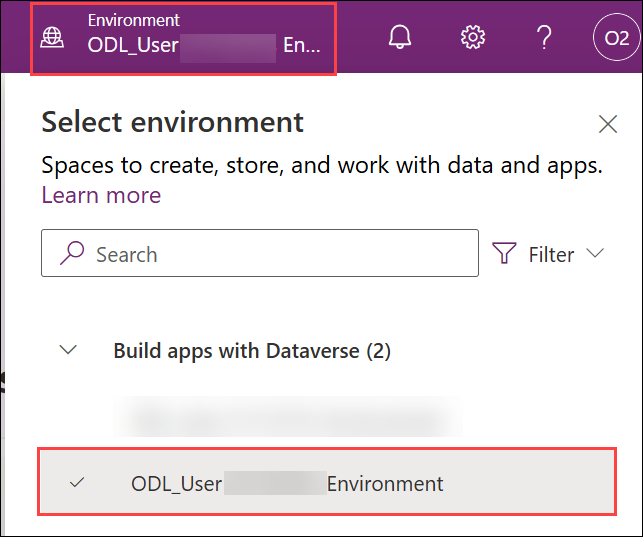

1. Once done, select **Tables (1)** from the left menu and click on **Create with Excel or .CSV file (2)**.

     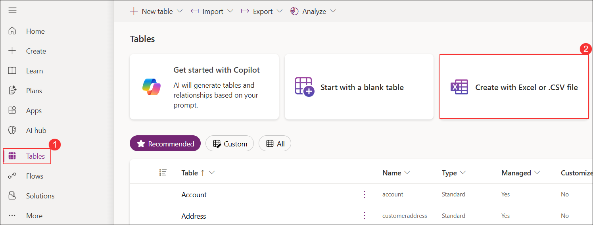

1. In the next pane, click on **Select from device** and in the pop-up window, select files.

     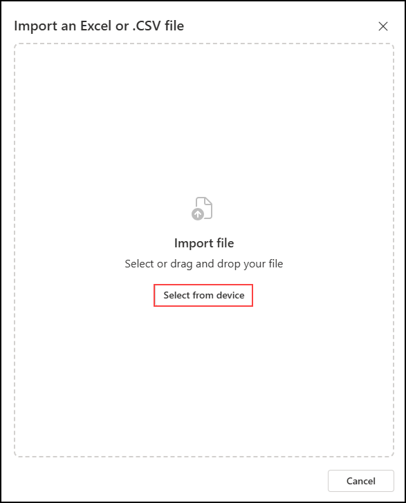

1. On the **Open** dialog box, navigate to the folder path `C:\datasets\Leave-Management-System-with-Microsoft-Copilot-Studio-datasets-main` **(1)**, select the file **LeaveRequests_Schema.csv (2)**, and then click **Open (3)**.

     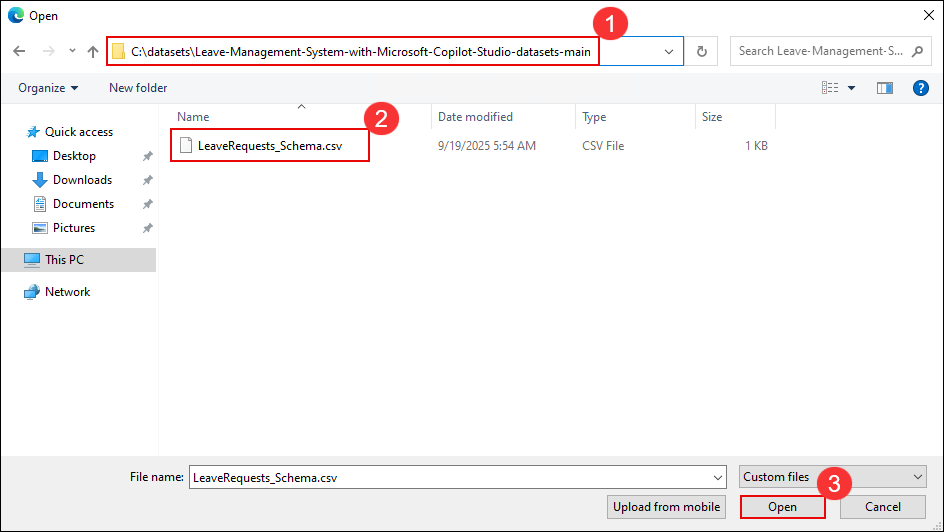

1. On the **Import an Excel or .CSV file** pane, verify that the file **LeaveRequests_Schema.csv** is listed. Ensure that the table **LeaveRequests** is included by keeping the toggle enabled. Click **Import** to proceed.

     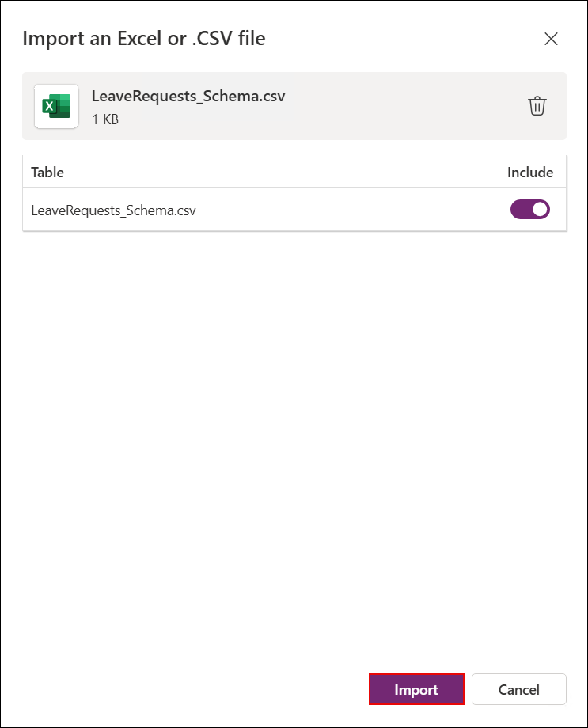

1. Once selected, click on **Save and exit** and in the pop up window, click on **Save and exit**.

     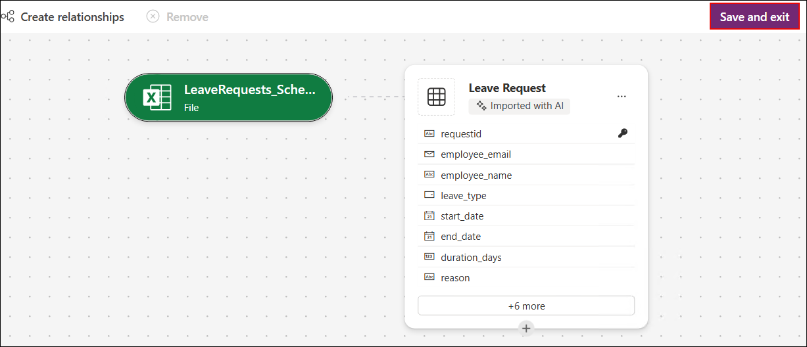

     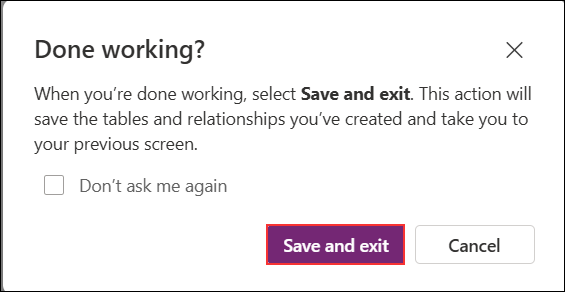

   >**Note:** If you are not able to find **Save and exit** button, minimize the screen using **CTRL + -**.

   >**Note:** If you are seeing **Create** option instead of **Save and Exit**, please go with the Create option.

1. Once created, locate the Leave Request table from the list and note down the logical ID of the table as shown in a notepad safely, as you will be using this value further in the lab.

     

   >**Note:** You may see a different ID than the one shown in the screenshot; this is expected.

## Task 2: Sign into Microsoft Copilot Studio

In this task, you will sign in to Microsoft Copilot Studio and switch the environment to the new developer environment that you created earlier.

1. As you have now created a new environment and set up Dataverse, navigate to **Copilot Studio**  in a new tab using this link: [copilot studio](https://go.microsoft.com/fwlink/p/?linkid=2252408&clcid=0x409&culture=en-us&country=us)

   >Note: Since you are working within a VM, please copy the above link and open it in the browser inside the VM.
   
1. In the pop-up window that appears, click on **Get Started**

     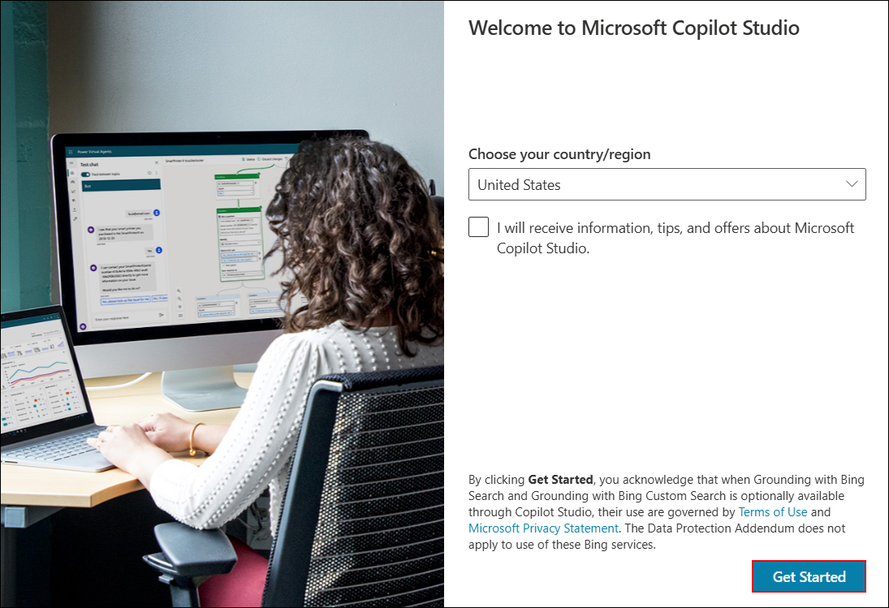
   
   >**[OPTIONAL]**

   >**Note:** If the Copilot Studio portal is taking longer than usual to load, please wait a few minutes. Alternatively, try closing your browser and reopening the portal in a private/incognito window. If the issue still persists, follow the instructions below. to resolve this:

   > Navigate back to Power Apps Portal, and copy the environment ID as shown.

     

   > Once copied, navigate back to Copilot Studio, from the URL, replace the **Default** environment ID with the ID that you copied.

     

1. If the **Welcome to Copilot Studio** prompt appears, click **Skip**.

     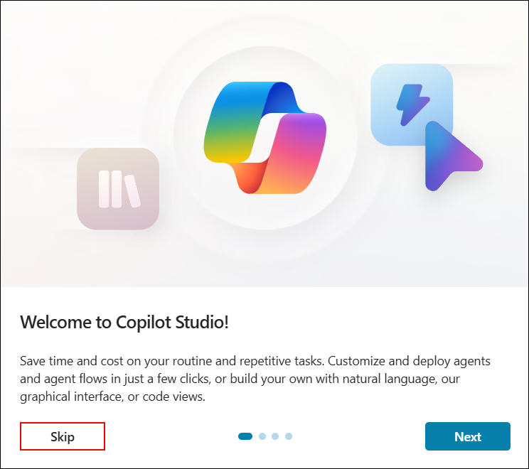

1. Once you are inside **Copilot Studio**, you will be on the home page. 

     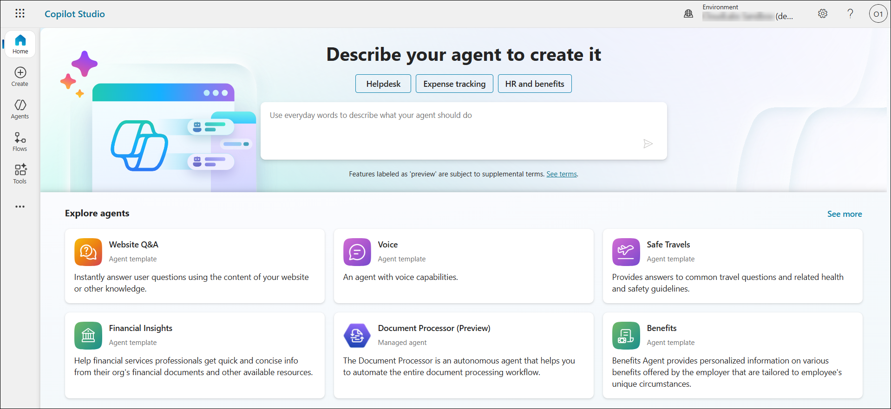

1. In the home page, select the environment option as shown.

     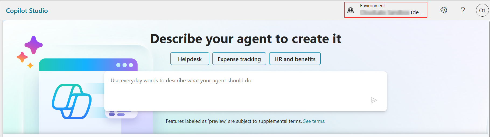

1. Change the environment to the new environment that you have created earlier on the **Select environment** pane, expand **Supported environments (1)** and select **ODL_User <your-ID> Environment (2)**.

     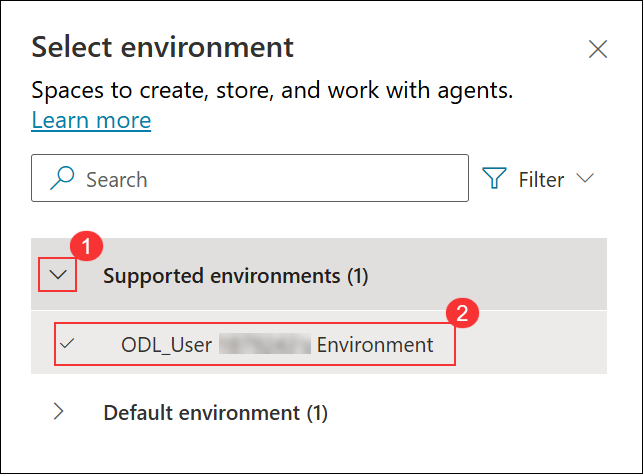

## Task 3: Create a New Agent

In this task, you will create a new agent in Microsoft Copilot Studio by defining its name, description, and basic configuration settings. This agent will serve as the base for enabling intelligent leave management operations.

1. Navigate back to the Copilot Studio page from the browser.

1. From the home page, select **Agents (1)** from the left menu and click on **+ Create blank agent (2)** to create an agent.

     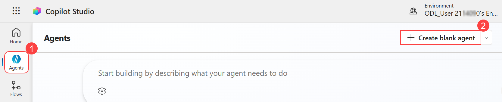

     > **Note:** Due to recent Copilot Studio UI updates, you may be prompted to enter the agent name before creating the agent. If prompted, provide the name below:

     ```
     Leave Management Agent
     ```

1. Wait until the **Getting things ready ...** screen completes and the Copilot Studio home page loads.

     

1. Verify that the agent provisioning is complete by confirming the **Your agent has been provisioned** message is displayed.

     

1. In the **Details** section, select **Edit** to modify the **Name** and **Description**.

     

1. In the next pane, enter the following details in **Name (1)** and **Description (2)** fields, and then select **Save (3)**..

    | Key                     | Value                               |
    |-------------------------------|--------------------------------------------|
    | Name | `Leave Management Agent` |
    | Description | Handles leave requests, approvals, and balance updates using Dataverse and Power Automate. Helps employees apply for leave, check status, and get real-time updates via Teams. |

    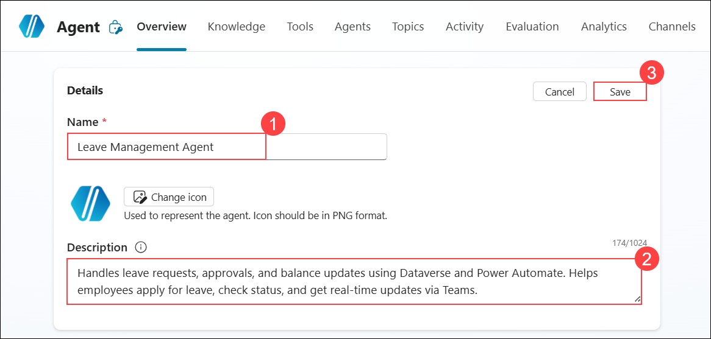

    > **Note:** If you have already provided the agent name during creation, you can update only the **Description** and then select **Save**.

1. In the **Instructions** section, select **Edit**.

    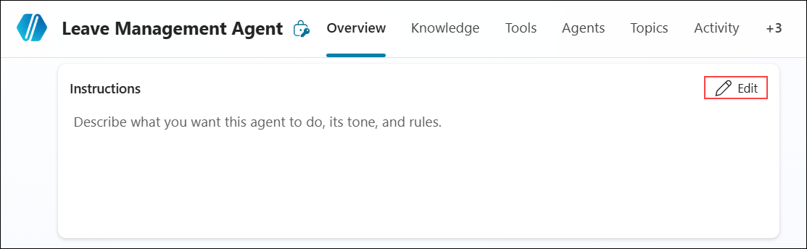

1. In the **Instructions** pane, enter the provided details in the **Instruction (1)** field, and then select **Save (2)**.

   | Key                     | Value                               |
   |-------------------------------|--------------------------------------------|
   | Instruction | Assist with leave applications, validate balances, and route approvals. Respond clearly and guide users through each step. Always ensure requests meet policy and ask for missing details. |

    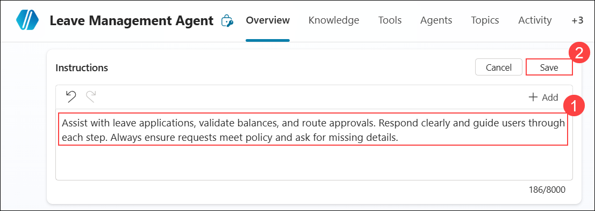

1. Once configured, please click on **save** to save the instructions.

1. You have successfully created the Leave Management Agent. In the next steps of this lab, you will enhance it further by adding knowledge sources and advanced features.

     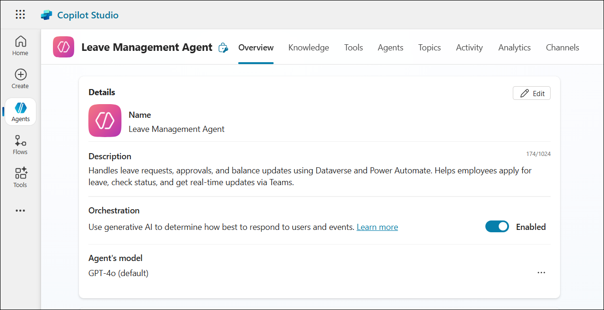

<validation step="153f21c8-cb47-43c9-8ecf-ae3a6c889323" />

> **Congratulations** on completing the task! Now, it's time to validate it. Here are the steps:
> - Hit the Validate button for the corresponding task. If you receive a success message, you can proceed to the next task. 
> - If not, carefully read the error message and retry the step, following the instructions in the lab guide.
> - If you need any assistance, please contact us at cloudlabs-support@spektrasystems.com. We are available 24/7 to help.

## Task 4: Configure Agent Basics

In this task, you will connect knowledge sources such as the product catalog, policy documents, and store website content to your agent, allowing it to provide AI-powered answers using Retrieval-Augmented Generation (RAG).

1. In the **Knowledge** section, select **Add knowledge**.

     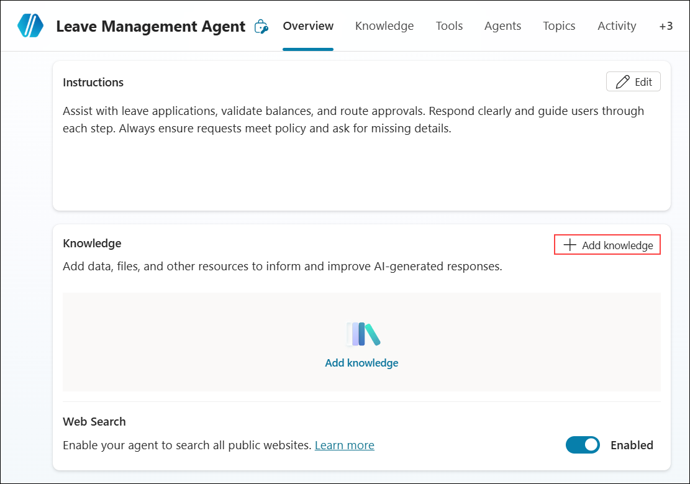

1. In the next pane, select **Dataverse** as a knowledge source.

     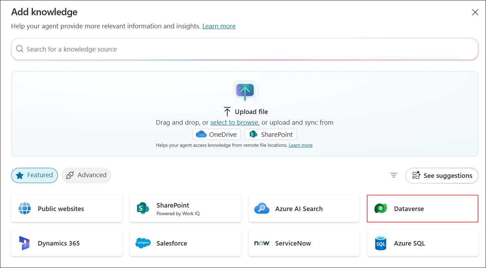

1. From the list, search **Leave Request (1)** and select **Leave Request (2)** table. Click on **Add to agent (3)**.

     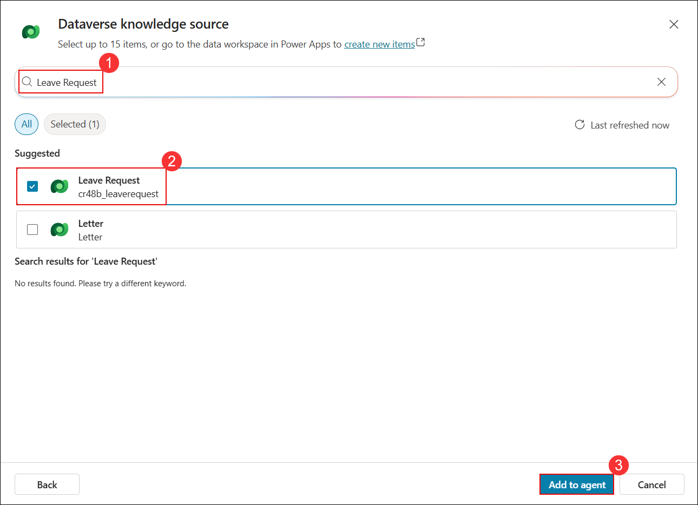

1. With the basic setup and configurations complete, the next exercises will focus on building the core logic for leave management.

## Summary

In this exercise, you provisioned a Power Platform environment, signed into Microsoft Copilot Studio, created a new agent, and configured its basic settings. These steps laid the groundwork for building an Agentic AI–driven leave management solution.

### You have successfully completed this exercise. Please continue to the next one >>

   
