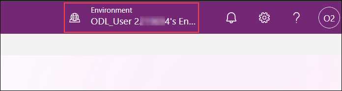
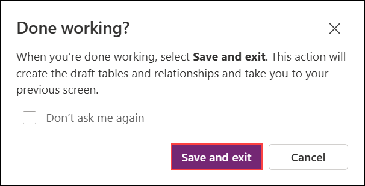
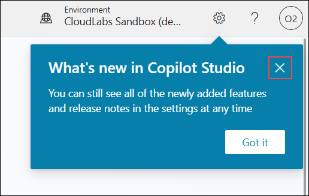
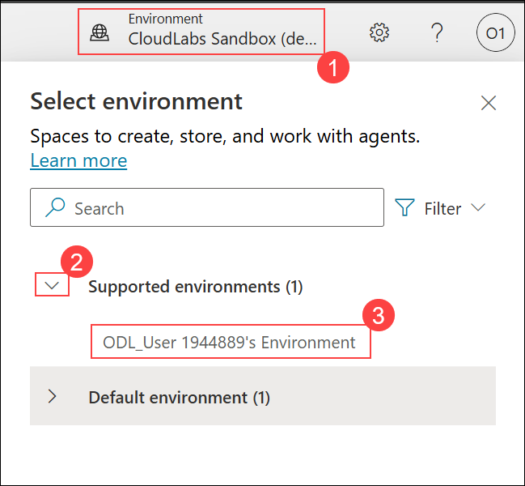
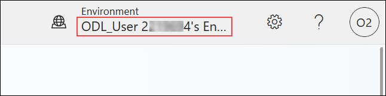
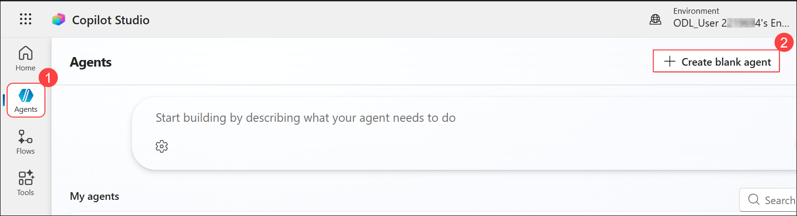
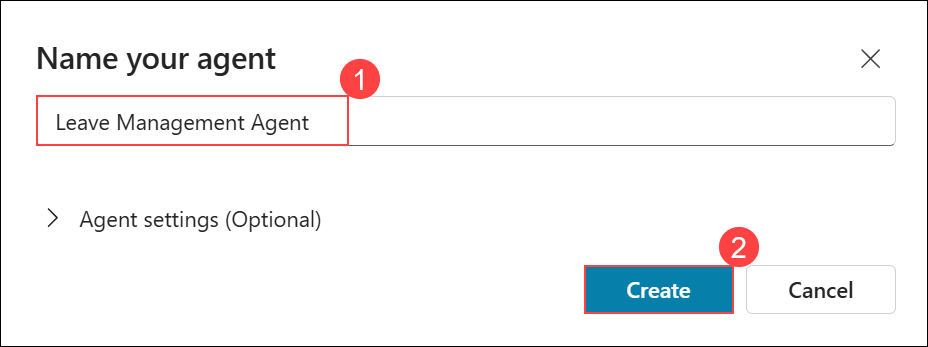
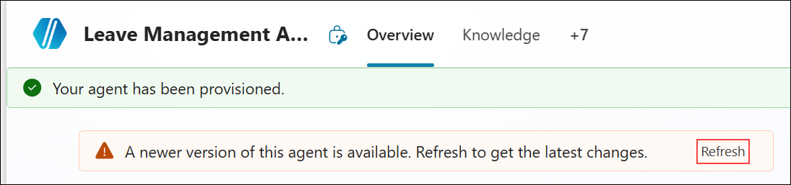
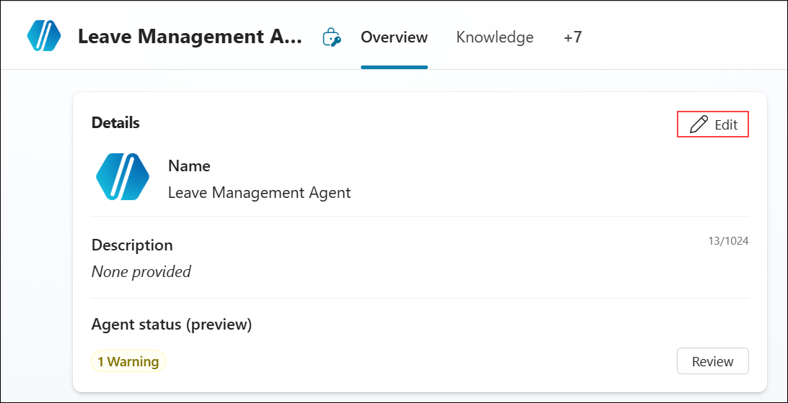
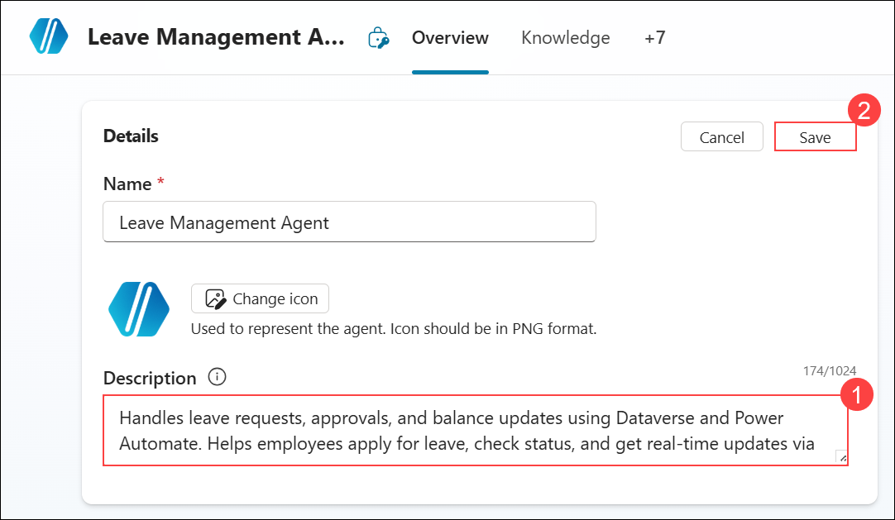

# 演習 1: 休暇管理エージェントの前提条件の設定

### 推定所要時間: 60 分

## 概要

この演習では、Microsoft Power Platform 環境をプロビジョニングし、Microsoft Copilot Studio にサインインします。次に新しいエージェントを作成して基本設定を構成します。これらのステップは、プロセスを合理化し、エクスペリエンスを向上させるエージェント型 AI 主導の休暇管理ソリューションを構築するための基盤を形成します。

## 目標

次のタスクを完了できるようになります。

- タスク 1: Power Platform 環境のプロビジョニング

- タスク 2: Microsoft Copilot Studio へのサインイン

- タスク 3: 新しいエージェントの作成

- タスク 4: エージェントの基本設定

## タスク 1: Power Platform 環境のプロビジョニング

このタスクでは、新しい Power Platform 環境に作成された Dataverse にデータセットを取り込みます。

1. Power Apps ポータルに戻り、先ほど作成した環境に切り替えてください。

    

    > **注:** 環境が表示されない場合は、ページを更新して再試行してください。

1. 現在の環境が **ODL_User <inject key="DeploymentID" enableCopy="false"></inject>'s Environment** と表示されていることを確認します。

    

1. 左側のメニューから **[テーブル] (1)** を選択し、**[Excel または .CSV ファイルで作成] (2)** をクリックします。

     

1. 次のウィンドウで **[デバイスから選択]** をクリックし、ポップアップ ウィンドウでファイルを選択します。

     

1. **[開く]** ダイアログ ボックスで、フォルダー パス `C:\datasets\Leave-Management-System-with-Microsoft-Copilot-Studio-datasets-main` **(1)** に移動し、ファイル **LeaveRequests_Schema.csv (2)** を選択して、**[開く] (3)** をクリックします。

     

1. **[Excel または .CSV ファイルのインポート]** ウィンドウで、ファイル **LeaveRequests_Schema.csv** が一覧表示されていることを確認します。テーブル **LeaveRequests** がトグルを有効にして含まれていることを確認します。**[インポート]** をクリックして続行します。

     

1. 選択後、**[保存して終了]** をクリックし、ポップアップ ウィンドウで確認します。

     

     > **注:** ファイルの解析と列の作成には数分かかる場合があります。処理が完了して列が表示されるまでお待ちください。この間はページを閉じたり移動したりしないでください。

1. **[保存して終了]** をクリックします。

     

     >**注:** **[保存して終了]** ボタンが見つからない場合は、**CTRL + -** を使用して画面を縮小してください。

1. 作成が完了したら、リストから Leave Request テーブルを見つけ、テーブルの論理 ID をメモ帳に安全にメモしてください。このラボの後半でこの値を使用します。

     

     >**注:** スクリーンショットとは異なる ID が表示される場合がありますが、これは正常な動作です。

## タスク 2: Microsoft Copilot Studio へのサインイン

このタスクでは、Microsoft Copilot Studio にサインインし、先ほど作成した新しい Developer 環境に切り替えます。

1. 新しいブラウザー タブを開き、次の URL を入力して **Microsoft Copilot Studio** に移動します。

     ```
     https://copilotstudio.microsoft.com
     ```

1. **[Microsoft Copilot Studio へようこそ]** 画面で、デフォルトの**国/地域**の選択のままにして **[開始する]** を選択して続行します。

     

1. **[Copilot Studio へようこそ!]** ポップアップが表示された場合は、**[スキップ]** を選択してメイン ダッシュボードに進みます。

     

1. **[Microsoft Copilot Studio の最新バージョンに更新されました]** ポップアップが表示された場合は、**[了解]** を選択します。

     

1. **[Copilot Studio の新機能]** ポップアップが表示された場合は、**[閉じる (X)]** アイコンを選択して閉じます。

     

1. Copilot Studio で、環境ピッカー **(1)** を開き、**[サポートされている環境] (2)** を展開して、**[ODL_User <inject key="Deployment ID" enableCopy="false"></inject>'s Environment (3)]** を選択して切り替えます。

     

1. **Copilot Studio** にアクセスすると、ホーム ページが表示されます。

     

## タスク 3: 新しいエージェントの作成

このタスクでは、Microsoft Copilot Studio で名前、説明、基本設定を定義して新しいエージェントを作成します。このエージェントは、インテリジェントな休暇管理操作を可能にするためのベースとなります。

1. ブラウザーから Copilot Studio ページに戻ります。

1. エージェントを作成する前に、選択した環境が **ODL_User <inject key="DeploymentID" enableCopy="false"></inject>'s Environment** であることを確認します。

     

   > **注:** 別の環境が選択されている場合は、続行する前に **ODL_User <inject key="DeploymentID" enableCopy="false"></inject>'s Environment** に切り替えてください。

1. ホーム ページから、左側のメニューで **[エージェント] (1)** を選択し、**[+ 空白のエージェントの作成] (2)** をクリックしてエージェントを作成します。

     

1. **[エージェントに名前を付ける]** ウィンドウで、**[エージェントに名前を付ける] (1)** フィールドに以下の値を入力し、**[作成] (2)** を選択します。

     ```
     Leave Management Agent
     ```

     

1. **[準備中 ...]** 画面が完了し、Copilot Studio ホーム ページが読み込まれるまで待ちます。

     

1. **[エージェントがプロビジョニングされました]** メッセージが表示されることを確認してエージェントのプロビジョニングが完了していることを確認します。

     

     > **注:** エージェントのプロビジョニングが完了するまでに数分かかる場合があります。

     > **注:** **[このエージェントの新しいバージョンが利用可能です]** という警告メッセージが表示された場合は、**[更新]** を選択します。

     

1. **[詳細]** セクションで **[編集]** を選択します。

     

1. 次のウィンドウで、以下の **[説明]** フィールドを入力し、**[保存] (2)** を選択します。

    | キー                     | 値                               |
    |-------------------------------|--------------------------------------------|
    | 説明 | Handles leave requests, approvals, and balance updates using Dataverse and Power Automate. Helps employees apply for leave, check status, and get real-time updates via Teams. |

    

1. **[エージェントのモデルの選択]** セクションで、デフォルト モデルを選択したままにして変更しないでください。

     > **注:** Copilot Studio はモデルを頻繁に更新するため、使用可能なモデルは異なる場合があります。

1. **[手順]** セクションで **[編集]** を選択します。

    

1. **[手順]** ウィンドウで、以下の詳細を **[手順] (1)** フィールドに入力し、**[保存] (2)** を選択します。

   | キー                     | 値                               |
   |-------------------------------|--------------------------------------------|
   | 手順 | Assist with leave applications, validate balances, and route approvals. Respond clearly and guide users through each step. Always ensure requests meet policy and ask for missing details. |

    

1. 休暇管理エージェントが正常に作成されました。このラボの次のステップでは、ナレッジ ソースと高度な機能を追加してさらに強化します。

## タスク 4: エージェントの基本設定

このタスクでは、Dataverse の Leave Request テーブルをエージェントのナレッジ ソースとして接続し、Retrieval-Augmented Generation (RAG) を使用した AI 搭載の回答を提供できるようにします。

1. **[ナレッジ]** セクションで、**[ナレッジの追加]** を選択します。

     

1. 次のウィンドウで、ナレッジ ソースとして **[Dataverse]** を選択します。

     

1. リストから **[Leave Request (1)]** を検索し、**[Leave Request (2)]** テーブルを選択します。**[エージェントに追加] (3)** をクリックします。

     

1. 基本的な設定と構成が完了しました。次の演習では、休暇管理のコア ロジックの構築に焦点を当てます。

<validation step="153f21c8-cb47-43c9-8ecf-ae3a6c889323" />

> **タスクの完了おめでとうございます！** 次は検証の時間です。手順は次のとおりです。
> - 対応するタスクの検証ボタンをクリックします。成功のメッセージが表示されたら、次のタスクに進むことができます。
> - 表示されない場合は、エラー メッセージをよく読み、ラボ ガイドの手順に従ってステップを再試行してください。
> - サポートが必要な場合は、cloudlabs-support@spektrasystems.com までお問い合わせください。24 時間 365 日対応しています。

## まとめ

この演習では、Power Platform 環境をプロビジョニングし、Microsoft Copilot Studio にサインインし、新しいエージェントを作成して基本設定を構成しました。これらのステップにより、エージェント型 AI 主導の休暇管理ソリューションを構築するための基盤が整いました。

### この演習を正常に完了しました。次の演習に進んでください >>

   
