# Exercise 2: Designing Advanced Topics

### Estimated Duration: 60 Minutes

## Overview

In this exercise, you will build a Copilot Studio agent to form the foundation of your leave management assistant. You will define its purpose by assigning a clear, descriptive name and a detailed description, and connecting it to critical knowledge sources, such as the leave policy and a database containing user details. These steps will enable your agent to deliver precise, AI-powered responses by leveraging indexed information.

## Objectives

You will be able to complete the following tasks:

- Task 1: Create a topic for leave application

- Task 2: Build a Power Automate flow to validate leave requests

- Task 3: Create a flow to update leave requests in Dataverse

- Task 4: Update Dataverse

## Task 1: Create topic for leave application

In this task, you will create a topic that enables employees to apply for leave by configuring the required inputs and connecting it to the validation flow.

1. In **Copilot Studio**, select **Agents (1)**, and then choose **Leave Management Agent (2)**. 

     

1. Select **+7 (1)**, and then choose **Topics (2)**.

     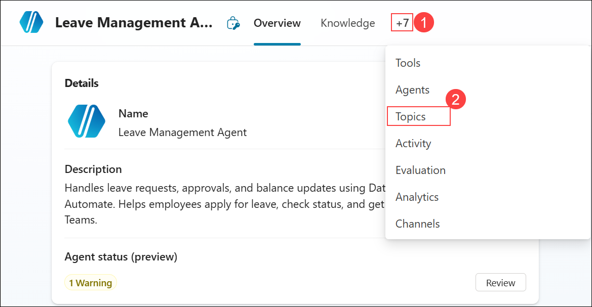

   > **Note:** If the **Topics** tab is directly visible on the screen, you can select it without clicking **+7**.

1. In the **Topics** page, select **Add a topic (1)**, and then choose **From blank (2)**.

     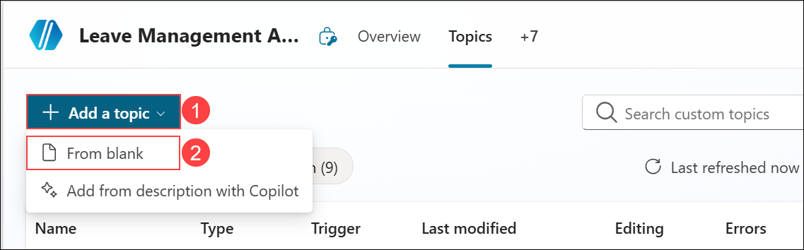

1. On the **Test your agent** pane, click the **Close (X)** button to close the testing window and make the canvas larger for easier workflow design.

     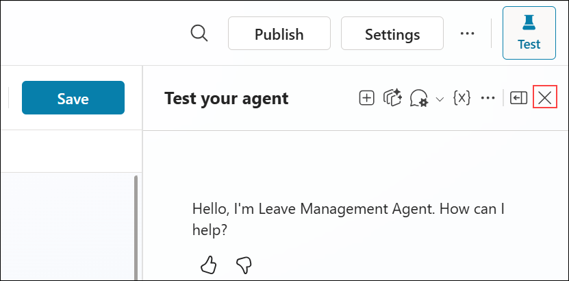

1. In the **Trigger** node, enter the following description in **Describe what the topic does (1)**, and then select the **plus (+) icon (2)**.

     ```
     This topic is used by employees to apply leaves
     ```

     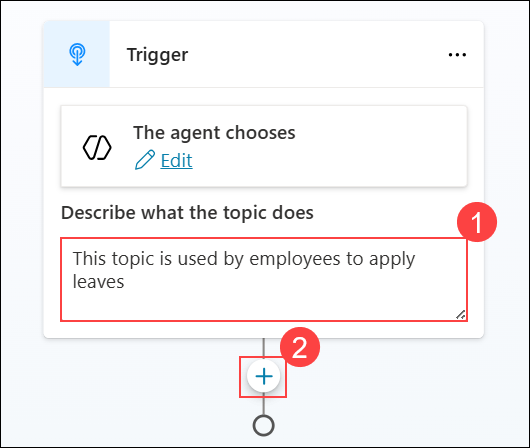

1. In the **Topic editor**, from the options displayed, select **Ask a question** to add a question node to the flow.

     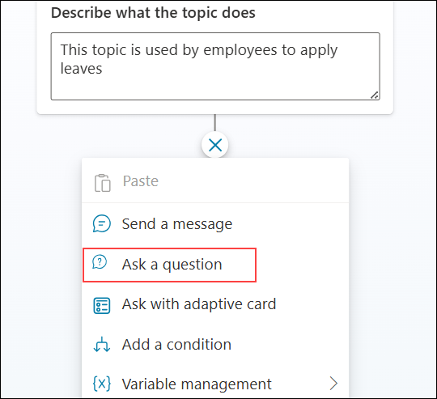

1. In the **Question** node, enter the following in the question text **(1)**, select **Multiple choice options (2)** under **Identify**, and then choose **+ New option (3)**.

     ```
     Please choose the Leave type from the list
     ```

     

1. In the **Options for user** section, type **Casual (1)** as the first leave type. Then click **+ New option (2)** to add another choice.  

     

1. Click on **+ New option** again as in the previous step, and add the leave types **Emergency** and **Unpaid**.   

     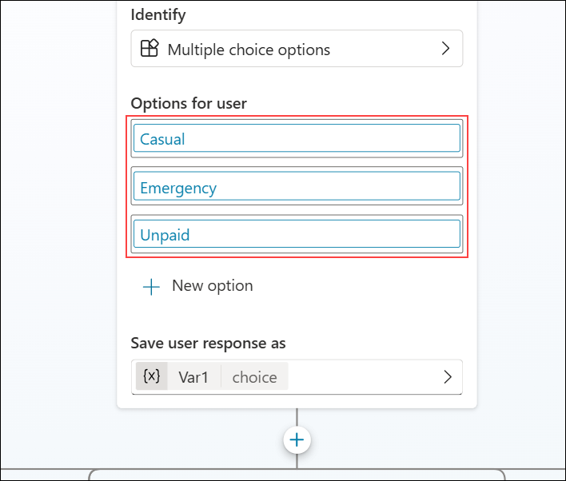

1. In the **Save user response as** field, select **Var1**. 

     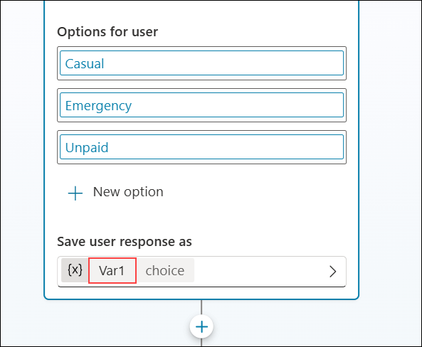

1. In the **Variable properties** pane, enter the below value in the **Variable name (1)** field, and then select **Close (2)**.

     ```
     leave_type
     ```

     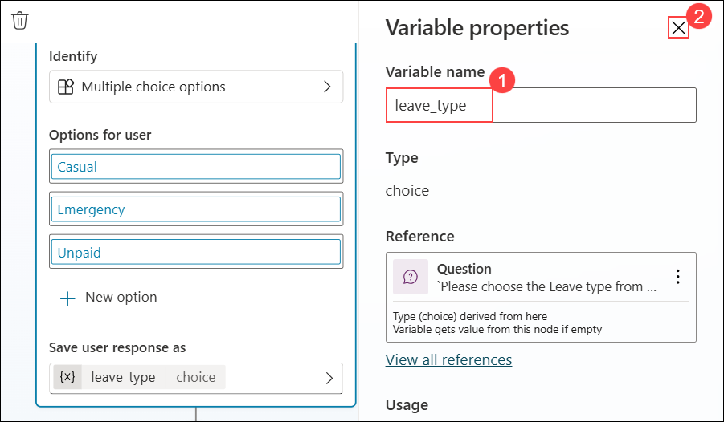

1. In the **Topics** designer, under **All other conditions**, click the **plus (+) icon** to add the next step in the flow. 

     

1. Click the **plus icon (1)** and select **Send a message (2)** from the menu.

     

1. In the **Message** action, enter the following text **(1)** in the text box. Then click the **plus icon (2)** below to add the next step.  

     ```
     Please choose an option from the list
     ```

     

1. From the **Message** node, open the action menu. Select **Topic management (1)** and then choose **Go to step (2)** to redirect the conversation flow.

     

1. After selecting **Go to step**, choose the **Question** node **(where the leave type options are defined)** to **loop the flow back to the beginning** in case users select any other option.

     

1. In the **Topics** designer, click the **plus (+) icon** below the condition branches to continue building the flow for each leave type path.

     

1. From the action menu, select **Ask a question** to prompt the user for additional information in the flow.

     

1. In the **Question** node, enter the following prompt **(1)** to capture the start date from the user.

     ```
     Please provide your leave Start Date (Please make sure to provide in yyyy-mm-dd format)
     ```

     

1. In the **Question** node, under **Identify**, click **Multiple choice options (2)** and select **User's entire response (3)** so that the agent saves the response exactly as the user enters it.

     

1. In the **Save user response as** field, select **Var1**.

     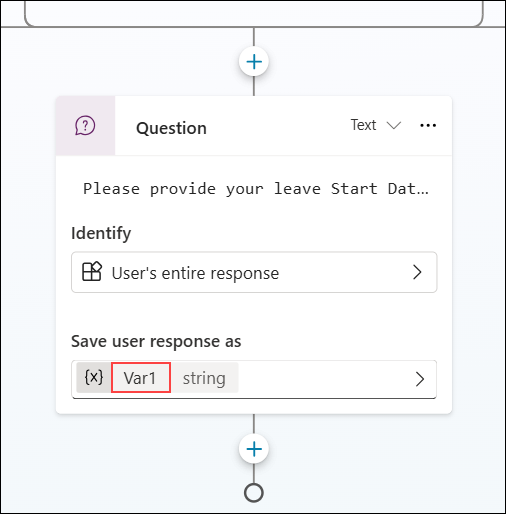

1. In the **Variable properties** pane, enter the below value in the **Variable name (1)** field, and then select **Close (2)**.

     ```
     startDate
     ```

     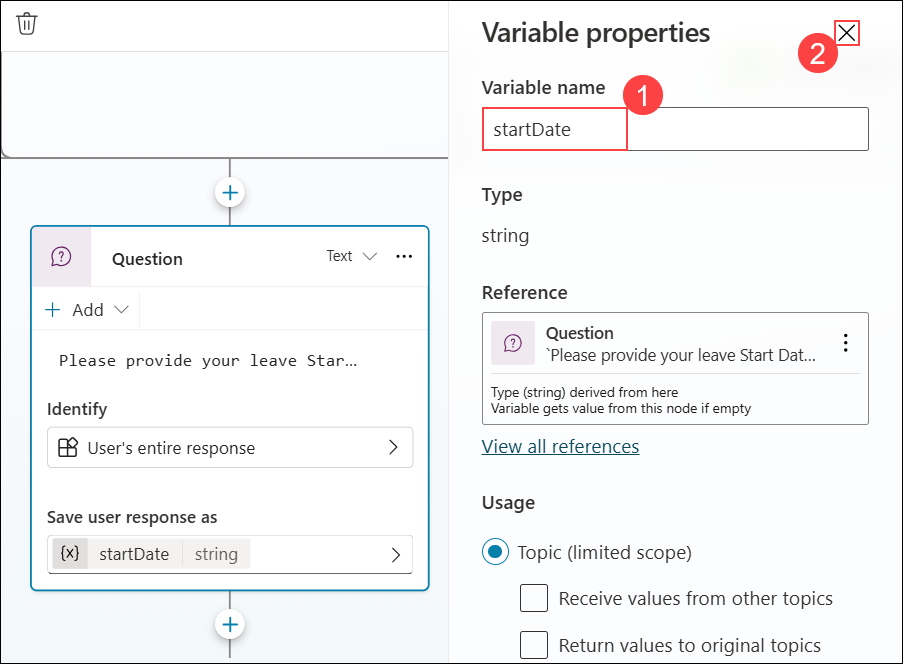

1. Below the **Question** node, click the **plus (+) icon** to add the next step in the flow. 

     

1. From the menu, select **Ask a question** to prompt the user for additional input.   

     

1. In the **Question** node, enter the following in the question text.

     ```
     Please provide your leave End Date (Please make sure to provide in yyyy-mm-dd format)
     ```

     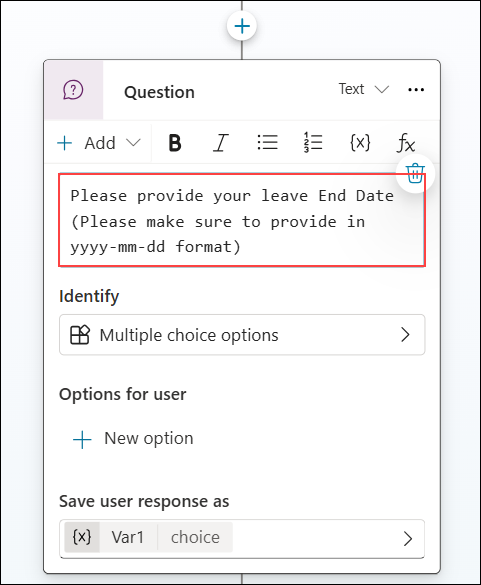

1. In the **Identify** section, select the option arrow **(1)**, and then choose **User's entire response (2)**.

     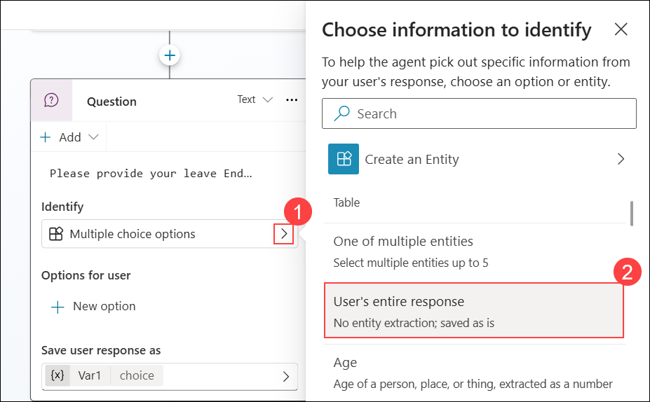

1. In the **Save user response as** field, select **Var1**.

     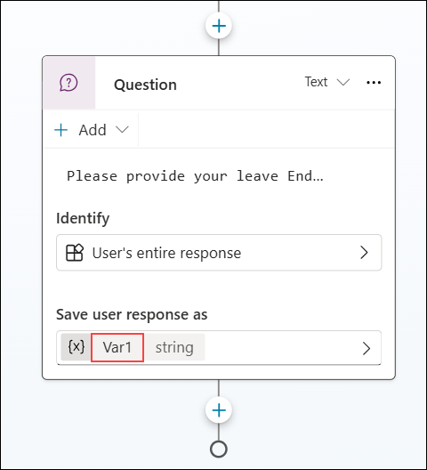

1. In the **Variable properties** pane, enter the below value in the **Variable name (1)** field, and then select **Close (2)**.

     ```
     endDate
     ```

     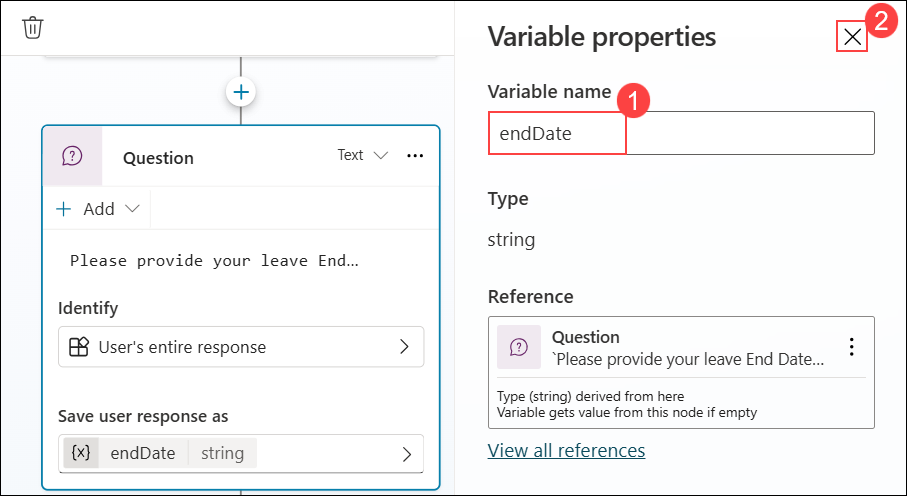

1. Below the **endDate** question node, click the **plus (+) icon** to add the next step in the flow.

     

1. Below the **endDate** question node, click the **plus (+) icon** and select **Ask a question** to add the next prompt in the flow. 

     

1. In the **Question** node, enter the following in the question text **(1)**, select the option arrow **(2)** under **Identify**, and then choose **User's entire response (3)**.

     ```
     May I please know the reason for your leave?
     ```

     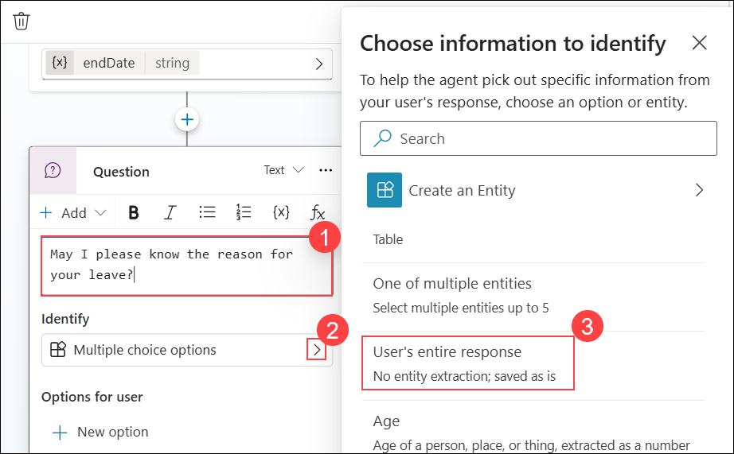

1. In the **Save user response as** field, select **Var1**.

     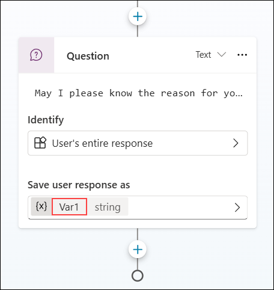

1. In the **Variable properties** pane, enter the below value in the **Variable name (1)** field, and then select **Close (2)**.

     ```
     reason
     ```

     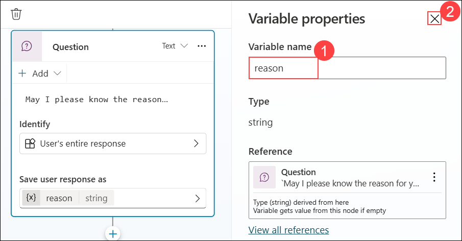

1. Select **Save** to save the topic.

     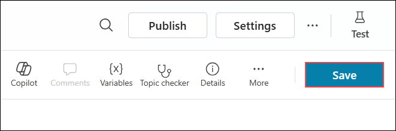

1. In the **Save your topic** pane, enter the below value in the **Name your topic (1)** field, and then select **Save (2)**.

     ```
     leave_request
     ```

     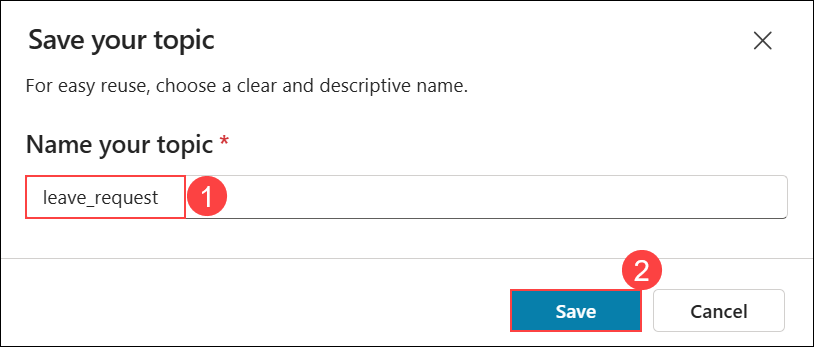

1. Below the **reason** question node, click the **plus (+) icon** to add the next step in the flow.  

     

1. Select **Add a tool (1)**, verify that the **Basic tools (2)** tab is selected, and then choose **New Agent flow (3)**.

     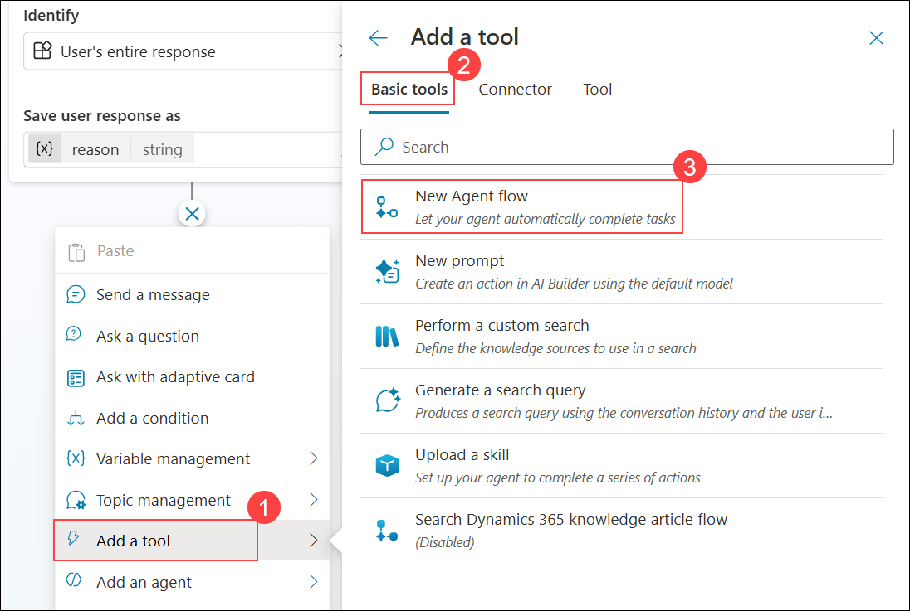

1. You will be redirected to the **Agent flows** page, where the **When an agent calls the flow** trigger and **Respond to the agent** action are already added by default.

     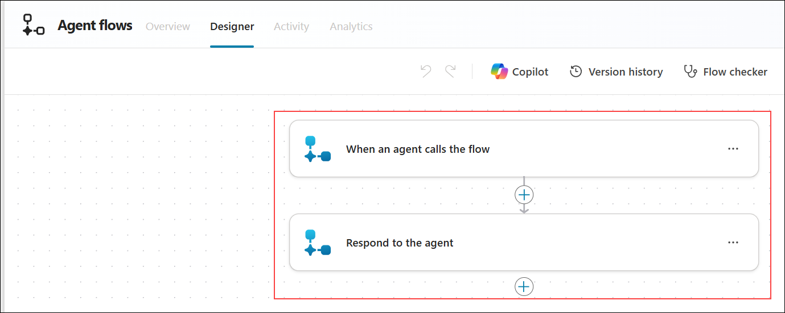

     > **Note:**  
     > - **When an agent calls the flow:** This trigger starts the flow whenever the Copilot agent invokes it. It is used to receive input or information from the agent and begin the automation process.  
     > - **Respond to the agent:** This action sends data or responses back to the Copilot agent after the flow execution is completed. It helps return outputs, confirmations, or processed information to the conversation.

## Task 2: Build a Power Automate flow to validate leave requests

In this task, you will create a Power Automate flow that validates leave requests by calculating the duration, checking the leave balance, and updating it accordingly.

1. Select the **When an agent calls the flow** trigger to expand it.

     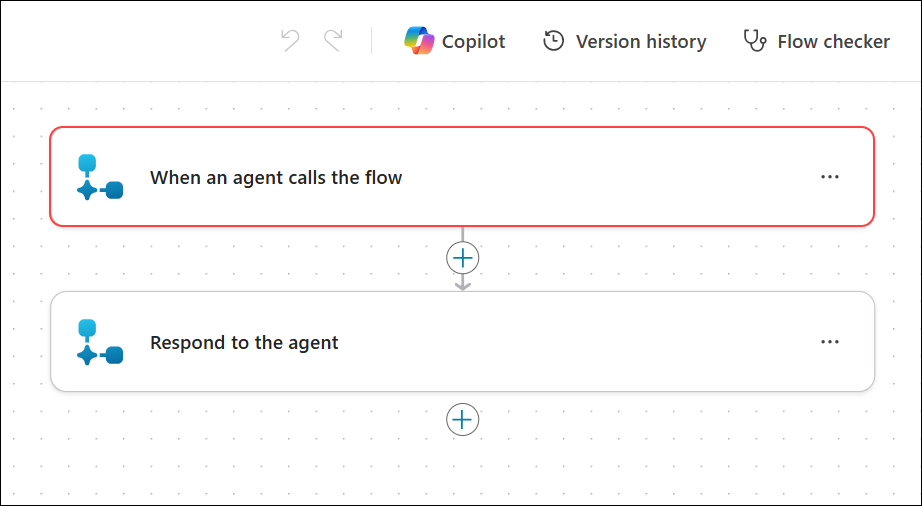

1. Now click **+ Add an input**.  

     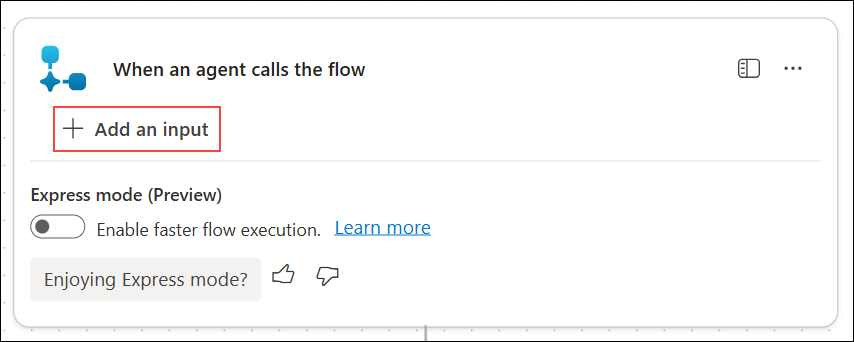

1. In the **Choose the type of user input** section, select **Date** to capture date values in the flow.  

     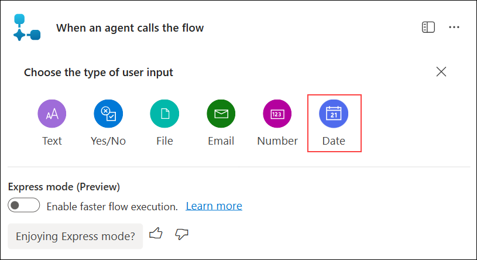

1. In the **Parameters** tab, enter the below value in the first input field as **startDate (1)**, and then select **+ Add an input (2)** to add another parameter.

     ```
     startDate
     ```

     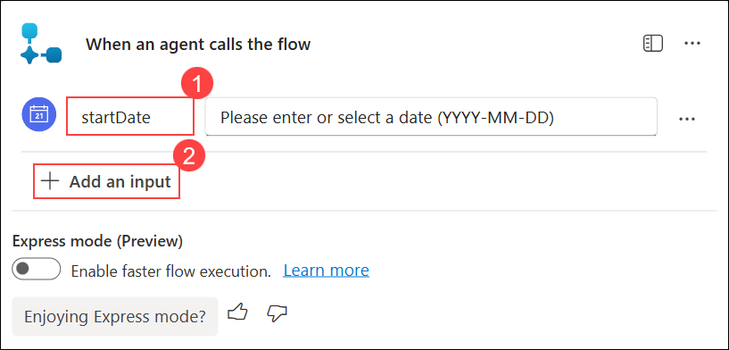

1. In the **Choose the type of user input** section, select **Date** again to add another date parameter for the flow.  

     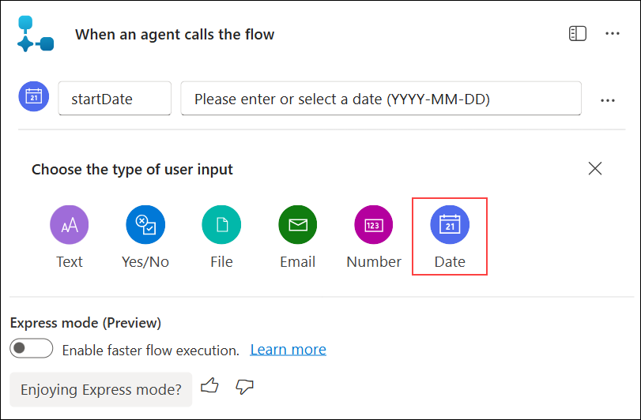

1. In the **Parameters** tab, enter the below value in the new date input field as **endDate (1)**, and then select **+ Add an input (2)** to create an additional parameter.

     ```
     endDate
     ```

     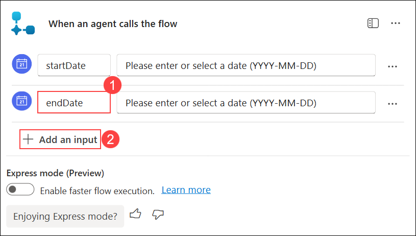

1. In the **Choose the type of user input** section, select **Text** to add a text-based parameter. 

     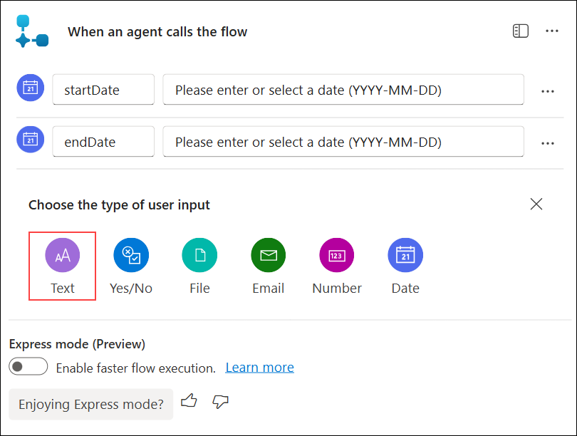

1. In the **Parameters** tab, add a text input and enter the below value as **employeeEmail**.

     ```text
     employeeEmail
     ```

     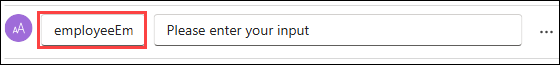

1. On the **Designer** canvas, select the **plus (+)** icon between the **When an agent calls the flow** trigger and the **Respond to the agent** action to add the next step.

     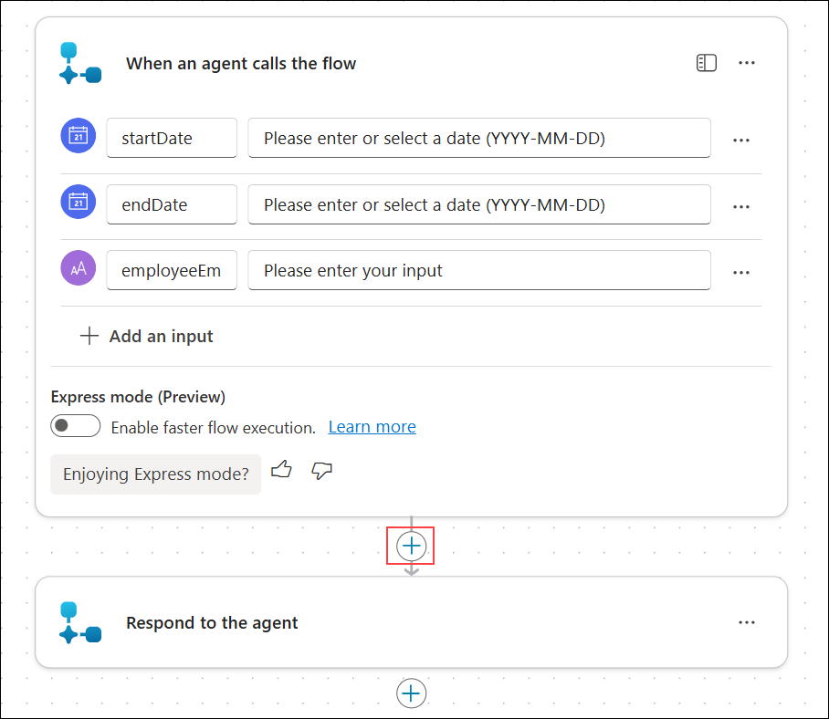

1. In the **Add an action** pane, search for **Compose (1)** and select **Compose (2)** from the **Data Operation** category.  

     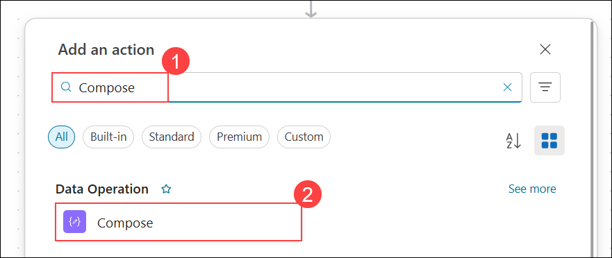

1. In the **Compose** action, click inside the **Inputs** field, type **/ (1)**, and then select **Insert expression (2)**.

     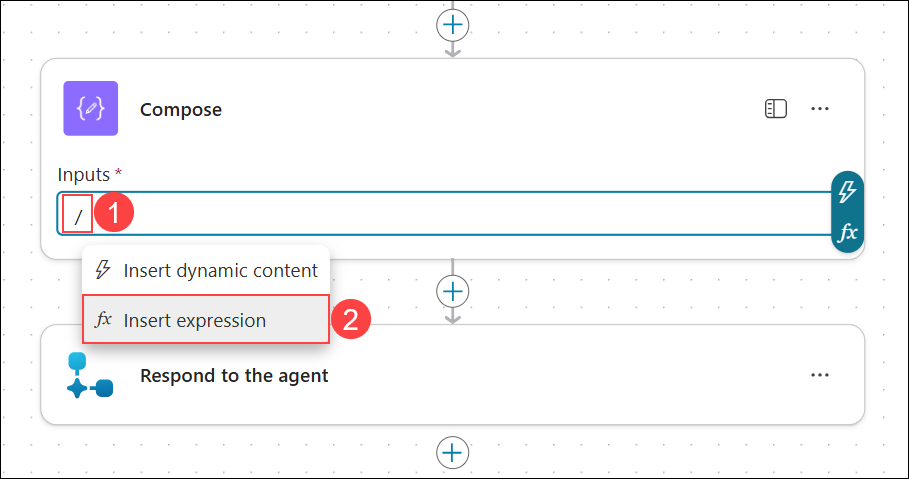

     > **Note:** Alternatively, you can click inside the **Inputs** field and use the options available on the right side to insert dynamic content or expressions directly.

     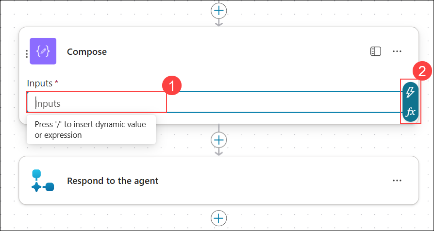

1. In the **Compose** action, paste the expression into the editor box **(1)** and then click **Add (2)** to insert it.

     ```
     add(div(sub(ticks(triggerBody()?['date_1']), ticks(triggerBody()?['date'])), 864000000000), 1)
     ```

     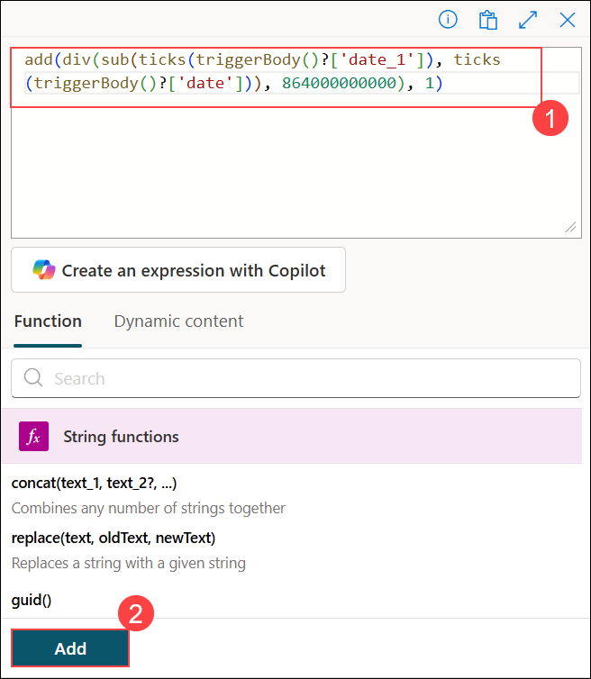

     > **Note:** After pasting the expression, click outside the **Compose** action to apply the changes; otherwise, an error may still appear even if the expression is correct.
     > This formula calculates the number of days between two dates (date and date_1).
     > - **ticks()** → converts a date into "ticks" (very large time units used in Power Automate).
     > - **sub(...)** → subtracts the start date ticks from the end date ticks (gives the difference in ticks).
     > - **864000000000** → number of ticks in one day (so dividing by this gives days).
     > - **add(..., 1)** → adds 1 so that both the start and end dates are counted.

1. On the **Compose action** pane, verify that the entered expression is applied successfully and appears in the **Inputs** field as shown and select the **plus (+)** icon below the **Compose** action to add the next step

     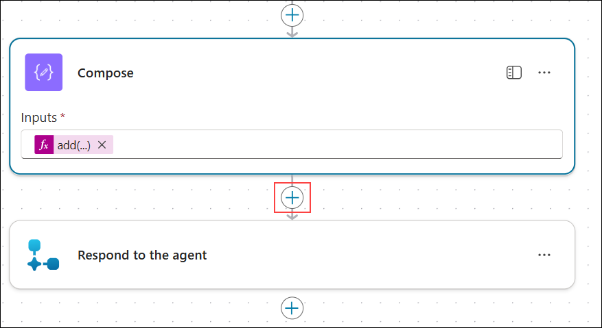

1. In the search box, type **List rows (1)** Under **Microsoft Dataverse**, select **List rows (2)**.  

     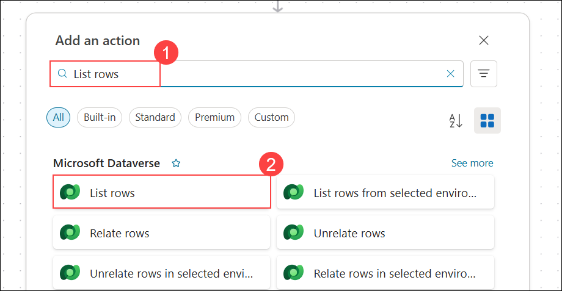

1. On the **Create connection** pane, enter the below value in the **Connection name (1)** field, and then select **Sign in (2)** to establish the connection.

     ```
     Microsoft Dataverse
     ```  

     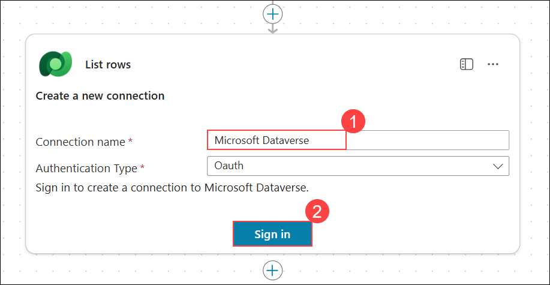

     > **Note:** If the sign-in pop-up is blocked by the browser, select the blocked pop-up icon from the browser address bar, choose **Always allow option**, and then click **Done**.

1. On the sign-in page, enter the following credentials in the respective fields, and then complete the sign-in process.

     - **Email/Username:** **<inject key="AzureAdUserEmail"></inject>**
     - **Temporary  Access Pass:** **<inject key="AzureAdUserPassword"></inject>**

1. On the **Confirmation required** page, select **I have verified this request and trust the source (1)**, and then click **Allow access (2)** to grant permission for Microsoft Dataverse.

     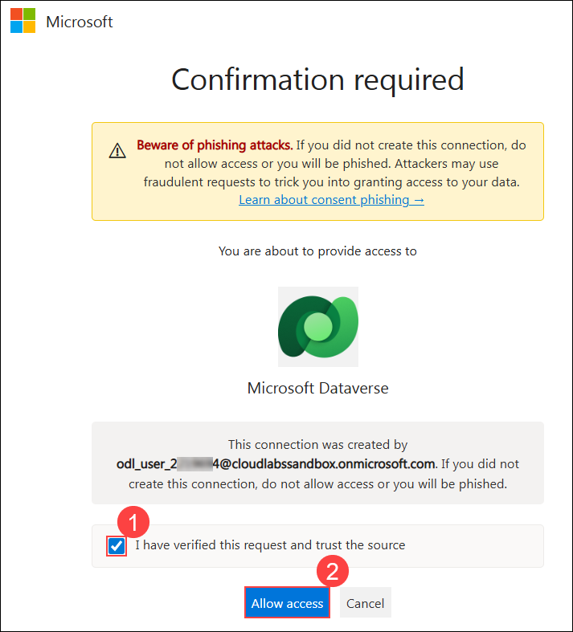

1. In the **List rows** action:

     - Select **Leave Request (1)** in the **Table name** field.  
     - Enter **Logical_ID_balancedays (2)** in the **Select columns** field to fetch leave balance days.  
     - In the **Filter rows** field, type **Logical_ID_employeeemail eq '' (3)** to filter records by employee email.

          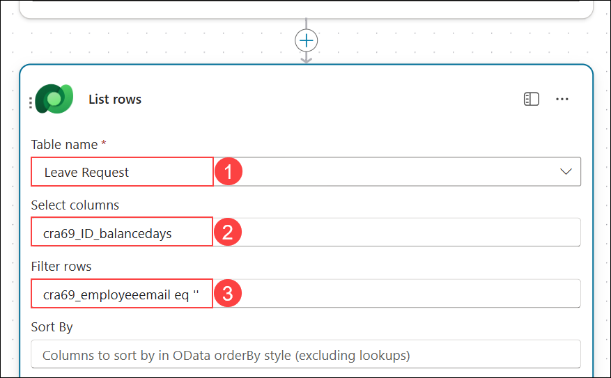

          > **Note**: The **Logical_ID** here refers to the ID that you have copied in the first exercise from the Power Apps portal.

1. In the **List rows** action, under the **Filter rows** field, place the cursor between the single quotes in **Logical_ID_employeeemail eq '' (1)**, and then select the **Expression (fx) (2)** icon to add a dynamic value.

     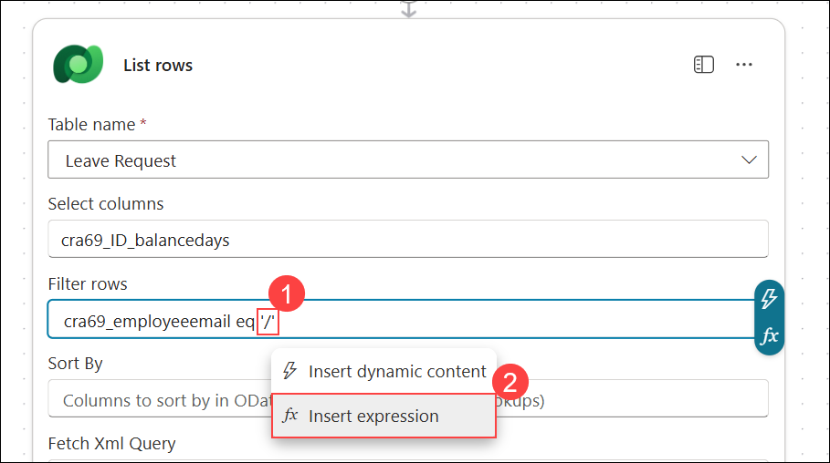

1. In the expression editor, click **Dynamic content (1)**, type **employeeEmail (2)** in the search box, and select **employeeEmail (3)** from the list. Then click **Add (4)** to insert it into the expression.

     

1. In the **List rows** action:

     - In the **Filter rows** field, ensure it looks like this: **Logical_ID_employeeemail eq 'employeeEmail' (1)**.  
     - In the **Sort By** field, enter **createdon desc (2)** to sort by the most recent record.  
     - In the **Row count** field, type **1 (3)** to return only the latest record.

          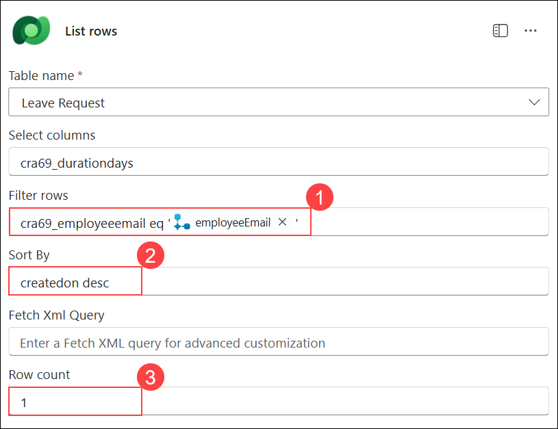

1. On the **Designer** canvas, select the **plus (+)** icon after the **List rows** action to add the next step.

     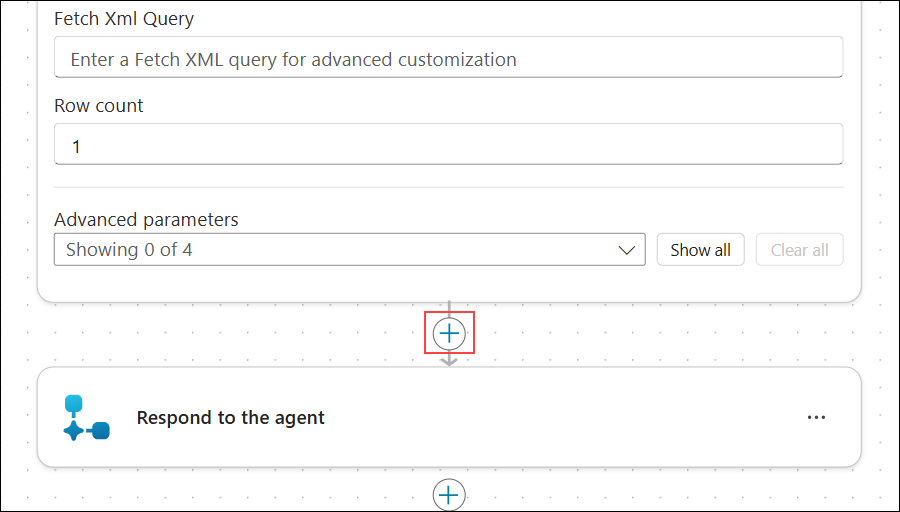

1. In the **Add an action** pane, enter **Condition (1)** in the search box, and then select **Condition (2)** from the results.

     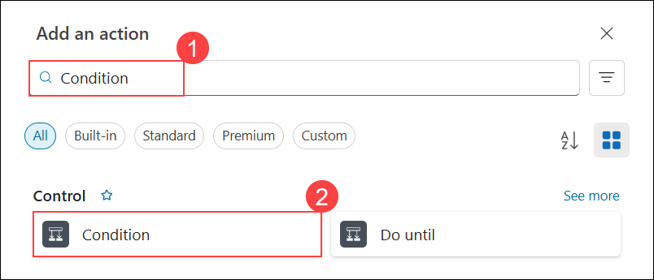

1. On the **Condition expression** field:  

     - Type **/** (1).  
     - Click **Insert expression (2)**.
     - Paste the expression **(3)**.  
     - Click **Add (4)** to insert it.
     - Select the operator **is greater than (5)**.  
     - Enter **0 (6)** as the comparison value.  

          ```
          length(outputs('List_rows')?['body/value'])
          ```

          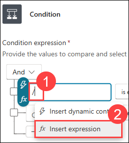

          

          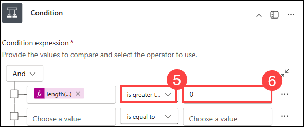

1. The above expression outputs('List_rows') → gets the result from the List rows action in Power Automate.

     - ['body/value'] → accesses the list of rows (records) returned.
     - length(...) → counts how many rows were returned.
     - **So this expression returns the number of records found in Dataverse**.
     - If the length is 0 → no record exists → this is the user’s first leave application.
     - If the length is greater than 0 → a record exists → the user already has leave data in the database.

1. Under the **False** branch of the **Condition**, click the **plus (+)** button to add a new action.

     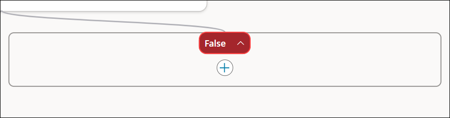

1.  Type **Compose (1)** in the search box, and from the **Data Operation** section select **Compose (2)**.

     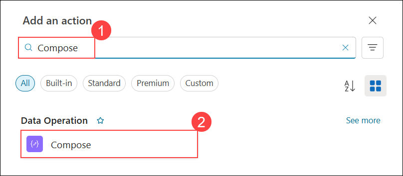

1. On the **Condition expression** field:

     - Type **/** (1).  
     - Click **Insert expression (2)**.  
     - Paste the expression **(3)**.  
     - Click **Add (4)** to insert it.  

          ```
          sub(24, outputs('Compose'))
          ```

          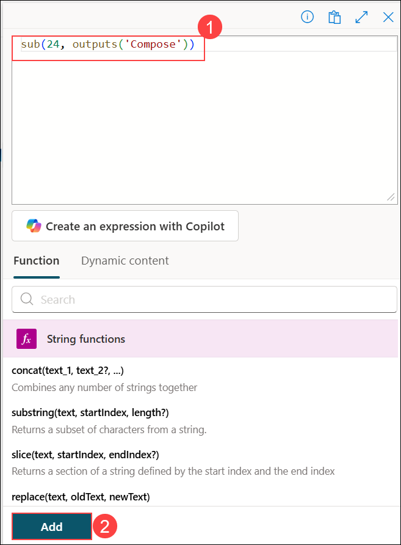

          > Since each employee is allotted 24 leaves annually, if a user is applying for the first time, they start with 24 available leaves. This expression subtracts the current leave duration from 24 to calculate the remaining balance.

1. Under the **True** branch of the **Condition**, click the **plus (+)**.

     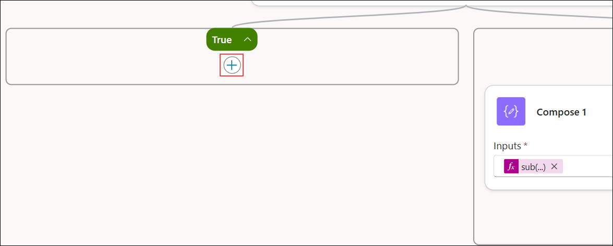

1. To add a new action, type **Compose (1)** in the search box, and from the **Data Operation** section select **Compose (2)**.

     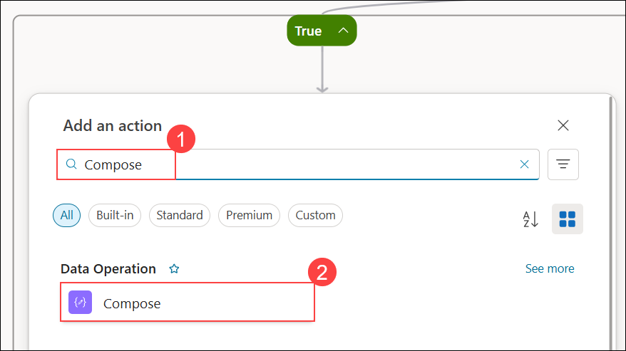

1. In the **Compose** action, enter **/** in the **Inputs (1)** field, and then select **Insert expression (2)**.

     

1. In the expression editor, paste the expression in the editor box **(1)**, and then select **Add (2)**. 

     ```
     sub(first(outputs('List_rows')?['body/value'])?['Logical_ID_balancedays'], outputs('Compose'))
     ```

     

     > **Note**: The **Logical_ID** here refers to the ID that you have copied in the first exercise from power apps portal.

     > If the user is not applying for leave for the first time, this expression retrieves the remaining balance from their previous request and subtracts the current leave duration to calculate the updated balance.

1. In the **Respond to the agent** action, select the **ellipsis (...) (1)** icon, and then choose **Delete (2)** to remove the action.

     

1. In the **Delete workflow action** confirmation pop-up, select **OK**.

     

1. Under the **True** branch's compose node, click the **plus (+) icon**.  

     

1. In the search bar, type **Respond to the agent (1)**. and from the **Skills** section, select **Respond to the agent (2)**.  

     

1. In the **Respond to the agent** action, select **Add an output**.

     

1. In the **Respond to the agent** action, select **Text** under **Choose the type of output**.

     

1. In the **Respond to the agent** action, enter the below value in the output name field as **duration (1)**, type **/** in the value field **(2)**, and then select **Insert expression (3)**.

     ```
     duration
     ```

     

1. In the expression editor, paste the expression in the editor box **(1)**, and then select **Add (2)**.

      ```
      outputs('Compose')
      ``` 

     

1. In the **Respond to the agent** action, select **Add an output**.

     

1. In the **Respond to the agent** action, select **Text** under **Choose the type of output**.

     

1. In the **Respond to the agent** action, enter the below value in the output name field as **balance (1)**, type **/** in the value field **(2)**, and then select **Insert expression (3)**.

     ```
     balance
     ```

     

1. In the expression editor, paste the expression in the editor box **(1)**, and then select **Add (2)**.

     ```
     outputs('Compose_2')
     ```

     

1. In the **False** branch of the **Condition**, select the **plus (+)** icon.

     

1. In the **Add an action** pane, search for **Skills (1)**, and then select **Respond to the agent (2)**.

     

1. In the **Respond to the agent 1** action, select **Add an output**.

     

1. In the **Respond to the agent 1** action, select **Text** under **Choose the type of output**.

     

1. In the **Respond to the agent 1** action, enter the below value in the output name field as **duration (1)**, type **/** in the value field **(2)**, and then select **Insert expression (3)**.

     ```
     duration
     ```

     

1. In the expression editor, paste the expression in the editor box **(1)**, and then select **Add (2)**.  
   
     ```
     outputs('Compose')
     ```

     

1. In the **Respond to the agent 1** action, select **Add an output**.

     

1. In the **Respond to the agent 1** action, select **Text** under **Choose the type of output**.

     

1. In the **Respond to the agent 1** action, enter the below value in the output name field as **balance (1)**, type **/** in the value field **(2)**, and then select **Insert expression (3)**.

     ```
     balance
     ```

     

1. In the expression editor, paste the expression in the editor box **(1)**, and then select **Add (2)**.
 
     ```
     outputs('Compose_1')
     ```

     

1. On the **Designer** page, review the flow and then select **Publish**.

     

1. In the **Your agent flow published successfully!** pop-up, select **Stay in Flow**.

     

1. On the top menu bar, click **Overview** to navigate to the flow details page.

     

1. On the **Overview** page, click **Edit** to update the flow details such as the name.

     

1. In the **Details** pane, enter the below value in the flow name field as **Leave Validation Flow (1)**, and then select **Save (2)**.

     ```text
     Leave Validation Flow
     ```

     

<validation step="03eaa8c6-82f1-486a-a16f-282662884018" />
 
> **Congratulations** on completing the task! Now, it's time to validate it. Here are the steps:
> - Hit the Validate button for the corresponding task. If you receive a success message, you can proceed to the next task. 
> - If not, carefully read the error message and retry the step, following the instructions in the lab guide.
> - If you need any assistance, please contact us at cloudlabs-support@spektrasystems.com. We are available 24/7 to help.

## Task 3: Create a flow to update leave requests in Dataverse

In this task, you will design a Power Automate flow that collects all the necessary leave request details from the agent. The flow will then update these details in the Dataverse database, ensuring that every leave application is properly recorded and managed.

1. In **Copilot Studio**, select **Agents (1)**, and then choose **Leave Management Agent (2)**. 

     

1. Select **+7 (1)**, and then choose **Topics (2)**.

     

   > **Note:** If the **Topics** tab is directly visible on the screen, you can select it without clicking **+7**.

1. On the **Topics** page, select the **leave_request** topic.

     

1. Scroll to the bottom of the topic, and below the **reason** question node, select the **plus (+)** icon to add the next step in the flow. 

     

1. Select **Add a tool (1)**, verify that the **Basic tools (2)** tab is selected, and then choose **New Agent flow (3)**.

     

1. You will be redirected to the **Agent flows** page, where the **When an agent calls the flow** trigger and **Respond to the agent** action are already added by default.

     

1. In the **Respond to the agent** action, select the **ellipsis (...) (1)** icon, and then choose **Delete (2)** to remove the action.

     

1. In the **Delete workflow action** confirmation pop-up, select **OK**.

     

1. Select the **When an agent calls the flow** trigger to expand it.

     

1. On the **Designer** tab of the flow, click **Add an input**.

     

1. In the **Choose the type of user input**, select **Text** to add a text input parameter.

     

1. In the **When an agent calls the flow** action, enter the below value in the input name field as **employeeEmail (1)**, and then select **Add an input (2)**.

     ```
     employeeEmail
     ```

     

1. In the **Parameters** section, follow the same steps used for **employeeEmail** to add the following input parameters, selecting **Add an input** after each:

     - **employeeName (1)**  
     - **leaveType (2)**  
     - **reason (3)**  
     - **durationDays (4)**  
     - **balance (5)**  

          

1. In the **When an agent calls the flow** action, select **Add an input**.

     

1. In the **Choose the type of user input** section, select **Date**.

     

1. In the **When an agent calls the flow** action, enter the below value in the input name field as **startDate (1)**, and then select **Add an input (2)**.

     ```
     startDate
     ```

     

1. In the **Choose the type of user input** section, select **Date**.

     

1. In the **When an agent calls the flow** action, enter the below value in the input name field as **endDate (1)**, and then select **Add an input (2)**.

     ```
     endDate
     ```

     

1. After adding the required inputs, the **Parameters** section should look as shown below, with the following fields: 

     

1. On the **Designer** canvas, click the **plus (+) icon** to add an action.

     

1. In the **Add an action** dialog, type **Add a new row (1)** in the search bar. Under **Microsoft Dataverse (3)**, select **Add a new row (2)**.

     

1. In the **Add a new row** action, select **Leave Request (1)** from the **Table name** drop-down. Expand the **Advanced parameters (2)** section to map the input fields with the parameters created earlier.

     

1. In the **Add a new row** action, under **Advanced parameters**, select the following fields to map with the input parameters:  

     - **balance_days**  
     - **duration_days**  
     - **employee_email**  
     - **employee_name**  
     - **end_date**  
     - **leave_type**  
     - **reason**  
     - **start_date**  
     - **status**  

          

1. In the **Add a new row** action, under **Balance_days**, type **/** (1) and then click **Insert expression (2)** to add an expression.

     

1. In the expression editor:

     - Select **Dynamic content (1)**.
     - Search for **balance (2)**.
     - Choose **balance (3)**.
     - Verify it appears in the expression area **(4)**.
     - Select **Add (5)**.

          

1. On the **Add a row** page, in the **Duration_days** field:  

     - Type **/** (1).  
     - Select **Insert expression (2)** from the menu.  

          

1. In the expression editor:  

     - Select **Dynamic content (1)**.  
     - Type **duration (2)** in the search bar.  
     - Choose **durationDays (3)** under *When an agent calls the flow*.  
     - Click **Add (4)** to insert it.  

          

1. Now map the remaining parameters to the Dataverse fields as shown in the table below.

     | Field Name      |   Choose                                   |
     |-----------------|--------------------------------------------|
     | Employee_email  | Select **employeeEmail** |
     | Employee_name   | Select **employeeName**  |
     | End_date        | Select **endDate**       |
     | Leave_type      | Select **Casual** as a static value         |
     | Reason          | Select **reason**        |
     | Start_date      | Select **startDate**     |
     | Status          | Select **Pending** as a static value        |

     - **Note:** For fields with dynamic values, select them from the **Dynamic content** panel.  

     - **Note:** For fields marked **static value**, select the value directly.  

          

1. Click the **plus (+) icon (1)** to add a new action.

     

1. In the **Add an action** dialog, type **Condition (2)** in the search bar and select **Condition (3)** under the **Control** section

     

1. In the **Condition** pane, type **/** in the field (1) and select **Insert expression (2)** from the dropdown list.

     

1. In the **Expression** editor, type **int() (1)** and keep the cursor inside the parentheses, select **Dynamic content (2)**, search for **durationDays (3)**, and then select **durationDays (4)**.

     

1. In the **Expression** editor, verify that the expression is set **(1)**. Once done, click **Add (2)** to insert it into the condition. 

     

     > **Note:** The expression reference (for example, `triggerBody()?['text_4']`) may vary depending on the order in which inputs are added in the **When an agent calls the flow** step. The number (`text_4`, `text_5`, etc.) is auto-generated

1. In the **Condition** action, select **is less or equal to (1)** from the operator dropdown.

     

1. In the **Condition** action, enter **2** in the value field.

     

1. In the **Condition** action, under the **False** branch, click the **plus (+) icon**.

     

1. In the **Add an action** dialog, type **Start and wait for an approval (1)** in the search bar and select **Start and wait for an approval (2)** under **Standard approvals**.

     

1. In the next pane, click on **Create new**.

     

1. In the **Start and wait for an approval** action, configure the parameters: 

     - From the **Approval type** drop-down, select **Approve/Reject - Everyone must approve (1)**.  
     - In the **Title** field, enter **Leave Approval (2)**.  
     - In the **Assigned to** field, type the email address <inject key="AzureAdUserEmail"></inject> **(3)** and select the matching account from the suggestions **(4)**. 

          

1. In the **False** branch after the approval node, click the **plus (+) icon**.

     

1. In the **Add an action** pane, search for **Condition (1)**, and then select **Condition (2)**.

     

1. In the **Condition** action, type **/** in the value field **(1)**, and then select **Insert expression (2)**.

     

1. In the expression editor, paste the expression in the editor box **(1)**, select **Dynamic content (2)** if required, and then choose **Add (3)**.

     ```
     outputs('Start_and_wait_for_an_approval')?['body/outcome']
     ``` 

     

1. In the **Condition 1** action, set the operator to **is equal to (1)**, and then enter **Approve (2)**.

     

     > This condition evaluates whether the leave request has been approved by retrieving the response from the previous approval step.

1. In the **False** branch, select the **+** icon.

     

1. In the **Add an action** pane, search for **Skills (1)**, and then select **Respond to the agent (2)**.

     

1. In the **Respond to the agent** action, select **Add an output**.

     

1. In the **Respond to the agent** action, select **Text** as the output type.

     

1. In the **Respond to the agent** action, enter the following details, and then continue to the next step.

     | Key | Value |
     |---|---|
     | Output name | `reply` |
     | Response message | `The request is rejected` |

     

1. In the **False** branch, after the **Respond to the agent** action, click the **plus (+) icon (1)** to add a new action.  

     

1. In the **Add an action** pane, search for **Terminate (1)**, and then select **Terminate (2)**.

     

1. In the **Terminate** action, set the **Status** field to **Succeeded** to complete the workflow after rejection.

     

### Task 4: Update Dataverse

In this task, you will update the flow to modify the Dataverse table, changing the leave request status from 'Pending' to 'Approved' based on the defined conditions.

1. Now click the **plus (+) icon (1)** to add a new action for the root node.   

     

1. In the **Add an action** pane, search for **Update a row (1)**, and then select **Update a row (2)**.  

     

1. In the **Update a row** action, select **Leave Request (1)** for **Table name**, enter **/** in the **Row ID (2)** field, and then select **Insert expression (3)**.

     

1. In the **Expression** editor, enter the following expression in **(1)**, and then select **Update (2)**:

     ```
     outputs('Add_a_new_row')?['body/<logical_ID>_leaverequestid']
     ``` 

     

     > **Note:** The **Logical_ID** here refers to the ID that you have copied in the first exercise from power apps portal.

1. In the **Update a row** action, select the **+** icon. 

     

1. In the **Add an action** pane, search for **Skills (1)**, and then select **Respond to the agent (2)**. 

     

1. In the **Respond to the agent 1** action, select **Add an output**.

     

1. In the **Respond to the agent 1** action, select **Text** as the output type.

     

1. In the **Respond to the agent 1** action, enter **reply (1)** as the output name, and then enter the following message in the value field **(2)**.

     ```
     Your leave is approved from [start_date] to [end_date]
     ```

     

1. In the **Respond to the agent 1** action, select the **start_date (1)** placeholder, and then choose the **fx (2)** option.

     

1. In the expression editor, paste the expression in the editor box, and then select **Add**.

     ```
     outputs('Add_a_new_row')?['body/<Logical_ID>_startdate']
     ```

     

     > **Note**: The **Logical_ID** here refers to the ID that you have copied in the first exercise from power apps portal.

1. In the **Respond to the agent 1** action, select the **end_date (1)** placeholder, and then choose the **fx (2)** option.

     

1. In the expression editor, paste the expression in the editor box **(1)**, and then select **Add (2)**.

     ```
     outputs('Add_a_new_row')?['body/<Logical_ID>_enddate']
     ``` 

     

     > **Note**: The **Logical_ID** here refers to the ID that you have copied in the first exercise from power apps portal.

1. On the **Designer** page, review the flow and then select **Publish**.

     

1. In the **Your agent flow published successfully!** pop-up, select **Stay in Flow**.

     

1. On the top menu bar, click **Overview** to navigate to the flow details page.

     

1. On the **Overview (1)** page, select **Edit (2)**.

     

1. In the **Details** pane, enter the below value in the **Flow name (1)** field, and then select **Save (2)** to apply the changes.

     ```
     Leave Management Workflow
     ``` 

     

## Task 4: Create topic for leave application

In this task, you will create a topic that enables employees to apply for leave by configuring the required inputs and connecting it to the validation flow.

1. In **Copilot Studio**, select **Agents (1)**, and then choose **Leave Management Agent (2)**. 

     

1. Select **+7 (1)**, and then choose **Topics (2)**.

     

   > **Note:** If the **Topics** tab is directly visible on the screen, you can select it without clicking **+7**.

1. On the **Topics** page, select the **leave_request** topic.

     

1. Scroll to the bottom of the topic, and below the **reason** question node, select the **plus (+)** icon to add the next step in the flow. 

     

1. In the **Question** node after capturing the reason, click **Add a tool (1)**. From the list of available tools, select **Leave Validation Flow (2)** to connect the flow with the validation process. 

     

1. On the **Authoring canvas**, click **Variables (1)** from the top menu. Under the **Browse (2)** tab, expand the **Topic (3)** section and select all the listed variables by checking the boxes **(4)**.   

     

1. On the **Power Automate inputs** card, click the **ellipsis (…) (1)** next to the **startDate** field. From the **Select a variable** pane, choose **startDate (2)** to map the variable.

     

1. On the **Power Automate inputs** card, click the **ellipsis (…) (1)** next to the **endDate** field. From the **Select a variable** pane, choose **endDate (2)** to map the variable. 

     

1. On the **Power Automate inputs** card:  

     - Click the **ellipsis (…) (1)** next to the **employeeEmail** field.  
     - In the **Select a variable** pane, switch to the **System (2)** tab.  
     - Search for **User.Email (3)**.  
     - Select **User.Email (4)**.  

          

1. On the **Outputs (2)** section, click the **plus (+) icon** to add the next step in the flow. **(1)**

     

1. On the **Outputs (2)** section, click **Add a tool (1)** and select **Leave Management Workflow (2)** from the list of tools. 

     

1. On the **Authoring canvas**, click **Variables (1)** from the top menu. Under the **Browse (2)** tab, expand the **Topic (7) (3)** section and select the **reply (4)** variable by checking the box.   

     

     > If you are not able to see the variables option, please click on **...** menu and select **Variables**

      

1. On the **Action** card, set the value for **employeeEmail (String)**: 

     - Click the **ellipsis (…) (1)**.  
     - In the **Select a variable** panel, go to the **System (2)** tab.  
     - Search for **User.Email (3)**.  
     - Select **User.Email (4)** from the results.  

          

1. On the **Action** card, set the value for **employeeName (String)**: 

     - Click the **ellipsis (…) (1)**.  
     - In the **Select a variable** panel, go to the **System (2)** tab.  
     - Search for **User.FirstName (3)**.  
     - Select **User.FirstName (4)** from the results. 

          

1. On the **Action** card, set the value for **leaveType (String)** by selecting the **ellipsis (…) (1)**, choosing the **Formula (2)** tab, entering the formula **(3)**, and then selecting **Insert (4)**.

     ```
     Text(Topic.leave_type)
     ```

     

1. On the **Action** card, set the value for **reason (String)**: 

     - Click the **ellipsis (…) (1)**.  
     - In the **Select a variable** panel, choose the **Custom (2)** tab.  
     - Select **reason (Topic.reason) (3)** from the list.  

          

1. On the **Action** card, set the value for **durationDays (String)**: 

     - Click the **ellipsis (…) (1)**.  
     - In the **Select a variable** panel, go to the **Custom (2)** tab.  
     - Select **duration (Topic.duration) (3)** from the list.  

          

1. On the **Action** card, set the value for **balance (String)**:

     - Click the **ellipsis (…) (1)**.  
     - In the **Select a variable** panel, go to the **Custom (2)** tab.  
     - Select **balance (Topic.balance) (3)** from the list.  

          

1. On the **Action** card, set the value for **startDate (String)**:

     - Click the **ellipsis (…) (1)**.  
     - In the **Select a variable** panel, go to the **Custom (2)** tab.  
     - Select **startDate (Topic.startDate) (3)** from the list.  

          

1. On the **Action** card, set the value for **endDate (String)**:  

     - Click the **ellipsis (…) (1)**.  
     - In the **Select a variable** panel, go to the **Custom (2)** tab.  
     - Select **endDate (Topic.endDate) (3)** from the list.  

          

1. On the **Outputs (1)** section, click the **plus icon (1)** and select **Send a message (2)**. 

     

1. On the **Message** step:  

     - Click on the **variable icon (1)**.  
     - In the **Select a variable** pane, choose the **Custom (2)** tab.  
     - Type **reply (3)** in the search box.  
     - Select **reply (4)** from the results. 

          

1. On the **Message** step, click the **plus (+) icon** to add the next action in the flow. 

     

1. On the **Message** step, expand the options and select **Topic management (1)**, then click **End conversation (2)** to close the flow. 

     

1. At the top-right corner of the page, click **Save** to store the changes made to the topic.  

     

1. You have successfully completed the creation of the agent. It is now fully equipped with all intended capabilities and will be ready for testing in the next task.

1. At the top-right corner of the page, click **Save** to store the changes made to the topic.  

     

<validation step="bc8e443a-14ef-4307-8619-3092a324799b" />
 
> **Congratulations** on completing the task! Now, it's time to validate it. Here are the steps:
> - Hit the Validate button for the corresponding task. If you receive a success message, you can proceed to the next task. 
> - If not, carefully read the error message and retry the step, following the instructions in the lab guide.
> - If you need any assistance, please contact us at cloudlabs-support@spektrasystems.com. We are available 24/7 to help.

## Summary

In this exercise, you created a Copilot Studio agent that served as the foundation for your leave management assistant. You defined the agent’s purpose by assigning it a name and description, and connected it to key knowledge sources such as the leave request data, employee information stored in Dataverse and leave policy rules. These steps enabled the agent to deliver relevant, AI-powered responses based on indexed information.

### You have successfully completed this exercise, please continue to next one >>

   
