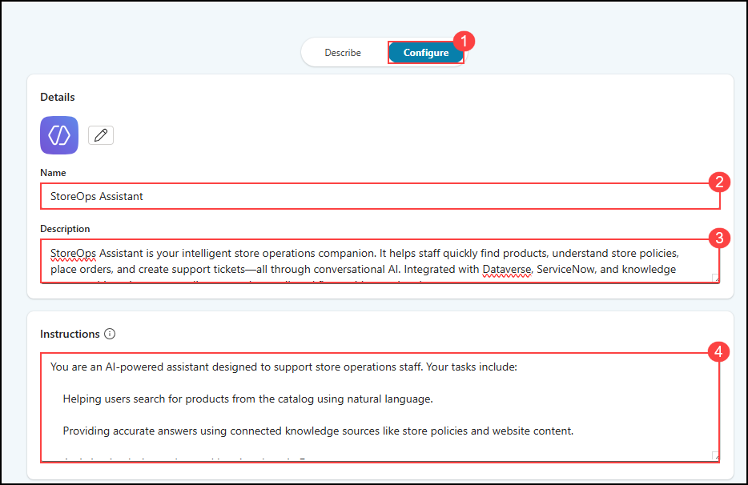
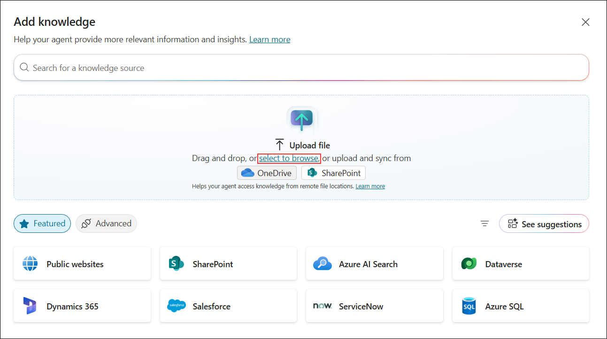
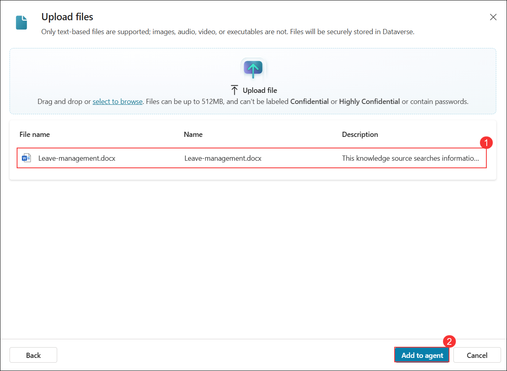
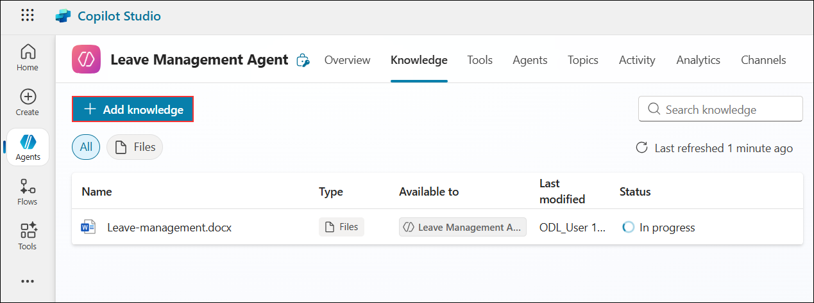

# Exercise 2: Create Store‑Operations Agent in Copilot Studio

### Estimated Duration: 45 Minutes

## Overview

In this exercise, you will create a Copilot Studio agent that will serve as the foundation for your store operations assistant. You will define the agent’s purpose by assigning it a name and description, and connect it to key knowledge sources such as the product catalog, store policy documents, and website content. These steps will enable your agent to deliver relevant, AI-powered responses based on indexed information.

## Objectives

You will be able to complete the following tasks:

- Task 1: Creating a store-operations agent in Copilot Studio

- Task 2: Adding knowledge sources to the agent

## Task 1: Creating a store-operations agent in Copilot Studio

In this task, you will create a new agent in Microsoft Copilot Studio by defining its name, description, and basic configuration settings. This agent will serve as the base for enabling intelligent store operations.

1. Navigate back to Copilot Studio page from the browser.

1. From the home page, select **Create (1)** from left menu and click on **+ New agent (2)** to create an agent.

   

1. In the next pane, select **configure (1)** and provide the following details.

    | Key                     | Value                               |
    |-------------------------------|--------------------------------------------|
    | Name | `Leave Management Agent` |
    | Description | Handles leave requests, approvals, and balance updates using Dataverse and Power Automate. Helps employees apply for leave, check status, and get real-time updates via Teams. |
    | Instruction | Assist with leave applications, validate balances, and route approvals. Respond clearly and guide users through each step. Always ensure requests meet policy and ask for missing details. |

    

    >**Note:** Sometimes you may see a diffrent UI, if you are seeing a UI diffrent than this, then follow this below steps:

    - Click on **Skip to configure**, to get the configuration pane.

      
   
1. In the next pane, provide the same details given above and click on **Create**.

   

1. Once after adding the details, click on **Continue** to create the agent.

1. You have successfully created the Leave Management Agent. In the next steps of this lab, you will enhance it further by adding knowledge sources and advanced features.

   

## Task 2: Adding knowledge sources to the agent

In this task, you will connect knowledge sources such as the product catalog, policy documents, and store website content to your agent, allowing it to provide AI-powered answers using Retrieval-Augmented Generation (RAG).

1. If you are not already on the **Agents** page, select **Agents (1)** from the left navigation menu. Then, click **Leave Management Agent (2)**.

   

1. On the **Leave Management Agent** page, select the **Knowledge (1)** tab from the top menu and click **+ Add knowledge (2)**.  

   

1. In the next pane, click on **select to browse** option as shown and in the pop up window to select files, navigate to `C:\datasets\Store-Operations-with-Copilot-Studio-lab-datasets\Leave-management` file.

   

1. On the **Upload files** pane, verify that the file **Leave-management.docx (1)** is listed and then click **Add to agent (2)**.

   

1. Once done, again click on **+ Add knowledge**.

   

1. In the next pane, select **Dataverse** as knowledge source.

   

1. From the list, search and select **Leave Request** table. Click on **Add to agent**.

   

1. On the **Copilot Studio** page, select **Flows (1)** from the left navigation menu and click **New agent flow (2)** to create a new flow.

   

1. On the **Agent flows – Designer** page, click **Add a trigger** to begin configuring the flow.  

   

1. In the next pane, select **Dataverse** as knowledge source.

   

## Summary

In this exercise, you created a Copilot Studio agent that served as the foundation for your store operations assistant. You defined the agent’s purpose by assigning it a name and description, and connected it to key knowledge sources such as the product catalog, store policy documents, and website content. These steps enabled the agent to deliver relevant, AI-powered responses based on indexed information.

### You have successfully completed this exercise, please continue to next one >>
