# 演習 2: 高度なトピックの設計

### 推定所要時間: 60 分

## 概要

この演習では、休暇管理アシスタントの基盤を形成する Copilot Studio エージェントを構築します。明確で詳細な名前と説明を割り当てることでエージェントの目的を定義し、休暇ポリシーやユーザーの詳細を含むデータベースなどの重要なナレッジ ソースに接続します。これらのステップにより、インデックス化された情報を活用して正確な AI 搭載の応答を提供できるようになります。

## 目標

次のタスクを完了できるようになります。

- タスク 1: 休暇申請を検証する Power Automate フローの構築

- タスク 2: Dataverse の休暇申請を更新するフローの作成

- タスク 3: 休暇申請トピックの作成

## タスク 1: 休暇申請を検証する Power Automate フローの構築

このタスクでは、期間を計算し、休暇残日数を確認して更新することで休暇申請を検証する Power Automate フローを作成します。

1. **Copilot Studio** ページで、左側のナビゲーション メニューから **[フロー] (1)** を選択し、**[+ 新しいエージェント フロー] (2)** を選択します。

     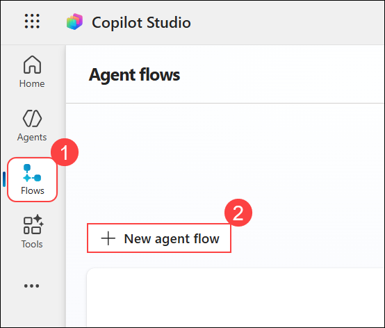

1. **[トリガーの追加]** ウィンドウで、**Skills (1)** を検索し、**[エージェントがフローを呼び出したとき] (2)** を選択します。

     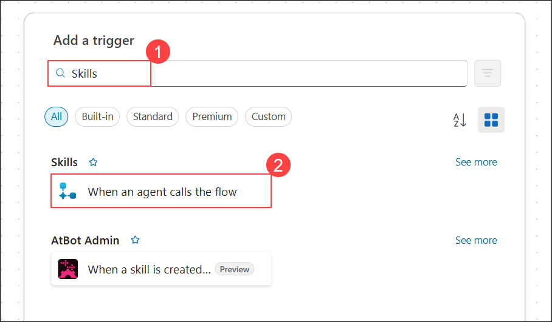

1. **[エージェント フロー デザイナー]** ページで、**[パラメーター]** タブの下にある **[+ 入力の追加]** をクリックします。

     

1. **[ユーザー入力の種類を選択してください]** セクションで、**[日付]** を選択してフローで日付値を取得します。

     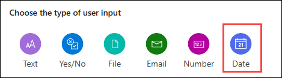

1. **[パラメーター]** タブで、最初の入力を **startDate (1)** と設定します。次に、**[+ 入力の追加] (2)** をクリックして別のパラメーターを追加します。

     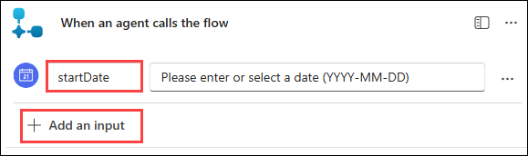

1. **[ユーザー入力の種類を選択してください]** セクションで、再度 **[日付]** を選択してフローに別の日付パラメーターを追加します。

     

1. **[パラメーター]** タブで、別の日付入力を追加し、名前を **endDate** に設定します。次に、**[+ 入力の追加]** をクリックしてパラメーターを追加します。

     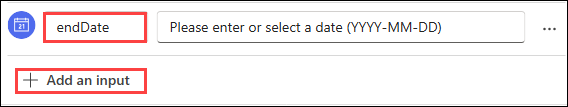

1. **[ユーザー入力の種類を選択してください]** セクションで、**[テキスト]** を選択してテキスト ベースのパラメーターを追加します。

     

1. **[パラメーター]** タブで、テキスト入力を追加し、名前を **employeeEmail** と設定します。

     

1. **デザイナー** キャンバスで、**[エージェントがフローを呼び出したとき]** の下にある**プラス (+) アイコン**をクリックして次のアクションを追加します。

     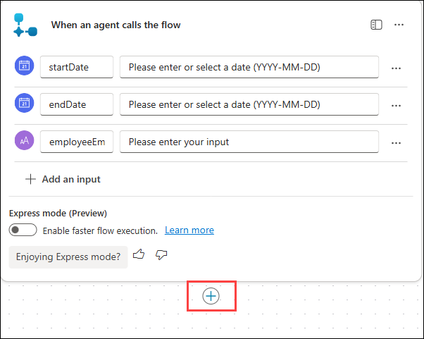

1. **[アクションの追加]** ウィンドウで、**作成 (1)** を検索し、**[データ操作]** カテゴリから **[作成] (2)** を選択します。

     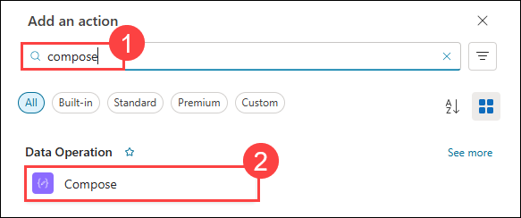

1. **[作成]** アクションで、**[入力]** フィールド内をクリックし、**/** **(1)** と入力して、**[式の挿入] (2)** を選択します。

     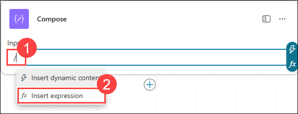

1. **[作成]** アクションで、式をエディター ボックス **(1)** に貼り付けて、**[追加] (2)** をクリックして挿入します。

     ```
     add(div(sub(ticks(triggerBody()?['date_1']), ticks(triggerBody()?['date'])), 864000000000), 1)
     ```

     

     > **注:** 式を貼り付けた後、**[作成]** アクションの外側をクリックして変更を適用してください。そうしないと、式が正しくてもエラーが表示される場合があります。
     > この計算式は、2 つの日付の間の日数を計算します。
     > - **ticks()** は日付を「ティック」(Power Automate で使用される非常に大きな時間単位) に変換します。
     > - **sub(...)** は開始日のティックから終了日のティックを引きます (ティックの差を計算)。
     > - **864000000000** は 1 日のティック数です (これで割ると日数が得られます)。
     > - **add(..., 1)** は 1 を加えることで開始日と終了日の両方が計算に含まれるようにします。

1. **[作成] アクション** ウィンドウで、入力した式が正常に適用され、**[入力]** フィールドに表示されていることを確認します。**デザイナー** ページで、**[作成]** アクションの下にある**プラス (+) アイコン**をクリックして新しいアクションを追加します。

     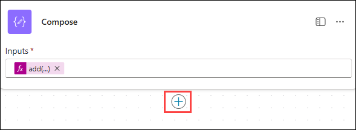

1. 検索ボックスに **行を一覧にする (1)** と入力し、**[Microsoft Dataverse]** の下から **[行を一覧にする] (2)** を選択します。

     

1. **[接続の作成]** ウィンドウで、接続名として **Microsoft Dataverse (1)** を入力し、**[サインイン] (2)** をクリックして接続を確立します。

     

1. **[サインイン]** ページで、**メール アドレス/ユーザー名:** <inject key="AzureAdUserEmail"></inject> **(1)** を入力し、**[次へ] (2)** をクリックして続行します。**[アカウントを選択してください]** ウィンドウが直接表示された場合は、アカウントを選択してサインイン プロセスをスキップできます。

     

1. **[パスワードの入力]** ページで、**パスワード** <inject key="AzureAdUserPassword"></inject> **(1)** を入力し、**[サインイン] (2)** をクリックして続行します。

     

1. **[サインインしたままにする]** ページで、**[はい]** をクリックしてサインイン状態を維持します。

     

1. **[確認が必要]** ページで、**[アクセスを許可する]** をクリックして Microsoft Dataverse へのアクセス許可を付与します。

     

1. **[行を一覧にする]** アクションで、次を設定します。

   - **[テーブル名]** フィールドで **Leave Request (1)** を選択します。
   - **[列の選択]** フィールドに **Logical_ID_balancedays (2)** を入力して休暇残日数を取得します。
   - **[行のフィルター]** フィールドに **<Logical_ID>_employeeemail eq '' (3)** と入力して、従業員のメール アドレスでレコードをフィルター処理します。

        

      > **注**: ここでの **Logical_ID** は、演習 1 で Power Apps ポータルからコピーした ID を指します。

1. **[行を一覧にする]** アクションの **[行のフィルター]** フィールドに **<Logical_ID>_employeeemail eq '' (1)** と入力し、単一引用符の内側にカーソルを置きます。次に、**[式 (fx)] (2)** アイコンをクリックして動的な値を追加します。

     

1. 式エディターで、**[動的コンテンツ] (1)** をクリックし、検索ボックスに **employeeEmail (2)** と入力して、リストから **employeeEmail (3)** を選択します。次に **[追加] (4)** をクリックして式に挿入します。

     

1. **[行を一覧にする]** アクションで、次を設定します。

   - **[行のフィルター]** フィールドが次のように表示されていることを確認します: **<Logical_ID>_employeeemail eq 'employeeEmail' (1)**。
   - **[並べ替え]** フィールドに **createdon desc (2)** と入力して、最新のレコードで並べ替えます。
   - **[行数]** フィールドに **1 (3)** と入力して、最新のレコードのみを返します。

        

1. **[行を一覧にする]** アクションで、**プラス (+) (1)** アイコンをクリックして新しいアクションを追加します。
   - **検索バー (2)** に **条件** と入力します。
   - **[コントロール] (3)** セクションから **[条件]** を選択します。

     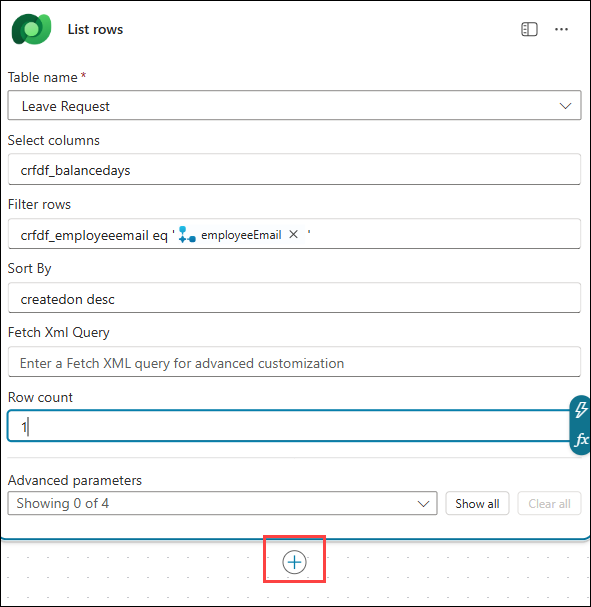

     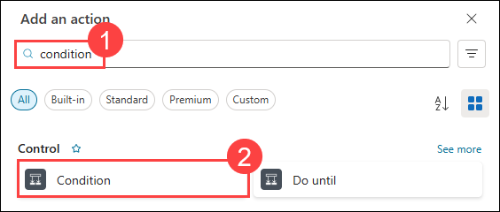

1. **[条件式]** フィールドで、次を行います。
   - **/** (1) と入力します。
   - **[式の挿入] (2)** をクリックします。
   - 式 **(3)** を貼り付けます。
   - **[追加] (4)** をクリックして挿入します。
   - 演算子 **より大きい (5)** を選択します。
   - 比較値として **0 (6)** を入力します。

      ```
      length(outputs('行を一覧にする')?['body/value'])
      ```

        

        

        

      > 上記の式 outputs('行を一覧にする') は、Power Automate の **[行を一覧にする]** アクションの結果を取得します。

      > - ['body/value'] は、返された行 (レコード) のリストにアクセスします。

      > - length(...) は返された行数をカウントします。

      > - **この式は Dataverse で見つかったレコード数を返します。**
      
      > - length が 0 の場合、レコードが存在しないため、ユーザーは初めて休暇を申請しています。

      > - length が 0 より大きい場合、レコードが存在するため、ユーザーはデータベースに既に休暇データがあります。

1. **[条件]** の **False** ブランチの下で、**プラス (+) (1)** ボタンをクリックして新しいアクションを追加し、検索ボックスに **作成 (2)** と入力して、**[データ操作]** セクションから **[作成] (3)** を選択します。

     

     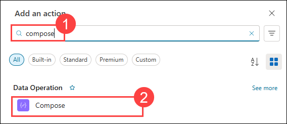

1. **[条件式]** フィールドで、次を行います。
   - **/** (1) と入力します。
   - **[式の挿入] (2)** をクリックします。
   - 式 **(3)** を貼り付けます。
   - **[追加] (4)** をクリックして挿入します。

      ```
      sub(24, outputs('作成'))
      ```

        

      > 各従業員には年間 24 日の休暇が付与されているため、ユーザーが初めて申請する場合は 24 日から開始します。この式は、現在の休暇期間を 24 から引いて残日数を計算します。

1. **[条件]** の **True** ブランチの下で、**プラス (+)** をクリックします。

     

1. 新しいアクションを追加するには、検索ボックスに **作成 (1)** と入力し、**[データ操作]** セクションから **[作成] (2)** を選択します。

     

1. **[作成]** アクションで、**[入力] (1)** フィールドに **/** と入力し、**[式の挿入] (2)** を選択します。

     

1. 式エディターで、エディター ボックス **(1)** に式を貼り付けて、**[追加] (2)** を選択します。

      ```
      sub(first(outputs('行を一覧にする')?['body/value'])?['<Logical_ID>_balancedays'], outputs('作成'))
      ```

     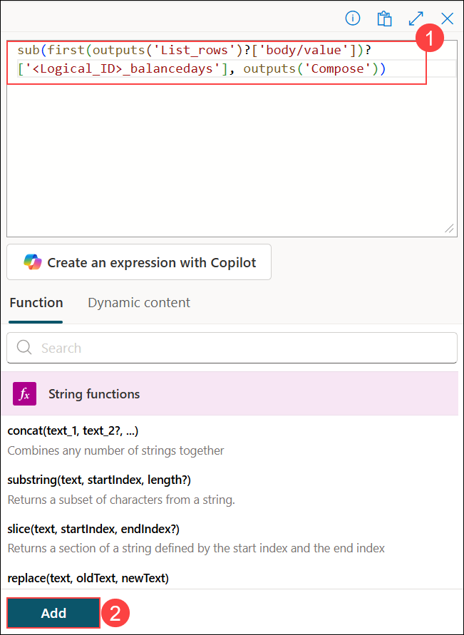

      > **注**: ここでの **Logical_ID** は、演習 1 で Power Apps ポータルからコピーした ID を指します。

      > ユーザーが初めての休暇申請でない場合、この式は前回の申請から残日数を取得し、現在の休暇期間を引いて更新後の残日数を計算します。

1. **True** ブランチの **[作成]** ノードの下で、**プラス (+) アイコン**をクリックします。

     

1. 検索バーに **エージェントへの応答 (1)** と入力し、**[Skills]** セクションから **[エージェントへの応答] (2)** を選択します。

     

1. **[エージェントへの応答]** アクションで、**[出力の追加]** を選択します。

     

1. **[エージェントへの応答]** アクションで、**[出力の種類を選択してください]** の下にある **[テキスト]** を選択します。

     

1. **[エージェントへの応答]** アクションで、出力名として **duration (1)** を入力し、値フィールド **(2)** に **/** と入力して、**[式の挿入] (3)** を選択します。

     

1. 式エディターで、エディター ボックス **(1)** に式を貼り付けて、**[追加] (2)** を選択します。

      ```
      outputs('作成')
      ``` 

     

1. **[エージェントへの応答]** アクションで、**[出力の追加]** を選択します。

     

1. **[エージェントへの応答]** アクションで、**[出力の種類を選択してください]** の下にある **[テキスト]** を選択します。

     

1. **[エージェントへの応答]** アクションで、出力名として **balance (1)** を入力し、値フィールド **(2)** に **/** と入力して、**[式の挿入] (3)** を選択します。

     

1. 式エディターで、エディター ボックス **(1)** に式を貼り付けて、**[追加] (2)** を選択します。

     ```
     outputs('作成_2')
     ```

     

1. **[条件]** の **False** ブランチで、**プラス (+) アイコン**を選択します。

     

1. **[アクションの追加]** ウィンドウで、**Skills (1)** を検索し、**[エージェントへの応答] (2)** を選択します。

     

1. **[エージェントへの応答 1]** アクションで、**[出力の追加]** を選択します。

     

1. **[エージェントへの応答 1]** アクションで、**[出力の種類を選択してください]** の下にある **[テキスト]** を選択します。

     

1. **[エージェントへの応答 1]** アクションで、出力名として **duration (1)** を入力し、値フィールド **(2)** に **/** と入力して、**[式の挿入] (3)** を選択します。

     

1. 式エディターで、エディター ボックス **(1)** に式を貼り付けて、**[追加] (2)** を選択します。
   
     ```
     outputs('作成')
     ```

     

1. **[エージェントへの応答 1]** アクションで、**[出力の追加]** を選択します。

     

1. **[エージェントへの応答 1]** アクションで、**[出力の種類を選択してください]** の下にある **[テキスト]** を選択します。

     

1. **[エージェントへの応答 1]** アクションで、出力名として **balance (1)** を入力し、値フィールド **(2)** に **/** と入力して、**[式の挿入] (3)** を選択します。

     

1. 式エディターで、エディター ボックス **(1)** に式を貼り付けて、**[追加] (2)** を選択します。
 
     ```
     outputs('作成_1')
     ```

     

1. **デザイナー** ページでフローを確認し、**[発行]** を選択します。

     

1. トップ メニュー バーで **[概要]** をクリックしてフローの詳細ページに移動します。

     

1. **[概要]** ページで **[編集]** をクリックして、フローの名前などの詳細を更新します。

     

1. **[詳細]** ウィンドウで、フロー名として **Leave Validation Flow (1)** を入力し、**[保存] (2)** をクリックします。

     

<validation step="03eaa8c6-82f1-486a-a16f-282662884018" />
 
> **タスクの完了おめでとうございます！** 次は検証の時間です。手順は次のとおりです。
> - 対応するタスクの検証ボタンをクリックします。成功のメッセージが表示されたら、次のタスクに進むことができます。
> - 表示されない場合は、エラー メッセージをよく読み、ラボ ガイドの手順に従ってステップを再試行してください。
> - サポートが必要な場合は、cloudlabs-support@spektrasystems.com までお問い合わせください。24 時間 365 日対応しています。

## タスク 2: Dataverse の休暇申請を更新するフローの作成

このタスクでは、エージェントから必要な休暇申請の詳細をすべて収集する Power Automate フローを設計します。フローはこれらの詳細を Dataverse データベースに更新し、すべての休暇申請が適切に記録および管理されるようにします。

1. **[エージェント フロー]** ページで、左側のナビゲーション ウィンドウから **[フロー] (1)** を選択し、**[新しいエージェント フロー] (2)** をクリックして新しいフローを作成します。

     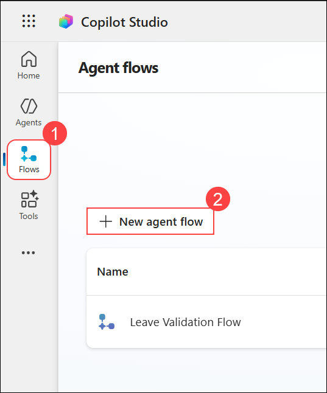

1. **[トリガーの追加]** ウィンドウで、**Skills (1)** を検索し、**[エージェントがフローを呼び出したとき] (2)** を選択します。

     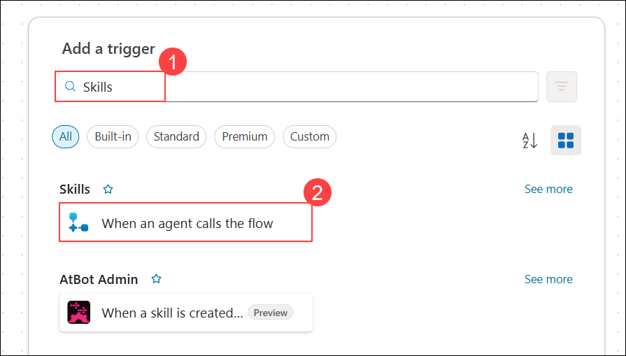

1. フローの **[デザイナー]** タブで、**[入力の追加]** をクリックします。

     

1. **[ユーザー入力の種類を選択してください]** で、**[テキスト]** を選択してテキスト入力パラメーターを追加します。

     

1. **[エージェントがフローを呼び出したとき]** アクションで、入力名として **employeeEmail (1)** を入力し、**[入力の追加] (2)** を選択します。

     

1. **[パラメーター]** セクションで、**employeeEmail** と同じ手順に従って、次の入力パラメーターをそれぞれ追加した後に **[入力の追加]** を選択します。

    - **employeeName (1)**
    - **leaveType (2)**
    - **reason (3)**
    - **durationDays (4)**
    - **balance (5)**

        

1. **[エージェントがフローを呼び出したとき]** アクションで、**[入力の追加]** を選択します。

     

1. **[ユーザー入力の種類を選択してください]** セクションで、**[日付]** を選択します。

     

1. **[エージェントがフローを呼び出したとき]** アクションで、入力名として **startDate (1)** を入力し、**[入力の追加] (2)** を選択します。

     

1. **[ユーザー入力の種類を選択してください]** セクションで、**[日付]** を選択します。

     

1. **[エージェントがフローを呼び出したとき]** アクションで、入力名として **endDate (1)** を入力し、**[入力の追加] (2)** を選択します。

     

1. 必要な入力を追加すると、**[パラメーター]** セクションは以下のように表示されます。

     

1. **デザイナー** キャンバスで、**プラス (+) アイコン**をクリックしてアクションを追加します。

     

1. **[アクションの追加]** ダイアログで、検索バーに **新しい行の追加 (1)** と入力します。**[Microsoft Dataverse] (3)** の下で、**[新しい行の追加] (2)** を選択します。

     

1. **[新しい行の追加]** アクションで、**[テーブル名]** ドロップダウンから **Leave Request (1)** を選択します。**[詳細パラメーター] (2)** セクションを展開して、入力フィールドと以前に作成したパラメーターをマッピングします。

     

1. **[新しい行の追加]** アクションの **[詳細パラメーター]** で、次のフィールドを選択して入力パラメーターとマッピングします。

    - **balance_days**
    - **duration_days**
    - **employee_email**
    - **employee_name**
    - **end_date**
    - **leave_type**
    - **reason**
    - **start_date**
    - **status**

        

1. **[新しい行の追加]** アクションの **[Balance_days]** の下に **/ (1)** と入力し、**[式の挿入] (2)** をクリックして式を追加します。

     

1. 式エディターで、次を行います。
    - **[動的コンテンツ] (1)** を選択します。
    - **balance (2)** を検索します。
    - **balance (3)** を選択します。
    - 式エリア **(4)** に表示されていることを確認します。
    - **[追加] (5)** を選択します。

       

1. **[行の追加]** ページの **[Duration_days]** フィールドで、次を行います。
    - **/ (1)** と入力します。
    - メニューから **[式の挿入] (2)** を選択します。

        

1. 式エディターで、次を行います。
    - **[動的コンテンツ] (1)** を選択します。
    - 検索バーに **duration (2)** と入力します。
    - **[エージェントがフローを呼び出したとき]** の下から **durationDays (3)** を選択します。
    - **[追加] (4)** をクリックして挿入します。

        

1. 以下の表に示すように、残りのパラメーターを Dataverse フィールドにマッピングします。

    | フィールド名      |   選択内容                                   |
    |-----------------|--------------------------------------------|
    | Employee_email  | **employeeEmail** を選択 |
    | Employee_name   | **employeeName** を選択  |
    | End_date        | **endDate** を選択       |
    | Leave_type      | 静的値として **Casual** を選択         |
    | Reason          | **reason** を選択        |
    | Start_date      | **startDate** を選択     |
    | Status          | 静的値として **Pending** を選択        |

    - **注:** 動的値を持つフィールドは、**[動的コンテンツ]** パネルから選択します。

    - **注:** **静的値**とマークされたフィールドは、直接値を選択します。

        

1. 完了したら、上部の **[下書きを保存]** をクリックして、現在の状態のフローを保存します。このフローは今後の演習で承認フローを追加して更新します。

     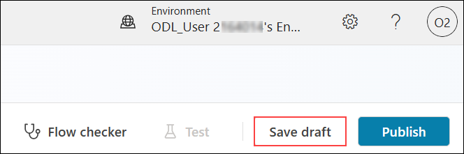

## タスク 3: 休暇申請トピックの作成

このタスクでは、必要な入力を設定して検証フローに接続することで、従業員が休暇を申請できるトピックを作成します。

1. **Copilot Studio** で、**[エージェント] (1)** を選択し、**[Leave Management Agent] (2)** を選択します。

     

1. **[トピック] (1)** タブで、**[トピックの追加] (2)** を選択し、**[空白から] (3)** を選択します。

     

   > **Note:** If the **Topics** tab is directly visible on the screen, you can select it without clicking **+7**.

1. In the **Topics** page, select **Add a topic (1)**, and then choose **From blank (2)**.

     

1. **[エージェントのテスト]** ウィンドウで、**[閉じる (X)]** ボタンをクリックしてテスト ウィンドウを閉じ、ワークフロー設計のためにキャンバスを広くします。

1. **[トリガー]** ノードで、**[トピックの動作の説明] (1)** に次の説明を入力し、**[プラス (+) アイコン] (2)** を選択します。

     ```
     This tool can handle queries like these: I want to apply for leave, apply for leave, request leave, requesting leave, I need time off, submit leave request, take a leave, leave application, I want to take leave, apply for casual leave, apply for emergency leave, apply for unpaid leave
     ```

     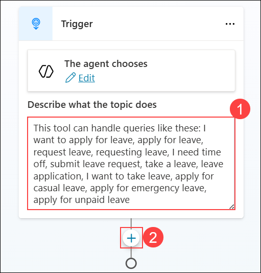

1. **トピック エディター**で、表示されたオプションから **[質問する]** を選択して、フローに質問ノードを追加します。

     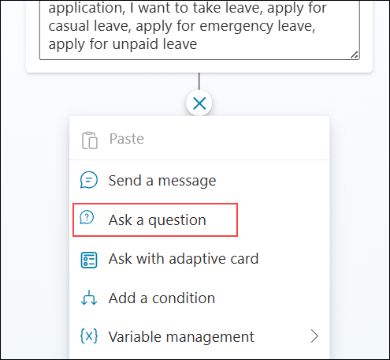

1. **[質問]** ノードで、質問テキスト **(1)** に次を入力し、**[識別]** の下で **[複数選択肢オプション] (2)** を選択して、**[+ 新しいオプション] (3)** を選択します。

     ```
     Please choose the Leave type from the list
     ```

     

1. **[ユーザーのオプション]** セクションに、最初の休暇タイプとして **Casual (1)** と入力します。次に **[+ 新しいオプション] (2)** をクリックして別の選択肢を追加します。

     

1. 前のステップと同様に **[+ 新しいオプション]** を再度クリックして、休暇タイプ **Emergency** と **Unpaid** を追加します。

     

1. **[ユーザーの応答を次として保存]** フィールドで **Var1** を選択します。

     

1. **[変数のプロパティ]** ウィンドウで、**[変数名] (1)** フィールドに **leave_type** と入力し、**[閉じる] (2)** を選択します。

     

1. **トピック** デザイナーで、**[その他のすべての条件]** の下にある**プラス (+) アイコン**をクリックして、フローに次のステップを追加します。

     

1. **プラス アイコン (1)** をクリックして、メニューから **[メッセージを送信する] (2)** を選択します。

     

1. **[メッセージ]** アクションで、テキスト ボックスに次のテキスト **(1)** を入力します。次に下の**プラス アイコン (2)** をクリックして次のステップを追加します。

     ```
     Please choose an option from the list
     ```

     

1. **[メッセージ]** ノードからアクション メニューを開きます。**[トピック管理] (1)** を選択して、**[ステップに移動する] (2)** を選択して会話フローをリダイレクトします。

     

1. **[ステップに移動する]** を選択した後、**[質問]** ノード **(休暇タイプ オプションが定義されている場所)** を選択して、ユーザーが他のオプションを選択した場合に**フローを最初に戻すようにループ**させます。

     

1. **トピック** デザイナーで、条件ブランチの下にある**プラス (+) アイコン**をクリックして、各休暇タイプのパスにフローを構築し続けます。

     

1. アクション メニューから **[質問する]** を選択して、フローでユーザーに追加情報を求めます。

     

1. **[質問]** ノードで、次のプロンプト **(1)** を入力してユーザーから開始日を取得します。

     ```
     Please provide your leave Start Date (Please make sure to provide in yyyy-mm-dd format)
     ```

     

1. **[質問]** ノードの **[識別]** の下で **[複数選択肢オプション] (2)** をクリックし、**[ユーザーの応答全体] (3)** を選択して、エージェントがユーザーの入力をそのまま保存できるようにします。

     

1. **[ユーザーの応答を次として保存]** フィールドで **Var1** を選択します。

     

1. **[変数のプロパティ]** ウィンドウで、**[変数名] (1)** フィールドに **startDate** と入力し、**[閉じる] (2)** を選択します。

     

1. **[質問]** ノードの下の**プラス (+) アイコン**をクリックして、フローに次のステップを追加します。

     

1. メニューから **[質問する]** を選択して、ユーザーに追加の入力を求めます。

     

1. **[質問]** ノードで、質問テキストに次を入力します。

     ```
     Please provide your leave End Date (Please make sure to provide in yyyy-mm-dd format)
     ```

     

1. **[識別]** セクションで、オプション矢印 **(1)** を選択し、**[ユーザーの応答全体] (2)** を選択します。

     

1. **[ユーザーの応答を次として保存]** フィールドで **Var1** を選択します。

     

1. **[変数のプロパティ]** ウィンドウで、**[変数名] (1)** フィールドに **endDate** と入力し、**[閉じる] (2)** を選択します。

     

1. **endDate** 質問ノードの下にある**プラス (+) アイコン**をクリックして、フローに次のステップを追加します。

     

1. **endDate** 質問ノードの下にある**プラス (+) アイコン**をクリックし、**[質問する]** を選択してフローに次のプロンプトを追加します。

     

1. **[質問]** ノードで、質問テキスト **(1)** に次を入力し、**[識別]** の下でオプション矢印 **(2)** を選択して、**[ユーザーの応答全体] (3)** を選択します。

     ```
     May I please know the reason for your leave?
     ```

     

1. **[ユーザーの応答を次として保存]** フィールドで **Var1** を選択します。

     

1. **[変数のプロパティ]** ウィンドウで、**[変数名] (1)** フィールドに **reason** と入力し、**[閉じる] (2)** を選択します。

     

1. **reason** 質問ノードの下にある**プラス (+) アイコン**をクリックして、フローに次のステップを追加します。

     

1. reason を取得した後の **[質問]** ノードで、**[ツールの追加] (1)** をクリックします。使用可能なツールのリストから **[Leave Validation Flow] (2)** を選択して、フローを検証プロセスに接続します。

     

1. **オーサリング キャンバス**で、上部メニューから **[変数] (1)** をクリックします。**[参照] (2)** タブで、**[トピック] (3)** セクションを展開し、チェックボックス **(4)** をオンにしてリストされているすべての変数を選択します。

     

1. **[Power Automate 入力]** カードで、**startDate** フィールドの横にある**省略記号 (...) (1)** をクリックします。**[変数の選択]** ウィンドウから **startDate (2)** を選択して変数をマッピングします。

## Task 2: Build a Power Automate flow to validate leave requests

1. **[Power Automate 入力]** カードで、**endDate** フィールドの横にある**省略記号 (...) (1)** をクリックします。**[変数の選択]** ウィンドウから **endDate (2)** を選択して変数をマッピングします。

1. Select the **When an agent calls the flow** trigger to expand it.

1. **[Power Automate 入力]** カードで、次を行います。
    - **employeeEmail** フィールドの横にある**省略記号 (...) (1)** をクリックします。
    - **[変数の選択]** ウィンドウで **[システム] (2)** タブに切り替えます。
    - **User.Email (3)** を検索します。
    - **User.Email (4)** を選択します。

1. Now click **+ Add an input**.  

1. ページ右上隅の **[保存]** をクリックして、トピックへの変更を保存します。

1. In the **Choose the type of user input** section, select **Date** to capture date values in the flow.  

1. **[トピックを保存する]** ダイアログで、次を行います。
    - トピック名として **leave_request (1)** を入力します。
    - **[保存] (2)** をクリックして確認し、トピックを保存します。

1. In the **Parameters** tab, enter the below value in the first input field as **startDate (1)**, and then select **+ Add an input (2)** to add another parameter.

1. 詳細を収集して休暇申請を検証する基本的なエージェントの作成が完了しました。今後の演習では、エージェントをより高度で有能にするための承認ロジックと条件付きワークフローを追加して強化します。

<validation step="bc8e443a-14ef-4307-8619-3092a324799b" />
 
> **タスクの完了おめでとうございます！** 次は検証の時間です。手順は次のとおりです。
> - 対応するタスクの検証ボタンをクリックします。成功のメッセージが表示されたら、次のタスクに進むことができます。
> - 表示されない場合は、エラー メッセージをよく読み、ラボ ガイドの手順に従ってステップを再試行してください。
> - サポートが必要な場合は、cloudlabs-support@spektrasystems.com までお問い合わせください。24 時間 365 日対応しています。

## まとめ

この演習では、休暇管理アシスタントの基盤となる Copilot Studio エージェントを作成しました。エージェントに名前と説明を割り当てて目的を定義し、Dataverse に保存された休暇申請データ、従業員情報、休暇ポリシー ルールなどの主要なナレッジ ソースに接続しました。これらのステップにより、インデックス化された情報に基づいた関連性の高い AI 搭載の応答を提供できるようになりました。

### この演習を正常に完了しました。次の演習に進んでください >>

   
