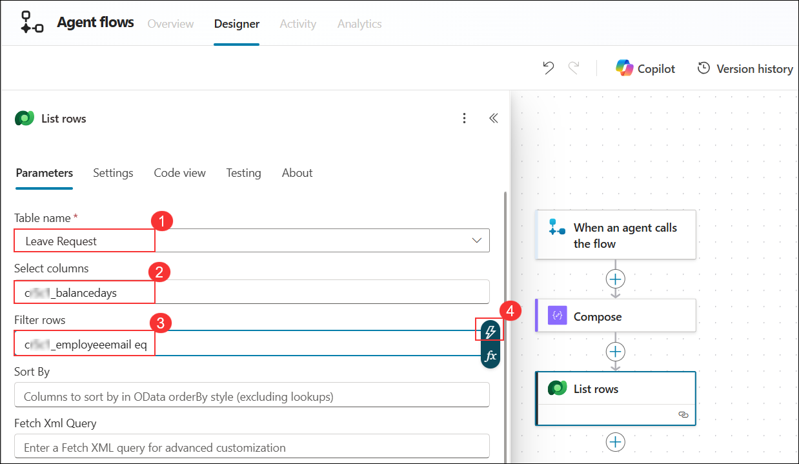
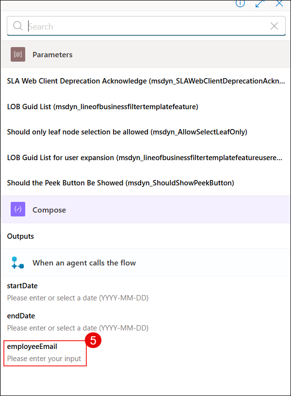
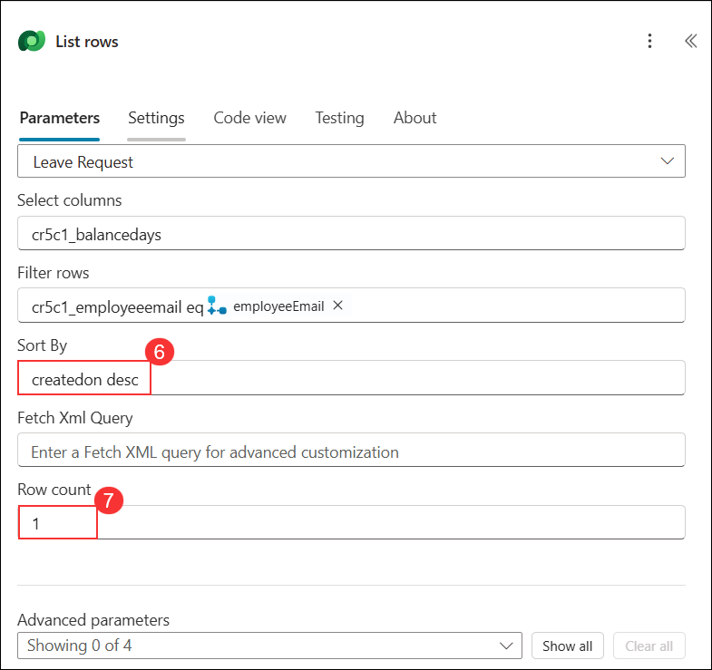
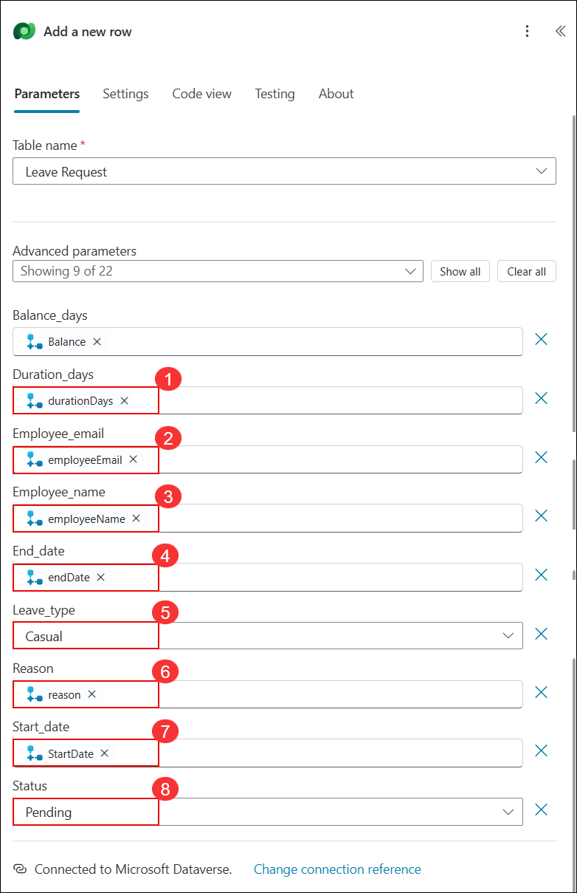
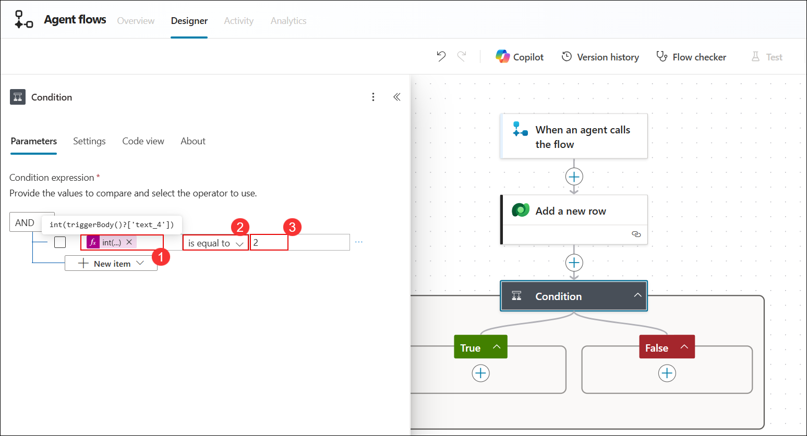

# Exercise 2: Create Store‑Operations Agent in Copilot Studio

### Estimated Duration: 45 Minutes

## Overview

In this exercise, you will create a Copilot Studio agent that will serve as the foundation for your store operations assistant. You will define the agent’s purpose by assigning it a name and description, and connect it to key knowledge sources such as the product catalog, store policy documents, and website content. These steps will enable your agent to deliver relevant, AI-powered responses based on indexed information.

## Objectives

You will be able to complete the following tasks:

- Task 1: Creating a store-operations agent in Copilot Studio

- Task 2: Adding knowledge sources to the agent

## Task 1: Creating a store-operations agent in Copilot Studio

In this task, you will create a new agent in Microsoft Copilot Studio by defining its name, description, and basic configuration settings. This agent will serve as the base for enabling intelligent store operations.

1. Navigate back to Copilot Studio page from the browser.

1. From the home page, select **Create (1)** from left menu and click on **+ New agent (2)** to create an agent.

   

1. In the next pane, select **configure (1)** and provide the following details.

    | Key                     | Value                               |
    |-------------------------------|--------------------------------------------|
    | Name | `Leave Management Agent` |
    | Description | Handles leave requests, approvals, and balance updates using Dataverse and Power Automate. Helps employees apply for leave, check status, and get real-time updates via Teams. |
    | Instruction | Assist with leave applications, validate balances, and route approvals. Respond clearly and guide users through each step. Always ensure requests meet policy and ask for missing details. |

    

    >**Note:** Sometimes you may see a diffrent UI, if you are seeing a UI diffrent than this, then follow this below steps:

    - Click on **Skip to configure**, to get the configuration pane.

      
   
1. In the next pane, provide the same details given above and click on **Create**.

   

1. Once after adding the details, click on **Continue** to create the agent.

1. You have successfully created the Leave Management Agent. In the next steps of this lab, you will enhance it further by adding knowledge sources and advanced features.

   

## Task 2: Adding knowledge sources to the agent

In this task, you will connect knowledge sources such as the product catalog, policy documents, and store website content to your agent, allowing it to provide AI-powered answers using Retrieval-Augmented Generation (RAG).

1. If you are not already on the **Agents** page, select **Agents (1)** from the left navigation menu. Then, click **Leave Management Agent (2)**.

   

1. On the **Leave Management Agent** page, select the **Knowledge (1)** tab from the top menu and click **+ Add knowledge (2)**.  

   

1. In the next pane, click on **select to browse** option as shown and in the pop up window to select files, navigate to `C:\datasets\Store-Operations-with-Copilot-Studio-lab-datasets\Leave-management` file.

   

1. On the **Upload files** pane, verify that the file **Leave-management.docx (1)** is listed and then click **Add to agent (2)**.

   

1. Once done, again click on **+ Add knowledge**.

   

1. In the next pane, select **Dataverse** as knowledge source.

   

1. From the list, search and select **Leave Request** table. Click on **Add to agent**.

   

1. On the **Copilot Studio** page, select **Flows (1)** from the left navigation menu and click **New agent flow (2)** to create a new flow.

   

1. On the **Agent flows – Designer** page, click **Add a trigger** to begin configuring the flow.  

   

1. In the **Add a trigger** pane, search for **When an agent calls the flow (1)** and select **When an agent calls the flow (2)** from the list.

   

1. On the **Agent flows – Designer** page, under the **Parameters** tab, click **+ Add an input**.  

   

1. In the **Choose the type of user input** section, select **Date** to capture date values in the flow.  

   

1. In the **Parameters** tab, set the first input as **startDate (1)**. Then click **+ Add an input (2)** to add another parameter.   

   

1. In the **Choose the type of user input** section, select **Date** again to add another date parameter for the flow.  

   

1. In the **Parameters** tab, add another date input and set its name as **endDate**. Then click **+ Add an input** to create an additional parameter. 

   

1. In the **Choose the type of user input** section, select **Text** to add a text-based parameter. 

   

1. In the **Parameters** tab, add a text input and set its name as **employeeEmail**.   

   

1. On the **Designer** canvas, click the **plus (+)** icon below **When an agent calls the flow** to add the next action.  

   

1. In the **Add an action** pane, search for **Compose (1)** and select **Compose (2)** from the **Data Operation** category.  

   

1. In the **Compose** action, click inside the **Inputs** field, type **/** **(1)**, and then select **Insert expression (2)**.

   

1. In the **Compose** action, paste the expression into the editor box **(1)** and then click **Add (2)** to insert it.

   ```
   add(div(sub(ticks(triggerBody()?['date_1']), ticks(triggerBody()?['date'])), 864000000000), 1)
   ```

   

1. On the **Compose action** pane, verify that the entered expression is applied successfully and appears in the **Inputs** field as shown.

   

1. On the **Designer** page, below the **Compose** action, click the **plus (+) icon** to add a new action **(1)**.  
   - In the search box, type **List rows (2)**.  
   - Under **Microsoft Dataverse (3)**, select **List rows (4)**.  

      

1. On the **Create connection** pane, enter **Microsoft Dataverse (1)** as the connection name, select **Oauth (2)** as the authentication type, and click **Sign in (3)** to establish the connection.   

   

1. On the **Sign in** page, enter the provided **ODL user account (1)** and click **Next (2)** to continue. 

   

1. On the **Enter password** page, type the provided **password (1)** and click **Sign in (2)** to proceed.  

   

1. On the **Stay signed in?** page, click **Yes** to remain signed in. 

   

1. On the **Confirmation required** page, click **Allow access** to grant permission for Microsoft Dataverse. 

   

1. In the **List rows** action:  
   - Select **Leave Request (1)** in the **Table name** field.  
   - Enter **cr5c1_balancedays (2)** in the **Select columns** field to fetch leave balance days.  
   - In the **Filter rows** field, type **cr5c1_employeeemail eq (3)** to filter by employee email.  
   -   - Click the **thunderbolt (4)** icon to insert the **employeeEmail (5)** parameter dynamically.
   - In the **Sort By** field, enter **createdon desc (6)** to sort by latest record.  
   - In the **Row count** field, type **1 (7)** to return only the most recent record.  

      

      

      

      > **Note**: The prefix **cr5c1_** is the schema prefix automatically generated by Dataverse for this environment. Your prefix may differ depending on the environment setup. 

1. On the **List rows** action, click the **plus (+) (1)** icon to add a new action.  
   - In the **search bar (2)**, type **Condition**.  
   - From the **Control (3)** section, select **Condition**.  

      

1. On the **Condition expression** field:  
   - Type **/** (1).  
   - Click **Insert expression (2)**.
   - Paste the expression **(3)**.  
   - Click **Add (4)** to insert it.
   - Select the operator **is greater than (5)**.  
   - Enter **0 (6)** as the comparison value.  

   ```
   length(outputs('List_rows')?['body/value'])
   ```

      

      

      

1. Under the **False** branch of the **Condition**, click the **plus (+) (1)** button to add a new action, type **Compose (2)** in the search box, and from the **Data Operation** section select **Compose (3)**.

   

1. On the **Condition expression** field:  
   - Type **/** (1).  
   - Click **Insert expression (2)**.  
   - Paste the expression **(3)**.  
   - Click **Add (4)** to insert it.  

   ```
   sub(24, outputs('Compose'))
   ```

   

1. Under the **True** branch of the **Condition**, click the **plus (+) (1)** button to add a new action, type **Compose (2)** in the search box, and from the **Data Operation** section select **Compose (3)**.

   

1. On the **Condition expression** field:  
   - Type **/** **(1).**  
   - Click **Insert expression (2)**.  
   - Paste the expression **(3)**.  
   - Click **Add (4)** to insert it.  

   ```
   sub(first(outputs('List_rows')?['body/value'])?['crf88_balancedays'], outputs('Compose'))
   ```

   

1. Under the **True** branch of the condition, click the **plus (+) icon (1)**.  
   - In the search bar, type **Respond to the agent (2)**.  
   - From the **Skills** section, select **Respond to the agent (3)**.  

   

1. In the **Respond to the agent** action: 
   - Enter **Duration (1)** as the output name.  
   - Type **/** (2) to open the expression editor.  
   - Paste the expression **(3)**.  
   - Click **Add (4)** to insert it. 
   - Click **Add an output (5)** and select **Text**.

   ```
   outputs('Compose')
   ``` 

    

1. In the **Respond to the agent** action, click **Add an output** and select **Text**.  
   - Enter **Balance (1)** as the output name.  
   - Type **/** and open the expression editor.  
   - Paste the expression **(2)**.  
   - Click **Add (3)** to insert it. 

   ```
   outputs('Compose_2')
   ```

   

1. In the **False** branch of the Condition, click the **plus (+) icon (1)**, search for **Respond to the agent (2)**, and select **Respond to the agent (3)** from the Skills section. 

   

1. On the **Respond to the agent** pane:  
   - In the **Duration (1)** field, paste the expression **(2)** for duration.  
   
      ```
      outputs('Compose')
      ```

   - In the **Balance (3)** field, paste the expression **(4)** for balance. 
      
      ```
      outputs('Compose_2')
      ```

   

1. On the **Designer** page, review the complete flow to ensure all steps are connected as shown. Once confirmed, click **Publish** to save and activate the flow.

   

1. On the top menu bar, click **Overview** to navigate to the flow details page.

   

1. On the **Overview** page, click **Edit** to update the flow details such as the name.

   

1. In the **Details** pane, enter **Leave Validation Flow (1)** as the flow name and click **Save (2)**.

   


## Task 2

1. On the **Agent flows** page, select **Flows (1)** from the left navigation pane and click **New agent flow (2)** to create a new flow.

   

1. On the **flow designer** canvas, click **Add a trigger (1)**. In the **Add a trigger** dialog, type **When an agent calls the flow (2)** in the search box and select **When an agent calls the flow (3)** from the list.

   

1. IOn the **Designer** tab of the flow, under **Parameters**, click **Add an input** to define a parameter for the trigger.

   

1. In the **Parameters** section, under **Choose the type of user input**, select **Text** to add a text input parameter.

   

1. In the **Parameters** section, enter **employeeEmail (1)** as the name of the input parameter. Click **Add an input (2)** to define an additional parameter.

   

1. In the **Parameters** section, follow the same steps used for **employeeEmail** to add the following input parameters:  
   - **employeeName (1)**  
   - **leaveType (2)**  
   - **reason (3)**  
   - **durationDays (4)**  
   - **Balance (5)**  
   - **Add an input (6)**

      

1. In the **Choose the type of user input** dialog, select **Date** to add a date input parameter.

   

1. In the **Parameters** section, add two date input parameters:  
- **StartDate (1)**  
- **endDate (2)**  

   

1. On the **Designer** canvas, click the **plus (+) icon (1)** to add an action. In the **Add an action** dialog, type **Add a new row (2)** in the search bar. Under **Microsoft Dataverse (3)**, select **Add a new row (4)**.

   

1. In the **Add a new row** action, select **Leave Request (1)** from the **Table name** drop-down. Expand the **Advanced parameters (2)** section to map the input fields with the parameters created earlier.

   

1. In the **Add a new row** action, under **Advanced parameters**, select the following fields to map with the input parameters:  

   - **balance_days**  
   - **duration_days**  
   - **employee_email**  
   - **employee_name**  
   - **end_date**  
   - **leave_type**  
   - **reason**  
   - **start_date**  
   - **status**  

   

1. In the **Add a new row** action, under **Balance_days**, type **/** (1) and then click **Insert expression (2)** to add an expression.

   

1. In the **expression editor**, paste the required expression (1) and click **Add (2)** to insert it into the parameter field.

   ```
   triggerBody()?['text_5']
   ``` 

   

1. In the **Add a new row** action, map the parameters to the Dataverse fields as shown in the table below.

   | Field Name      | Value / Expression                        |
   |-----------------|--------------------------------------------|
   | Balance_days    | Paste the expression for **Balance**       |
   | Duration_days   | Paste the expression for **durationDays**  |
   | Employee_email  | Paste the expression for **employeeEmail** |
   | Employee_name   | Paste the expression for **employeeName**  |
   | End_date        | Paste the expression for **endDate**       |
   | Leave_type      | Enter **Casual** as a static value         |
   | Reason          | Paste the expression for **reason**        |
   | Start_date      | Paste the expression for **StartDate**     |
   | Status          | Enter **Pending** as a static value        |

In the **Add a new row** | action, map the parameters to their corresponding fields:  
   - **Duration_days (1)** | Paste the expression for **durationDays.**

      ```
      triggerBody()?['text_4']
      ``` 

   - **Employee_email (2)** | Paste the expression for **employeeEmail.**

      ```
      triggerBody()?['text']
      ``` 

   - **Employee_name (3)** | Paste the expression for **employeeName.** 

      ```
      triggerBody()?['text_1']
      ``` 

   - **End_date (4)** → Paste the expression for **endDate.** 

      ```
      triggerBody()?['date_1']
      ``` 

   - **Leave_type (5)** → Enter **Casual.** as a static value.     

   - **Reason (6)** → Paste the expression for **reason.** 

      ```
      triggerBody()?['text_3']
      ``` 

   - **Start_date (7)** → Paste the expression for **StartDate.**   

      ```
      triggerBody()?['date']
      ``` 

   - **Status (8)** → Enter **Pending** as a static value.  

      - **Note:** For fields marked **Paste the expression**, click inside the input box, choose **Insert expression**, and paste the expression provided in the lab guide. 

      - **Note:** For fields marked **static value**, type the value directly.  

         

1. On the **Designer** canvas, click the **plus (+) icon (1)** to add a new action. In the **Add an action** dialog, type **Condition (2)** in the search bar and select **Condition (3)** under the **Control** section.

   

1. In the **Condition** action, paste the required expression (1) into the first box. From the operator drop-down (2), select **is equal to**, and in the value field (3), enter the comparison value.

   ```
   int(triggerBody()?['text_4'])
   ``` 

   

1. In the **Condition** action, under the **False** branch, click the **plus (+) icon (1)** to add a new action. In the **Add an action** dialog, type **Start and wait for an approval (2)** in the search bar and select **Start and wait for an approval (3)** under **Standard approvals**.

   

1. In the **Start and wait for an approval** action, configure the parameters:  
   - From the **Approval type** drop-down, select **Approve/Reject - Everyone must approve (1)**.  
   - In the **Title** field, enter **Leave Approval (2)**.  
   - In the **Assigned to** field, type the user’s email address **(3)** and select the matching account from the suggestions **(4)**. 

      

1. In the **False** branch of the approval, click the **plus (+) icon (1)** to add a new action.  
   - In the **Add an action** dialog, type **Condition (2)** in the search bar.  
   - Under the **Control** section, select **Condition (3)**.  

      

1. In the **Condition 1** action, configure the condition as follows:  
   - Select **Outcome (1)** from the dynamic content.  
   - From the operator drop-down, select **is equal to (2)**.  
   - In the value field, enter **Approve (3)**. 

      ```
      outputs('Start_and_wait_for_an_approval')?['body/outcome']
      ``` 

      

1. In the **False** branch of **Condition 1**, click the **plus (+) icon (1)** to add a new action.  
   - In the **Add an action** dialog, type **Respond to the agent (2)** in the search bar.  
   - Under **Skills**, select **Respond to the agent (3)**.  

   

1. In the **Respond to the agent** action, set the output name to **reply (1)** and enter **the request is rejected (2)** as the response message.

   

1. In the **False** branch, after the **Respond to the agent** action, click the **plus (+) icon (1)** to add a new action.  
   - In the **Add an action** dialog, type **Terminate (2)** in the search bar.  
   - Under the **Control** section, select **Terminate (3)**. 

      

1. In the **Terminate** action, set the **Status** field to **Succeeded** to complete the workflow after rejection.

   

1. In the **True** branch of **Condition 1**, click the **plus (+) icon (1)** to add a new action.  
   - In the **Add an action** dialog, type **Update a row (2)** in the search bar.  
   - Under **Microsoft Dataverse**, select **Update a row (3)**.  

      

1. On the **Update a row** action:  
   - Select **Leave Request (1)** as the table name.  
   - In the **Row ID (2)** field, paste the expression (3) to reference the row created earlier.  
   - Click **Add (4)** to confirm the expression.  
   - In the **Status (5)** field, type **Approved**.  

      ```
      outputs('Add_a_new_row')?['body/crf88_leaverequestid']
      ``` 

      

1. On the **Update a row** action, click the **plus (+) button (1)** to add a new action.  
   - In the search box, type **Respond to the agent (2)**.  
   - From the **Skills** section, select **Respond to the agent (3)**. 

      

1. On the **Respond to the agent 1** action, in the **reply (1)** field, enter the message **You leave is approved from [start_date] to [end_date] (2)** and paste the provided expressions for **start_date** and **end_date**.

   ```
   outputs('Add_a_new_row')?['body/crf88_startdate']
   ``` 

   ```
   outputs('Add_a_new_row')?['body/crf88_enddate']
   ``` 

   

The completed flow should now look like the following:

- The flow starts with **When an agent calls the flow**.  
- A new record is created in the **Leave Request** table using **Add a new row**.  
- A **Condition** checks the leave duration.  
  - If **True**, the process continues.  
  - If **False**, the flow triggers **Start and wait for an approval**.  
    - Inside this branch, another **Condition** validates the approval outcome.  
      - If **Approved**, the flow updates the leave record with status **Approved** and sends a response back to the agent.  
      - If **Rejected**, the flow responds to the agent that the request is rejected and then terminates successfully.  
- The final steps include **Update a row** to mark approval in Dataverse, followed by a confirmation response through **Respond to the agent 1**. 

   

1. At the top-right corner of the flow designer, click **Publish** to save and activate your flow.

   

1. On the top menu, click **Overview** to return to the flow overview page after publishing.

   

1. On the **Overview** page, under the **Details** section, click **Edit** to update the flow details such as the name and description.

   

1. In the **Details** pane, enter **Leave Management Workflow (1)** in the **Flow name** field. Then, click **Save (2)** to apply the changes.  

   

## Summary

In this exercise, you created a Copilot Studio agent that served as the foundation for your store operations assistant. You defined the agent’s purpose by assigning it a name and description, and connected it to key knowledge sources such as the product catalog, store policy documents, and website content. These steps enabled the agent to deliver relevant, AI-powered responses based on indexed information.

### You have successfully completed this exercise, please continue to next one >>
