# Exercise 2: Designing Advanced Topics

### Estimated Duration: 60 Minutes

## Overview

In this exercise, you will build a Copilot Studio agent to form the foundation of your leave management assistant. You will define its purpose by assigning a clear, descriptive name and a detailed description, and connect it to critical knowledge sources, such as the leave policy and a database containing user details. These steps will enable your agent to deliver precise, AI-powered responses by leveraging indexed information.

## Objectives

You will be able to complete the following tasks:

- Task 1: Build a Power Automate flow to validate leave requests

- Task 2: Create flow to update leave request in Dataverse

- Task 3: Create topic for leave application

## Task 1: Build a Power Automate flow to validate leave requests

In this task, you will create a Power Automate flow that validates leave requests by calculating the duration, checking the leave balance, and updating it accordingly.

1. On the **Copilot Studio** page, select **Flows (1)** from the left navigation menu and click **New agent flow (2)** to create a new flow.

   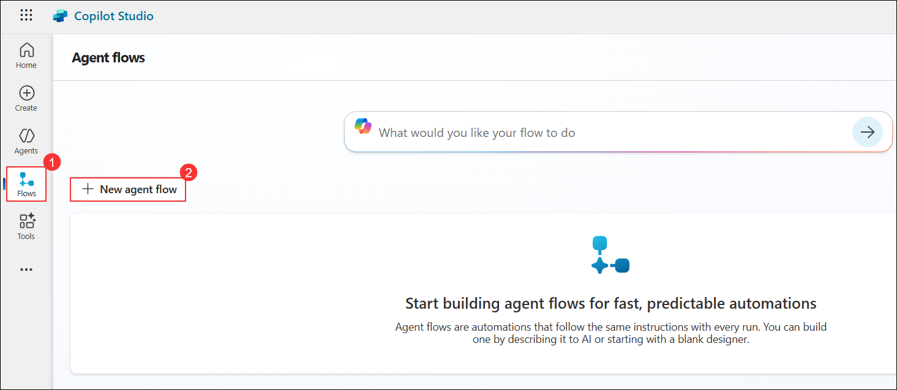

1. On the **Agent flows Designer** page, click **Add a trigger** to begin configuring the flow.  

   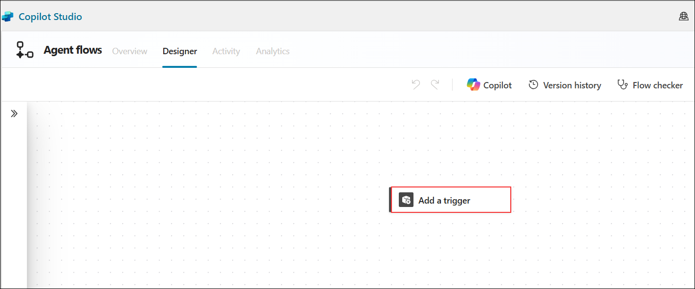

1. In the **Add a trigger** pane, search for **When an agent calls the flow (1)** and select **When an agent calls the flow (2)** from the list.

   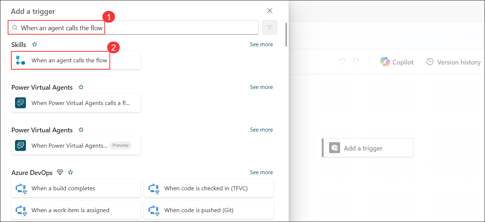

1. On the **Agent flows Designer** page, under the **Parameters** tab, click **+ Add an input**.  

   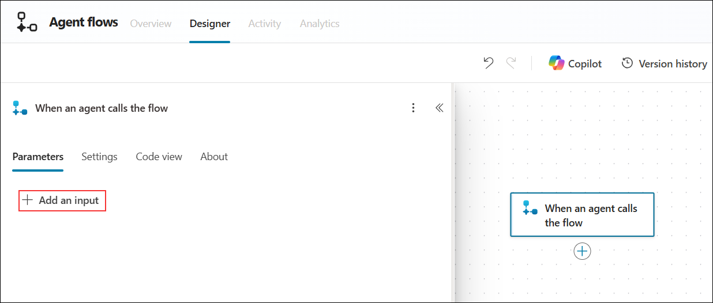

1. In the **Choose the type of user input** section, select **Date** to capture date values in the flow.  

   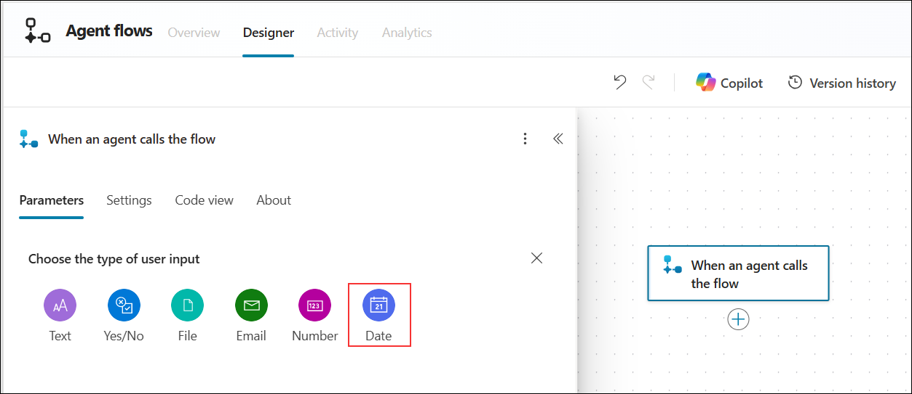

1. In the **Parameters** tab, set the first input as **startDate (1)**. Then click **+ Add an input (2)** to add another parameter.   

   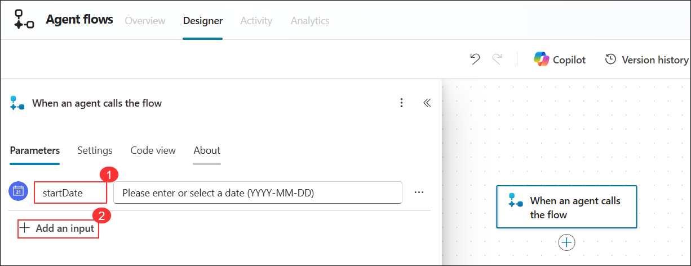

1. In the **Choose the type of user input** section, select **Date** again to add another date parameter for the flow.  

   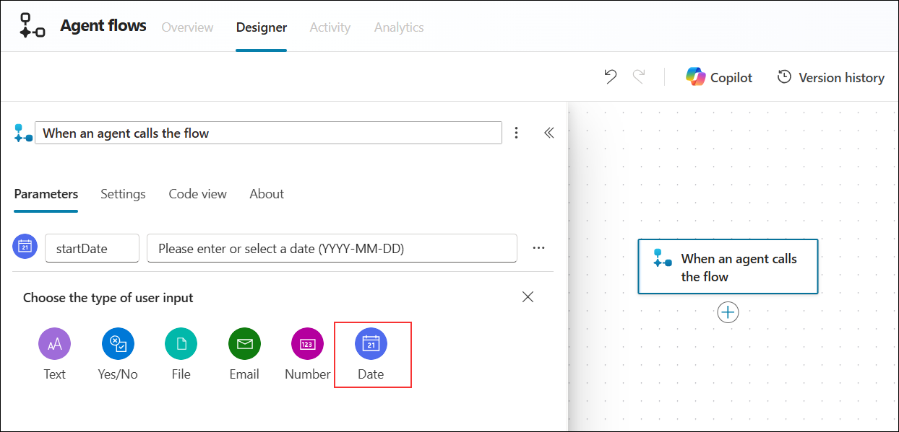

1. In the **Parameters** tab, add another date input and set its name as **endDate**. Then click **+ Add an input** to create an additional parameter. 

   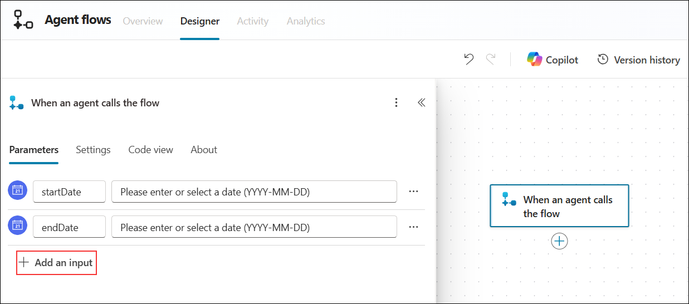

1. In the **Choose the type of user input** section, select **Text** to add a text-based parameter. 

   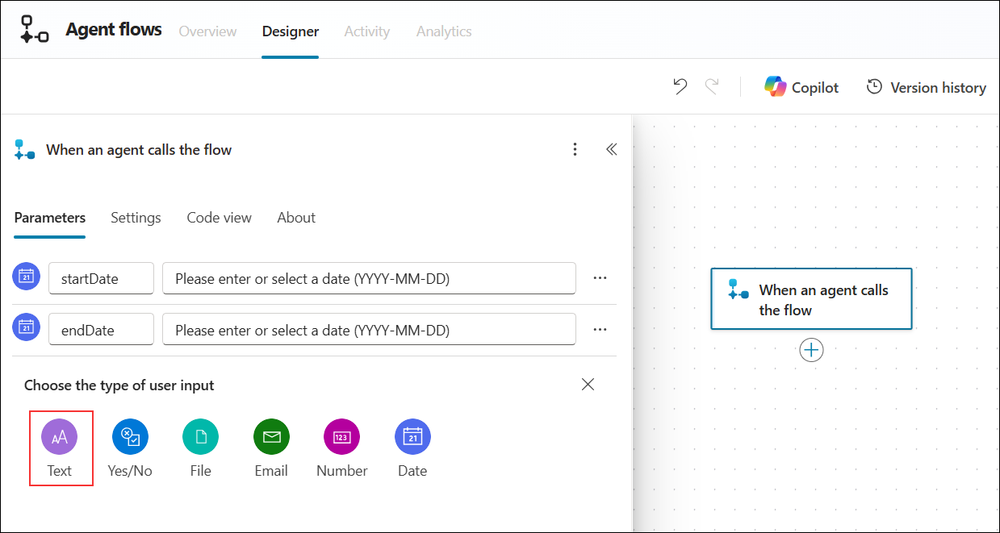

1. In the **Parameters** tab, add a text input and set its name as **employeeEmail**.   

   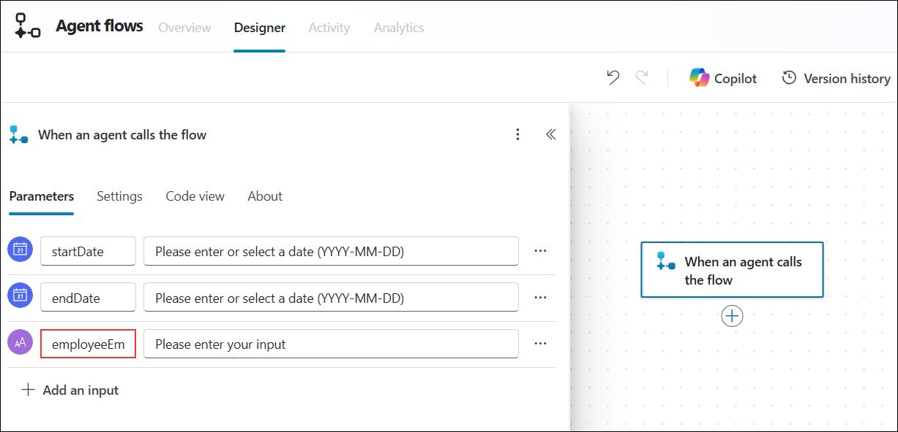

1. On the **Designer** canvas, click the **plus (+)** icon below **When an agent calls the flow** to add the next action.  

   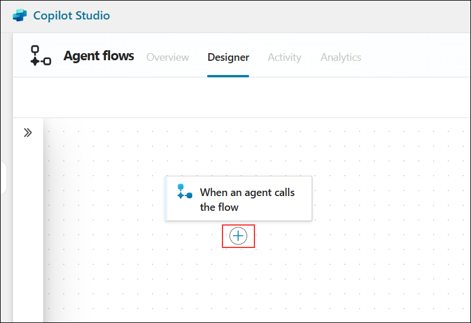

1. In the **Add an action** pane, search for **Compose (1)** and select **Compose (2)** from the **Data Operation** category.  

   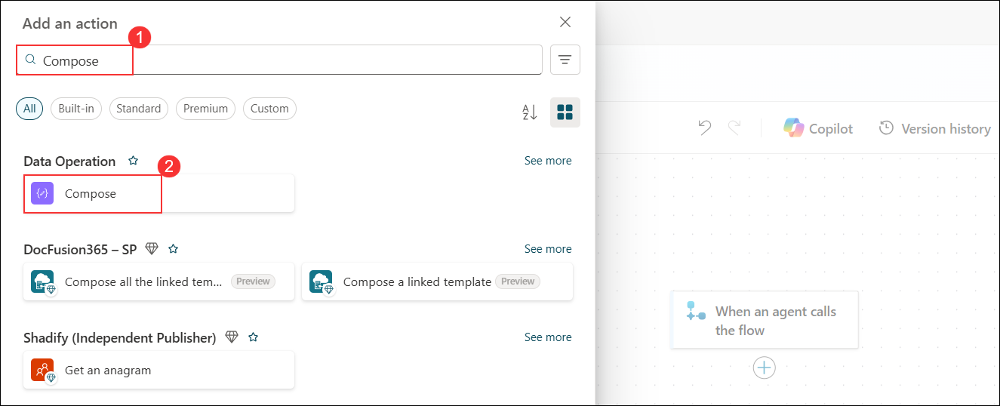

1. In the **Compose** action, click inside the **Inputs** field, type **/** **(1)**, and then select **Insert expression (2)**.

   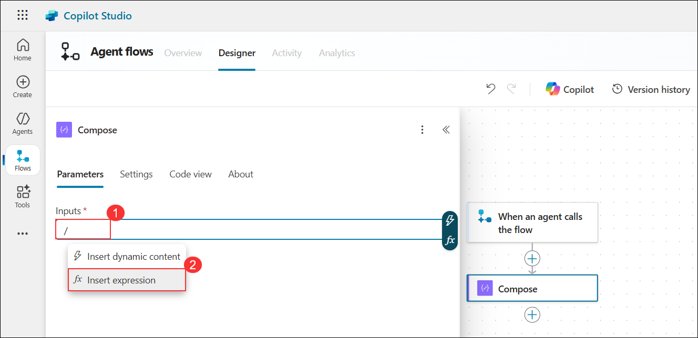

1. In the **Compose** action, paste the expression into the editor box **(1)** and then click **Add (2)** to insert it.

   ```
   add(div(sub(ticks(triggerBody()?['date_1']), ticks(triggerBody()?['date'])), 864000000000), 1)
   ```

   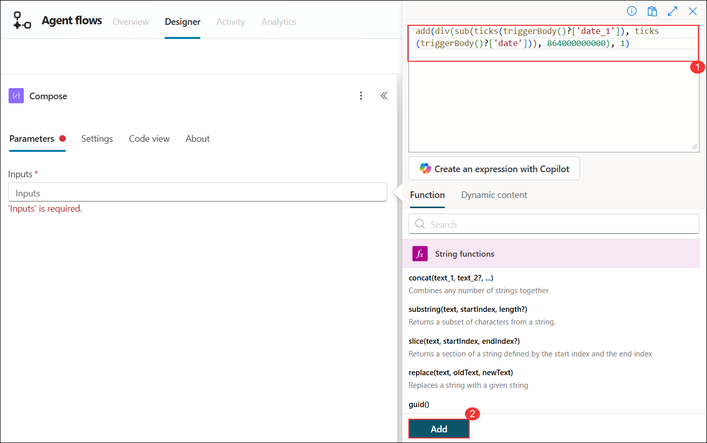

   > This formula calculates the number of days between two dates (date and date_1).

   > - **ticks()** → converts a date into "ticks" (very large time units used in Power Automate).

   > - **sub(...)** → subtracts the start date ticks from the end date ticks (gives the difference in ticks).

   > - **864000000000** → number of ticks in one day (so dividing by this gives days).

   > - **add(..., 1)** → adds 1 so that both the start and end dates are counted.

1. On the **Compose action** pane, verify that the entered expression is applied successfully and appears in the **Inputs** field as shown.

   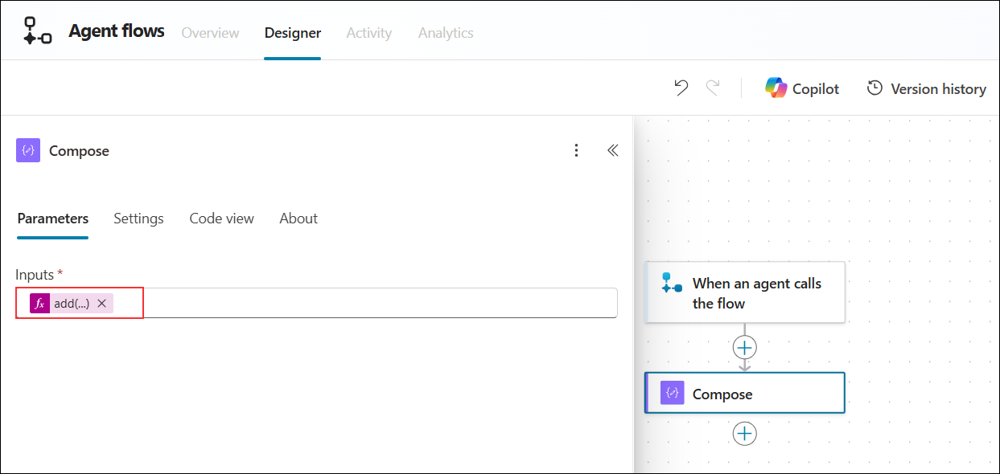

1. On the **Designer** page, below the **Compose** action, click the **plus (+) icon** to add a new action **(1)**.  
   - In the search box, type **List rows (2)**.  
   - Under **Microsoft Dataverse (3)**, select **List rows (4)**.  

      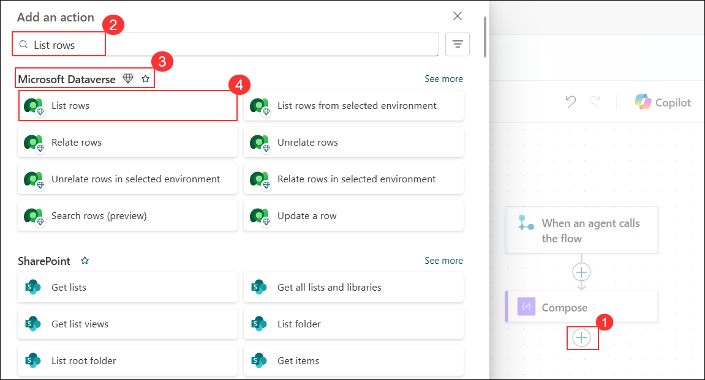

1. On the **Create connection** pane, enter **Microsoft Dataverse (1)** as the connection name, select **Oauth (2)** as the authentication type, and click **Sign in (3)** to establish the connection.   

   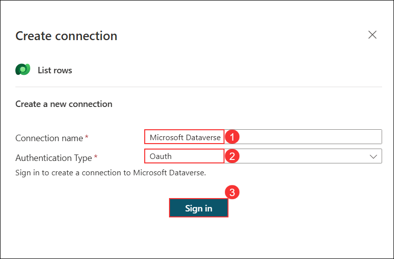

1. On the **Sign in** page, enter **Email/Username:** <inject key="AzureAdUserEmail"></inject> **(1)** and click **Next (2)** to continue. 

   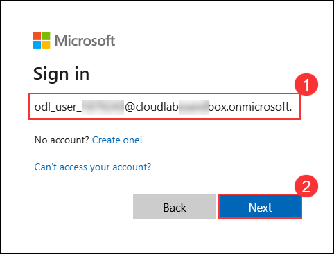

1. On the **Enter password** page, enter **password** <inject key="AzureAdUserPassword"></inject> **(1)** and click **Sign in (2)** to proceed.  

   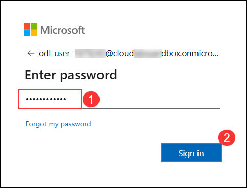

1. On the **Stay signed in?** page, click **Yes** to remain signed in. 

   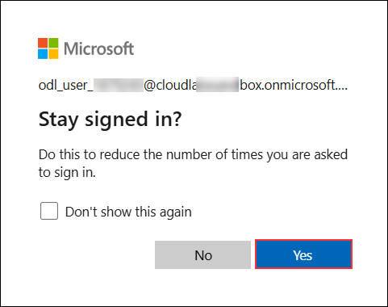

1. On the **Confirmation required** page, click **Allow access** to grant permission for Microsoft Dataverse. 

   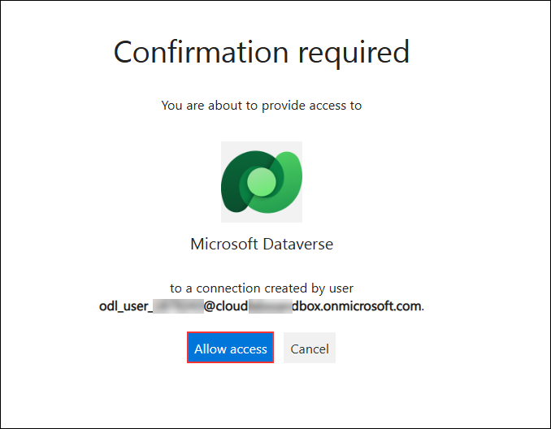

1. In the **List rows** action:

   - Select **Leave Request (1)** in the **Table name** field.  
   - Enter **<Logical_ID>_balancedays (2)** in the **Select columns** field to fetch leave balance days.  
   - In the **Filter rows** field, type **<Logical_ID>_employeeemail eq '' (3)** to filter records by employee email.

      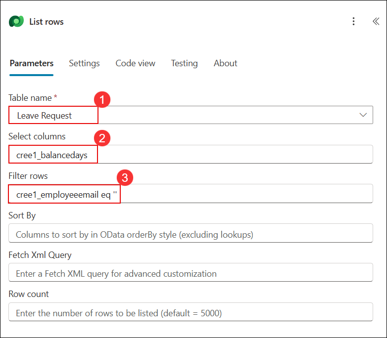

      > **Note**: The **<Logical_ID>** here refers to the ID that you have copied in the first exercise from power apps portal.

1. In the **List rows** action, under the **Filter rows** field, type **<Logical_ID>_employeeemail eq '' (1)** and place the cursor inside the single quotes. Then click the **Expression (fx) (2)** icon to add a dynamic value.

   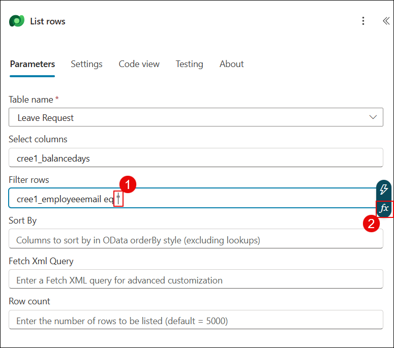

1. In the expression editor, click **Dynamic content (1)**, type **employeeEmail (2)** in the search box, and select **employeeEmail (3)** from the list. Then click **Add (4)** to insert it into the expression.

   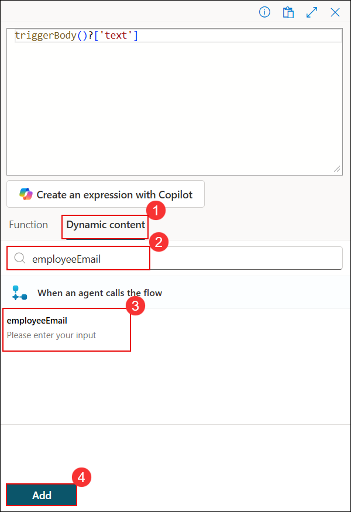

1. In the **List rows** action:

   - In the **Filter rows** field, ensure it looks like this: **<Logical_ID>_employeeemail eq 'employeeEmail' (1)**.  
   - In the **Sort By** field, enter **createdon desc (2)** to sort by the most recent record.  
   - In the **Row count** field, type **1 (3)** to return only the latest record.

      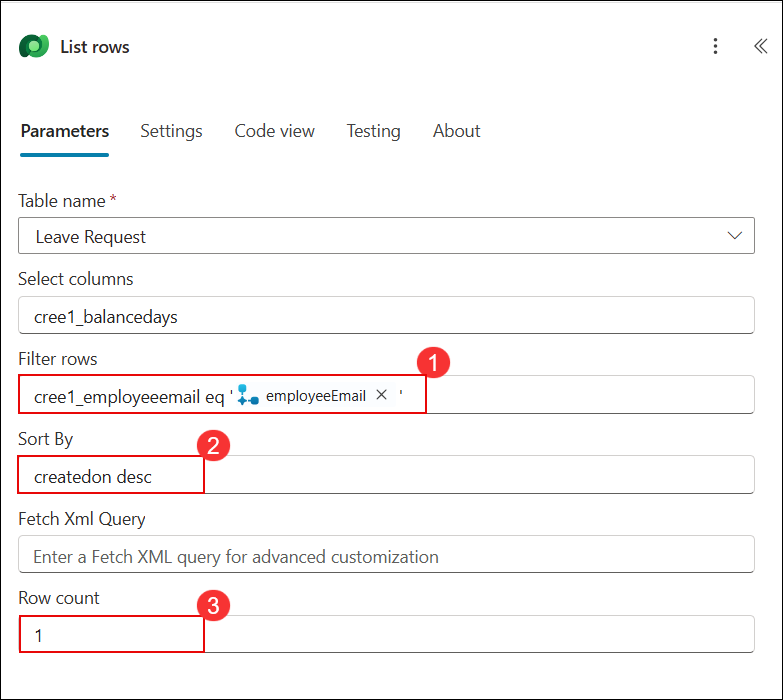

1. On the **List rows** action, click the **plus (+) (1)** icon to add a new action.  
   - In the **search bar (2)**, type **Condition**.  
   - From the **Control (3)** section, select **Condition**.  

      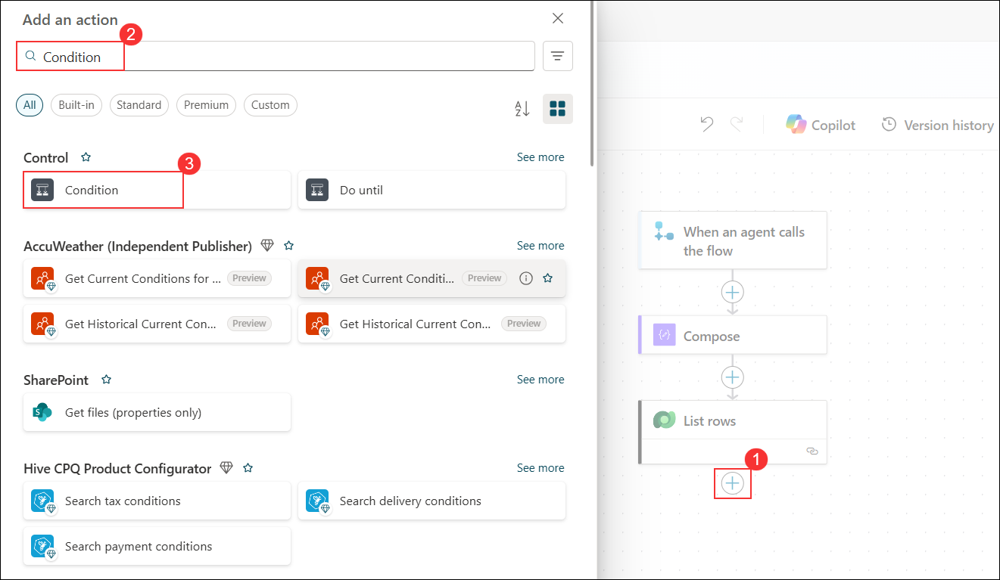

1. On the **Condition expression** field:  
   - Type **/** (1).  
   - Click **Insert expression (2)**.
   - Paste the expression **(3)**.  
   - Click **Add (4)** to insert it.
   - Select the operator **is greater than (5)**.  
   - Enter **0 (6)** as the comparison value.  

      ```
      length(outputs('List_rows')?['body/value'])
      ```

      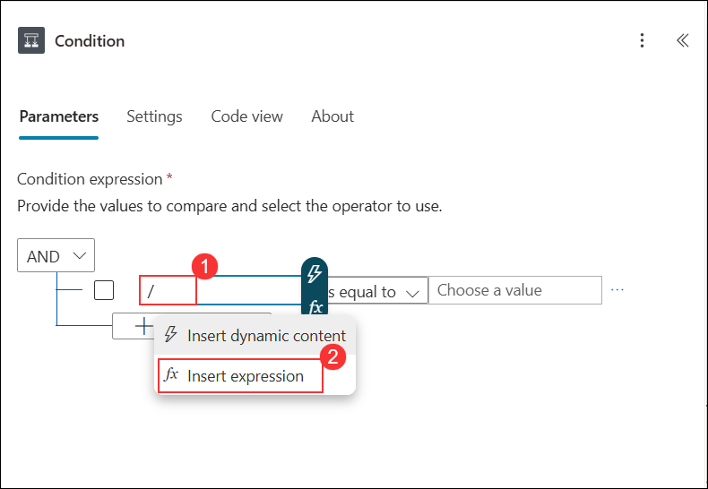

      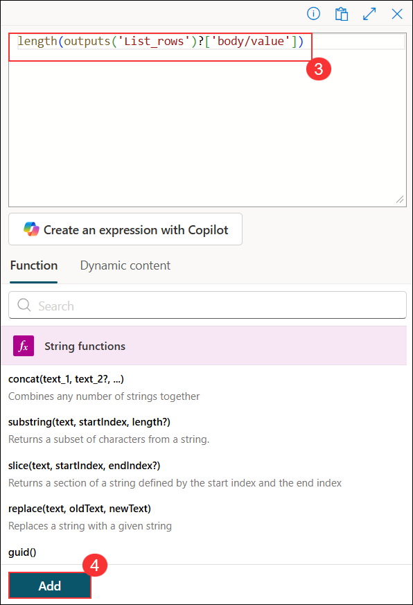

      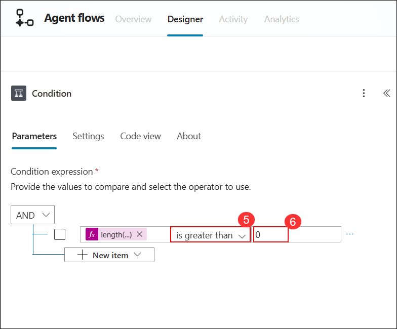

      > the above expression outputs('List_rows') → gets the result from the List rows action in Power Automate.

      > - ['body/value'] → accesses the list of rows (records) returned.

      > - length(...) → counts how many rows were returned.

      > - **So this expression returns the number of records found in Dataverse**.
      
      > - If the length is 0 → no record exists → this is the user’s first leave application.

      > - If the length is greater than 0 → a record exists → the user already has leave data in the database.

1. Under the **False** branch of the **Condition**, click the **plus (+) (1)** button to add a new action, type **Compose (2)** in the search box, and from the **Data Operation** section select **Compose (3)**.

   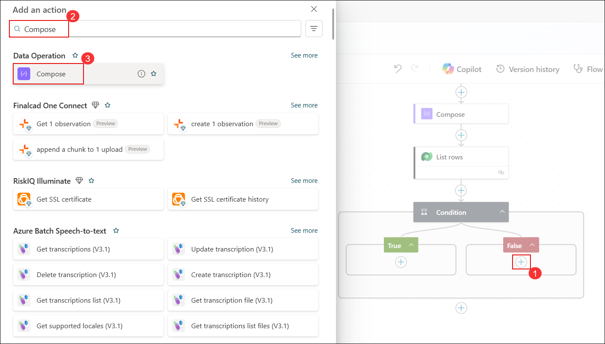

1. On the **Condition expression** field:  
   - Type **/** (1).  
   - Click **Insert expression (2)**.  
   - Paste the expression **(3)**.  
   - Click **Add (4)** to insert it.  

      ```
      sub(24, outputs('Compose'))
      ```

      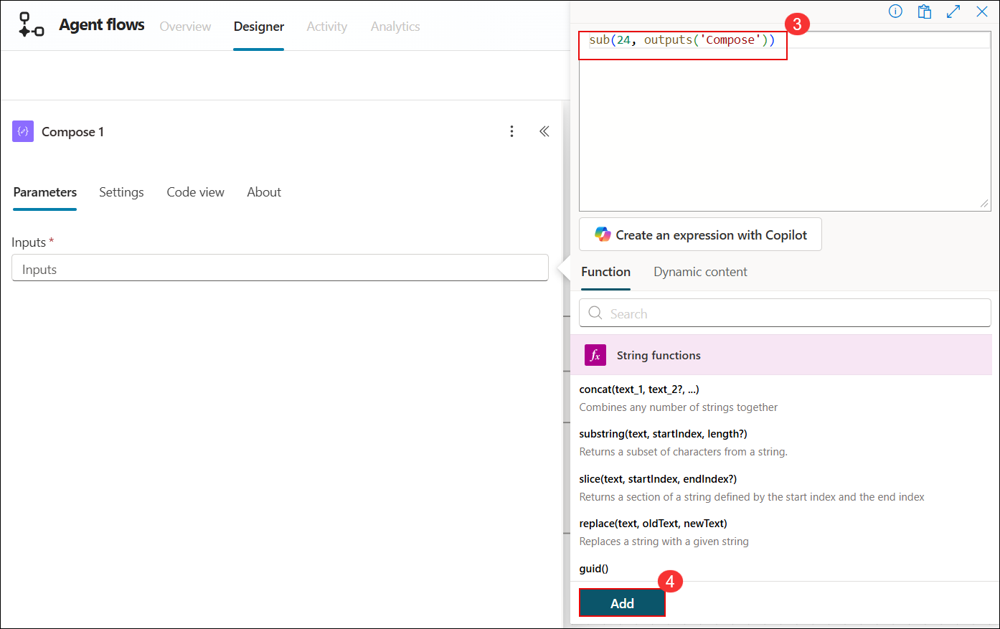

      > Since each employee is allotted 24 leaves annually, if a user is applying for the first time, they start with 24 available leaves. This expression subtracts the current leave duration from 24 to calculate the remaining balance.

1. Under the **True** branch of the **Condition**, click the **plus (+) (1)** button to add a new action, type **Compose (2)** in the search box, and from the **Data Operation** section select **Compose (3)**.

   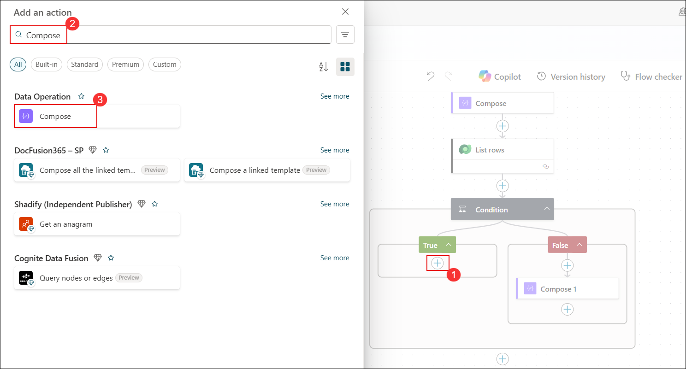

1. On the **Condition expression** field:  
   - Type **/** **(1).**  
   - Click **Insert expression (2)**.  
   - Paste the expression **(3)**.  
   - Click **Add (4)** to insert it.  

      ```
      sub(first(outputs('List_rows')?['body/value'])?['<Logical_ID>_balancedays'], outputs('Compose'))
      ```

      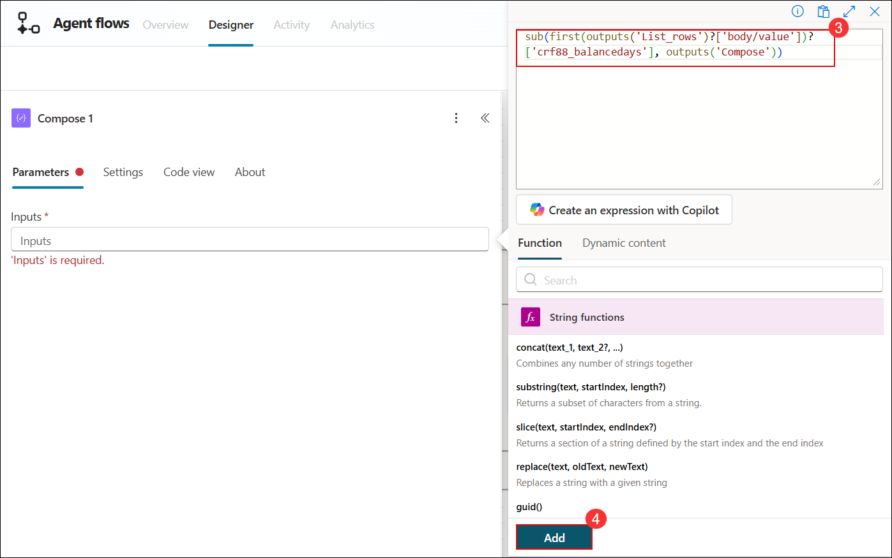

      > **Note**: The **<Logical_ID>** here refers to the ID that you have copied in the first exercise from power apps portal.

      > If the user is not applying for leave for the first time, this expression retrieves the remaining balance from their previous request and subtracts the current leave duration to calculate the updated balance.

1. Under the **True** branch of the condition, click the **plus (+) icon (1)**.  
   - In the search bar, type **Respond to the agent (2)**.  
   - From the **Skills** section, select **Respond to the agent (3)**.  

      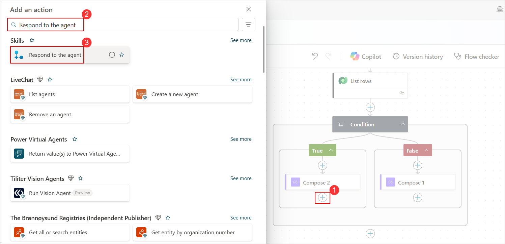

1. In the **Respond to the agent** action, click **Add an output** and select **Text**.   
   - Type **/** (2) to open the expression editor.  
   - Paste the expression **(3)**.  
   - Click **Add (4)** to insert it. 
   - Click **Add an output (5)** and select **Text**.

      ```
      outputs('Compose')
      ``` 

      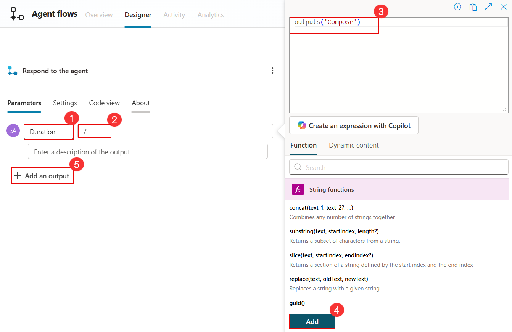 

1. In the **Respond to the agent** action, click **Add an output** and select **Text**.  
   - Enter **Balance (1)** as the output name.  
   - Type **/** and open the expression editor.  
   - Paste the expression **(2)**.  
   - Click **Add (3)** to insert it. 

      ```
      outputs('Compose_2')
      ```

      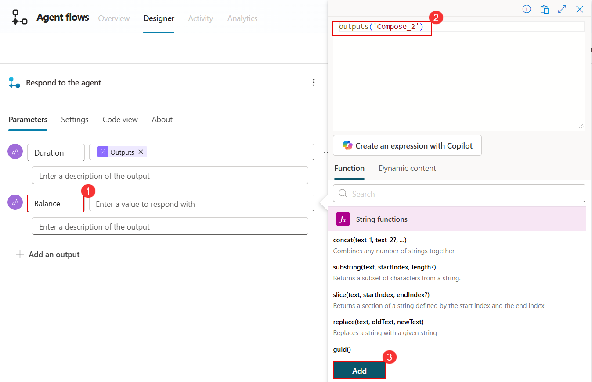

1. In the **False** branch of the Condition, click the **plus (+) icon (1)**, search for **Respond to the agent (2)**, and select **Respond to the agent (3)** from the Skills section. 

   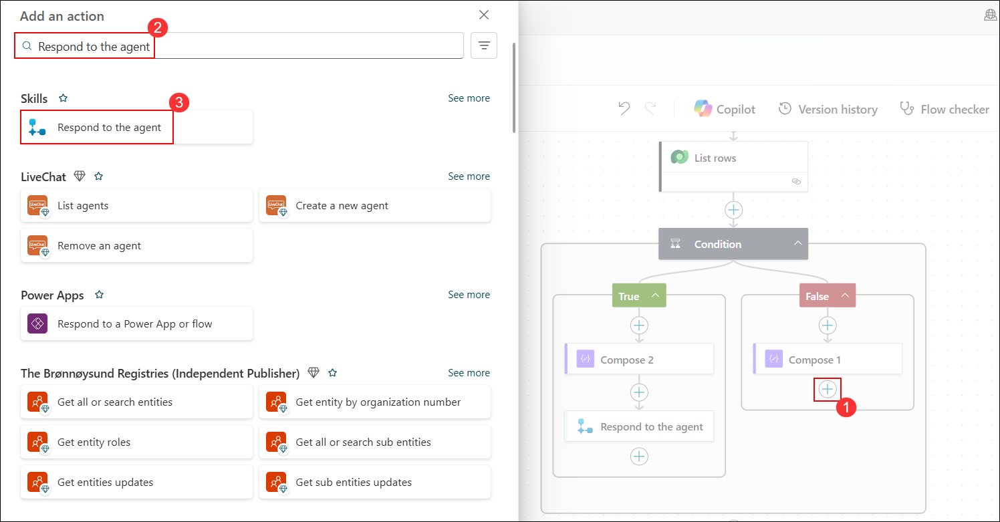

1. On the **Respond to the agent** pane:  
   - In the **Duration (1)** field, paste the expression **(2)** for duration.  
   
      ```
      outputs('Compose')
      ```

   - In the **Balance (3)** field, paste the expression **(4)** for balance. 
      
      ```
      outputs('Compose_1')
      ```

      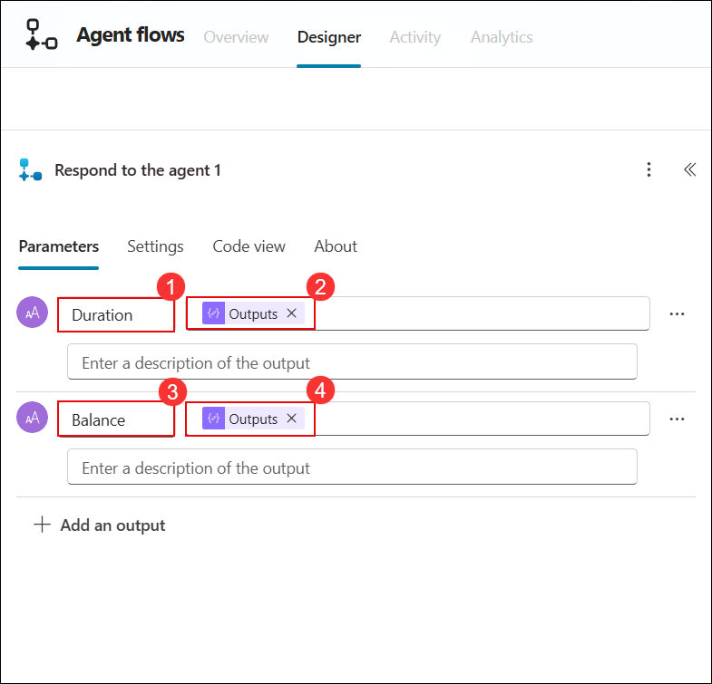

1. On the **Designer** page, review the complete flow to ensure all steps are connected as shown. Once confirmed, click **Publish** to save and activate the flow.

   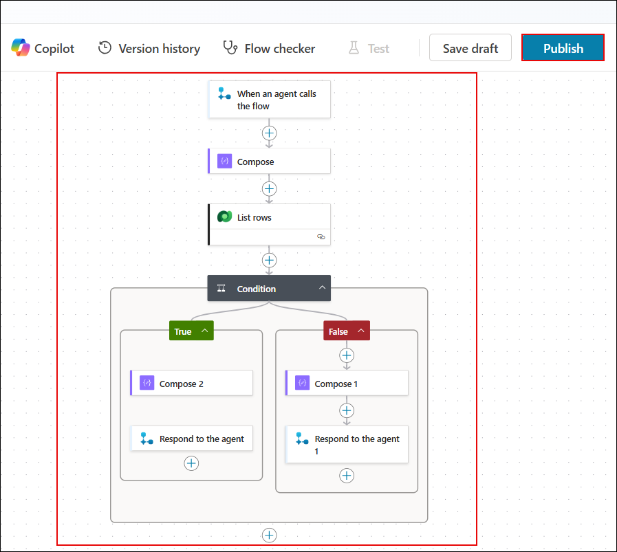

1. On the top menu bar, click **Overview** to navigate to the flow details page.

   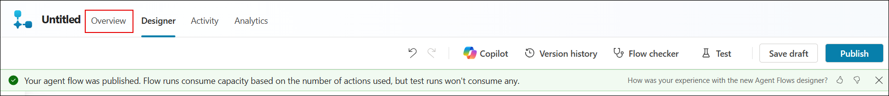

1. On the **Overview** page, click **Edit** to update the flow details such as the name.

   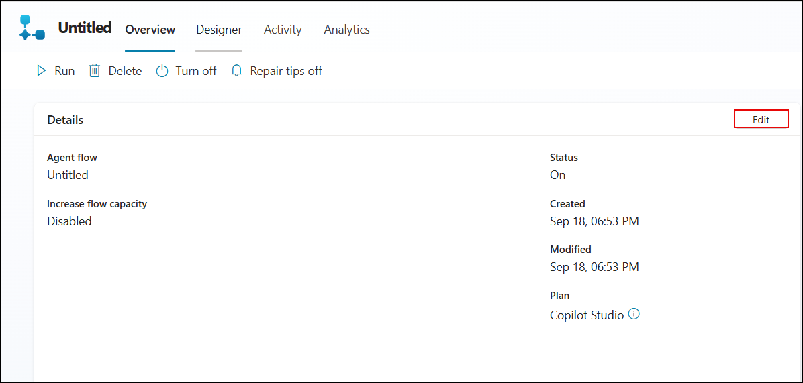

1. In the **Details** pane, enter **Leave Validation Flow (1)** as the flow name and click **Save (2)**.

   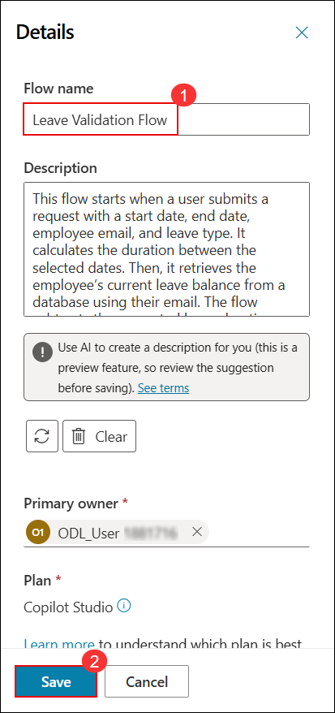


## Task 2: Create flow to update leave request in Dataverse

In this task, you will design a Power Automate flow that collects all the necessary leave request details from the agent. The flow will then update these details in the Dataverse database, ensuring that every leave application is properly recorded and managed.

1. On the **Agent flows** page, select **Flows (1)** from the left navigation pane and click **New agent flow (2)** to create a new flow.

   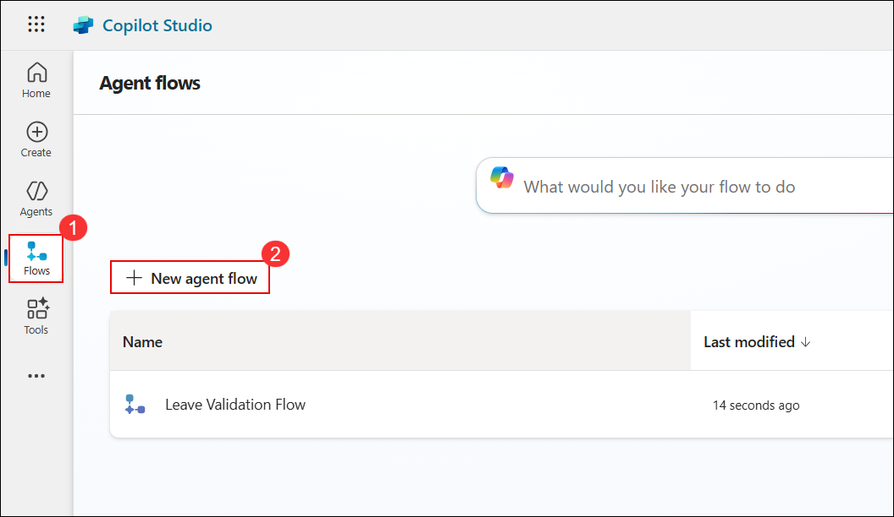

1. On the **Agent flows Designer** page, click **Add a trigger** to begin configuring the flow.  

   

1. In the **Add a trigger** pane, search for **When an agent calls the flow (1)** and select **When an agent calls the flow (2)** from the list.

   

1. IOn the **Designer** tab of the flow, under **Parameters**, click **Add an input** to define a parameter for the trigger.

   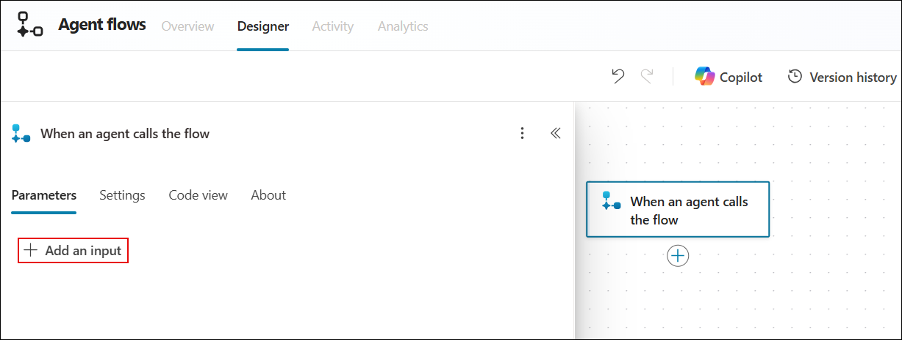

1. In the **Parameters** section, under **Choose the type of user input**, select **Text** to add a text input parameter.

   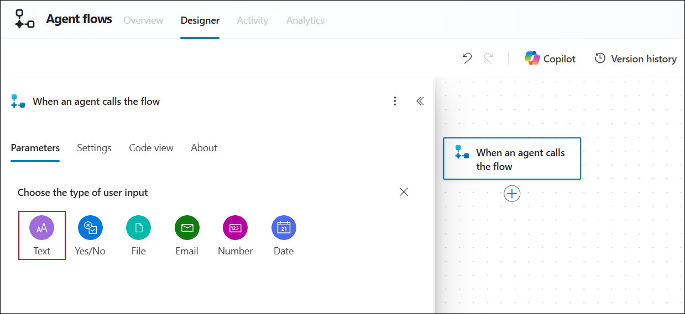

1. In the **Parameters** section, enter **employeeEmail (1)** as the name of the input parameter. Click **Add an input (2)** to define an additional parameter.

   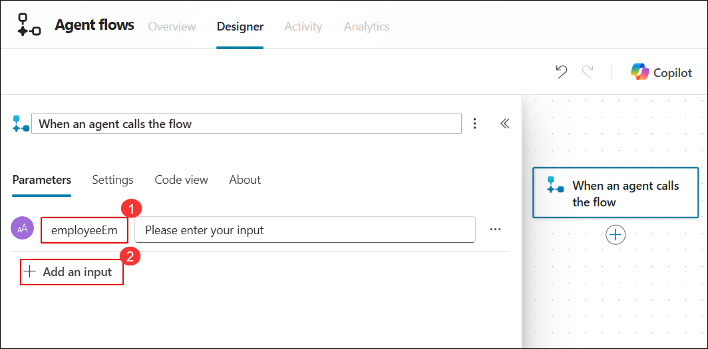

1. In the **Parameters** section, follow the same steps used for **employeeEmail** to add the following input parameters and click **Add an input (6)**:
   - **employeeName (1)**  
   - **leaveType (2)**  
   - **reason (3)**  
   - **durationDays (4)**  
   - **Balance (5)**  

      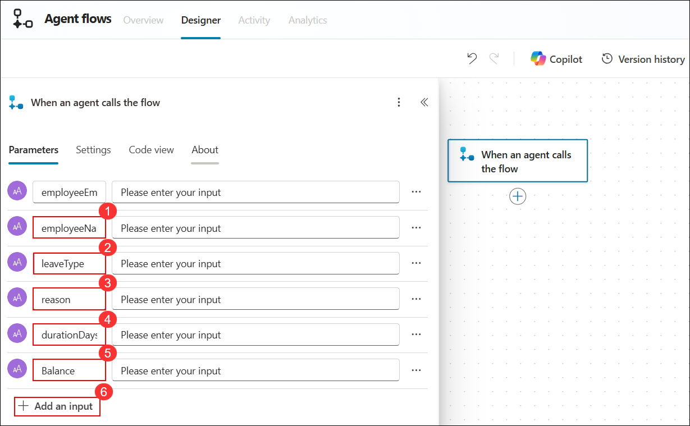

1. In the **Choose the type of user input** dialog, select **Date** to add a date input parameter.

   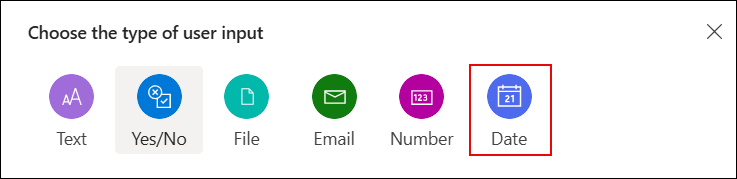

1. In the **Parameters** section, add two date input parameters:  
   - **StartDate (1)**  
   - **endDate (2)**  

      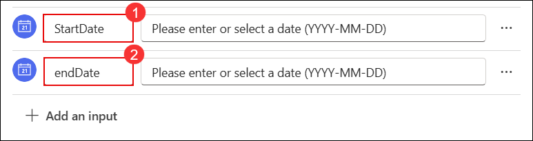

1. After adding the required inputs, the **Parameters** section should look as shown below, with the following fields: 

   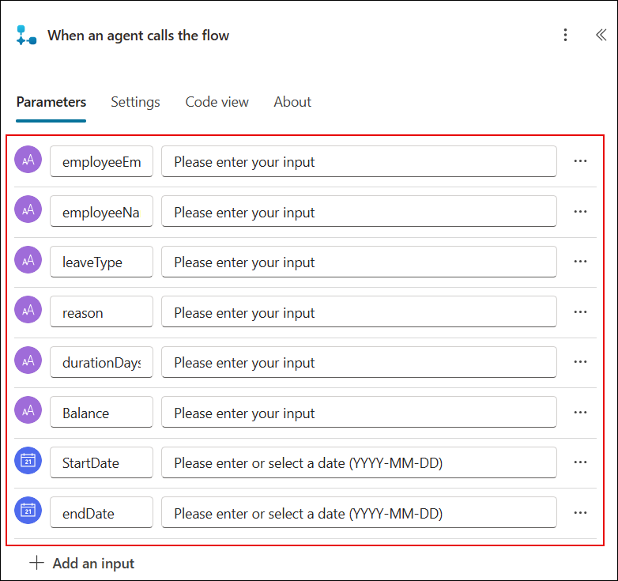

1. On the **Designer** canvas, click the **plus (+) icon (1)** to add an action. In the **Add an action** dialog, type **Add a new row (2)** in the search bar. Under **Microsoft Dataverse (3)**, select **Add a new row (4)**.

   

1. In the **Add a new row** action, select **Leave Request (1)** from the **Table name** drop-down. Expand the **Advanced parameters (2)** section to map the input fields with the parameters created earlier.

   

1. In the **Add a new row** action, under **Advanced parameters**, select the following fields to map with the input parameters:  

   - **balance_days**  
   - **duration_days**  
   - **employee_email**  
   - **employee_name**  
   - **end_date**  
   - **leave_type**  
   - **reason**  
   - **start_date**  
   - **status**  

      

1. In the **Add a new row** action, under **Balance_days**, type **/** (1) and then click **Insert expression (2)** to add an expression.

   

1. On the **Add a row** page, in the **Balance_days** field:  
   - Select the **Dynamic content (1)** tab.  
   - In the search bar, type **balance (2)**.  
   - From the results, select **Balance (3)**.  
   - Click **Add (4)** to confirm.  

      

1. On the **Add a row** page, in the **Duration_days** field:  
   - Type **/** (1).  
   - Select **Insert expression (2)** from the menu.  

      

1. In the expression editor:  
   - Select **Dynamic content (1)**.  
   - Type **duration (2)** in the search bar.  
   - Choose **durationDays (3)** under *When an agent calls the flow*.  
   - Click **Add (4)** to insert it.  

      

1. Now map the remaining parameters to the Dataverse fields as shown in the table below.

   | Field Name      |   Choose                                   |
   |-----------------|--------------------------------------------|
   | Employee_email  | Select **employeeEmail** |
   | Employee_name   | Select **employeeName**  |
   | End_date        | Select **endDate**       |
   | Leave_type      | Select **Casual** as a static value         |
   | Reason          | Select **reason**        |
   | Start_date      | Select **StartDate**     |
   | Status          | Select **Pending** as a static value        |

   - **Note:** For fields with dynamic values, select them from the **Dynamic content** panel.  

   - **Note:** For fields marked **static value**, select the value directly.  

      

1. Once done, click on **Save Draft** option from top to save the flow in current state, you will updating this flow in coming excerises to add approval flow.

   

## Task 3: Create topic for leave application

1. On the **Leave Management Agent** page, select the **Topics (1)** tab. Click **Add a topic (2)** and then choose **From blank**.  

   

1. On the **Test your agent** pane, click the **Close (X)** button to close the testing window and make the canvas larger for easier workflow design.

   

1. In the **Trigger** node, enter a description for the topic (1), for example: *This topic is used by employees to apply leaves*. Then click the **plus (+) icon (2)** to add the next step in the topic flow.

   

1. In the **Topic editor**, from the options displayed, select **Ask a question** to add a question node to the flow.

   

1. In the **Question** node, enter `Please choose the Leave type from the list` **(1)** as the question text. Under **Identify**, select **Multiple choice options (2)**, and then click **+ New option (3)** to start adding choices.

   

1. In the **Options for user** section, type **Casual (1)** as the first leave type. Then click **+ New option (2)** to add another choice.  

   

1. Click on **+ New option** again as in the previous step, and add the leave types **Emergency** and **Unpaid**.   

   

1. In the **Save user response as** field, ensure that a variable such as **Var1 (1)** is automatically populated. On the right-side **Variable properties** pane  

   

   **Note:** If no variable is automatically populated (for example, **Var1** is missing), try refreshing the page or opening the flow in a new incognito window and perform the step again. Once successful, it should appear as shown in the image above.

      

1. In the **Save user response as** field, enter **leave_type (1)** as the variable name. On the right-side **Variable properties** pane, confirm that the **Variable name** is also set to **leave_type (2)**.

   

1. In the **Topics** designer, under **All other conditions**, click the **plus (+) icon** to add the next step in the flow. 

   

1. Click the **plus icon (1)** and select **Send a message (2)** from the menu.

   

1. In the **Message** action, type `Please choose an option from the list` **(1)** in the text box. Then click the **plus icon (2)** below to add the next step.  

   

1. From the **Message** node, open the action menu. Select **Topic management (1)** and then choose **Go to step (2)** to redirect the conversation flow.

   

1. After selecting **Go to step**, choose the **Question** node **(where the leave type options are defined)** to **loop the flow back to the beginning** in case users select any other option.

   

1. In the **Topics** designer, click the **plus (+) icon** below the condition branches to continue building the flow for each leave type path.

   

1. From the action menu, select **Ask a question** to prompt the user for additional information in the flow.

   

1. In the **Question** node, enter the prompt `Please provide your leave Start Date (Please make sure to provide in yyyy-mm-dd format)` **(1)** to capture the start date from the user.

   

1. In the **Question** node, under **Identify**, click **Multiple choice options (2)** and select **User's entire response (3)** so that the agent saves the response exactly as the user enters it.

   

1. In the **Save user response as** field, enter **StartDate (1)** as the variable name. On the **Variable properties** pane, confirm the **Variable name (2)** is set to **StartDate**.

   

1. Below the **Question** node, click the **plus (+) icon** to add the next step in the flow. 

   

1. From the menu, select **Ask a question** to prompt the user for additional input.   

   

1. On the **Question** node, configure it to capture the end date of the leave:  
- Enter the message `Please provide your leave End Date (Please make sure to provide in yyyy-mm-dd format)` in the text box **(1)**.  
   - Under **Identify**, select **User's entire response (2)**.  
   - In **Save user response as**, enter **EndDate (3)**.  
   - In the **Variable properties** pane, confirm the variable name is set as **EndDate (4)**. 

      

1. Below the **EndDate** question node, click the **plus (+) icon** to add the next step in the flow.

   

1. Below the **EndDate** question node, click the **plus (+) icon** and select **Ask a question** to add the next prompt in the flow. 

   

1. On the **Question** node:  
   - Enter the prompt `May I please know the reason for your leave?` **(1)**.  
   - Under **Identify**, select **User's entire response (2)**.  
   - In **Save user response as**, set the variable name to **reason (3)**.  
   - Verify in the **Variable properties** pane that the variable name is correctly set as **reason (4)**, then close the properties pane **(5)**.  

      

1. Below the **reason** question node, click the **plus (+) icon** to add the next step in the flow.  

   

1. In the **Question** node after capturing the reason, click **Add a tool (1)**. From the list of available tools, select **Leave Validation Flow (2)** to connect the flow with the validation process. 

   

1. On the **Authoring canvas**, click **Variables (1)** from the top menu. Under the **Browse (2)** tab, expand the **Topic (3)** section and select all the listed variables by checking the boxes **(4)**.   

   

1. On the **Power Automate inputs** card, click the **ellipsis (…) (1)** next to the **startDate** field. From the **Select a variable** pane, choose **StartDate (2)** to map the variable.

   

1. On the **Power Automate inputs** card, click the **ellipsis (…) (1)** next to the **endDate** field. From the **Select a variable** pane, choose **EndDate (2)** to map the variable. 

   

1. On the **Power Automate inputs** card:  
   - Click the **ellipsis (…) (1)** next to the **employeeEmail** field.  
   - In the **Select a variable** pane, switch to the **System (2)** tab.  
   - Search for **User.Email (3)**.  
   - Select **User.Email (4)**.  

      

1. At the top-right corner of the page, click **Save** to store the changes made to the topic.  

   

1. In the **Save your topic** dialog:  
   - Enter the topic name as **leave_request (1)**.  
   - Click **Save (2)** to confirm and store the topic.  

      

1. You have successfully created a basic agent that collects details and validates leave requests. In the upcoming exercises, we will enhance the agent by adding approval logic and conditional workflows to make it more advanced and capable.

## Summary

In this exercise, you created a Copilot Studio agent that served as the foundation for your store operations assistant. You defined the agent’s purpose by assigning it a name and description, and connected it to key knowledge sources such as the product catalog, store policy documents, and website content. These steps enabled the agent to deliver relevant, AI-powered responses based on indexed information.

### You have successfully completed this exercise, please continue to next one >>

   