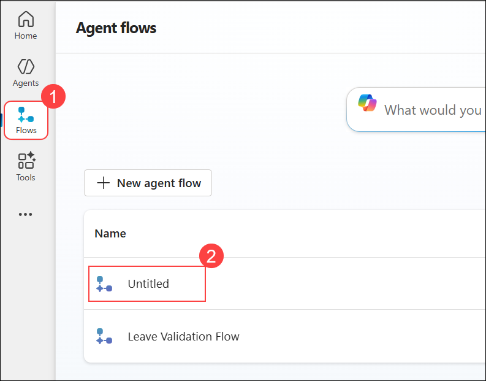
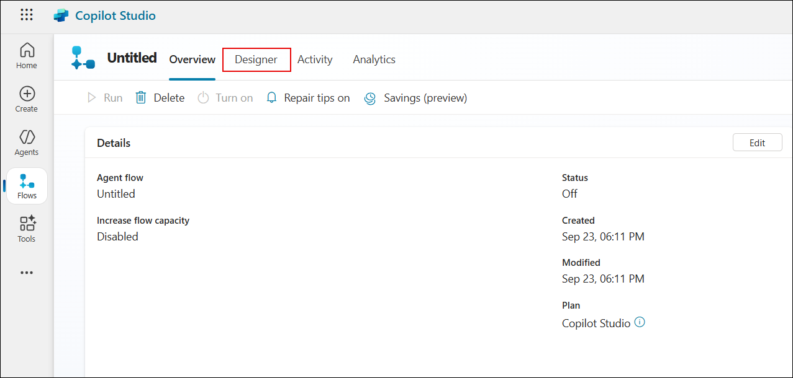
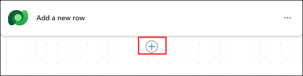
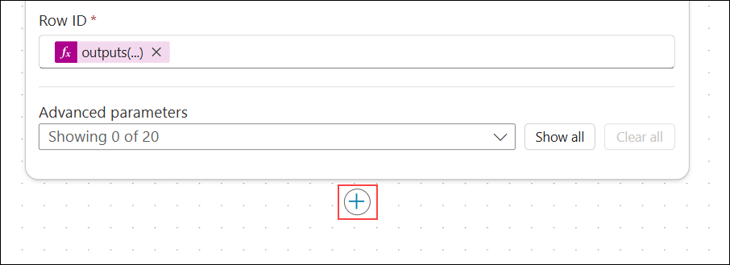
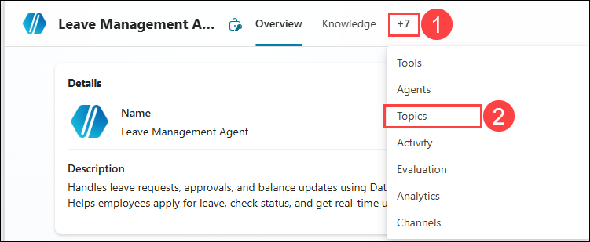

# Exercise 3: Power Automate Approval Workflow 

### Estimated Duration: 40 Minutes

## Overview

In this exercise, you will continue building the leave management agent by adding more advanced capabilities. You will implement approval logic based on company policy: if the leave duration is two days or less, it will be automatically approved. Otherwise, it will go through an approval process. Once approved, the leave request will be finalized and recorded.

## Objectives

You will be able to complete the following tasks:

- Task 1: Create Approval Flow

- Task 2: Update Dataverse

- Task 3: Complete leave request topic 

### Task 1: Create Approval Flow

In this task, you will enhance the Leave Management Workflow by incorporating approval logic and advanced management features to handle leave requests more efficiently.

1. On the **Copilot Studio** page, select **Flows (1)** from the left navigation menu, and then click on the **Untitled (2)** flow to open and edit it.

     

1. On the **Untitled** flow page, click the **Designer** tab to begin editing the flow.

     

1. On the **Designer** canvas, click the **plus (+) icon (1)** to add a new action.

     

1. In the **Add an action** dialog, type **Condition (2)** in the search bar and select **Condition (3)** under the **Control** section

     

1. In the **Condition** pane, type **/** in the field (1) and select **Insert expression (2)** from the dropdown list.

     

1. In the **Expression** editor, type **int() (1)** and keep the cursor inside the parentheses, select **Dynamic content (2)**, search for **durationDays (3)**, and then select **durationDays (4)**.

     

1. In the **Expression** editor, verify that the expression is set **(1)**. Once done, click **Add (2)** to insert it into the condition. 

     

   > **Note:** The expression reference (for example, `triggerBody()?['text_4']`) may vary depending on the order in which inputs are added in the **When an agent calls the flow** step. The number (`text_4`, `text_5`, etc.) is auto-generated

1. In the **Condition** action, select **is less or equal to (1)** from the operator dropdown.

     

1. In the **Condition** action, enter **2** in the value field.

     

1. In the **Condition** action, under the **False** branch, click the **plus (+) icon**.

     

1. In the **Add an action** dialog, type **Start and wait for an approval (1)** in the search bar and select **Start and wait for an approval (2)** under **Standard approvals**.

     

1. In the next pane, click on **Create new**.

     

1. In the **Start and wait for an approval** action, configure the parameters:  
   - From the **Approval type** drop-down, select **Approve/Reject - Everyone must approve (1)**.  
   - In the **Title** field, enter **Leave Approval (2)**.  
   - In the **Assigned to** field, type the email address <inject key="AzureAdUserEmail"></inject> **(3)** and select the matching account from the suggestions **(4)**. 

        

1. In the **False** branch after the approval node, click the **plus (+) icon**.

     

1. In the **Add an action** pane, search for **Condition (1)**, and then select **Condition (2)**.

     

1. In the **Condition 1** action, configure the condition as follows:  
   - Select **Outcome (1)** from the dynamic content.  
   - From the operator drop-down, select **is equal to (2)**.  
   - In the value field, enter **Approve (3)**. 

      ```
      outputs('Start_and_wait_for_an_approval')?['body/outcome']
      ``` 

        

      > This condition evaluates whether the leave request has been approved by retrieving the response from the previous approval step.

1. In the **False** branch, select the **+** icon.

     

1. In the **Add an action** pane, search for **Skills (1)**, and then select **Respond to the agent (2)**.

     

1. In the **Respond to the agent** action, select **Add an output**.

     

1. In the **Respond to the agent** action, select **Text** as the output type.

     

1. In the **Respond to the agent** action, set the output name to **reply (1)** and enter **the request is rejected (2)** as the response message.

     

1. In the **False** branch, after the **Respond to the agent** action, click the **plus (+) icon (1)** to add a new action.  

     

1. In the **Add an action** pane, search for **Terminate (1)**, and then select **Terminate (2)**.

     

1. In the **Terminate** action, set the **Status** field to **Succeeded** to complete the workflow after rejection.

     

### Task 2: Update Dataverse

In this task, you will update the flow to modify the Dataverse table, changing the leave request status from 'Pending' to 'Approved' based on the defined conditions.

1. Now click the **plus (+) icon (1)** to add a new action for the root node.   

     

1. In the **Add an action** pane, search for **Update a row (1)**, and then select **Update a row (2)**.  

     

1. In the **Update a row** action, select **Leave Request (1)** for **Table name**, enter **/** in the **Row ID (2)** field, and then select **Insert expression (3)**.

     

1. In the **Expression** editor, enter the following expression in **(1)**, and then select **Update (2)**:

     ```
     outputs('Add_a_new_row')?['body/<logical_ID>_leaverequestid']
     ``` 

     

     > **Note:** The **Logical_ID** here refers to the ID that you have copied in the first exercise from power apps portal.

1. In the **Update a row** action, select the **+** icon. 

     

1. In the **Add an action** pane, search for **Skills (1)**, and then select **Respond to the agent (2)**. 

     

1. In the **Respond to the agent 1** action, select **Add an output**.

     

1. In the **Respond to the agent 1** action, select **Text** as the output type.

     

1. Enter the message **Your leave is approved from [start_date] to [end_date] (2)** and paste the provided expressions for **start_date** and **end_date**.

   ```
   outputs('Add_a_new_row')?['body/<Logical_ID>_startdate']
   ``` 

   ```
   outputs('Add_a_new_row')?['body/<Logical_ID>_enddate']
   ``` 

     

   > **Note**: The **Logical_ID** here refers to the ID that you have copied in the first exercise from power apps portal.

1. The completed flow should now look like the following:

   - The flow starts with **When an agent calls the flow**.  
   - A new record is created in the **Leave Request** table using **Add a new row**.  
   - A **Condition** checks the leave duration.  
   - If **True**, the process continues.  
   - If **False**, the flow triggers **Start and wait for an approval**.  
      - Inside this branch, another **Condition** validates the approval outcome.  
         - If **Approved**, the flow updates the leave record with status **Approved** and sends a response back to the agent.  
         - If **Rejected**, the flow responds to the agent that the request is rejected and then terminates successfully.  
   - The final steps include **Update a row** to mark approval in Dataverse, followed by a confirmation response through **Respond to the agent 1**. 

1. At the top-right corner of the flow designer, click **Publish** to save and activate your flow.

     

1. On the top menu, click **Overview** to return to the flow overview page after publishing.

     

1. On the **Overview** page, under the **Details** section, click **Edit** to update the flow details such as the name and description.

     

1. In the **Details** pane, enter **Leave Management Workflow (1)** in the **Flow name** field. Then, click **Save (2)** to apply the changes.  

     

<validation step="786e3497-70e3-44d4-997f-45095642a4af" />
 
> **Congratulations** on completing the task! Now, it's time to validate it. Here are the steps:
> - Hit the Validate button for the corresponding task. If you receive a success message, you can proceed to the next task. 
> - If not, carefully read the error message and retry the step, following the instructions in the lab guide.
> - If you need any assistance, please contact us at cloudlabs-support@spektrasystems.com. We are available 24/7 to help.

### Task 3: Complete leave request topic

In this task, you will complete the leave request topic by implementing the logic to add new leave requests and update existing records in Dataverse with the request details.

1. On the **Copilot Studio** page, select **Agents (1)** from the left navigation menu and click **Leave Management Agent (2)**.

     

1. Please click on **+** as shown below to expand the menu and then select **Topics** from the list.

     

1. On the **Outputs (2)** section, click the **plus (+) icon** to add the next step in the flow. **(1)**

     

1. On the **Outputs (2)** section, click **Add a tool (1)** and select **Leave Management Workflow (2)** from the list of tools. 

     

1. On the **Authoring canvas**, click **Variables (1)** from the top menu. Under the **Browse (2)** tab, expand the **Topic (7) (3)** section and select the **reply (4)** variable by checking the box.   

     

     > If you are not able to see the variables option, please click on **...** menu and select **Variables**

      

1. On the **Action** card, set the value for **employeeEmail (String)**:  
    - Click the **ellipsis (…) (1)**.  
    - In the **Select a variable** panel, go to the **System (2)** tab.  
    - Search for **User.Email (3)**.  
    - Select **User.Email (4)** from the results.  

        

1. On the **Action** card, set the value for **employeeName (String)**:  
    - Click the **ellipsis (…) (1)**.  
    - In the **Select a variable** panel, go to the **System (2)** tab.  
    - Search for **User.FirstName (3)**.  
    - Select **User.FirstName (4)** from the results. 

        

1. On the **Action** card, set the value for **leaveType (String)**:  
    - Click the **ellipsis (…) (1)**.  
    - In the **Select a variable** panel, switch to the **Formula (2)** tab.  
    - Enter the formula **Text(Topic.leave_type) (3)**.  
    - Click **Insert (4)** to apply the formula.  

        

1. On the **Action** card, set the value for **reason (String)**:  
    - Click the **ellipsis (…) (1)**.  
    - In the **Select a variable** panel, choose the **Custom (2)** tab.  
    - Select **reason (Topic.reason) (3)** from the list.  

        

1. On the **Action** card, set the value for **durationDays (String)**:  
    - Click the **ellipsis (…) (1)**.  
    - In the **Select a variable** panel, go to the **Custom (2)** tab.  
    - Select **duration (Topic.duration) (3)** from the list.  

        

1. On the **Action** card, set the value for **balance (String)**:  
    - Click the **ellipsis (…) (1)**.  
    - In the **Select a variable** panel, go to the **Custom (2)** tab.  
    - Select **balance (Topic.balance) (3)** from the list.  

        

1. On the **Action** card, set the value for **startDate (String)**:  
    - Click the **ellipsis (…) (1)**.  
    - In the **Select a variable** panel, go to the **Custom (2)** tab.  
    - Select **startDate (Topic.startDate) (3)** from the list.  

        

1. On the **Action** card, set the value for **endDate (String)**:  
    - Click the **ellipsis (…) (1)**.  
    - In the **Select a variable** panel, go to the **Custom (2)** tab.  
    - Select **endDate (Topic.endDate) (3)** from the list.  

        

1. On the **Outputs (1)** section, click the **plus icon (1)** and select **Send a message (2)**. 

     

1. On the **Message** step:  
    - Click on the **variable icon (1)**.  
    - In the **Select a variable** pane, choose the **Custom (2)** tab.  
    - Type **reply (3)** in the search box.  
    - Select **reply (4)** from the results. 

        

1. On the **Message** step, click the **plus (+) icon** to add the next action in the flow. 

     

1. On the **Message** step, expand the options and select **Topic management (1)**, then click **End conversation (2)** to close the flow. 

     

1. At the top-right corner of the page, click **Save** to store the changes made to the topic.  

     

1. You have successfully completed the creation of the agent. It is now fully equipped with all intended capabilities and will be ready for testing in the next task.

## Summary

In this exercise, you continued building the leave management agent by adding advanced capabilities. You implemented approval logic based on company policy: leaves of two days or less were automatically approved, while longer leaves went through an approval process. Once approved, the leave requests were finalized and recorded.

### You have successfully completed this exercise. Please continue to the next one >>

   
