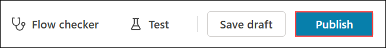
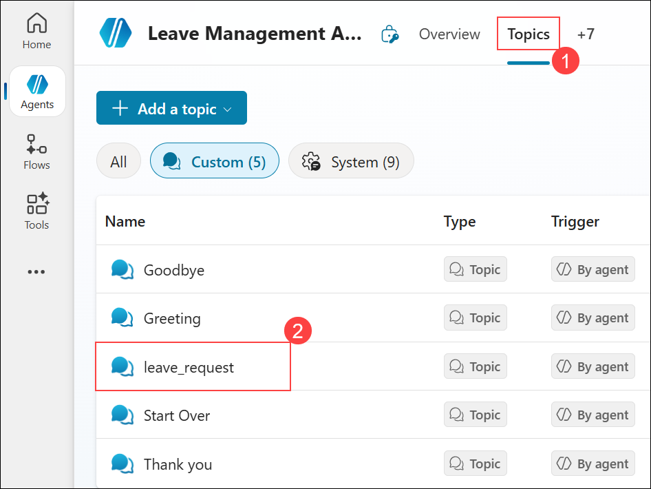
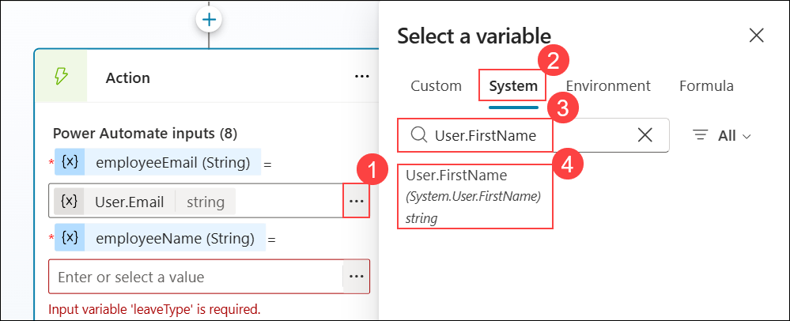

# 演習 3: Power Automate 承認ワークフロー

### 推定所要時間: 40 分

## 概要

この演習では、休暇管理エージェントを引き続き構築し、より高度な機能を追加します。会社のポリシーに基づいた承認ロジックを実装します。2 日以内の休暇は自動承認されます。それ以外の場合は承認プロセスを通じます。承認された後は、休暇申請が確定されて記録されます。

## 目標

次のタスクを完了できるようになります。

- タスク 1: 承認フローの作成

- タスク 2: Dataverse の更新

- タスク 3: 休暇申請トピックの完成

### タスク 1: 承認フローの作成

このタスクでは、承認ロジックと高度な管理機能を組み込んで Leave Management Workflow を強化し、休暇申請をより効率的に処理します。

1. **Copilot Studio** ページで、左側のナビゲーション メニューから **[フロー] (1)** を選択し、**[Untitled] (2)** フローをクリックして開いて編集します。

     

1. **[Untitled]** フロー ページで、**[デザイナー]** タブをクリックしてフローの編集を開始します。

     

1. **デザイナー** キャンバスで、**プラス (+) アイコン (1)** をクリックして新しいアクションを追加します。

     

1. **[アクションの追加]** ダイアログで、検索バーに **条件 (2)** と入力して、**[コントロール]** セクションで **[条件] (3)** を選択します。

     

1. **[条件]** ウィンドウで、フィールド (1) に **/** と入力して、ドロップダウン リストから **[式の挿入] (2)** を選択します。

     

1. **[式]** エディターで、**int() (1)** と入力して括弧の内側にカーソルを置き、**[動的コンテンツ] (2)** を選択し、**durationDays (3)** を検索して **durationDays (4)** を選択します。

     

1. **[式]** エディターで、式が設定されていることを確認 **(1)** します。完了したら、**[追加] (2)** をクリックして条件に挿入します。

     

     > **注:** 式の参照 (例えば `triggerBody()?['text_4']`) は、**[エージェントがフローを呼び出したとき]** ステップで入力が追加された順序によって异なる場合があります。番号 (`text_4`、`text_5` など) は自動生成されます。

1. **[条件]** アクションで、演算子のドロップダウンから **[以下または等しい] (1)** を選択します。

     

1. **[条件]** アクションの値フィールドに **2** と入力します。

     

1. **[条件]** アクションの **False** ブランチで、**プラス (+) アイコン**をクリックします。

     

1. **[アクションの追加]** ダイアログで、検索バーに **承認を開始して待機する (1)** と入力して、**[標準承認]** の下で **[承認を開始して待機する] (2)** を選択します。

     

1. 次のウィンドウで、**[新規作成]** をクリックします。

     

1. **[承認を開始して待機する]** アクションでパラメーターを構成します。
     - **[承認の種類]** ドロップダウンから **[承認/拒否 - 全員が承認する必要がある] (1)** を選択します。
     - **[タイトル]** フィールドに **Leave Approval (2)** と入力します。
     - **[担当者]** フィールドにメール アドレス <inject key="AzureAdUserEmail"></inject> **(3)** を入力し、候補 **(4)** から一致するアカウントを選択します。

          

1. **False** ブランチの承認ノードの後で、**プラス (+) アイコン**をクリックします。

     

1. **[アクションの追加]** ウィンドウで、**条件 (1)** を検索し、**[条件] (2)** を選択します。

     

1. **[条件]** アクションで、値フィールド **(1)** に **/** と入力して、**[式の挿入] (2)** を選択します。

     

1. 式エディターで、エディター ボックス **(1)** に式を貼り付け、必要に応じて **[動的コンテンツ] (2)** を選択して、**[追加] (3)** をクリックします。

     ```
     outputs('Start_and_wait_for_an_approval')?['body/outcome']
     ``` 

     

1. **[条件 1]** アクションで、演算子を **[等しい] (1)** に設定し、**Approve (2)** と入力します。

     

     > この条件は、前の承認ステップから応答を取得することで、休暇申請が承認されたかどうかを評価します。

1. **False** ブランチで、**+** アイコンを選択します。

     

1. **[アクションの追加]** ウィンドウで、**Skills (1)** を検索し、**[エージェントへの応答] (2)** を選択します。

     

1. **[エージェントへの応答]** アクションで、**[出力の追加]** を選択します。

     

1. **[エージェントへの応答]** アクションで、出力の種類として **[テキスト]** を選択します。

     

1. **[エージェントへの応答]** アクションで、出力名を **reply (1)** に設定し、応答メッセージとして **The request is rejected (2)** と入力します。

     

1. **False** ブランチで、**[エージェントへの応答]** アクションの後にある**プラス (+) アイコン (1)** をクリックして新しいアクションを追加します。

     

1. **[アクションの追加]** ウィンドウで、**終了 (1)** を検索し、**[終了] (2)** を選択します。

     

1. **[終了]** アクションで、拒否後にワークフローを完了するため、**[状態]** フィールドを **[成功]** に設定します。

     

### タスク 2: Dataverse の更新

このタスクでは、定義した条件に基づいて休暇申請のステータスを [保留中] から [承認済み] に変更するようにフローを更新します。

1. ルート ノードの**プラス (+) アイコン (1)** をクリックして新しいアクションを追加します。

     

1. **[アクションの追加]** ウィンドウで、**行の更新 (1)** を検索し、**[行の更新] (2)** を選択します。

     

1. **[行の更新]** アクションで、**[テーブル名]** に **Leave Request (1)** を選択し、**[行 ID] (2)** フィールドに **/** と入力して、**[式の挿入] (3)** を選択します。

     

1. **[式]** エディターで、**(1)** に次の式を入力して、**[更新] (2)** を選択します。

     ```
     outputs('Add_a_new_row')?['body/<logical_ID>_leaverequestid']
     ``` 

     

     > **注:** ここでの **Logical_ID** は、演習 1 で Power Apps ポータルからコピーした ID を指します。

1. **[行の更新]** アクションで、**+** アイコンを選択します。

     

1. **[アクションの追加]** ウィンドウで、**Skills (1)** を検索し、**[エージェントへの応答] (2)** を選択します。

     

1. **[エージェントへの応答 1]** アクションで、**[出力の追加]** を選択します。

     

1. **[エージェントへの応答 1]** アクションで、出力の種類として **[テキスト]** を選択します。

     

1. **[エージェントへの応答 1]** アクションで、出力名として **reply (1)** を入力し、値フィールド **(2)** に次のメッセージを入力します。

     ```
     Your leave is approved from [start_date] to [end_date]
     ```

     

1. **[エージェントへの応答 1]** アクションで、**start_date (1)** プレースホルダーを選択して、**fx (2)** オプションを選択します。

     

1. 式エディターで、エディター ボックスに式を貼り付けて、**[追加]** を選択します。

     ```
     outputs('Add_a_new_row')?['body/<Logical_ID>_startdate']
     ``` 

     > **注**: ここでの **Logical_ID** は、演習 1 で Power Apps ポータルからコピーした ID を指します。

1. **[エージェントへの応答 1]** アクションで、**end_date (1)** プレースホルダーを選択して、**fx (2)** オプションを選択します。

     

1. 式エディターで、エディター ボックス **(1)** に式を貼り付けて、**[追加] (2)** を選択します。

     ```
     outputs('Add_a_new_row')?['body/<Logical_ID>_enddate']
     ``` 

     

     > **注**: ここでの **Logical_ID** は、演習 1 で Power Apps ポータルからコピーした ID を指します。

1. 完成したフローは次のようになります。

   - フローは **[エージェントがフローを呼び出したとき]** から開始します。
   - **[新しい行の追加]** を使用して **Leave Request** テーブルに新しいレコードを作成します。
   - **[条件]** で休暇期間を確認します。
   - **True** の場合は処理を続けます。
   - **False** の場合は **[承認を開始して待機する]** フローがトリガーされます。
      - このブランチ内で、別の **[条件]** が承認結果を検証します。
         - **[承認済み]** の場合は、フローが Dataverse の休暇レコードを承認済み状態に更新し、エージェントに確認応答を返します。
         - **[拒否]** の場合は、フローが申請は拒否されたとエージェントに応答し、正常終了します。
   - 最終ステップには、**[行の更新]** で Dataverse の承認をマークし、**[エージェントへの応答 1]** で確認応答を返す処理が含まれます。

1. フロー デザイナーの右上隅で **[発行]** をクリックして、フローを保存して有効化します。

     

1. **[概要] (1)** ページで **[編集] (2)** を選択します。

     

1. **[詳細]** ウィンドウで、**[フロー名] (1)** フィールドに **Leave Management Workflow** と入力し、**[保存] (2)** をクリックして変更を適用します。

     

<validation step="786e3497-70e3-44d4-997f-45095642a4af" />
 
> **タスクの完了おめでとうございます！** 次は検証の時間です。手順は次のとおりです。
> - 対応するタスクの検証ボタンをクリックします。成功のメッセージが表示されたら、次のタスクに進むことができます。
> - 表示されない場合は、エラー メッセージをよく読み、ラボ ガイドの手順に従ってステップを再試行してください。
> - サポートが必要な場合は、cloudlabs-support@spektrasystems.com までお問い合わせください。24 時間 365 日対応しています。

### タスク 3: 休暇申請トピックの完成

このタスクでは、新しい休暇申請を追加し、Dataverse の既存レコードを申請詳細で更新するロジックを実装して、休暇申請トピックを完成させます。

1. **Copilot Studio** ページで、左側のナビゲーション メニューから **[エージェント] (1)** を選択し、**[Leave Management Agent] (2)** をクリックします。

     

1. 下図のように **+** をクリックしてメニューを展開し、リストから **[トピック]** を選択します。

     

1. **[トピック] (1)** タブで、**[leave_request] (2)** を選択します。

     

1. **[出力] (2)** セクションで、**プラス (+) アイコン**をクリックしてフローの次のステップを追加します。**(1)**

     

1. **[出力] (2)** セクションで、**[ツールの追加] (1)** をクリックし、ツールのリストから **[Leave Management Workflow] (2)** を選択します。

     

1. **オーサリング キャンバス**で、上部メニューから **[変数] (1)** をクリックします。**[参照] (2)** タブで、**[トピック (7)] (3)** セクションを展開して、チェックボックスをオンにして **reply (4)** 変数を選択します。

     

     > 変数オプションが表示されない場合は、**[...]** メニューをクリックして **[変数]** を選択してください。

      

1. **[アクション]** カードで、**employeeEmail (String)** の値を設定します。
    - **省略記号 (...) (1)** をクリックします。
    - **[変数の選択]** パネルで **[システム] (2)** タブに移動します。
    - **User.Email (3)** を検索します。
    - 結果から **User.Email (4)** を選択します。

        

1. **[アクション]** カードで、**employeeName (String)** の値を設定します。
    - **省略記号 (...) (1)** をクリックします。
    - **[変数の選択]** パネルで **[システム] (2)** タブに移動します。
    - **User.FirstName (3)** を検索します。
    - 結果から **User.FirstName (4)** を選択します。

        

1. **[アクション]** カードで、**leaveType (String)** の値を設定するには、**省略記号 (...) (1)** を選択し、**[式] (2)** タブを選択し、式 **(3)** を入力して、**[挿入] (4)** を選択します。

     ```
     Text(Topic.leave_type)
     ```

     

1. **[アクション]** カードで、**reason (String)** の値を設定します。
    - **省略記号 (...) (1)** をクリックします。
    - **[変数の選択]** パネルで **[カスタム] (2)** タブを選択します。
    - リストから **reason (Topic.reason) (3)** を選択します。

        

1. **[アクション]** カードで、**durationDays (String)** の値を設定します。
    - **省略記号 (...) (1)** をクリックします。
    - **[変数の選択]** パネルで **[カスタム] (2)** タブに移動します。
    - リストから **duration (Topic.duration) (3)** を選択します。

        

1. **[アクション]** カードで、**balance (String)** の値を設定します。
    - **省略記号 (...) (1)** をクリックします。
    - **[変数の選択]** パネルで **[カスタム] (2)** タブに移動します。
    - リストから **balance (Topic.balance) (3)** を選択します。

        

1. **[アクション]** カードで、**startDate (String)** の値を設定します。
    - **省略記号 (...) (1)** をクリックします。
    - **[変数の選択]** パネルで **[カスタム] (2)** タブに移動します。
    - リストから **startDate (Topic.startDate) (3)** を選択します。

        

1. **[アクション]** カードで、**endDate (String)** の値を設定します。
    - **省略記号 (...) (1)** をクリックします。
    - **[変数の選択]** パネルで **[カスタム] (2)** タブに移動します。
    - リストから **endDate (Topic.endDate) (3)** を選択します。

        

1. **[出力] (1)** セクションで、**プラス アイコン (1)** をクリックし、**[メッセージを送信する] (2)** を選択します。

     

1. **[メッセージ]** ステップで、次を行います。
    - **変数 アイコン (1)** をクリックします。
    - **[変数の選択]** ウィンドウで **[カスタム] (2)** タブを選択します。
    - 検索ボックスに **reply (3)** と入力します。
    - 結果から **reply (4)** を選択します。

        

1. **[メッセージ]** ステップで、**プラス (+) アイコン**をクリックしてフローに次のアクションを追加します。

     

1. **[メッセージ]** ステップで、オプションを展開して **[トピック管理] (1)** を選択し、**[会話を終了する] (2)** をクリックしてフローを閉じます。

     

1. ページ右上隅の **[保存]** をクリックして、トピックへの変更を保存します。

     

1. エージェントの作成が正常に完了しました。次のタスクでテストする準備ができました。

## まとめ

この演習では、休暇管理エージェントに高度な機能を追加しました。会社のポリシーに基づいた承認ロジックを実装しました。2 日以内の休暇は自動承認され、長期の休暇は承認プロセスを通じました。承認後は、休暇申請が確定されて記録されました。

### この演習を正常に完了しました。次の演習に進んでください >>

   
