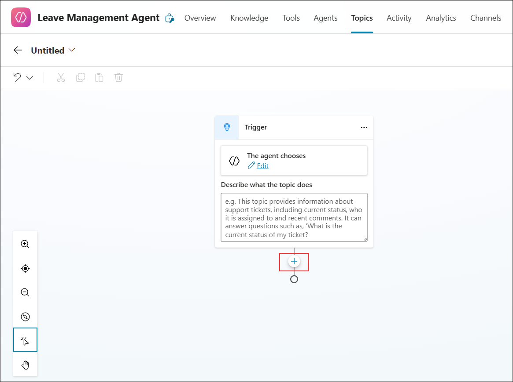
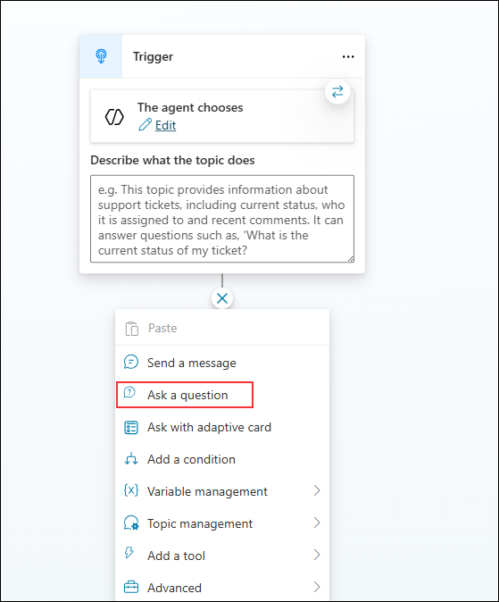

1. On the **Leave Management Agent** page, select the **Topics (1)** tab. Click **Add a topic (2)** and then choose **From blank (3)**.  

   

1. On the **Topic editor** page, click the **plus (+)** icon to add a new node to the flow. 

   

1. In the **Topic editor**, from the options displayed, select **Ask a question** to add a question node to the flow.

   

1. In the **Question** node, enter **Please choose the Leave type from the list (1)** as the question text. Under **Identify**, select **Multiple choice options (2)**, and then click **+ New option (3)** to start adding choices.

   

1. In the **Options for user** section, type **Casual (1)** as the first leave type. Then click **+ New option (2)** to add another choice.  

   

1. Click on **+ New option** again as in the previous step, and add the leave types **Emergency** and **Unpaid**.   

   

1. In the **Save user response as** field, enter **leave_type (1)** as the variable name. On the right-side **Variable properties** pane, confirm that the **Variable name** is also set to **leave_type (2)**.

   

1. You have now successfully added all the necessary data as a knowledge source for this agent.
