# 演習 3: Power Automate 承認ワークフロー

### 推定所要時間: 40 分

## 概要

この演習では、承認後に Dataverse の休暇申請ステータスを変更する [行の更新] アクションを追加して、休暇管理ワークフローを完成させます。フローを発行して名前を変更します。次に、Leave Validation Flow と Leave Management Workflow を接続し、必要なすべての変数をマッピングして、ユーザーへの応答を表示するメッセージ ノードを追加することで、Copilot Studio の leave_request トピックを完成させます。

## 目標

次のタスクを完了できるようになります。

- タスク 1: Dataverse の更新

- タスク 2: 休暇申請トピックの完成

### タスク 1: Dataverse の更新

このタスクでは、定義された条件に基づいて Dataverse テーブルを更新し、休暇申請ステータスを「保留中」から「承認済み」に変更するようにフローを更新します。

1. ルート ノードに新しいアクションを追加するには、**[プラス (+) アイコン] ** をクリックします。

     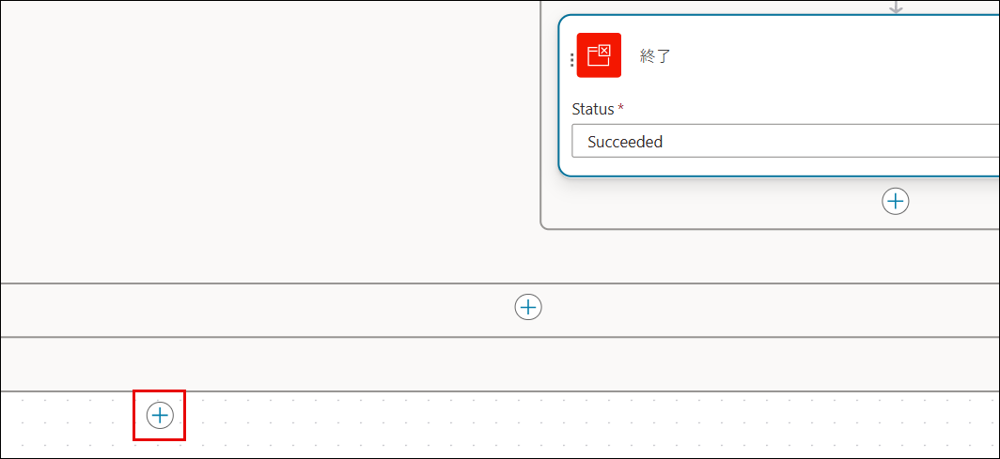

1. **[アクションを追加する]** ウィンドウで **[行の更新] (1)** を検索し、**[行の更新] (2)** を選択します。

     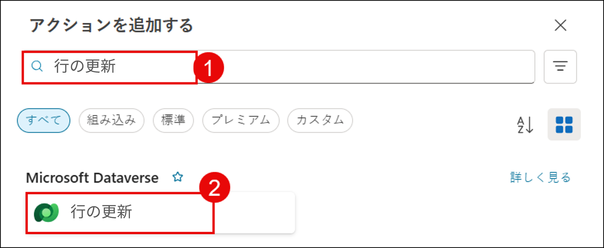

1. **[行の更新]** アクションで、**[テーブル名]** に **Leave Request (1)** を選択し、**[行 ID] (2)** フィールドに **/** と入力して、**[式の挿入] (3)** を選択します。

     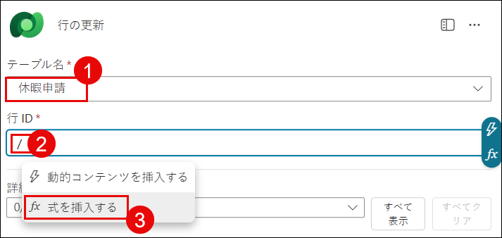

1. **[式]** エディターで、以下の式 **(1)** を入力し、**[更新] (2)** を選択します。

     ```
     last(split(first(split(outputs('新しい行を追加する')?['body/@odata.id'],')')), '('))
     ```

     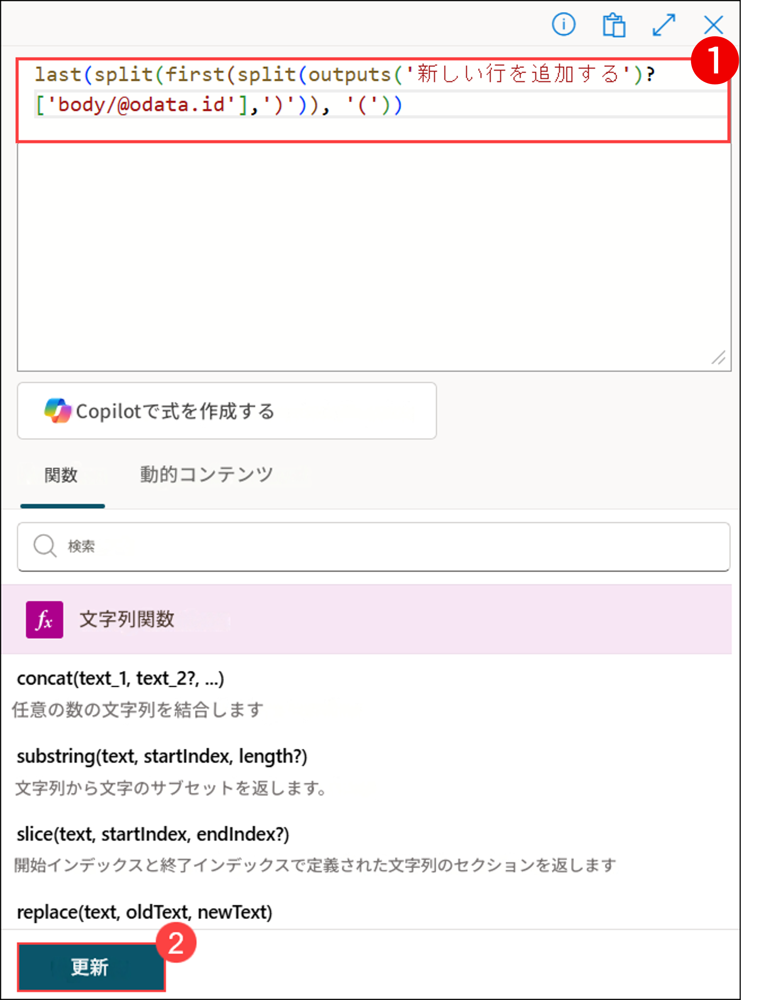

     > **注:** ここでの **Logical_ID** は、最初の演習で Power Apps ポータルからコピーした ID です。

1. **[行の更新]** アクションで、**[+] アイコン**を選択します。

     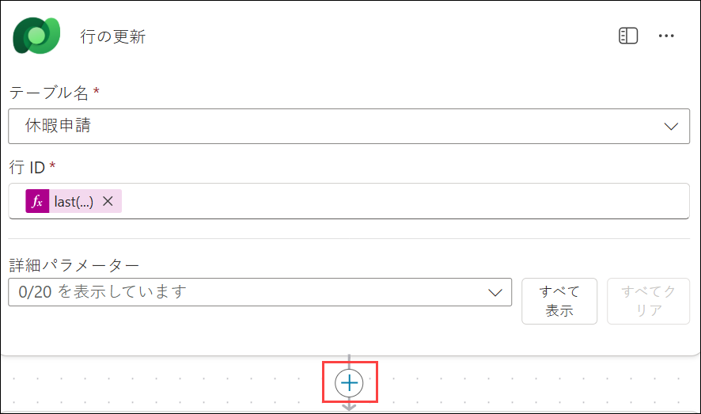

1. **[アクションを追加する]** ウィンドウで **[スキル] (1)** を検索し、**[エージェントに応答する] (2)** を選択します。

     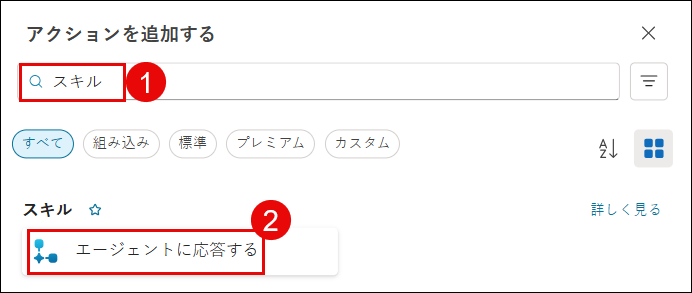

1. **[エージェントに応答する 1]** アクションで、**[出力を追加する]** を選択します。

     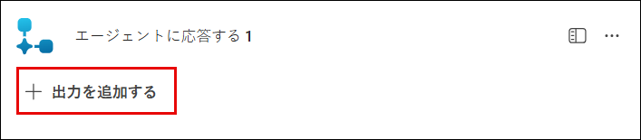

1. **[エージェントに応答する 1]** アクションで、出力の種類として **[テキスト]** を選択します。

     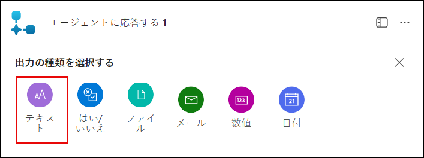

1. **[エージェントに応答する 1]** アクションで、出力名として **reply (1)** を入力し、値フィールドに以下のメッセージ **(2)** を入力します。

     ```
     [start_date] から [end_date] までの休暇が承認されました
     ```

     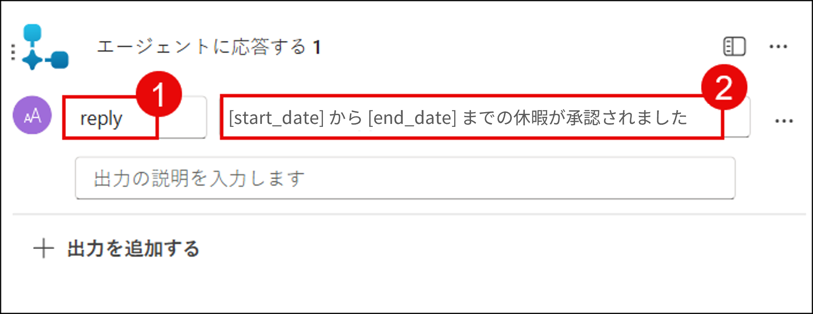

1. **[エージェントに応答する 1]** アクションで、**start_date (1)** プレースホルダーを選択し、**[fx] (2)** オプションを選択します。

     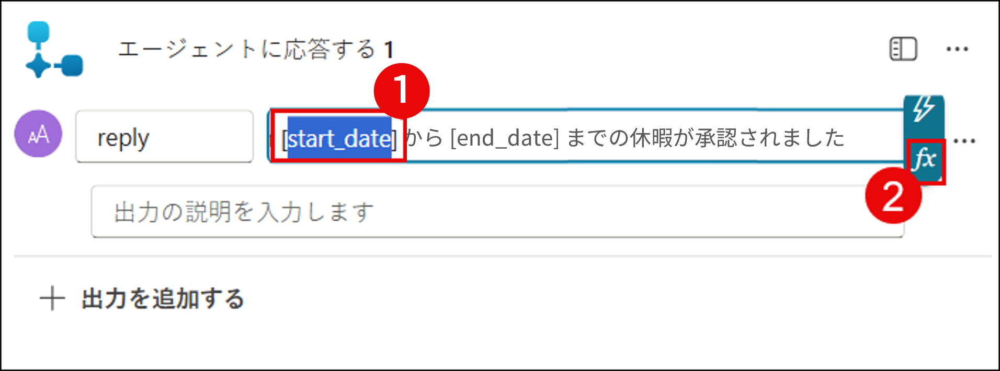

1. 式エディターで、エディター ボックスに式 (1) を貼り付け、**[追加] (2)** を選択します。

     ```
     outputs('新しい行を追加する')? ['body/Logical_Id_start_date']
     ```

     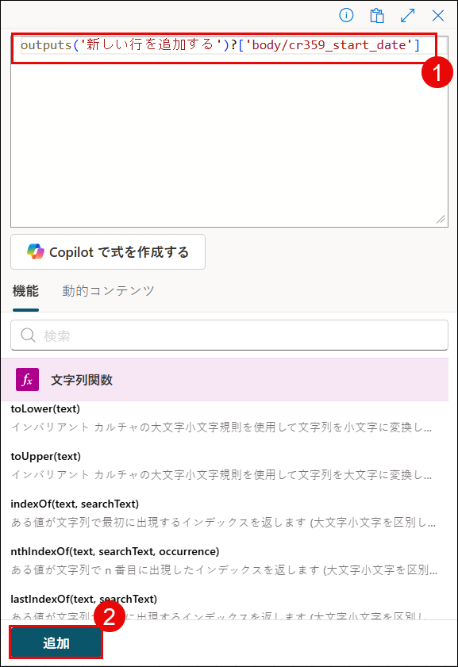

     > **注**: ここでの **Logical_ID** は、最初の演習で Power Apps ポータルからコピーした ID です。

1. **[エージェントに応答する 1]** アクションで、**end_date (1)** プレースホルダーを選択し、**[fx] (2)** オプションを選択します。

     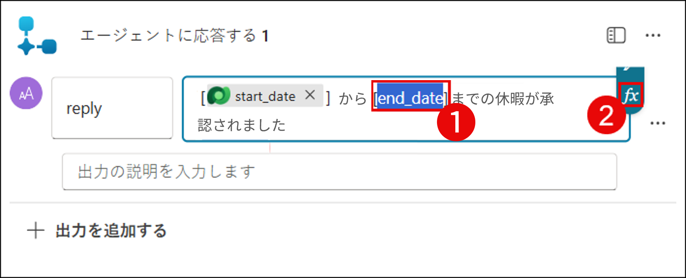

1. 式エディターで、エディター ボックス **(1)** に式を貼り付け、**[追加] (2)** を選択します。

     ```
     outputs('行の更新')?['body/Logical_id_end_date']
     ```

     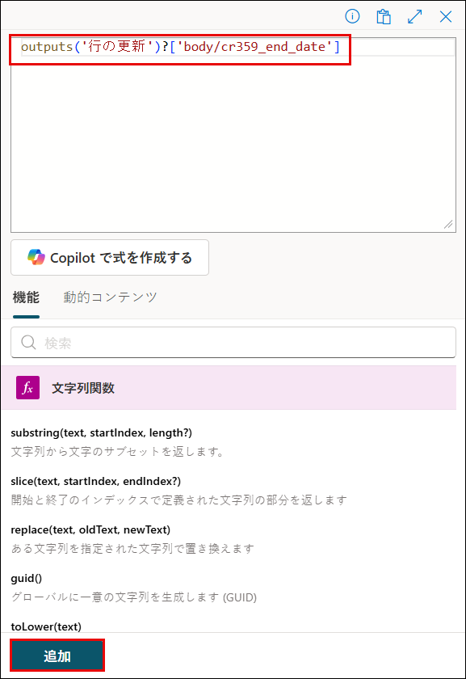

     > **注**: ここでの **Logical_ID** は、最初の演習で Power Apps ポータルからコピーした ID です。

1. **[デザイナー]** ページでフローを確認し、**[公開]** を選択します。

     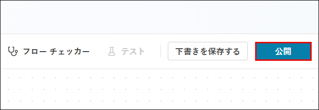

1. **[エージェント フローが正常に発行されました!]** ポップアップで、**[フローに留まる]** を選択します。

1. 上部のメニュー バーで **[概要]** をクリックして、フローの詳細ページに移動します。

     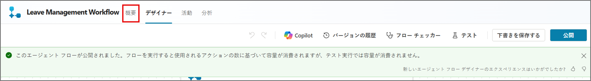

1. **[概要] (1)** ページで **[編集] (2)** を選択します。

     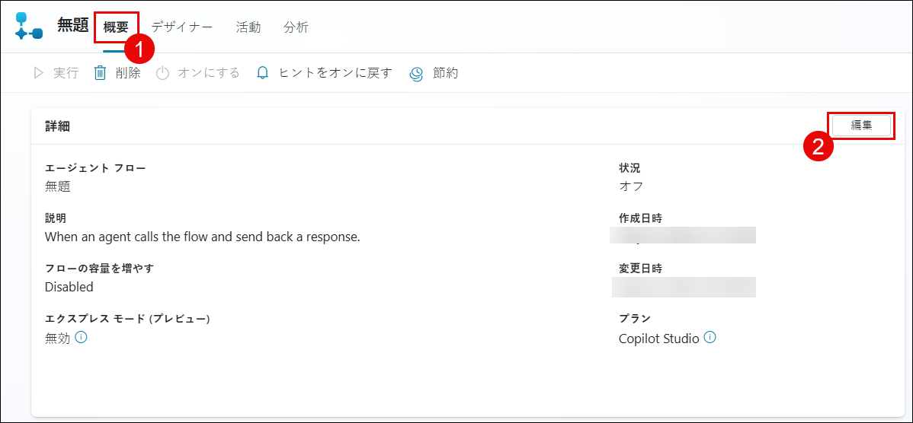

1. **[詳細]** ウィンドウで、**[フロー名] (1)** フィールドに以下の値を入力し、**[保存] (2)** をクリックして変更を適用します。

     ```
     休暇管理ワークフロー
     ```

     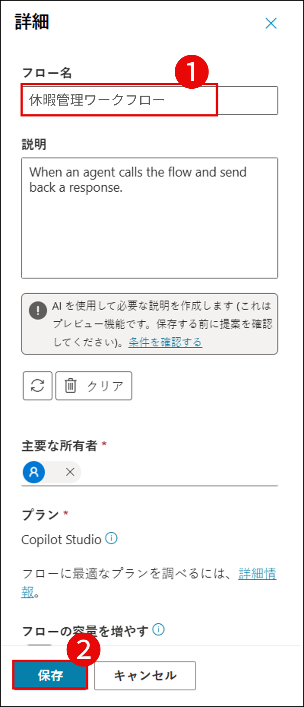

### タスク 2: 休暇申請トピックの完成

このタスクでは、Leave Validation Flow と Leave Management Workflow に接続することで、Copilot Studio の leave_request トピックを完成させます。各フローの入力パラメーターにトピック変数とシステム変数をマッピングし、承認応答をユーザーに表示するメッセージ ノードを追加します。

1. **Copilot Studio** で **[エージェント] (1)** を選択し、**[Leave Management Agent] (2)** を選択します。

     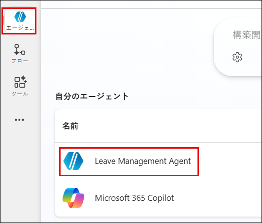

1. **[+7] (1)** を選択し、**[トピック] (2)** を選択します。

     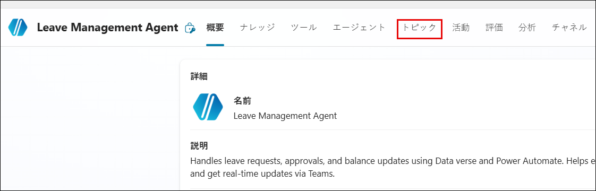

   > **注:** **[トピック]** タブが画面に直接表示されている場合は、**[+7]** をクリックせずに選択できます。

1. **[トピック]** ページで、**leave_request** トピックを選択します。

     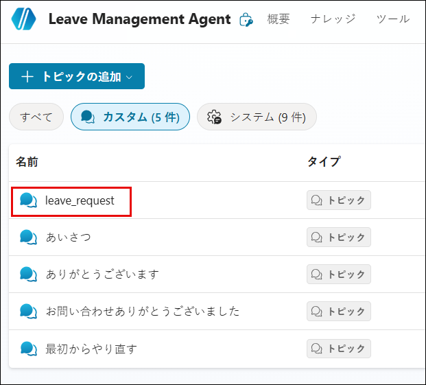

1. トピックの一番下までスクロールし、**reason** 質問ノードの下にある **[プラス (+) アイコン]** を選択してフローの次のステップを追加します。

     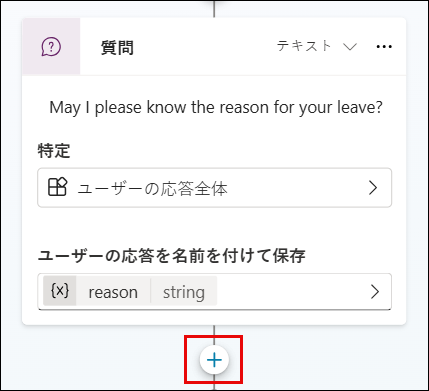

1. **reason** をキャプチャした後の **[質問]** ノードで、**[ツールの追加] (1)** をクリックします。利用可能なツールのリストから **[Leave Validation Flow] (2)** を選択して、フローを検証プロセスに接続します。

     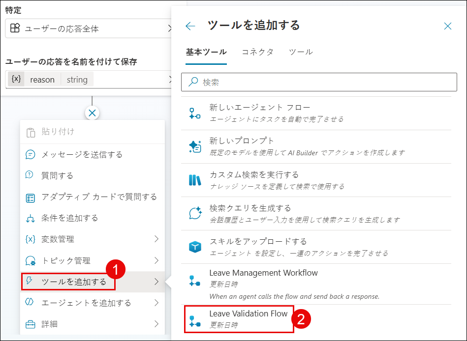

1. **オーサリング キャンバス**で、上部メニューから **[変数] (1)** をクリックします。**[参照] (2)** タブで、**[トピック] (3)** セクションを展開し、チェックボックス **(4)** をオンにしてリストされているすべての変数を選択します。

     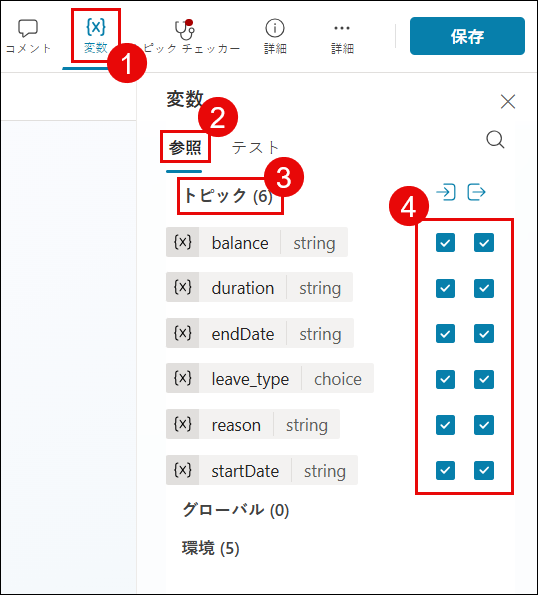

1. **[Power Automate 入力]** カードで、**startDate** フィールドの横にある **[省略記号 (...) (1)]** をクリックします。**[変数の選択]** ウィンドウから **startDate (2)** を選択して変数をマッピングします。

     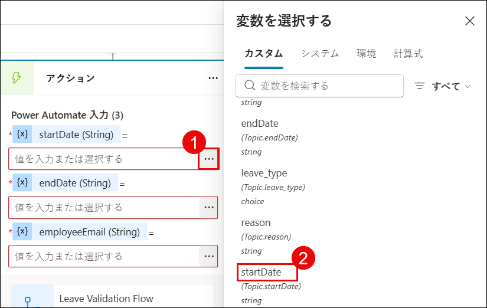

1. **[Power Automate 入力]** カードで、**endDate** フィールドの横にある **[省略記号 (...) (1)]** をクリックします。**[変数の選択]** ウィンドウから **endDate (2)** を選択して変数をマッピングします。

     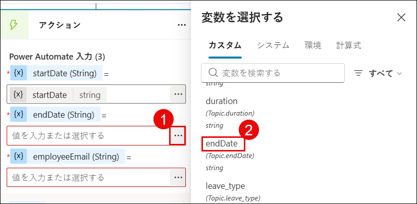

1. **[Power Automate 入力]** カードで、次を行います。

     - **employeeEmail** フィールドの横にある **[省略記号 (...) (1)]** をクリックします。
     - **[変数の選択]** ウィンドウで **[システム] (2)** タブに切り替えます。
     - **User.Email (3)** を検索します。
     - **User.Email (4)** を選択します。

          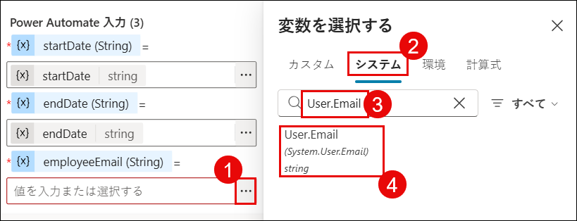

1. **[出力] (2)** セクションで、**[プラス (+) アイコン]** をクリックしてフローの次のステップを追加します。**(1)**

     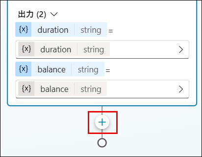

1. **[出力] (2)** セクションで、**[ツールの追加] (1)** をクリックし、ツールのリストから **[Leave Management Workflow] (2)** を選択します。

     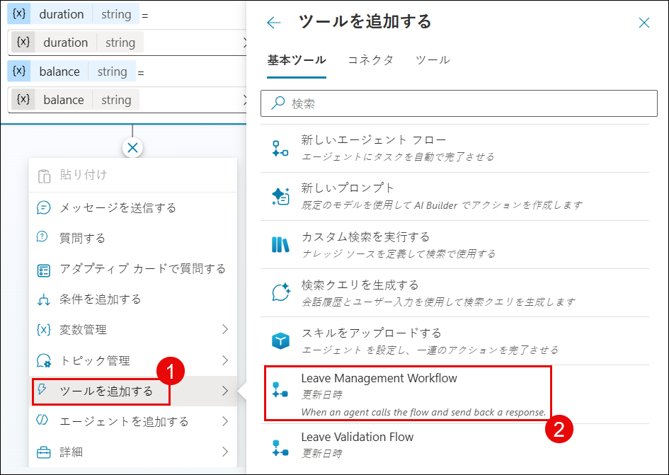

1. **オーサリング キャンバス**で、上部メニューから **[変数] (1)** をクリックします。**[参照] (2)** タブで、**[トピック (7)] (3)** セクションを展開して、チェックボックスをオンにして **reply (4)** 変数を選択します。

     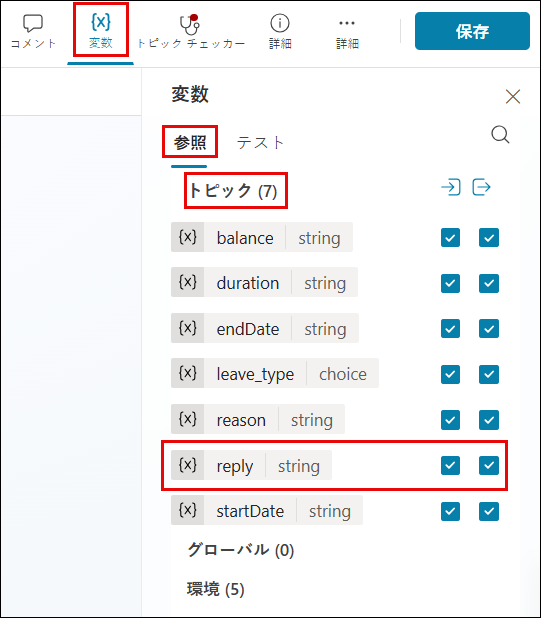

     > 変数オプションが表示されない場合は、**[...]** メニューをクリックして **[変数]** を選択してください。

     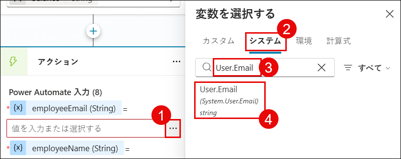

1. **[アクション]** カードで、**employeeEmail (String)** の値を設定します。

     - **[省略記号 (...) (1)]** をクリックします。
     - **[変数の選択]** パネルで **[システム] (2)** タブに移動します。
     - **User.Email (3)** を検索します。
     - 結果から **User.Email (4)** を選択します。

          

1. **[アクション]** カードで、**employeeName (String)** の値を設定します。

     - **[省略記号 (...) (1)]** をクリックします。
     - **[変数の選択]** パネルで **[システム] (2)** タブに移動します。
     - **User.FirstName (3)** を検索します。
     - 結果から **User.FirstName (4)** を選択します。

          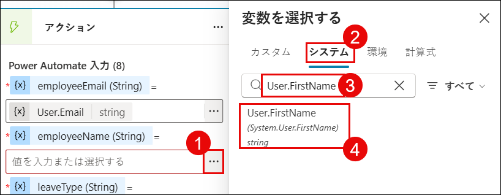

1. **[アクション]** カードで、**leaveType (String)** の値を設定するには、**[省略記号 (...) (1)]** を選択し、**[数式] (2)** タブを選択し、数式 **(3)** を入力して、**[挿入] (4)** を選択します。

     ```
     Text(Topic.leave_type)
     ```

     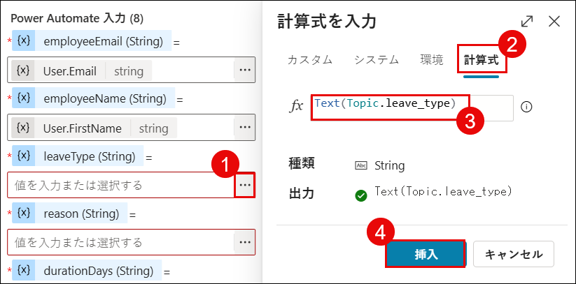

1. **[アクション]** カードで、**reason (String)** の値を設定します。

     - **[省略記号 (...) (1)]** をクリックします。
     - **[変数の選択]** パネルで **[カスタム] (2)** タブを選択します。
     - リストから **reason (Topic.reason) (3)** を選択します。

          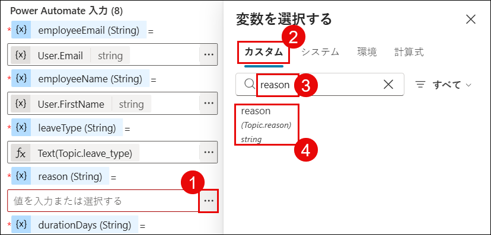

1. **[アクション]** カードで、**durationDays (String)** の値を設定します。

     - **[省略記号 (...) (1)]** をクリックします。
     - **[変数の選択]** パネルで **[カスタム] (2)** タブに移動します。
     - リストから **duration (Topic.duration) (3)** を選択します。

          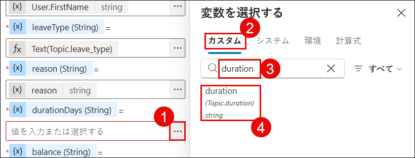

1. **[アクション]** カードで、**balance (String)** の値を設定します。

     - **[省略記号 (...) (1)]** をクリックします。
     - **[変数の選択]** パネルで **[カスタム] (2)** タブに移動します。
     - リストから **balance (Topic.balance) (3)** を選択します。

          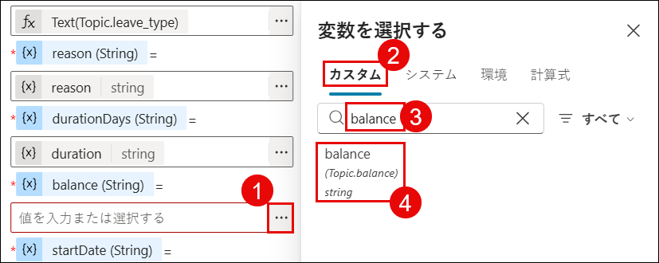

1. **[アクション]** カードで、**startDate (String)** の値を設定します。

     - **[省略記号 (...) (1)]** をクリックします。
     - **[変数の選択]** パネルで **[カスタム] (2)** タブに移動します。
     - リストから **startDate (Topic.startDate) (3)** を選択します。

          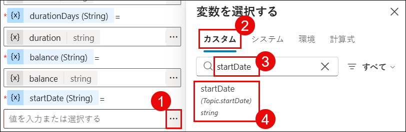

1. **[アクション]** カードで、**endDate (String)** の値を設定します。

     - **[省略記号 (...) (1)]** をクリックします。
     - **[変数の選択]** パネルで **[カスタム] (2)** タブに移動します。
     - リストから **endDate (Topic.endDate) (3)** を選択します。

          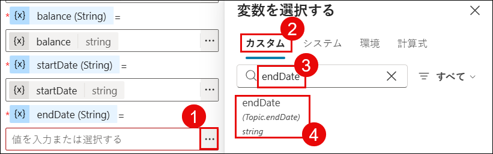

1. **[出力] (1)** セクションで、**[プラス アイコン (1)]** をクリックし、**[メッセージを送信する] (2)** を選択します。

     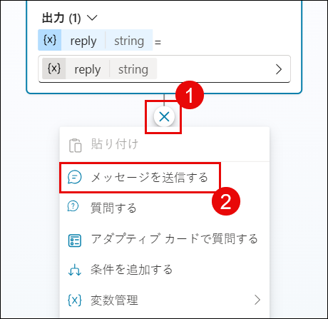

1. **[メッセージ]** ステップで、次を行います。

     - **[変数 アイコン (1)]** をクリックします。
     - **[変数の選択]** ウィンドウで **[カスタム] (2)** タブを選択します。
     - 検索ボックスに **reply (3)** と入力します。
     - 結果から **reply (4)** を選択します。

          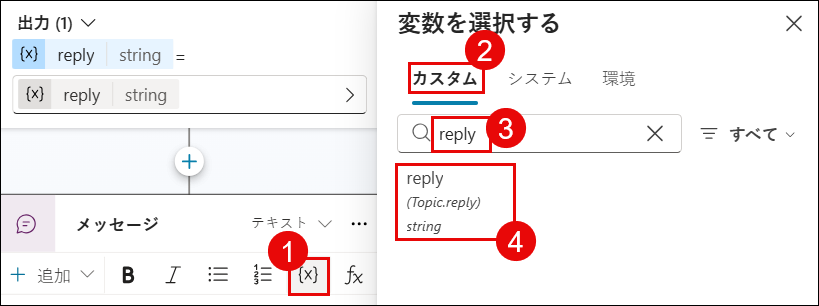

1. **[メッセージ]** ステップで、**[プラス (+) アイコン]** をクリックしてフローに次のアクションを追加します。

     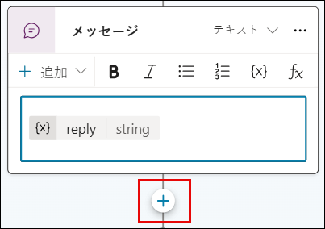

1. **[メッセージ]** ステップで、オプションを展開して **[トピック管理] (1)** を選択し、**[会話を終了する] (2)** をクリックしてフローを閉じます。

     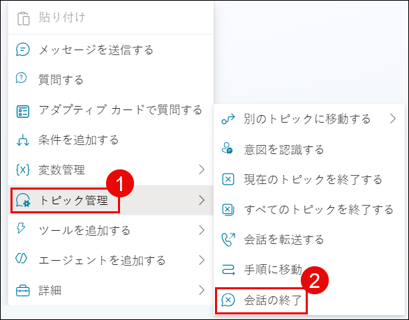

1. ページ右上隅の **[保存]** をクリックして、トピックへの変更を保存します。

     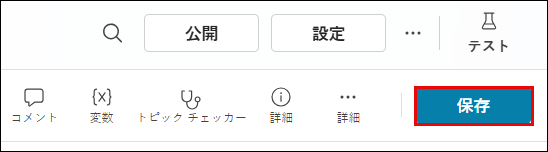

## まとめ

この演習では、承認後に Dataverse の休暇申請ステータスを変更する [行の更新] アクションを追加し、承認済み休暇日付を含む応答メッセージを設定して休暇管理ワークフローを完成させました。次に、Leave Validation Flow と Leave Management Workflow に接続し、必要なすべての変数をマッピングして、ユーザーへの応答を表示するメッセージ ノードを追加することで、Copilot Studio の leave_request トピックを完成させました。

### この演習を正常に完了しました。次の演習に進んでください >>

   
