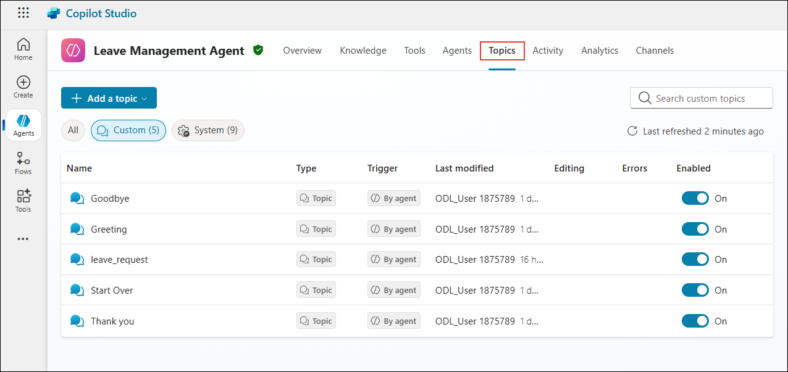
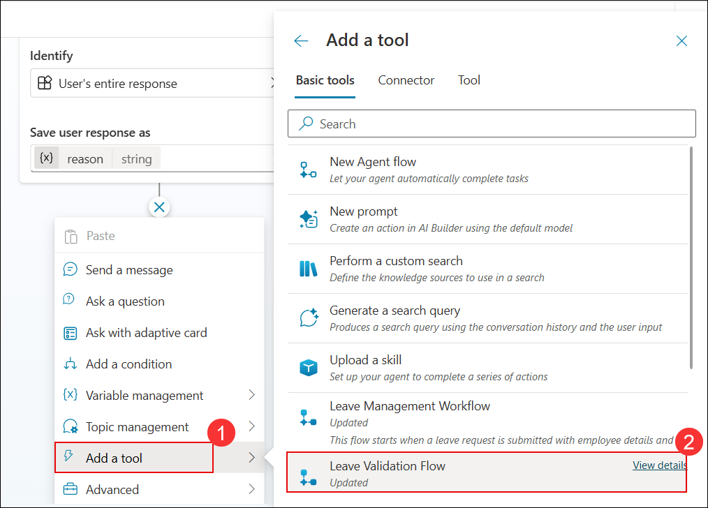
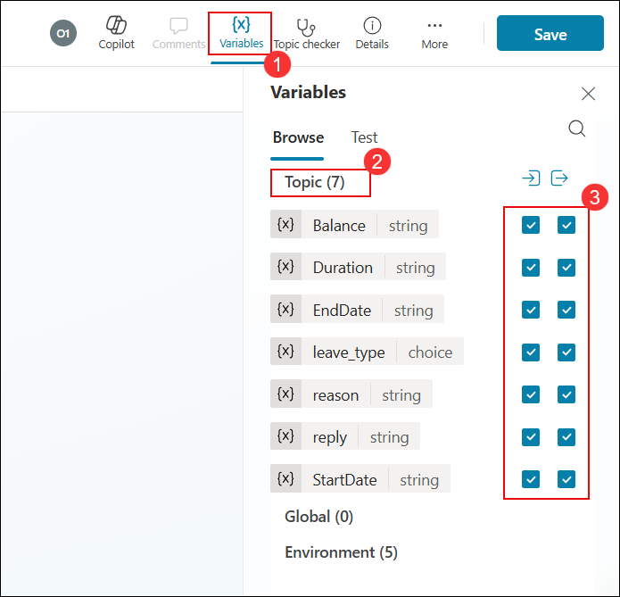

1. On the **Leave Management Agent** page, select the **Topics (1)** tab. Click **Add a topic (2)** and then choose **From blank (3)**.  

   

1. On the **Test your agent** pane, click the **Close (X)** button to close the testing window and make the canvas larger for easier workflow design.

   

1. In the **Trigger** node, enter a description for the topic (1), for example: *This topic is used by employees to apply leaves*. Then click the **plus (+) icon (2)** to add the next step in the topic flow.

   

1. In the **Topic editor**, from the options displayed, select **Ask a question** to add a question node to the flow.

   

1. In the **Question** node, enter **`Please choose the Leave type from the list` (1)** as the question text. Under **Identify**, select **Multiple choice options (2)**, and then click **+ New option (3)** to start adding choices.

   

1. In the **Options for user** section, type **Casual (1)** as the first leave type. Then click **+ New option (2)** to add another choice.  

   

1. Click on **+ New option** again as in the previous step, and add the leave types **Emergency** and **Unpaid**.   

   

1. In the **Save user response as** field, enter **leave_type (1)** as the variable name. On the right-side **Variable properties** pane, confirm that the **Variable name** is also set to **leave_type (2)**.

   

1. In the **Topics** designer, under **All other conditions**, click the **plus (+) icon** to add the next step in the flow. 

   

1. Under **All other conditions**, select **Send a message** from the action menu to add a response step.  

   

1. In the **Message** node, enter the text **`Please choose an option from the list` (1)**. Then click the **plus (+) icon (2)** to add the next step in the flow. 

   

1. From the **Message** node, open the action menu. Select **Topic management (1)** and then choose **Go to step (2)** to redirect the conversation flow.

   

1. After selecting **Go to step**, choose the **Question** node **(where the leave type options are defined)** to **loop the flow back to the beginning** in case users select any other option.

   

1. In the **Topics** designer, click the **plus (+) icon** below the condition branches to continue building the flow for each leave type path.

   

1. From the action menu, select **Ask a question** to prompt the user for additional information in the flow.

   

1. In the **Question** node, enter the prompt **Please provide your leave Start Date (Please make sure to provide in yyyy-mm-dd format) (1)** to capture the start date from the user.

   

1. In the **Question** node, under **Identify**, click **Multiple choice options (2)** and select **User's entire response (3)** so that the agent saves the response exactly as the user enters it.

   

1. In the **Save user response as** field, enter **StartDate (1)** as the variable name. On the **Variable properties** pane, confirm the **Variable name (2)** is set to **StartDate**.

   

1. Below the **Question** node, click the **plus (+) icon** to add the next step in the flow. 

   

1. From the menu, select **Ask a question** to prompt the user for additional input.   

   

1. On the **Question** node, configure it to capture the end date of the leave:  
- Enter the message **Please provide your leave End Date (Please make sure to provide in yyyy-mm-dd format)** in the text box **(1)**.  
   - Under **Identify**, select **User's entire response (2)**.  
   - In **Save user response as**, enter **EndDate (3)**.  
   - In the **Variable properties** pane, confirm the variable name is set as **EndDate (4)**. 

      

1. Below the **EndDate** question node, click the **plus (+) icon** to add the next step in the flow.

   

1. Below the **EndDate** question node, click the **plus (+) icon** and select **Ask a question** to add the next prompt in the flow. 

   

1. On the **Question** node:  
   - Enter the prompt **May I please know the reason for your leave? (1)**.  
   - Under **Identify**, select **User's entire response (2)**.  
   - In **Save user response as**, set the variable name to **reason (3)**.  
   - Verify in the **Variable properties** pane that the variable name is correctly set as **reason (4)**, then close the properties pane **(5)**.  

      

1. Below the **reason** question node, click the **plus (+) icon** to add the next step in the flow.  

   

1. In the **Question** node after capturing the reason, click **Add a tool (1)**. From the list of available tools, select **Leave Validation Flow (2)** to connect the flow with the validation process. 

   

1. On the **Variables (1)** pane, under **Topic (7) (2)**, enable all the checkboxes (3) to make sure each variable is included in the flow.  

   

1. On the **Power Automate inputs** card, click the **ellipsis (…) (1)** next to the **startDate** field. From the **Select a variable** pane, choose **StartDate (2)** to map the variable.

   

1. On the **Power Automate inputs** card, click the **ellipsis (…) (1)** next to the **endDate** field. From the **Select a variable** pane, choose **EndDate (2)** to map the variable. 

   

1. On the **Power Automate inputs** card:  
   - Click the **ellipsis (…) (1)** next to the **employeeEmail** field.  
   - In the **Select a variable** pane, switch to the **System (2)** tab.  
   - Search for **User.Email (3)**.  
   - Select **User.Email (4)**.  

      

1. On the **Outputs (2)** section, click the **plus (+) icon** to add the next step in the flow. **(1)**

   

1. On the **Outputs (2)** section, click **Add a tool (1)** and select **Leave Management Workflow (2)** from the list of tools. 

   

1. On the **Action** card, set the value for **employeeEmail (String)**:  
   - Click the **ellipsis (…) (1)**.  
   - In the **Select a variable** panel, go to the **System (2)** tab.  
   - Search for **User.Email (3)**.  
   - Select **User.Email (4)** from the results.  

      

1. On the **Action** card, set the value for **employeeName (String)**:  
   - Click the **ellipsis (…) (1)**.  
   - In the **Select a variable** panel, go to the **System (2)** tab.  
   - Search for **User.FirstName (3)**.  
   - Select **User.FirstName (4)** from the results. 

      

1. On the **Action** card, set the value for **leaveType (String)**:  
   - Click the **ellipsis (…) (1)**.  
   - In the **Select a variable** panel, switch to the **Formula (2)** tab.  
   - Enter the formula **Text(Topic.leave_type) (3)**.  
   - Click **Insert (4)** to apply the formula.  

      

1. On the **Action** card, set the value for **reason (String)**:  
   - Click the **ellipsis (…) (1)**.  
   - In the **Select a variable** panel, choose the **Custom (2)** tab.  
   - Select **reason (Topic.reason) (3)** from the list.  

      

1. On the **Action** card, set the value for **durationDays (String)**:  
   - Click the **ellipsis (…) (1)**.  
   - In the **Select a variable** panel, go to the **Custom (2)** tab.  
   - Select **Duration (Topic.Duration) (3)** from the list.  

      

1. On the **Action** card, set the value for **Balance (String)**:  
   - Click the **ellipsis (…) (1)**.  
   - In the **Select a variable** panel, go to the **Custom (2)** tab.  
   - Select **Balance (Topic.Balance) (3)** from the list.  

      

1. On the **Action** card, set the value for **StartDate (String)**:  
   - Click the **ellipsis (…) (1)**.  
   - In the **Select a variable** panel, go to the **Custom (2)** tab.  
   - Select **StartDate (Topic.StartDate) (3)** from the list.  

      

1. On the **Action** card, set the value for **endDate (String)**:  
   - Click the **ellipsis (…) (1)**.  
   - In the **Select a variable** panel, go to the **Custom (2)** tab.  
   - Select **EndDate (Topic.EndDate) (3)** from the list.  

      

1. On the **Outputs (1)** section, click the **plus icon (1)** and select **Send a message (2)**. 

   

1. On the **Message** step:  
   - Click on the **variable icon (1)**.  
   - In the **Select a variable** pane, choose the **Custom (2)** tab.  
   - Type **reply (3)** in the search box.  
   - Select **reply (4)** from the results. 

      

1. On the **Message** step, click the **plus (+) icon** to add the next action in the flow. 

   

1. On the **Message** step, expand the options and select **Topic management (1)**, then click **End conversation (2)** to close the flow. 

   

1. At the top-right corner of the page, click **Save** to store the changes made to the topic.  

   

In the **Save your topic** dialog:  
   - Enter the topic name as **leave_request (1)**.  
   - Click **Save (2)** to confirm and store the topic.  

      

