# 演習 4: エンド ツー エンド テスト

### 推定所要時間: 40 分

## 概要

この演習では、さまざまなプロンプトとシナリオを実行してエージェントをエンド ツー エンドでテストします。テスト完了後は、休暇申請データが Dataverse テーブルに正しく更新されていることを確認します。

## 目標

次のタスクを完了できるようになります。

- タスク 1: 承認シナリオのテスト

- タスク 2: Dataverse のデータの検証

## タスク 1: 承認シナリオのテスト

このタスクでは、指定のプロンプトを使用してエージェントをエンド ツー エンドで実行し、応答の正確性を検証します。

1. エージェントの設定が完了したので、テストを行います。

1. **Copilot Studio** で、**[エージェント] (1)** を選択し、**[Leave Management Agent] (2)** をクリックします。

   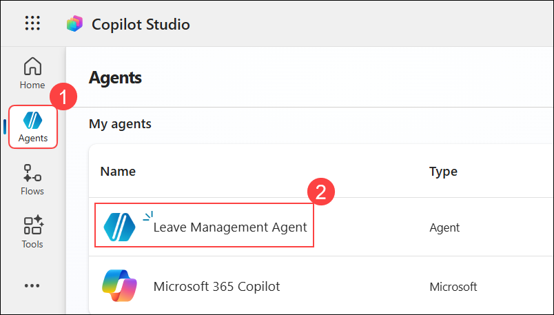

1. 上部のメニュー バーで **[発行]** をクリックして、エージェントへの変更を保存して適用します。

   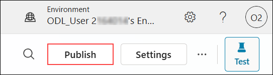

1. **[このエージェントを発行する]** ダイアログ ボックスで、詳細を確認し、**[発行]** をクリックして発行プロセスを確認して完了します。

   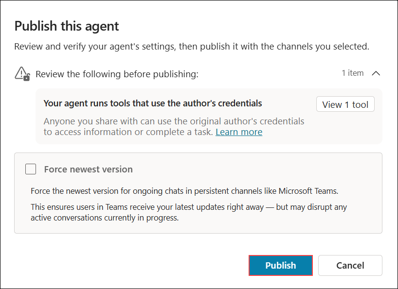

1. **[Leave Management Agent]** ページで、右上隅の **[テスト]** をクリックしてエージェントのテスト パネルを開きます。

   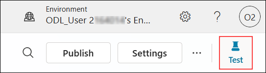

1. **[エージェントのテスト]** パネルで、**Leave Management Agent** のテストを行います。

   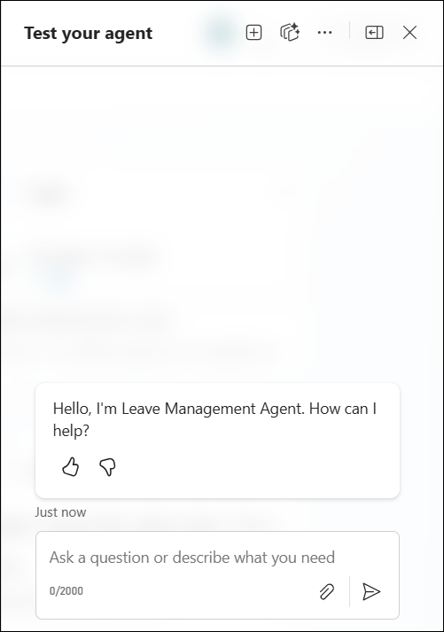

1. **[エージェントのテスト]** パネルで、チャット ボックスに **Hello (1)** (または類似のメッセージ) と入力し、**[送信] (2)** ボタンをクリックしてエージェントと話しかけます。

1. **[アクティビティ マップ]** ページで、**[挨拶]** トピックがトリガーされ、*Good afternoon*、*Good morning*、*Hello*、*Hey*、*Hi* などのフレーズが表示されることを確認します。

   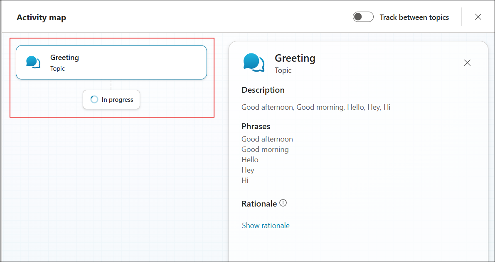

1. **[エージェントのテスト]** パネルで、メッセージ ボックスに以下のリクエスト **(1)** を入力し、**[送信] (2)** ボタンをクリックしてエージェントをテストします。

   ```
   I want to apply for Leave
   ```

   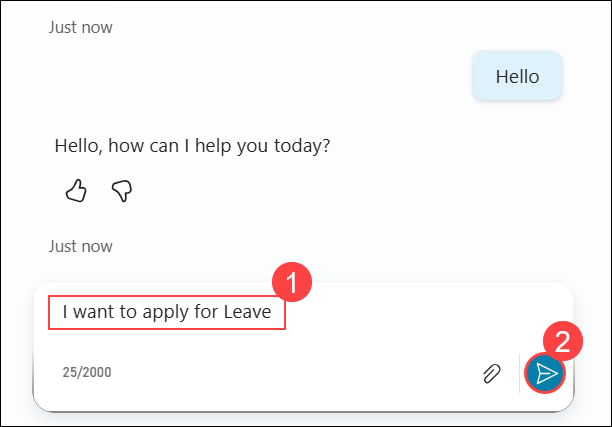

1. **[エージェントのテスト]** パネルで、休暇の種類を選択するよう求められたら、**Casual**、**Emergency**、**Unpaid** などのオプションから選択します。

   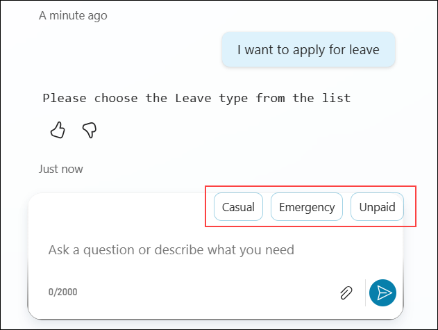

1. **[エージェントのテスト]** パネルで、必要な **yyyy-mm-dd** 形式で休暇開始日を以下の例の値 **(1)** を使用して入力し、**[送信] (2)** ボタンをクリックします。

   ```
   2026-05-13
   ```

   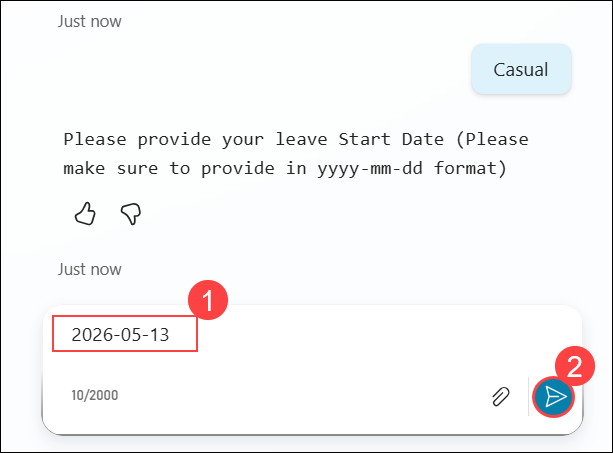

1. **[エージェントのテスト]** パネルで、必要な **yyyy-mm-dd** 形式で休暇終了日を以下の例の値 **(1)** を使用して入力し、**[送信] (2)** ボタンをクリックします。

   ```
   2026-05-14
   ```

   > **注:** このテスト シナリオでは、2 日以内の休暇申請を検証します。

   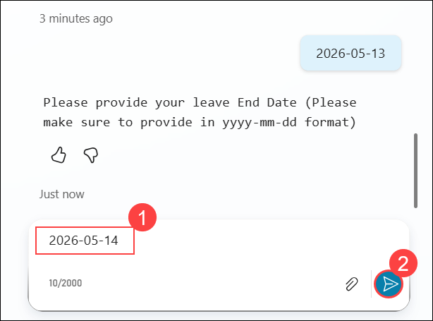

1. **[エージェントのテスト]** パネルで、以下の例の値 **(1)** を使用して休暇の理由を入力し、**[送信] (2)** ボタンをクリックします。

   ```
   I will be attending a family function
   ```

   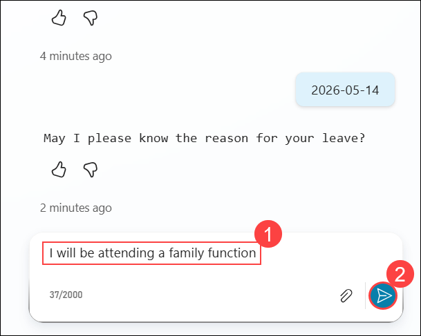

1. **[エージェントのテスト]** パネルで、承認された休暇日を示す確認メッセージがエージェントから返ってくることを確認します。

   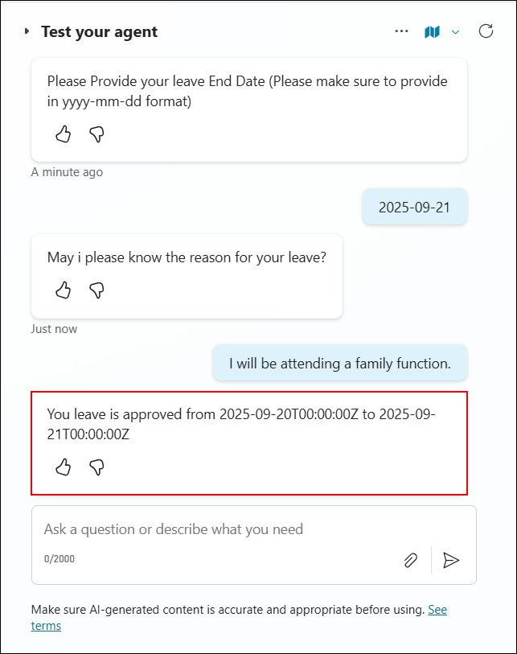

   > **注:** 接続するよう求めるプロンプトが表示される場合は、以下の手順を実行してください。

   > **[接続マネージャーを開く] (1)** をクリックして資格情報を確認します。

      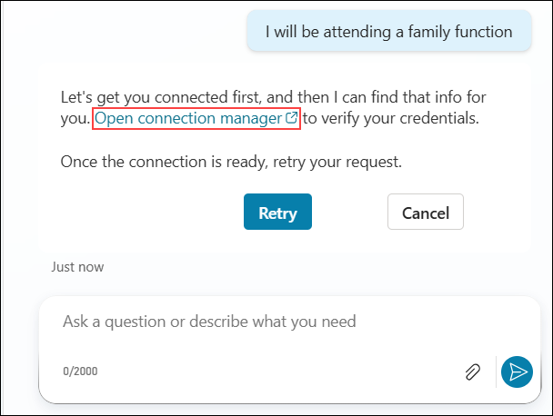
      
   > **[接続の管理]** ページで、**Leave Management Workflow** が **[接続なし] (1)** と表示される場合があります。**[接続] (2)** をクリックして接続を確立します。

      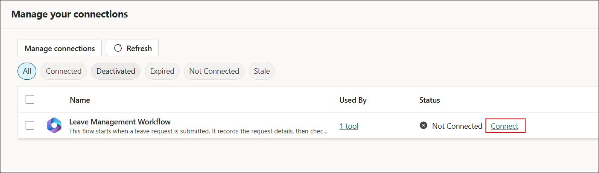

   > **[接続またはピック接続の作成]** ページで、使用可能な接続 **[標準承認] (1)** を選択し、**[送信] (2)** をクリックして接続セットアップを完了します。

      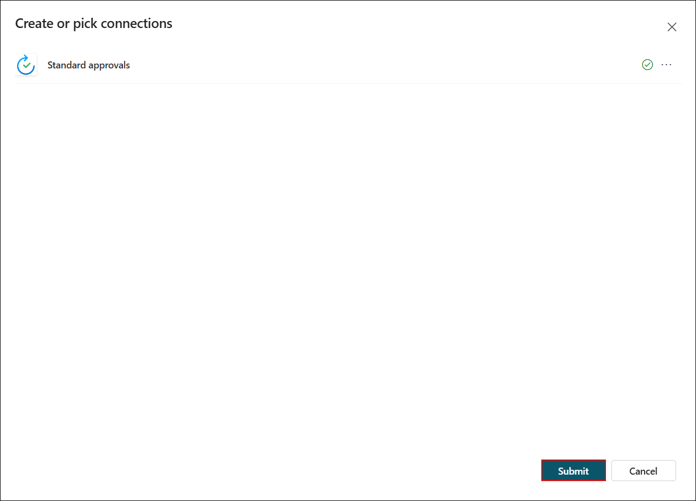

   > **[接続の管理]** ページで、**Leave Management Workflow** の状態が **[接続済み] (1)** と表示されていることを確認します。接続されたら、エージェントをテストしていた前のタブに戻って続けてください。

      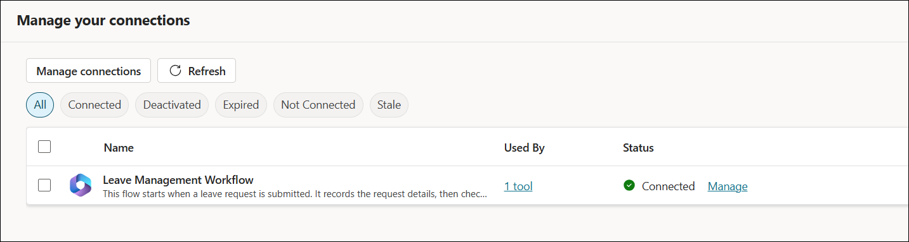

1. **[エージェントのテスト]** タブに戻り、**[再試行]** をクリックします。

   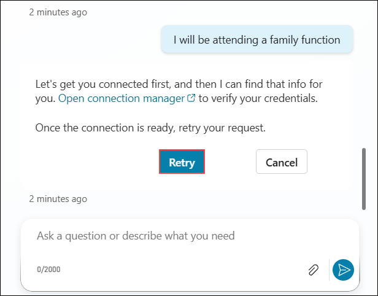

1. 2 日以内の休暇申請がエージェントの応答で自動承認されることを確認します。

   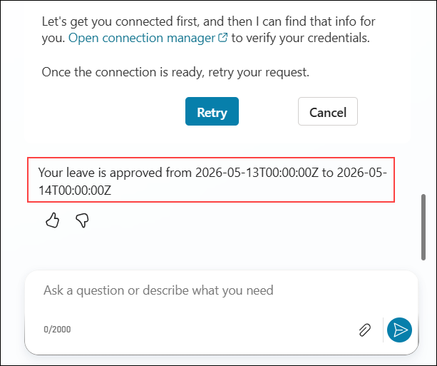

1. ブラウザーを開き、次の URL を使用して Outlook に移動します。

   ```
   https://outlook.com
   ```

1. ラボの資格情報を使用してサインインします。

   - Username: <inject key="AzureAdUserEmail"></inject>
   - Temporary Access Key: <inject key="AzureAdUserPassword"></inject>

      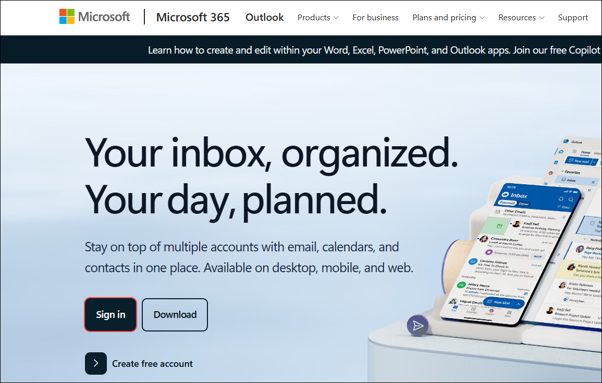

1. **[テスト]** ウィンドウで、**[新しいテスト セッション]** を選択して、2 日を超える休暇申請をテストします。

   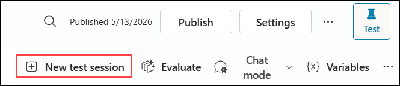

1. メッセージ ボックスに **Hello (1)** と入力し、**[送信] (2)** アイコンをクリックします。

   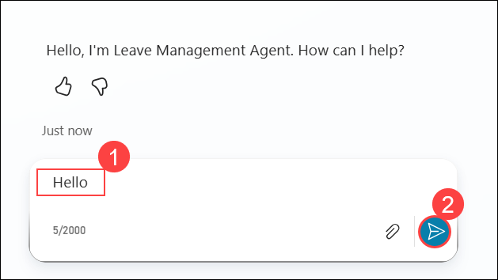

1. **[エージェントのテスト]** パネルで、メッセージ ボックスに以下のリクエスト **(1)** を入力し、**[送信] (2)** ボタンをクリックしてエージェントをテストします。

   ```
   I want to apply for Leave
   ```

   

1. **[エージェントのテスト]** パネルで、休暇の種類を選択するよう求められたら、**Casual**、**Emergency**、**Unpaid** などのオプションから選択します。

   

1. **[エージェントのテスト]** パネルで、必要な **yyyy-mm-dd** 形式で休暇開始日を以下の例の値 **(1)** を使用して入力し、**[送信] (2)** ボタンをクリックします。

   ```
   2026-05-13
   ```

   

1. **[エージェントのテスト]** パネルで、必要な **yyyy-mm-dd** 形式で休暇終了日を以下の例の値 **(1)** を使用して入力し、**[送信] (2)** ボタンをクリックします。

   ```
   2026-05-17
   ```

   > **注:** このテスト シナリオでは、2 日を超える休暇申請を検証します。

   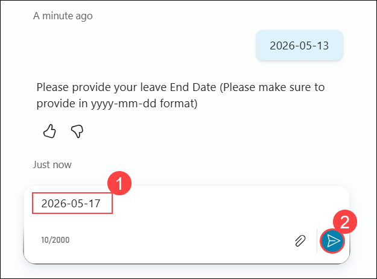

1. **[エージェントのテスト]** パネルで、以下の例の値 **(1)** を使用して休暇の理由を入力し、**[送信] (2)** ボタンをクリックします。

   ```
   I need to take leave for personal work
   ```

   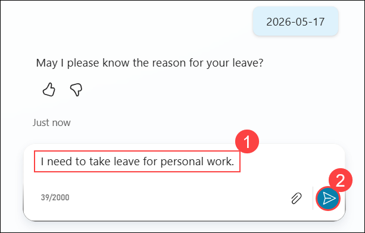

1. メール承認応答を待機している間、エージェントに **[処理中]** ステータスが表示されることを確認します。

   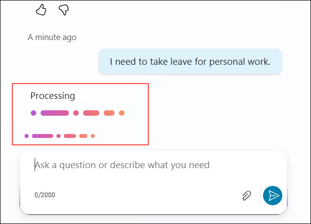

1. **[受信トレイ] (1)** で、**[Microsoft Power Automate - Leave Approval] (2)** メールを選択して休暇申請の詳細を確認します。

   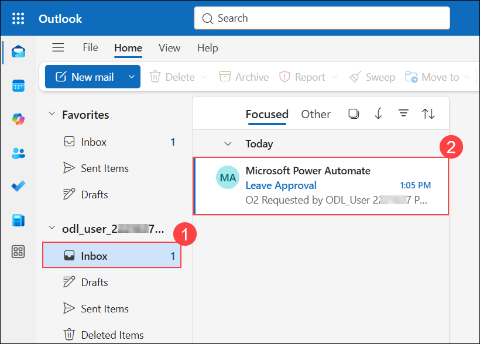

1. **[承認] (1)** を選択し、**[コメント] (2)** ボックスに *Approved* と入力して、**[送信] (3)** をクリックして休暇承認を確定します。

   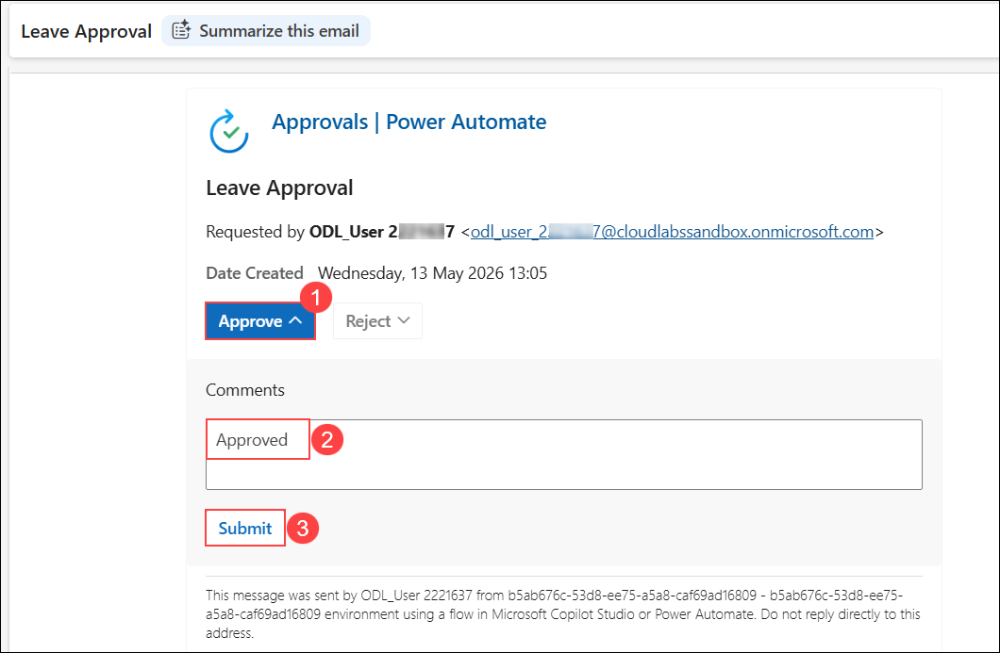

1. エージェントが休暇申請を確認し、休暇期間の詳細を表示する承認メッセージを返します。

   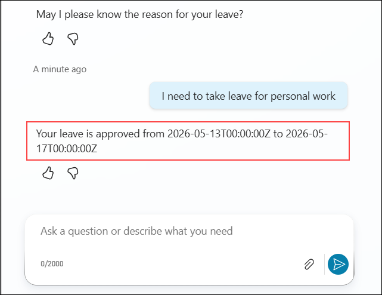

## タスク 2: Dataverse のデータの検証

このタスクでは、Dataverse に移動してエージェントによって更新されたデータを検証します。

1. **Power Apps** ポータルで、環境が **ODL_User (1)** に設定されていることを確認します。左側のナビゲーション メニューから **[テーブル] (2)** を選択し、リストから **[Leave Request] (3)** を選択します。

   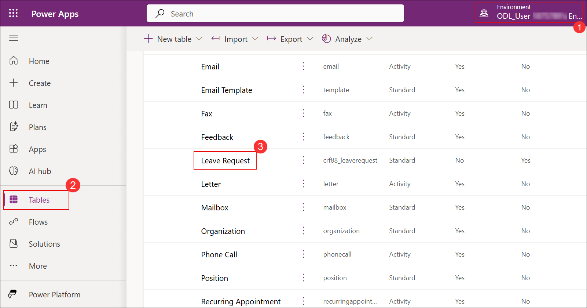

1. **[Leave Request 列とデータ]** ページで、新しく追加されたレコードを確認します。次のフィールドを確認してください。
      - **[従業員のメールアドレス]** と **[従業員名]** は自動的にユーザーの詳細で入力されます。
      - **[休暇の種類]** は選択した休暇の種類を反映します。
      - **[開始日]** と **[終了日]** はテスト中に入力した値と一致します。
      - **[期間]** は計算された休暇日数を表示します。
      - **[ステータス]** は現在の承認状態を表示します。

         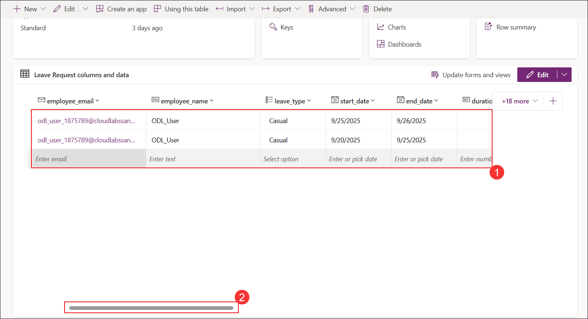  

         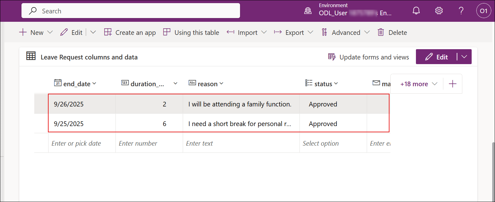

         > **注:** **[従業員のメールアドレス/ユーザー ID]** フィールドは、ログイン コンテキストからシステムによって自動的に取得されます。手動で入力する必要はありません。

## まとめ

この演習では、さまざまなプロンプトとシナリオを実行してエージェントをエンド ツー エンドでテストしました。テスト完了後は、休暇申請データが Dataverse テーブルに正しく更新されていることを確認しました。

### この演習を正常に完了しました。次の演習に進んでください >>

   
