# Exercise 4: End-to-End Testing

### Estimated Duration: 40 Minutes

## Overview

In this exercise, you will test the agent end-to-end by executing various prompts and scenarios. After completing the tests, you will verify that the leave request data has been correctly updated in the Dataverse table.

## Objectives

You will be able to complete the following tasks:

- Task 1: Test Approval Scenarios

- Task 2: Validate Data in Dataverse

## Task 1: Test Approval Scenarios

In this task, you will run the agent end-to-end using the provided prompts and verify its responses for accuracy.

1. Now that you've configured the agent, it's time to test.

1. On the top menu bar, click **Publish** to save and apply your changes to the agent.

   

1. On the **Publish this agent** dialog box, review the details and click **Publish** to confirm and complete the publishing process.

   

1. On the **Leave Management Agent** page, click **Test** in the top-right corner to open the testing panel for the agent.

   

1. In the **Test your agent** panel, you will be testing the **Leave Management Agent**.

   

1. In the **Test your agent** panel, type a greeting such as **Hello (1)** (or any similar message) in the chat box and click the **Send (2)** button to interact with the agent.

1. On the **Activity map** page, verify that the **Greeting** topic is triggered, showing phrases such as *Good afternoon*, *Good morning*, *Hello*, *Hey*, and *Hi*.  

   

1. In the **Test your agent** panel, type a request such as **I want to apply for leave (1)** and click the **Send (2)** button to test the agent’s ability to process leave-related queries.

   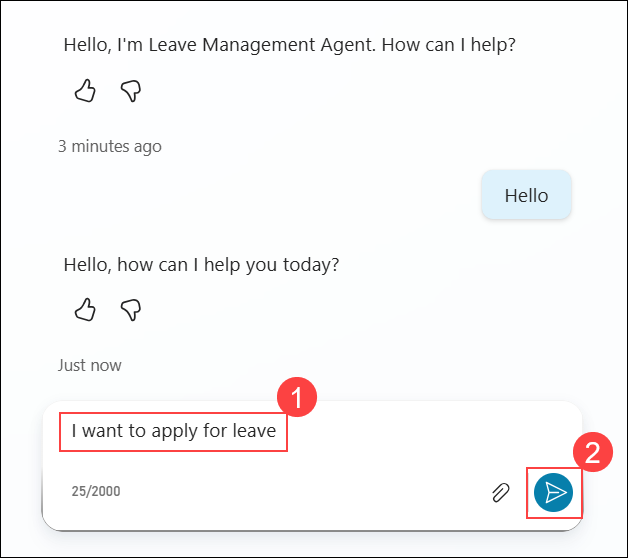

1. In the **Test your agent** panel, when prompted to choose a leave type, select from the available options such as **Casual**, **Emergency**, or **Unpaid**.

   

1. In the **Test your agent** panel, enter the leave start date in the required **yyyy-mm-dd** format (example, **2026-04-06 (1)**) and click the **Send (2)** button.

   

1. In the **Test your agent** panel, enter the leave end date in the required **yyyy-mm-dd** format (for example, **2026-04-07 (1)**) and click the **Send (2)** button.

1. In the **Test your agent** panel, enter the reason for your leave (for example, **I will be attending a family function (1)**) and click the **Send (2)** button.

   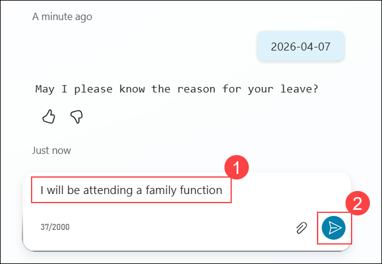

1. In the **Test your agent** panel, verify that the agent responds with a confirmation message showing the approved leave dates. 

   

   > **Note:** If you see the prompt asking you to connect, perform the below steps:  

   > Click **Open connection manager (1)** to verify your credentials.

      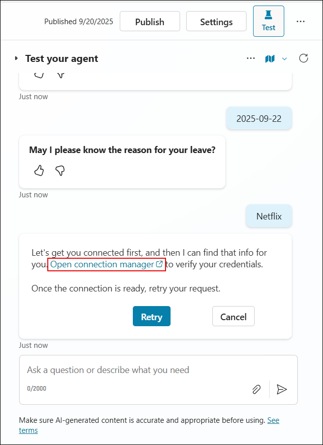
      
   > On the **Manage your connections** page, the **Leave Management Workflow** may show as **Not Connected (1)**. Click **Connect (2)** to establish the connection.  

      

   > On the **Create or pick connections** page, select the available connection **Standard approvals (1)** and click **Submit (2)** to complete the connection setup. 

      

   > On the **Manage your connections** page, verify that the **Leave Management Workflow** status shows as **Connected (1)**. Once connected, return to the previous tab where you were testing the agent and continue.  

      

   > After confirming the connection, return to the **Test your agent** tab. Click the **Refresh (1)** button at the top to reload the session, then retry your request to continue testing.

      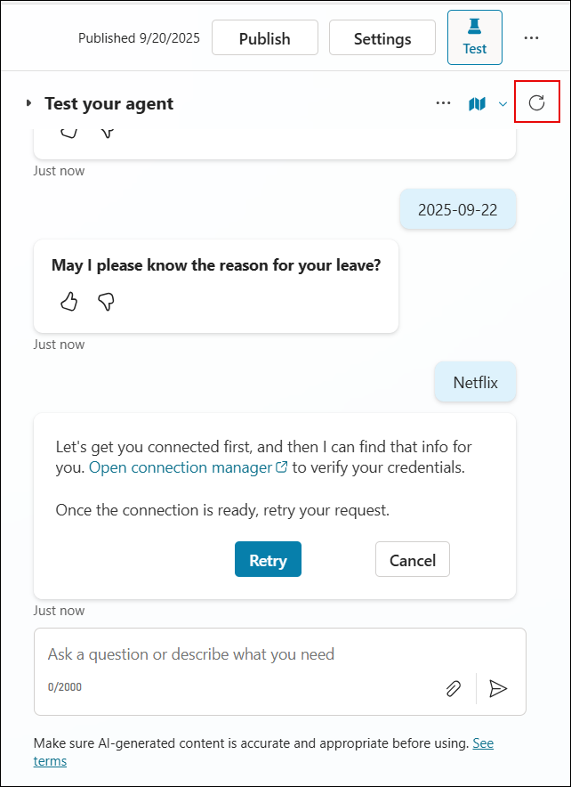

1. In the **Test your agent** panel, click the **Refresh** icon to restart the conversation and test the agent with new inputs.

   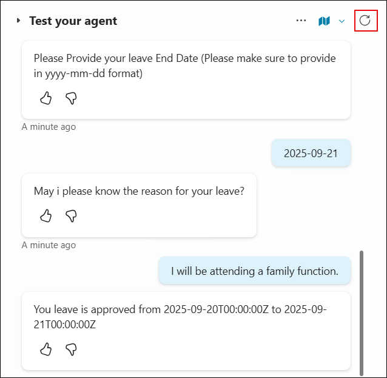

1. In the **Test your agent** panel, type a greeting such as **Hello (1)** (or any similar phrase) and click the **Send (2)** button to trigger the greeting intent.

   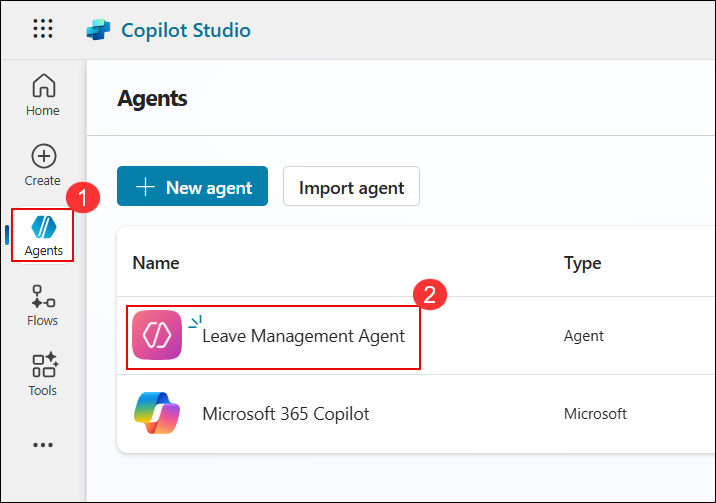

1. In the **Test your agent** panel, type a request such as **I want to apply for leave (1)** and click the **Send (2)** button to test the agent’s ability to process leave-related queries.

   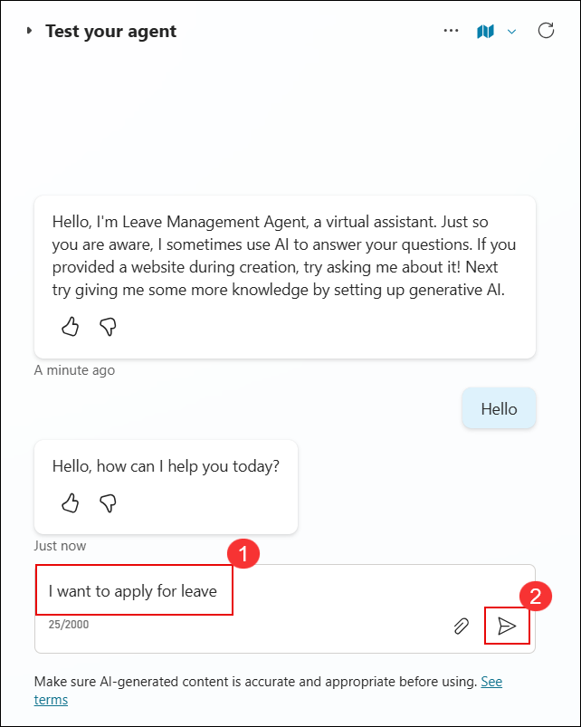

1. In the **Test your agent** panel, when prompted to choose a leave type, select from the available options such as **Casual**, **Emergency**, or **Unpaid**.

   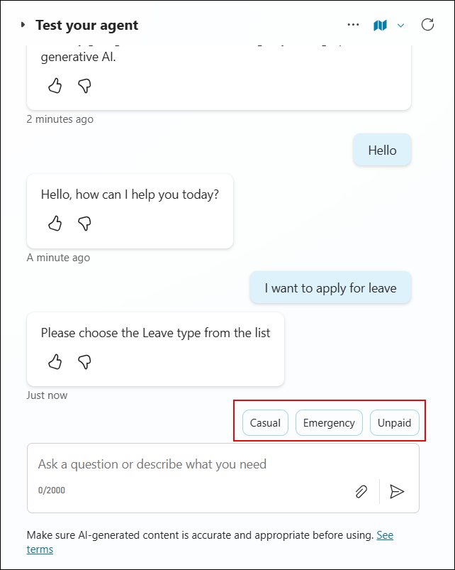

1. In the **Test your agent** panel, enter the leave start date in the required **yyyy-mm-dd** format (example, **2025-09-20 (1)**) and click the **Send (2)** button.

   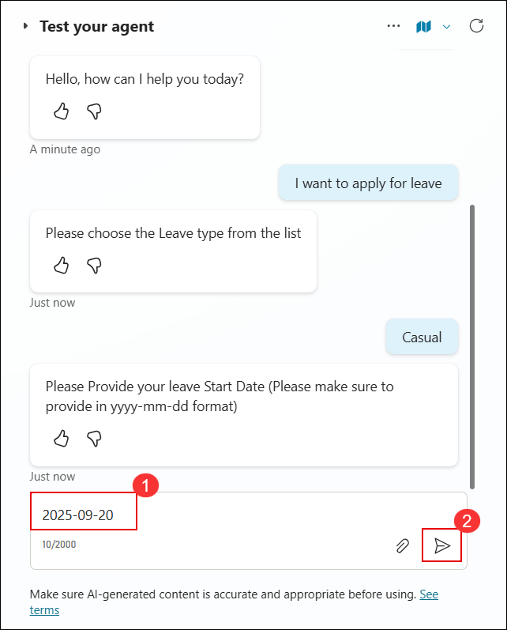

1. In the **Test your agent** panel, enter the leave end date in the format **yyyy-mm-dd**, ensuring it is more than 2 days from the start date (for example, **2025-09-25 (1)**), and click the **Send (2)** button to submit the request.

   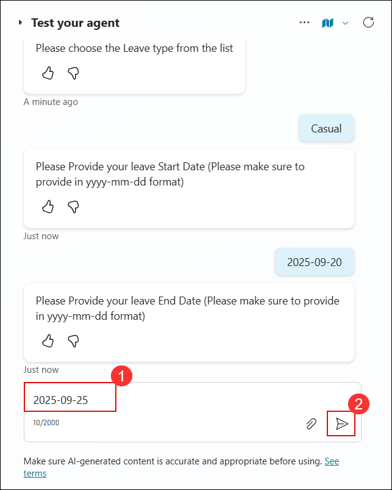

1. In the **Test your agent** panel, enter the reason for applying for leave (for example, *I need a short break for personal reasons* (1)) and click the **Send (2)** button to continue.

   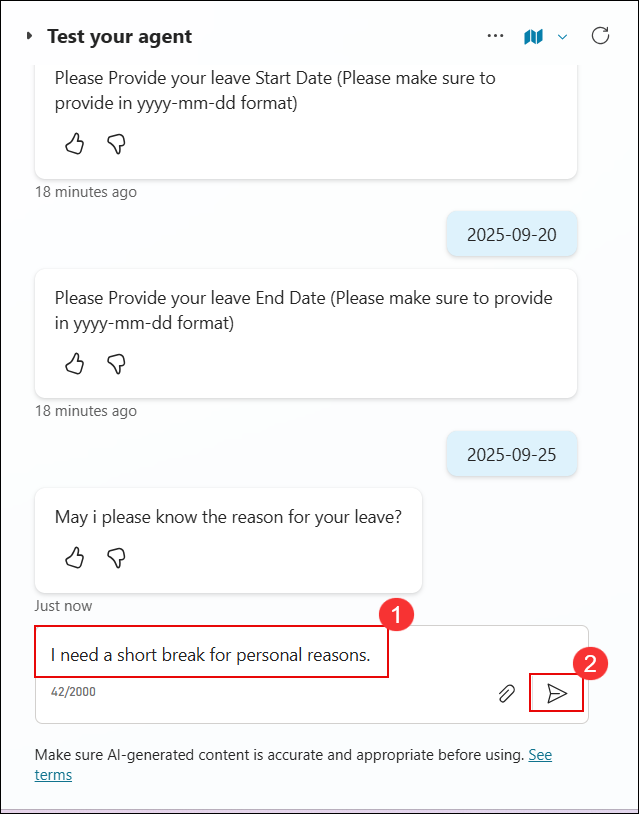

1. Open a browser and navigate to [https://outlook.com](https://outlook.com) to access Outlook.  

1. In the **Inbox**, locate and click the email with the subject **Microsoft Power Automate - Leave Approval** to view the leave request details.

   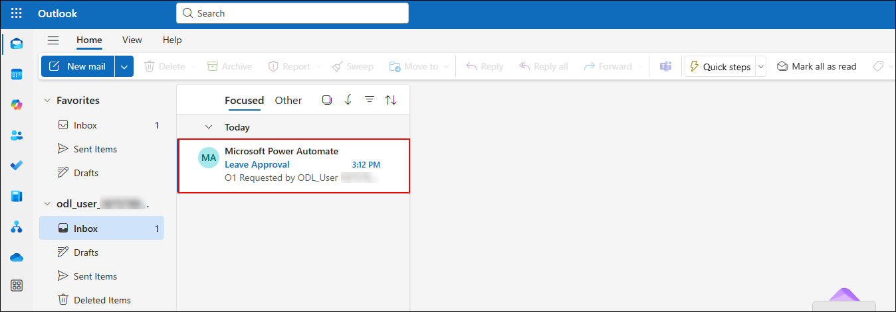

1. In the **Leave Approval** email, click **Approve** to approve the leave request.  

   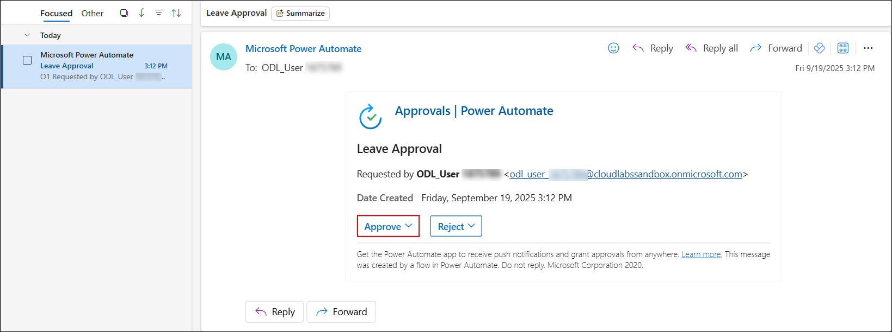

1. In the **Comments (1)** box, type your approval note (e.g., *Approved*) and then click **Submit (2)** to finalize the leave approval. 

   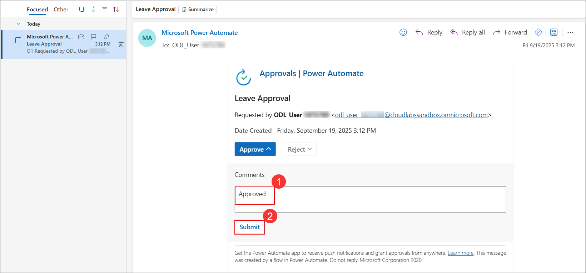

1. The agent confirms the leave request, displaying an approval message with the leave duration details. 

   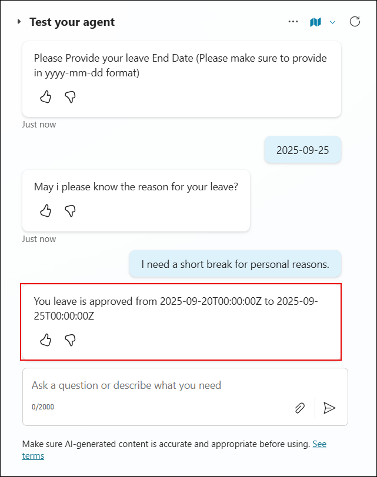

## Task 2: Validate Data in Dataverse

In this task, you will navigate the Dataverse and validate the data updated by the agent.

1. On the **Copilot Studio** page, click on the **More options (1)** menu from the left navigation panel and select **Power Apps (2)** under the **Power Platform** section to navigate there, **or** open a new browser window and go to [https://make.powerapps.com](https://make.powerapps.com).

   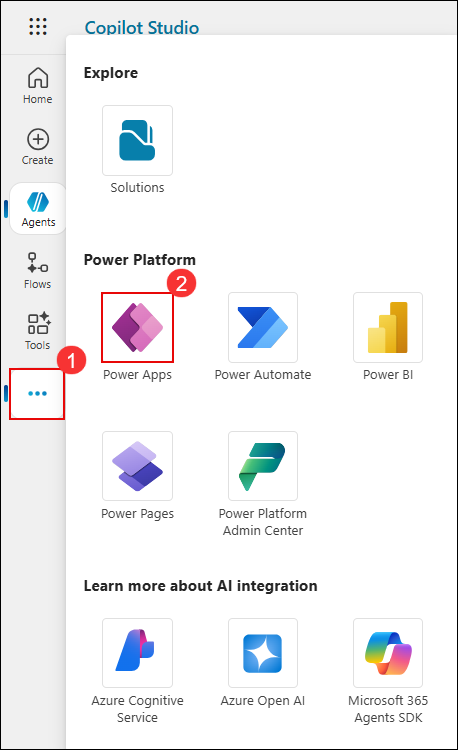

1. On the **Power Apps** portal, ensure the environment is set to **ODL_User (1)**. From the left navigation menu, select **Tables (2)** and then choose **Leave Request (3)** from the list.

   

1. On the **Leave Request columns and data** page, review the newly added records. Verify the following fields:  
      - **Employee Email** and **Employee Name** are automatically populated with your user details.  
      - **Leave Type** reflects the type of leave selected.  
      - **Start Date** and **End Date** match the values entered during testing.  
      - **Duration** displays the calculated number of leave days.  
      - **Status** shows the current approval status. 

           

         

         > **Note:** The **Employee Email/User ID** field is automatically fetched by the system from your login context. You do not need to enter it manually.

## Summary

In this exercise, you tested the agent end-to-end by executing various prompts and scenarios. After completing the tests, the leave request data was verified to ensure it had been correctly updated in the Dataverse table.

### You have successfully completed this exercise, please continue to next one >>

   
