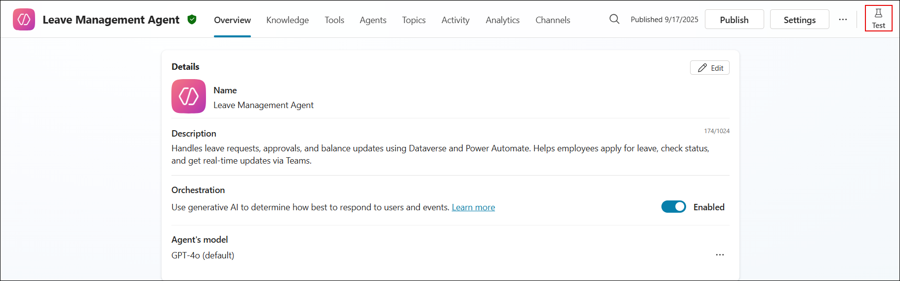
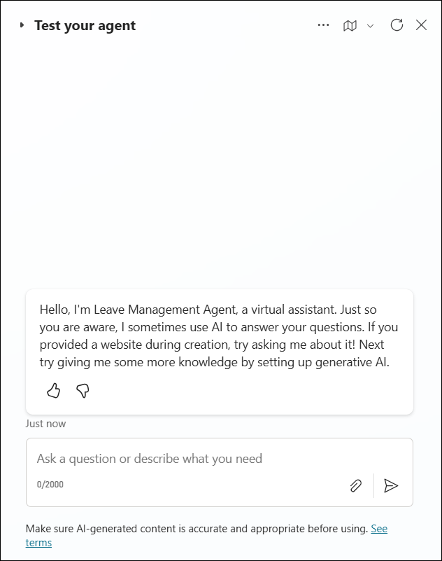
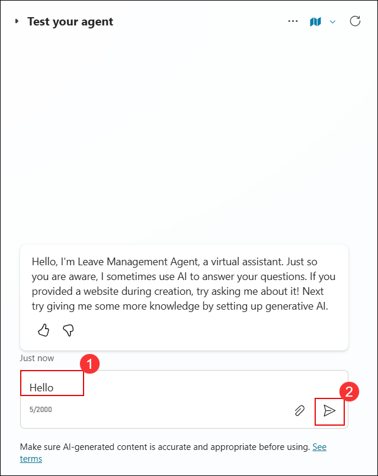
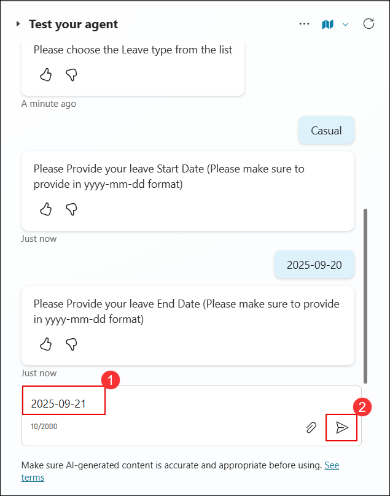

# Exercise 4: Testing

### Estimated Duration: 00 Minutes

## Overview

## Objectives

You will be able to complete the following tasks:

- Task 1: Publish the agent to a Microsoft Teams channel

## Task 1: 

1. Now that you've configured the agent, it's time to test..

1. On the **Copilot Studio** page, select **Agents (1)** from the left navigation menu and click **Leave Management Agent (2)**.

   

1. On the **Leave Management Agent** page, click **Test** in the top-right corner to open the testing panel for the agent.

   

1. In the **Test your agent** panel, you will be testing the **Leave Management Agent**

   

1. In the **Test your agent** panel, type a greeting such as **Hello (1)** (or any similar message) in the chat box and click the **Send (2)** button to interact with the agent.

   

1. On the **Activity map** page, verify that the **Greeting** topic is triggered, showing phrases such as *Good afternoon*, *Good morning*, *Hello*, *Hey*, and *Hi*.  

   

1. In the **Test your agent** panel, type a request such as **I want to apply for leave (1)** and click the **Send (2)** button to test the agent’s ability to process leave-related queries.

   

1. In the **Test your agent** panel, when prompted to choose a leave type, select from the available options such as **Casual**, **Emergency**, or **Unpaid**.

   

1. In the **Test your agent** panel, enter the leave start date in the required **yyyy-mm-dd** format ( example, **2025-09-20 (1)**) and click the **Send (2)** button.

   

1. In the **Test your agent** panel, enter the leave end date in the required **yyyy-mm-dd** format (for example, **2025-09-21 (1)**) and click the **Send (2)** button. Ensure the end date results in a leave duration of **less than 2 days**.

   

1. In the **Test your agent** panel, enter the reason for your leave (for example, **I will be attending a family function (1)**) and click the **Send (2)** button.

   

1. In the **Test your agent** panel, verify that the agent responds with a confirmation message showing the approved leave dates. 

   

1. In the **Test your agent** panel, click the **Refresh** icon to restart the conversation and test the agent with new inputs.

   

1. In the **Test your agent** panel, type a greeting such as **Hello (1)** (or any similar phrase) and click the **Send (2)** button to trigger the greeting intent.

   

1. In the **Test your agent** panel, type a request such as **I want to apply for leave (1)** and click the **Send (2)** button to test the agent’s ability to process leave-related queries.

   

1. In the **Test your agent** panel, when prompted to choose a leave type, select from the available options such as **Casual**, **Emergency**, or **Unpaid**.

   

1. In the **Test your agent** panel, enter the leave start date in the required **yyyy-mm-dd** format ( example, **2025-09-20 (1)**) and click the **Send (2)** button.

   

1. In the **Test your agent** panel, enter the leave end date in the format **yyyy-mm-dd**, ensuring it is more than 2 days from the start date (for example, **2025-09-25 (1)**), and click the **Send (2)** button to submit the request.

   

1. In the **Test your agent** panel, enter the reason for applying leave (for example, *I need a short break for personal reasons* (1)) and click the **Send (2)** button to continue.

   

1. Open a browser and navigate to [https://outlook.com](https://outlook.com) to access Outlook.  

1. In the **Inbox**, locate and click the email with the subject **Microsoft Power Automate - Leave Approval** to view the leave request details.

   

1. In the **Leave Approval** email, click **Approve** to approve the leave request.  

   

1. In the **Comments (1)** box, type your approval note (e.g., *Approved*) and then click **Submit (2)** to finalize the leave approval. 

   

1. The agent confirms the leave request, displaying an approval message with the leave duration details. 

   

## Summary

### You have successfully completed the Lab!
