# Exercise 5: Publishing & Sharing

### Estimated Duration: 40 Minutes

## Overview

In this exercise, you will learn how to publish the **Leave Management Agent** to Microsoft Teams and validate its functionality. You will begin by enabling the Teams channel in Copilot Studio and completing the publishing process. After deployment, you will interact with the agent in Microsoft Teams by submitting a leave request, confirming that it responds correctly, and verifying the approval workflow.  

## Objectives

You will be able to complete the following tasks:

- Task 1: Deploy & Publish Your Agent to Microsoft Teams
- Task 2: Test the Deployed Agent in Microsoft Teams

## Task 1: Deploy & Publish Your Agent to Microsoft Teams

In this task, you will publish the **Leave Management Agent** to Microsoft Teams by enabling the Teams channel in Copilot Studio. You will configure the publishing settings, make the agent available, and verify that it is successfully installed and accessible within the Teams environment.

1. Now that you've configured the agent, it's time to publish it so it can be used across different platforms.

1. On the **Leave Management Agent** page, select the **Channels (1)** tab and click **Teams and Microsoft 365 Copilot (2)** under Microsoft channels.

   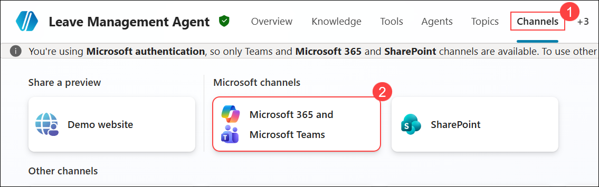

1. Clear the **Make agent available in Microsoft 365 Copilot (1)** checkbox, and then select **Add channel (2)**.

   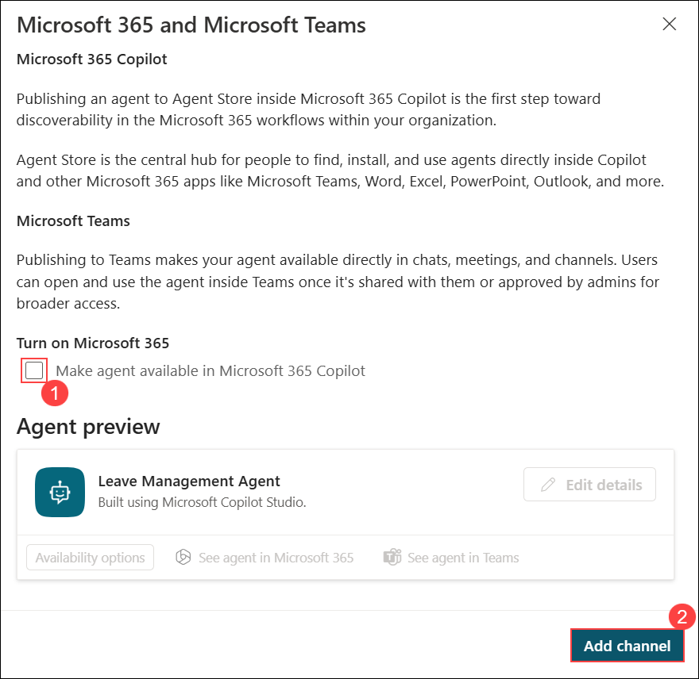

1. Once the channel is added, on the **Microsoft Teams**, select **See agent in Teams** to open the agent in Microsoft Teams.

   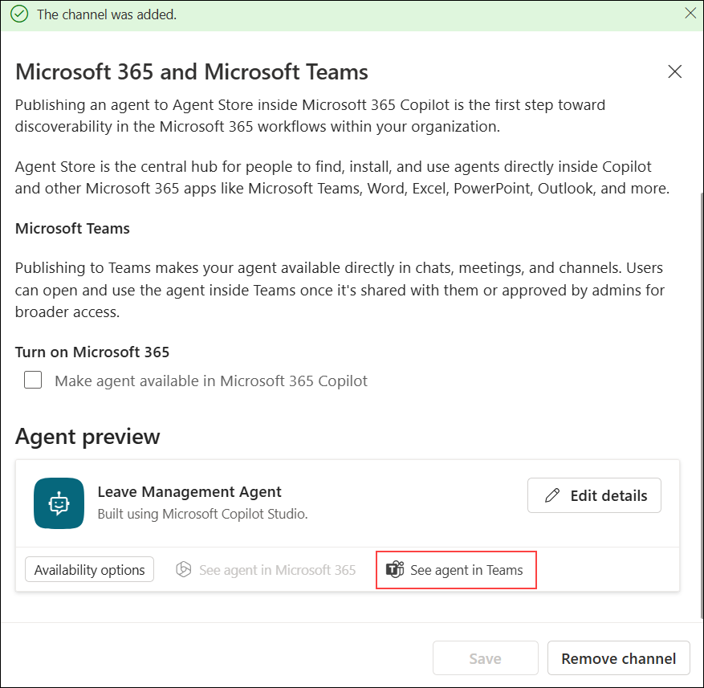

1. On the **Stay better connected with the Teams desktop app** page, click **Use the web app instead** to continue in the browser.

   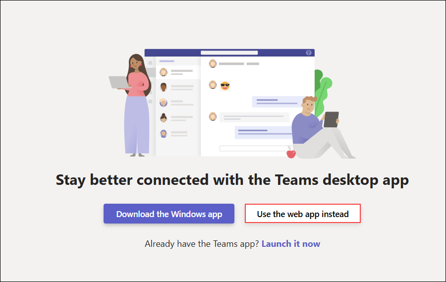

1. On the **Leave Management Agent** page in Microsoft Teams, click **Add** to install the agent. If you are not able to see the **Add** option, please navigate back to Copilot Studio and use **See agent in Teams** again.

   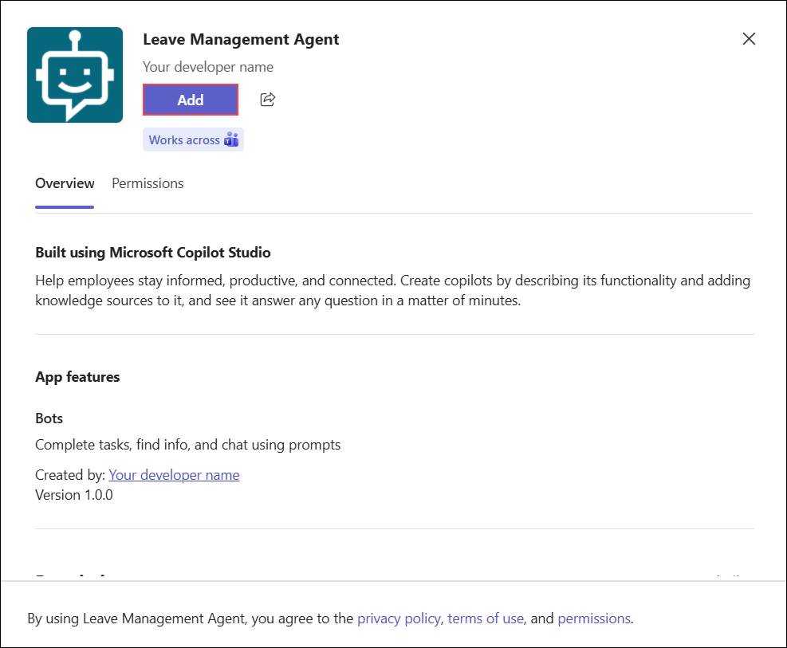

1. Once the agent is added successfully, click **Open** to launch the **Leave Management Agent** in Teams. 

   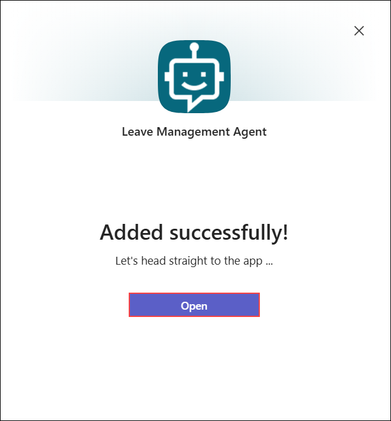

1. In the **Leave Management Agent** chat window, type **Hello (1)** in the message box and click the **Send (2)** button to initiate the conversation.

   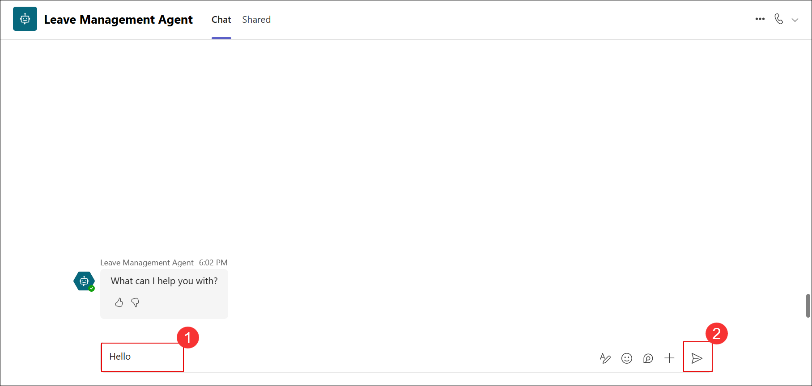

## Task 2: Test the Deployed Agent in Microsoft Teams

In this task, you will test the deployed **Leave Management Agent** in Microsoft Teams by submitting a leave request, providing the required details, and reviewing the approval outcome.

1. In the **Leave Management Agent** chat window, type **I want to apply for leave (1)** in the message box and click the **Send (2)** button to continue the conversation.

   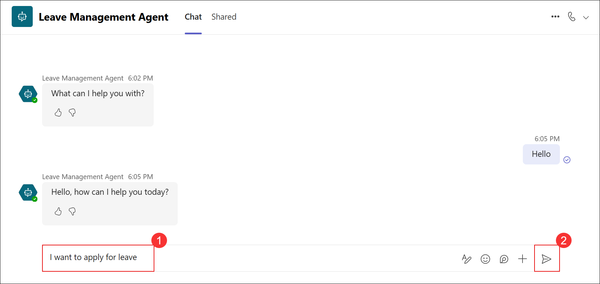

1. In the **Leave Management Agent** chat window, when prompted to select a leave type, choose one of the options.

   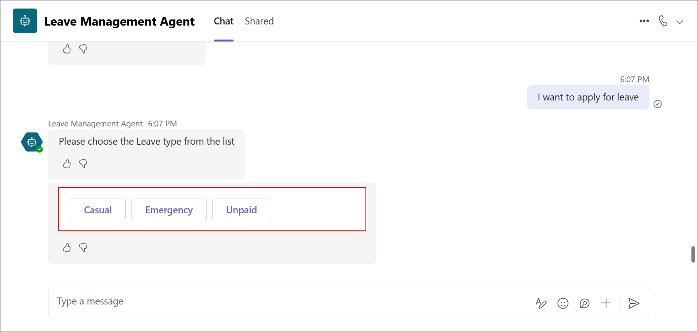

1. In the **Leave Management Agent** chat, enter your leave start date in the required format **yyyy-mm-dd**, for example **2025-09-20 (1)**, and click the **Send (2)** button to proceed. 

   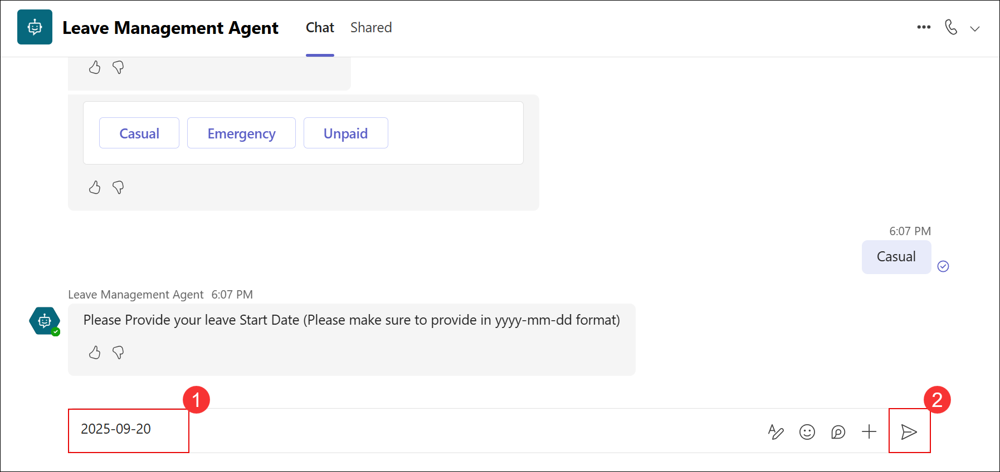

1. In the **Leave Management Agent** chat, enter your leave end date in the required format **yyyy-mm-dd**, for example **2025-09-27 (1)**, and click the **Send (2)** button to submit. This ensures the total leave period is greater than 2 days.

   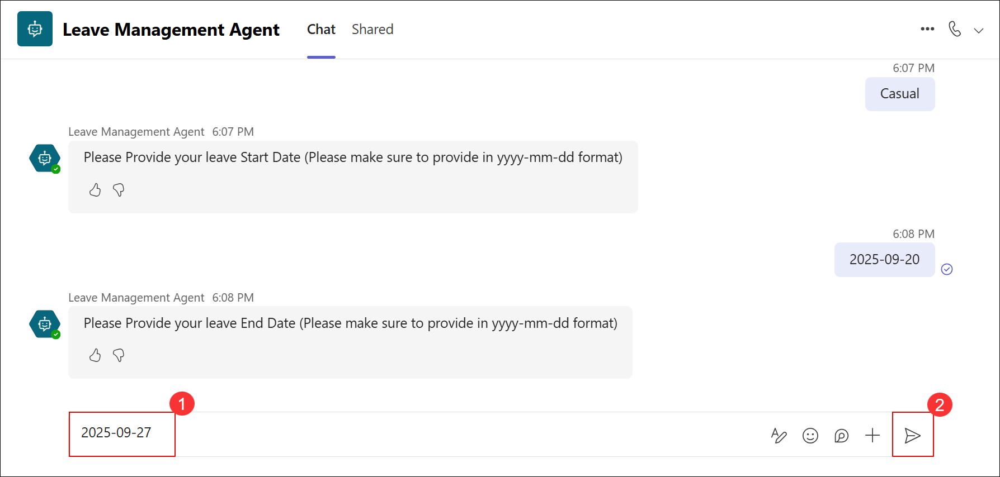

1. In the **Leave Management Agent** chat, type the reason for your leave, for example **Need a break to play video games (1)**, and click the **Send (2)** button to continue.

   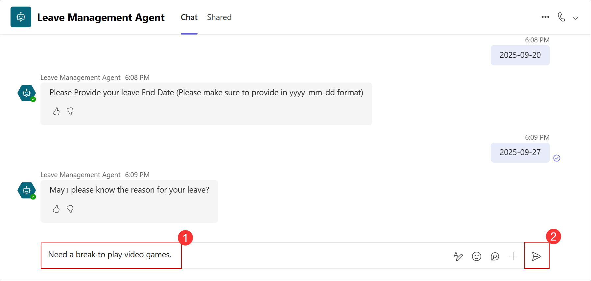

1. In the **Leave Approval** email from **Microsoft Power Automate (1)**, click **Reject (2)**, type the reason for rejection in the **Comments (3)** field, and click **Submit (4)** to confirm. 

   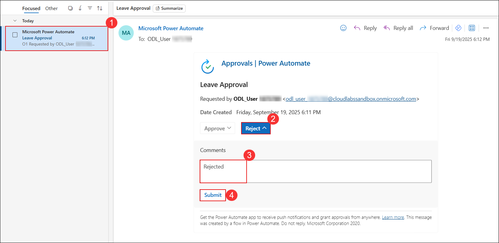

1. In Microsoft Teams, go to the **Activity (1)** section and review the **Leave Approval (2)** notification to see the final status of the request. 

   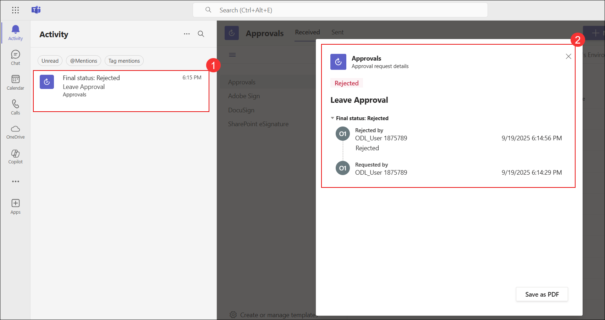

## Summary

In this exercise, you successfully published the **Leave Management Agent** to Microsoft Teams and confirmed that it could be accessed and used within the Teams environment. You tested the agent by submitting a leave request, providing the required details, and observing the automated approval process through Power Automate. This validated both the deployment and the functional behavior of the agent in a real user scenario.

### You have successfully completed the Lab!
