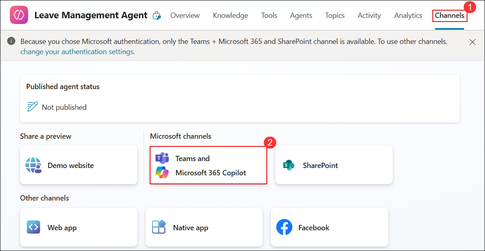
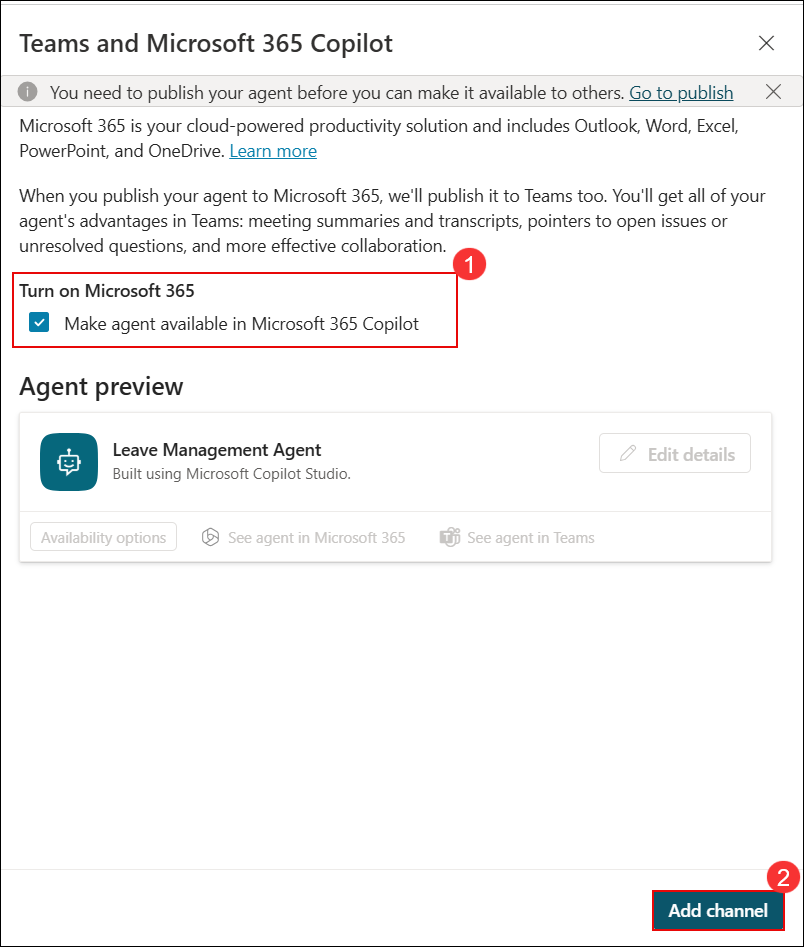
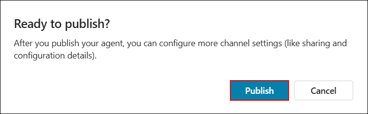
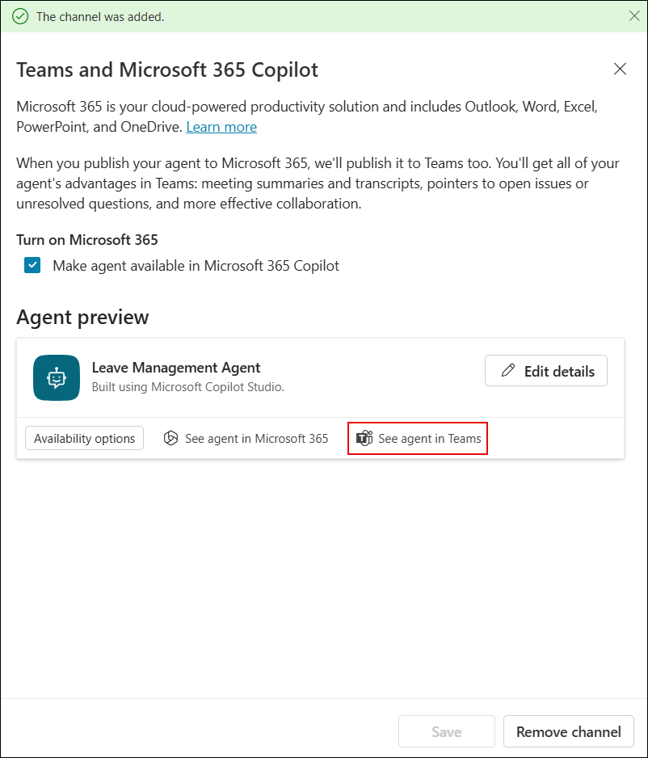
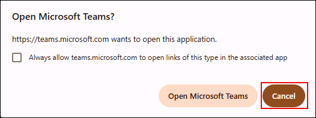
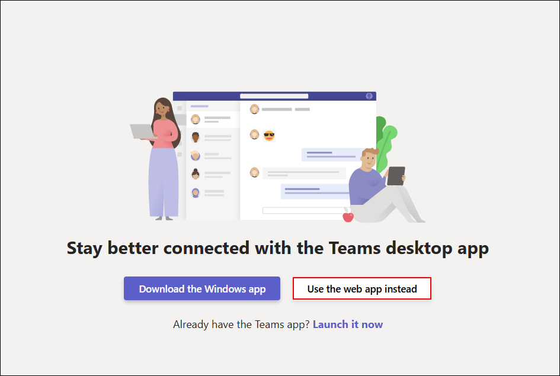
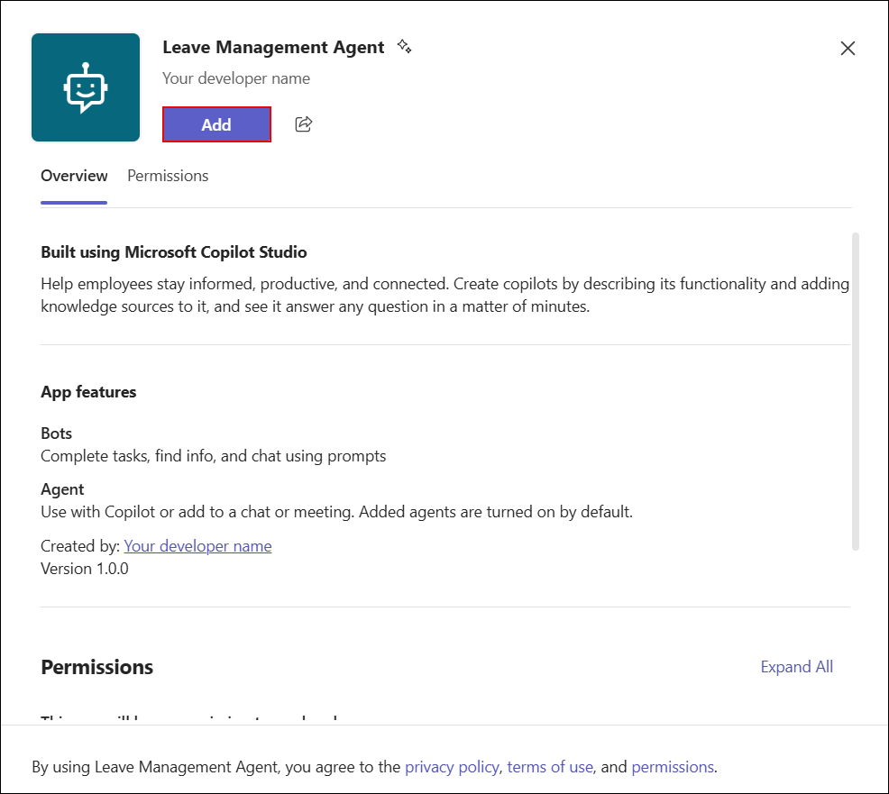
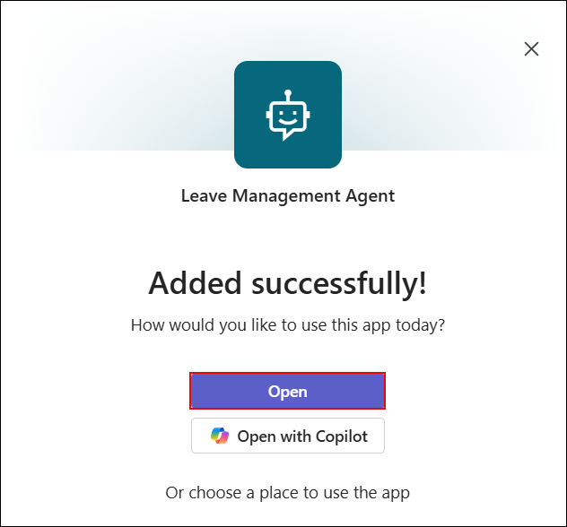

# Exercise 5: Publishing & Sharing

### Estimated Duration: 30 Minutes

## Overview

In this exercise, you will publish the agent to Microsoft Teams, enabling users to interact with it directly within the Teams environment. You will also verify that the agent is accessible and responds correctly to basic prompts.

## Objectives

You will be able to complete the following tasks:

- Task 1: Deploy & Publish Your Agent to Microsoft Teams

## Task 1: Deploy & Publish Your Agent to Microsoft Teams

1. Now that you've configured the agent, it's time to publish it so it can be used across different platforms.

1. On the **Copilot Studio** page, select **Agents (1)** from the left navigation and click on **Leave Management Agent (2)**.

   

1. On the **Leave Management Agent** page, select the **Channels (1)** tab and click **Teams and Microsoft 365 Copilot (2)** under Microsoft channels.

   

1. On the **Teams and Microsoft 365 Copilot** page, select **Make agent available in Microsoft 365 Copilot (1)** and then click **Add channel (2)**. 

   

1. On the **Ready to publish?** dialog box, click **Publish** to make the agent available. 

   

1. Once the channel is added, on the **Teams and Microsoft 365 Copilot** page, click **See agent in Teams** to open the agent in Microsoft Teams. 

   

1. If the **Open Microsoft Teams?** pop-up appears, click **Cancel** to stay on the browser. 

   

1. On the **Stay better connected with the Teams desktop app** page, click **Use the web app instead** to continue in the browser.

   

1. On the **Leave Management Agent** page in Microsoft Teams, click **Add** to install the agent. 

   

1. Once the agent is added successfully, click **Open** to launch the **Leave Management Agent** in Teams. 

   

1. In the **Leave Management Agent** chat window, type **Hello (1)** in the message box and click the **Send (2)** button to initiate the conversation.

   

1. In the **Leave Management Agent** chat window, type **I want to apply for leave (1)** in the message box and click the **Send (2)** button to continue the conversation.

   

1. In the **Leave Management Agent** chat window, when prompted to select a leave type, choose one of the option.

   

1. In the **Leave Management Agent** chat, enter your leave start date in the required format **yyyy-mm-dd**, for example **2025-09-20 (1)**, and click the **Send (2)** button to proceed. 

   

1. In the **Leave Management Agent** chat, enter your leave end date in the required format **yyyy-mm-dd**, for example **2025-09-27 (1)**, and click the **Send (2)** button to submit. This makes the total leave period greater than 2 days.

   

1. In the **Leave Management Agent** chat, type the reason for your leave, for example **Need a break to play video games (1)**, and click the **Send (2)** button to continue.

   

1. In the **Leave Approval** email from **Microsoft Power Automate (1)**, click **Reject (2)**, type the reason for rejection in the **Comments (3)** field, and click **Submit (4)** to confirm. 

   

1. In Microsoft Teams, go to the **Activity (1)** section and review the **Leave Approval (2)** notification to see the final status of the request. 

   

## Summary

In this exercise, the agent was published to Microsoft Teams, allowing users to interact with it directly within the Teams environment. The agent was also verified to ensure it was accessible and responded correctly to basic prompts.

### You have successfully completed the Lab!
