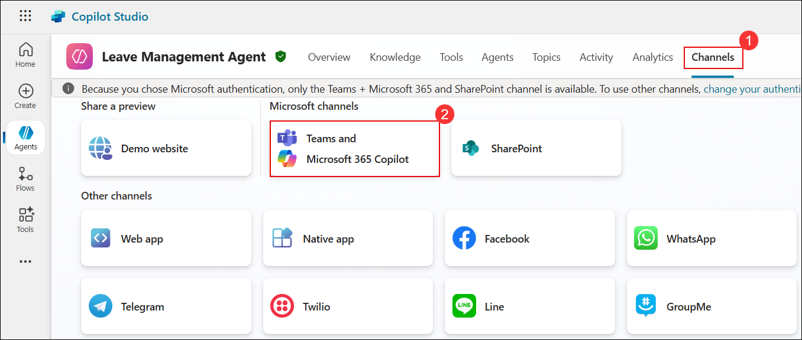
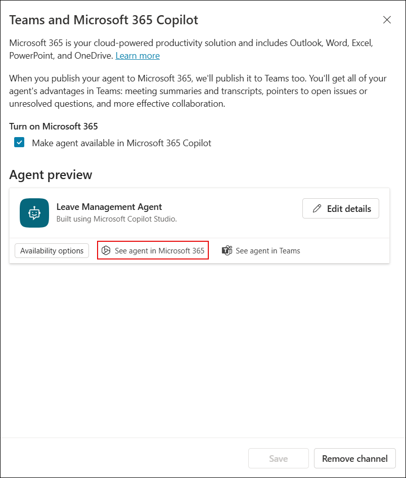
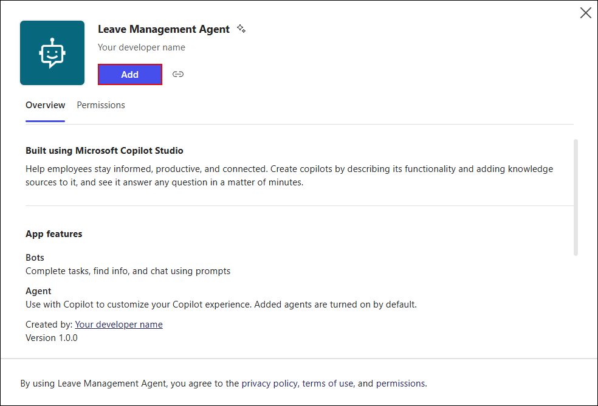

# Exercise 5: Deploy & Publish Your Agent to Microsoft Teams

### Estimated Duration: 30 Minutes

## Overview

## Objectives

You will be able to complete the following tasks:

- Task 1: Publish the agent to a Microsoft Teams channel

## Task 1: Publish the agent to a Microsoft Teams channel

1. Now that you've configured the agent, it's time to publish it so it can be used across different platforms.

1. On the **Copilot Studio** page, select **Agents (1)** from the left navigation and click on **Leave Management Agent (2)**.

   

1. On the **Leave Management Agent** page, select the **Channels (1)** tab and click **Teams and Microsoft 365 Copilot (2)** under Microsoft channels.

   

1. On the **Teams and Microsoft 365 Copilot** page, select **Make agent available in Microsoft 365 Copilot (1)** and then click **Add channel (2)**. 

   

1. On the **Ready to publish?** dialog box, click **Publish** to make the agent available. 

   

1. Once the channel is added, on the **Teams and Microsoft 365 Copilot** page, click **See agent in Teams** to open the agent in Microsoft Teams. 

   

1. If the **Open Microsoft Teams?** pop-up appears, click **Cancel** to stay on the browser. 

   

1. On the **Stay better connected with the Teams desktop app** page, click **Use the web app instead** to continue in the browser.

   

1. On the **Leave Management Agent** page in Microsoft Teams, click **Add** to install the agent. 

   

1. Once the agent is added successfully, click **Open** to launch the **Leave Management Agent** in Teams. 

   

1. Back on the **Leave Management Agent** page in Copilot Studio, select the **Channels (1)** tab and click **Teams and Microsoft 365 Copilot (2)** under Microsoft channels.

   

1. On the **Teams and Microsoft 365 Copilot** page, under **Agent preview**, click **See agent in Microsoft 365** to validate the agent in Microsoft 365 apps. 

   

1. On the **Leave Management Agent** page in Microsoft 365, click **Add** to enable the agent. 

   

   >**Note:** If you are not navigated to copilot chat, please wait for sometime and publish the agent again from copilot studio and try accessing it again.

## Summary

### You have successfully completed the Lab!
